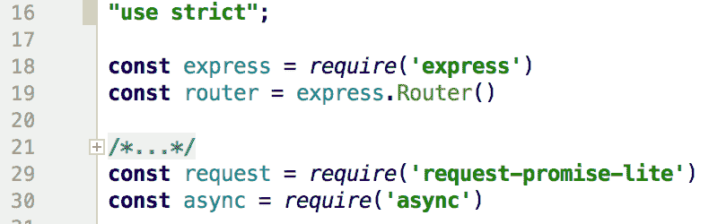
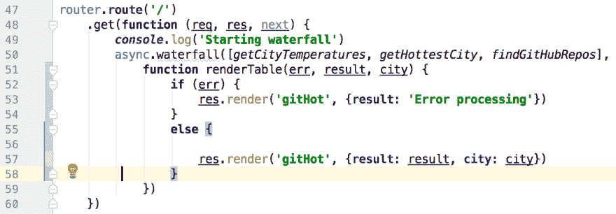
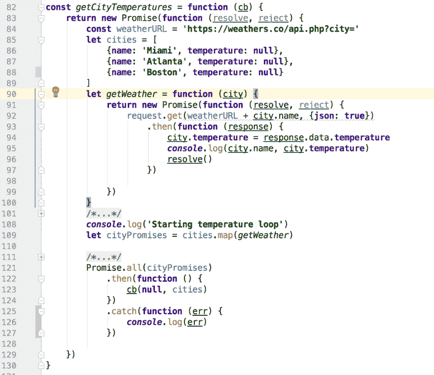
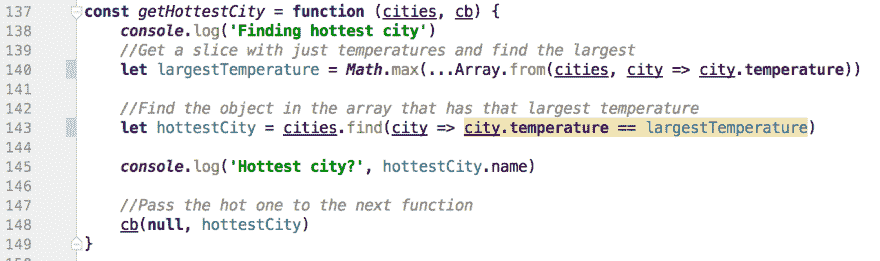
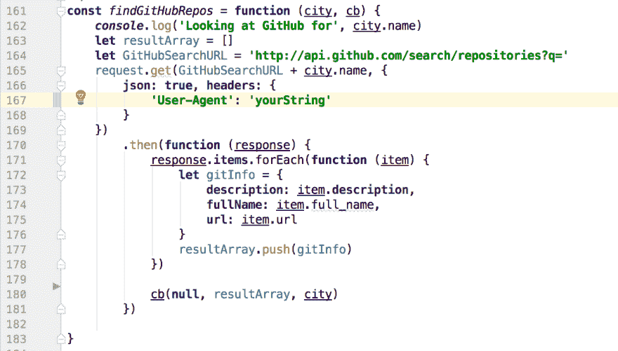
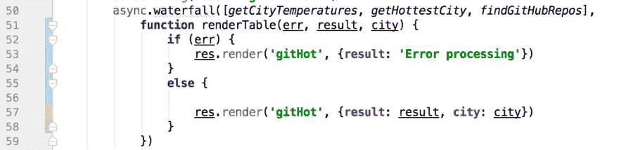

# 使用 async .瀑布和 ES6 组合 Javascript 中嵌套异步调用的结果

> 原文:[https://dev . to/perrydbucs/composing-the-results-of-nested-async-calls-in-JavaScript-using-async fault-and-es6-promises](https://dev.to/perrydbucs/composing-the-results-of-nested-asynchronous-calls-in-javascript-using-asyncwaterfall-and-es6-promises)

*我最近[在我的博客](http://sites.bu.edu/perryd)上发布了这篇文章，并想在这里分享一下。今年夏天，我教授了一门关于应用程序开发的课程，并观察到我的许多学生在异步环境中工作很艰难(大多数人没有做过任何 Javascript 编码)。这篇文章是我的尝试，既帮助我的学生学习一些模式，也帮助我巩固自己的想法。我欢迎建设性的批评，尤其是如果我偏离了轨道！* 

## 不同步搜索

Javascript 中最难理解的事情之一是如何处理嵌套异步调用，尤其是当一个函数依赖于前一个函数的结果时。在我的软件工程课程中，我经常看到这种情况，团队需要从两个不同的第三方数据源中合成新信息。模式是查找返回集合的内容，然后为集合中的每个成员查找其他内容。

有多种方法可以解决这个问题，但是大多数依赖于 Javascript 的承诺，要么来自 ES5 和更早版本的第三方库，要么来自 ES6 的内置承诺。在本文中，我们将通过使用 ES6 native Promises 和 async.js 包来使用这两者。这不是对 ES6 承诺本身的讨论，但它可能有助于您理解它们。

此处讨论的文件旨在安装在 Node/Express 应用程序中的路由上:

```
//From app.js
const rp = require('./routes/request-promises')
app.use('/rp', rp)
```

[不幸的是，BU 博客上使用的 Wordpress 实现在显示代码方面做得很糟糕，所以下面的代码片段是讨论的主要内容。完整的文件可以在文章的底部找到。]

这里的路线使用了两个 API:
*【https://weathers.co】*三个城市的当前天气，
*[https://api.github.com/search/repositories?q=&lt；term](https://api.github.com/search/repositories?q=<term) >* 在 GitHub repos 中搜索“最热”的城市。

在我们的例子中，我们将获取 3 个城市的天气，选择最热的一个，然后点击 GitHub 搜索以该城市的名字命名的 repos。这有点牵强——但我们只是想演示当所有 API 调用都异步时，使用一个 API 调用的结果来填充第二个 API 调用。

使用了两种包装(除了 Express ):

[T2】](https://res.cloudinary.com/practicaldev/image/fetch/s--vIYbGkvc--/c_limit%2Cf_auto%2Cfl_progressive%2Cq_auto%2Cw_880/https://thepracticaldev.s3.amazonaws.com/i/pkf9zy7eoz6g4oklmhim.png)

第一种是标准*请求-承诺*包装的缩小包装；我们不需要更大的库的所有功能。 *request-promise* 本身是一个包装器，它将承诺添加到用于进行网络调用的标准 *request* 包中，例如对 HTTP 端点的调用。

在这个模块中只有一个路由，即顶级 URL 上的 GET。在上面的代码片段中，这个路由器安装在'/rp '，因此完整的 URL 路径是 [http://localhost:3000/rp](http://localhost:3000/rp) (假设服务器设置为监听端口 3000)。

[T2】](https://res.cloudinary.com/practicaldev/image/fetch/s--aSPtv8E_--/c_limit%2Cf_auto%2Cfl_progressive%2Cq_auto%2Cw_880/https://thepracticaldev.s3.amazonaws.com/i/ap7psiptu2a4bed5c4f0.png)

在第 50 行上，*async . fault*方法被用来创建一个将依次执行的函数链。每个函数都返回一个承诺，因此下一个函数会一直等待，直到前一个函数的承诺得到解决。我们需要这样做，因为每个函数都提供数据，下面的函数将以某种方式使用这些数据。这些数据随回调一起依次提供给每个函数，回调是瀑布中的下一个函数。

*async . fault*在这个实现中有两个参数:一个按顺序调用的函数数组，和一个最后执行的函数(第 51 行的 *renderTable* )。一个小的旁注:最终的函数可以是匿名的，但是当调试一个大的应用程序时，可能很难在数百个潜在的匿名函数中准确地找出哪个匿名函数导致了问题。在调试时，命名这些函数非常有帮助！

### 获取城市温度

瀑布中的第一个函数 *getCityTemperatures* ，以硬编码数组的形式调用每个城市的 weathers.co API。这是瀑布中的第一个函数，所以它只接收一个参数，回调(cb)。

[T2】](https://res.cloudinary.com/practicaldev/image/fetch/s--uDjK6hBi--/c_limit%2Cf_auto%2Cfl_progressive%2Cq_auto%2Cw_880/https://thepracticaldev.s3.amazonaws.com/i/ueptjzehhnq9schcqkr8.png)

这是三个函数中最有趣的一个，因为它必须对 *cities* 数组中的每个城市进行 API 调用，而且它们都是异步调用。直到收集了所有的城市天气，我们才能从功能中返回。

在每个 API 调用中，一旦知道了当前温度，它就被插入到城市对象中——在*城市*数组中。(注意，weathers.co 并不总是返回实际的当前温度，它通常是一个缓存值。)这里的技术是创建一个包含第 83 行的 API 调用的承诺。这个承诺代表了整个函数，在收集完所有城市天气信息之前，它不会被解析。

第二个承诺是在第 91 行的本地函数 *getWeather* 中建立的，它处理每个城市的 API 调用。 *request.get()* 本身在第 92 行返回一个承诺(因为我们使用的是 request-promise-lite 包)，所以我们生成了 *request.get()* 并在它后面跟随一个 then()，当 API 调用返回时它将运行。第 96 行的 resolve()让我们从这个内心的承诺中走出来，进入下一个。

注意，我们还没有执行 *getWeather()* ，我们只是用*在这里定义*它。第 109 行使用 *Array.map* 方法返回一个包含三个函数的数组。每个函数都有一个城市对象传递给它，每个函数都返回一个承诺(如第 91 行所定义的)。那个 *cityPromises* 数组看起来像

```
[getWeather({name: 'Miami', temperature: null}), getWeather({name: 'Atlanta', temperature: null}), getWeather({name: 'Boston', temperature: null})]
```

在行 109 完成之后。

我们*仍然*没有执行任何事情。第 109 行的映射让我们使用第 121 行的 ES6 原生 Promise 库中的 *Promise.all( )* 方法，该方法仅在其输入数组中的所有承诺都已解析时才解析。这有点像第 50 行中的 async . fault()调用，但是在这种情况下，顺序并不重要。如果任何一个承诺被拒绝，整个 Promise.all()结构将立即拒绝，即使还有未解决的承诺。

一旦所有的承诺都解决了(意味着每个城市的天气都被记录了)，第 122 行中的 then()就会执行，并使用现在已经完成的城市和温度数组调用传入的回调。传递给回调函数的空值被解释为一个错误对象。

这里有趣的是 Promise.all()实际上是并行运行请求。

### getHottestCity

链中的下一个函数 getHottestCity 简单地查找城市数组中的最高温度，并将该城市的对象返回给瀑布中的下一个函数。这是同步代码，所以不需要承诺。

[T2】](https://res.cloudinary.com/practicaldev/image/fetch/s--ZTPBlU8R--/c_limit%2Cf_auto%2Cfl_progressive%2Cq_auto%2Cw_880/https://thepracticaldev.s3.amazonaws.com/i/vw2wlcc9hu28ezwwtgup.png)

第 140 行创建了一个切片，只包含来自*城市*数组的温度，并调用 *Math.max( )* 来确定最大值。然后，第 143 行查找原始城市数组中最热的温度，并返回相应的对象。这两行都使用 ES6 的方式用粗箭头符号(= >)定义函数，第 140 行使用新的 spread 操作符。

一旦确定了“热门”城市，就将其传递给第 148 行瀑布中的下一个函数。这里， *null* 再次代替了一个错误对象。

### findGithubRepos

瀑布中的倒数第二个函数在 Github 中搜索包含之前发现的“热门”城市名称的项目。第 167 行的 User-Agent 头是 Github 搜索 API 所需要的——您可以将其更改为您喜欢的任何字符串。

[T2】](https://res.cloudinary.com/practicaldev/image/fetch/s--k4JD1VYg--/c_limit%2Cf_auto%2Cfl_progressive%2Cq_auto%2Cw_880/https://thepracticaldev.s3.amazonaws.com/i/v068wbtybka21tm6vkl3.png)

第 165 行中的 API 调用使用*请求-承诺*(来自第 29 行)，因此返回一个承诺。一旦承诺被解析， *then( )* 函数从一些返回的数据中构建一个对象数组。

在第 180 行，完成的项目数组连同原始的“hot”city 对象一起被传递给瀑布中的下一个函数。

### 最终功能

要执行的最后一个函数只是获取瀑布的结果，并在第 57 行呈现一个 Pug 页面。

[T2】](https://res.cloudinary.com/practicaldev/image/fetch/s--zg5Ul4B_--/c_limit%2Cf_auto%2Cfl_progressive%2Cq_auto%2Cw_880/https://thepracticaldev.s3.amazonaws.com/i/njnbfzc6wk00bny8vu5f.png)

这里有一个到完整文件的[链接。如有疑问或指正，请留言评论！](https://gist.github.com/pdonham/8d2c7e0ccd482150a6877b5075794b23)