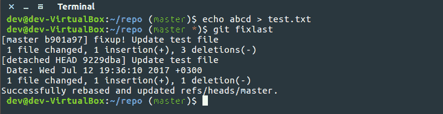

# 轻松自动压缩对以前提交的更改

> 原文:[https://dev . to/samipietikainen/easy-auto-squash-changes-to-previous-commit](https://dev.to/samipietikainen/easily-auto-squash-changes-to-previous-commit)

在提交之后，我总是喜欢在将变更推向上游之前先进行比较。只是为了确保一切正常。嗯，我经常会发现一些打字错误，注释掉我应该删除的代码，或者其他一些需要修复的小问题。所以我最终一次又一次地运行相同的命令。首先进行新的提交以进行修复，然后进行交互式重定基础以压缩对先前提交的更改。这是一个绝佳的化名机会来保存那些珍贵的按键。

```
fixlast = !git commit -a --fixup=HEAD && GIT_EDITOR=true git rebase -i --autosquash HEAD~2 
```

<svg width="20px" height="20px" viewBox="0 0 24 24" class="highlight-action crayons-icon highlight-action--fullscreen-on"><title>Enter fullscreen mode</title></svg> <svg width="20px" height="20px" viewBox="0 0 24 24" class="highlight-action crayons-icon highlight-action--fullscreen-off"><title>Exit fullscreen mode</title></svg>

例如，您可以将别名添加到您的 **~/。gitconfig** 文件。有了这个别名，您可以通过运行 **git fixlast** 轻松地自动撤销对之前提交的更改。

[T2】](https://res.cloudinary.com/practicaldev/image/fetch/s--ZBV23udW--/c_limit%2Cf_auto%2Cfl_progressive%2Cq_auto%2Cw_880/https://pagefaultblog.files.wordpress.com/2017/07/git-autosquash-to-previous.png)

所以我们来快速分解一下。为了轻松运行多个命令，我使用了**！**运行 shell 命令，而不仅仅是 git 子命令。第一部分接受所有更改，并为之前的提交创建一个修正提交， **HEAD** 。修正参数增加了**修正！**提交消息的前缀，稍后将被自动撤销识别。

第二部分启动交互式 rebase，并告诉 git 处理所有修正和挤压提交( **- autosquash** 参数)。 **HEAD~2** 向 rebase 提交两个最上面的提交。

通常，交互式 rebase 会打开一个编辑器，但在这种情况下，我们真的只想接受自动撤销，而不需要任何手动选择。为此， **GIT_EDITOR** 环境变量被设置为 true(即/bin/true application)。因此，当 git 想要打开 rebase 编辑器时，它会立即收到成功返回代码，并继续 rebase。这就是全部了。

**编辑:**刚刚意识到上面的解决方案有点过于复杂。您可以用- amend commit 标志完成同样的工作。不过，使用 GIT_EDITOR 环境变量可以避免 amend 编辑器弹出。

这也发表在我的博客上。有兴趣就去看看。