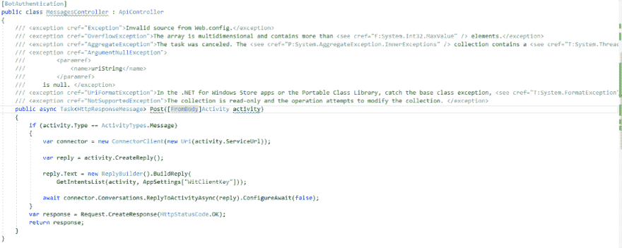

# ArticleNotFoundException:404

> 原文::1230【https://dev . to/dim 0kq/article notfounindexception 404】

例外，例外——等等，什么？最近我提出了一个[观点](https://medium.com/r/?url=https%3A%2F%2Fwww.facebook.com%2Fdmytro.zhluktenko%2Fposts%2F241724886318393%3Fpnref%3Dstory)，然后想了想，决定写一篇闲聊的文章。
 
有 C#命令式 OO 背景，我挺习惯异常的，我们到处都有异常。
想到 Java。我几乎不记得在弗罗茨瓦夫的一次啤酒谈话中，我说过 Java 是面向异常的语言。没关系，它仍然是一种很好的编程语言，人们用它写了一堆代码，并继续这样做。这是我的代码样本，通常我们会有这样的东西。

这有什么错？如果你只有面向对象的经验，没有什么不对。

如果我问人们想要什么，他们会说是更快的马。T3【亨利·福特】T4】

有时候我会在软件工程的背景下想到这句话。许多人只是不想使用一些工具，因为对他们来说太复杂了。马很好骑，也很好理解，每个人都骑着马。在 OOP 中，每个人都在做那种事情。如你所见，我没有把所有的东西都打包到 try/catch 块中，但是实际上，我可以，我甚至可以尝试处理所有这些。对我来说，我不认为例外是银弹练习，它们既不好也不坏。简而言之:看情况。取决于领域(例如医疗保健)、重构时间、团队技能、语言生态系统等等。

***一个例外是当一个成员未能完成其名字所指示的任务时。**
(杰弗瑞·里希特，CLR via C#)* 

想到这个论题。每个有 FP 背景的人都会说异常是垃圾，你不应该产生副作用，不应该改变你的控制流，保持它的纯净等等。我基本上同意，纯洁、透明是新的黑色。
我想说的是，有时您仍然需要提出一个异常，但那应该是像 StackOverflow 这样的异常情况。或者假设您正在调用一个 web API 服务器。当然，你希望它每时每刻都在工作。一个例外是当它由于某种原因关闭时。例外情况是您请求超时。
偶然的情况是当用户在他的年龄字段中键入“daslkjdsalk#()Dk”时。预计用户是愚蠢的。
我想在这里提到的要点是，在提出例外之前，你需要评估你的情况是否真的例外。
如果真的是例外(< 1%)，提出一个例外，你就可以走了。但是还有一件事:使代码可读。例如，在 Java 中，try/catch 块非常大，甚至是样板文件，很难分解。像正确性和性能之类的所有其他考虑都是二等公民。如果它是可读的，其余的可以在维护中处理，一些东西可以重构等等。但是如果你没有可读的代码，那么你最好扔掉它，从头开始重写。我认为这就是现代软件的构建方式:你尝试，你学习，你做，你重复。

**关于单子我怎么能不说呢？！**

 **在 FP 中我们称之为单子。我会假设我不需要解释整个单子的事情，让我们假装你已经知道了。

[@ monadburritos](twitter.com/monadburritos)

它们与异常有什么关系？

 **我认为单子可能是一种近乎纯粹的工具。简单地说，Maybe 是一种期权类型，可以持有某物，也可以不持有。基本上，某个东西本身就是一个价值。所以在你的函数中，如果一切顺利，你只需要赋值。或者如果出错或发生错误，则不返回任何值。这使得你的方法非常透明和纯粹——它总是返回一些东西或者什么也不返回。容易测试吗？大概吧。

调用堆栈中的下一个函数应该处理两种情况——“有”和“没有”。这很像从一个函数中返回 null，只不过它是以一种类型安全的方式完成的，这种方式强制您不处理任何情况。所以不能有 NullReferenceException 这样的东西。注意，也许单子在接吻，没有额外的信息说明为什么你没有价值，只是简单地说你没有价值。这并不像我们习惯于使用 FileNotFound、TimeOutException、NumberFormatException、UriFormatException 等。没有关于问题的额外信息，只有 1 或 0。我认为使用 Maybe 的最佳情况是通过一个键从字典中获取一个值——要么有，要么没有，没有什么特别的。不应该有 ValueNotFoundException。

**所以……**

我不能说引发异常是不好的，同样我也不能说它是好的。看情况而定。但是我确信有些情况下我应该抛出一个异常，我可以处理可能/错误代码/最低值/等等。
有很多不同的方法，我认为软件工程就是关于——关于选择，关于考虑不同的情况，关于让你大吃一惊。

最初发布于[我的媒体](https://medium.com/@dmytrozhluktenko/articlenotfoundexception-404-d407a1221e3b)。****