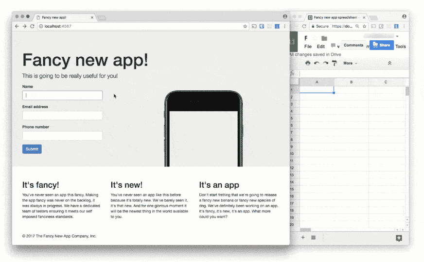
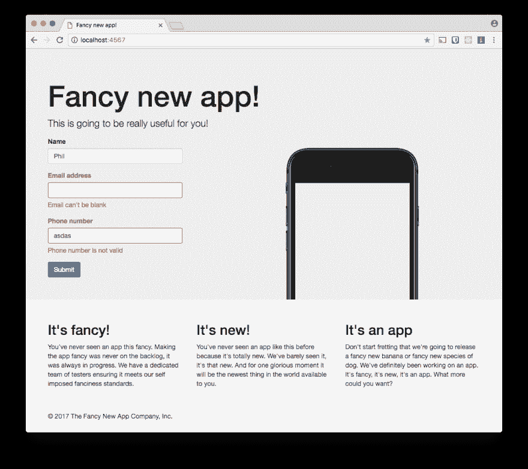

# 用活动模型验证来验证 Ruby 对象

> 原文:[https://dev . to/twilio/validate-ruby-objects-with-active-model-validations](https://dev.to/twilio/validate-ruby-objects-with-active-model-validations)

在 Rails 和活动记录的世界中，验证数据并将其存储在数据库中很容易。如果你曾经[建立了一个简单的网站，在谷歌电子表格](https://dev.to/philnash/create-a-landing-page-with-sinatra-google-spreadsheets-and-ruby)中存储数据，那么你会很快了解到用户可以输入任何东西(或者什么都不输入)。在这篇文章中，我们将看到如何使用活动记录的一部分来验证输入:`ActiveModel::Validations`。

## 电子表格也可以是数据库

在我的上一篇文章中，我们使用 Sinatra 和 Google 电子表格作为数据库，为一个新应用建立了一个[登陆页面。尽管这个应用程序需要一点改进；用户可以在表单中输入他们想要的任何数据，它会很高兴地提交。如果我们要在应用发布时联系我们的用户，我们需要保证获得一些真实的数据。](https://dev.to/philnash/create-a-landing-page-with-sinatra-google-spreadsheets-and-ruby)

我们应该验证我们的输入并确保

*   我们至少得到一个名字和电子邮件地址
*   如果我们得到一个电子邮件地址，它看起来像一个有效的电子邮件地址
*   如果我们得到一个电话号码，那么它就是一个有效的号码

让我们改进这个应用程序，让它可以做到以上所有。

## 获取设置

如果你想跟随本教程中的代码，你需要一个 Google 电子表格和上一篇文章中的[应用程序。如果你还没有设置好，不要担心，下面有这样做的说明。](https://dev.to/philnash/create-a-landing-page-with-sinatra-google-spreadsheets-and-ruby)

如果你还没有一个电子表格设置和通过 API 编辑它的权限，那么[按照这篇文章来生成你的凭证](https://dev.to/philnash/google-spreadsheets-and-ruby)，保存为一个名为`client_secret.json`的文件。请确保为您的服务提供对电子表格的编辑权限。

接下来，克隆或下载应用程序，并检查 save-data 分支。这是从[前一篇博文](https://dev.to/philnash/create-a-landing-page-with-sinatra-google-spreadsheets-and-ruby)结束时应用程序的当前状态。

```
git clone https://github.com/philnash/ruby-google-sheets-sinatra.git
cd ruby-google-sheets-sinatra
git checkout save-data 
```

<svg width="20px" height="20px" viewBox="0 0 24 24" class="highlight-action crayons-icon highlight-action--fullscreen-on"><title>Enter fullscreen mode</title></svg> <svg width="20px" height="20px" viewBox="0 0 24 24" class="highlight-action crayons-icon highlight-action--fullscreen-off"><title>Exit fullscreen mode</title></svg>

使用 Bundler 安装依赖项，运行应用程序并在 [访问 http://localhost:4567](http://localhost:4567) 以确保它按预期工作。

```
bundle install bundle exec ruby app.rb 
```

<svg width="20px" height="20px" viewBox="0 0 24 24" class="highlight-action crayons-icon highlight-action--fullscreen-on"><title>Enter fullscreen mode</title></svg> <svg width="20px" height="20px" viewBox="0 0 24 24" class="highlight-action crayons-icon highlight-action--fullscreen-off"><title>Exit fullscreen mode</title></svg>

[T2】](https://res.cloudinary.com/practicaldev/image/fetch/s--qLnJGUJg--/c_limit%2Cf_auto%2Cfl_progressive%2Cq_auto%2Cw_880/https://twilioinc.wpengine.com/wp-content/uploads/2017/06/V0nFfq0H-tlU9rIaofpRtScv8BQUSoXtcZY-D0lndme3R0kVai5HHWbvm1XFe7q8Ro1UgzGFuvnjOCt_e2OG0DgWxy7y1jHMyOfR5xQw8EbpuWIyedJ0VMdmL85BM5P7LWMe7So.png)

首先，应用程序需要一点重构。

## 朴素古老的红宝石物件

目前，我们构建的 Sinatra 应用程序只接受用户提交的表单参数，并将它们直接发送给 Google Sheets API。为了开始我们对这个过程的重构，最好是将输入捕获为一个对象，然后我们可以对其进行推理。创建一个我们可以用来封装这些数据的类。

```
class UserDetails
  attr_reader :name, :email, :phone_number
  def initialize(name=nil, email=nil, phone_number=nil)
    @name = name
    @email = email
    @phone_number = phone_number
  end

  def to_row
    [name, email, phone_number]
  end
end 
```

<svg width="20px" height="20px" viewBox="0 0 24 24" class="highlight-action crayons-icon highlight-action--fullscreen-on"><title>Enter fullscreen mode</title></svg> <svg width="20px" height="20px" viewBox="0 0 24 24" class="highlight-action crayons-icon highlight-action--fullscreen-off"><title>Exit fullscreen mode</title></svg>

给这个类一个初始化器，它接收姓名、电子邮件和电话号码作为参数，并将它们存储为实例变量。包括一个公开这些属性的`attr_reader`和一个以正确格式返回属性的`to_row`方法，以便向电子表格添加一行。

现在我们可以更新我们的路由，使用这个对象代替原始参数。

```
post "/" do
  user_details = UserDetails.new(params["name"], params["email"], params["phone_number"])
  begin
    worksheet.insert_rows(worksheet.num_rows 1, [user_details.to_row])
    worksheet.save
    erb :thanks
  rescue
    erb :index, locals: {
      error_message: "Your details could not be saved, please try again."
    }
  end
end 
```

<svg width="20px" height="20px" viewBox="0 0 24 24" class="highlight-action crayons-icon highlight-action--fullscreen-on"><title>Enter fullscreen mode</title></svg> <svg width="20px" height="20px" viewBox="0 0 24 24" class="highlight-action crayons-icon highlight-action--fullscreen-off"><title>Exit fullscreen mode</title></svg>

如果你再次启动应用程序，你会发现它仍然像以前一样工作。到目前为止，我们所做的工作只是对下一部分的有益重构；验证数据。

## 用 ActiveModel::Validations 进行验证

为了使验证我们的用户详细信息变得容易，并且能够被任何 Rails 开发人员识别，我们可以使用`ActiveModel::Validations`来验证对象。首先将 ActiveModel 添加到您的`Gemfile`中。

```
# frozen_string_literal: true
source "https://rubygems.org"

gem "sinatra"
gem "google_drive"
gem "activemodel", require: "active_model" 
```

<svg width="20px" height="20px" viewBox="0 0 24 24" class="highlight-action crayons-icon highlight-action--fullscreen-on"><title>Enter fullscreen mode</title></svg> <svg width="20px" height="20px" viewBox="0 0 24 24" class="highlight-action crayons-icon highlight-action--fullscreen-off"><title>Exit fullscreen mode</title></svg>

通过运行`bundle install`更新您的依赖项。我们准备向我们的对象添加一些验证。

### 开箱验证

使用`ActiveModel::Validations`来验证用户提交的姓名和电子邮件地址是非常简单的。让我们向`UserDetails`类添加验证。将`ActiveModel::Validations`模块包含到`UserDetails`类中。然后使用[类方法`validates`](http://api.rubyonrails.org/classes/ActiveModel/Validations/ClassMethods.html#method-i-validates) 来验证姓名和电子邮件字段的存在。

```
class UserDetails
  include ActiveModel::Validations

  attr_reader :name, :email, :phone_number

  validates :name, presence: true
  validates :email, presence: true

  # etc
end 
```

<svg width="20px" height="20px" viewBox="0 0 24 24" class="highlight-action crayons-icon highlight-action--fullscreen-on"><title>Enter fullscreen mode</title></svg> <svg width="20px" height="20px" viewBox="0 0 24 24" class="highlight-action crayons-icon highlight-action--fullscreen-off"><title>Exit fullscreen mode</title></svg>

您可以通过在 irb 中加载应用程序来测试这一点。只需运行

```
irb -r ./app.rb 
```

<svg width="20px" height="20px" viewBox="0 0 24 24" class="highlight-action crayons-icon highlight-action--fullscreen-on"><title>Enter fullscreen mode</title></svg> <svg width="20px" height="20px" viewBox="0 0 24 24" class="highlight-action crayons-icon highlight-action--fullscreen-off"><title>Exit fullscreen mode</title></svg>

这将给你一个可以访问`UserDetails`类的 Ruby REPL。

```
user_details = UserDetails.new
user_details.valid?
#=> false
user_details.errors.full_messages
#=> ["Name can't be blank", "Email can't be blank"]
user_details2 = UserDetails.new("Phil", "Phil's email")
user_details2.valid?
#=> true 
```

<svg width="20px" height="20px" viewBox="0 0 24 24" class="highlight-action crayons-icon highlight-action--fullscreen-on"><title>Enter fullscreen mode</title></svg> <svg width="20px" height="20px" viewBox="0 0 24 24" class="highlight-action crayons-icon highlight-action--fullscreen-off"><title>Exit fullscreen mode</title></svg>

`ActiveModel::Validations`向`UserDetails`对象添加了`valid?`和`errors`方法。这些稍后会有用，首先要写更多的验证。

我们还想检查电子邮件地址至少看起来像一个电子邮件地址。电子邮件验证不需要 100%完美，检查电子邮件地址属于输入它的人的唯一真正方法是给它发送一封电子邮件，但最好能发现明显的错别字。我们可以使用格式验证来检查正则表达式。我不想编写自己的正则表达式来检查电子邮件地址格式，所以我打算从[design](https://github.com/plataformatec/devise/blob/ee01bac8b0b828b3da0d79c46115ba65c433d6c8/lib/devise.rb#L113)那里借用一个。

```
class UserDetails
  include ActiveModel::Validations

  attr_reader :name, :email, :phone_number

  validates :name, presence: true
  validates :email, presence: true, format: { with: /A[^@s] @[^@s] z/, allow_blank: true }

  # etc
end 
```

<svg width="20px" height="20px" viewBox="0 0 24 24" class="highlight-action crayons-icon highlight-action--fullscreen-on"><title>Enter fullscreen mode</title></svg> <svg width="20px" height="20px" viewBox="0 0 24 24" class="highlight-action crayons-icon highlight-action--fullscreen-off"><title>Exit fullscreen mode</title></svg>

### 自定义验证

我们希望检查用户是否提供了一个看起来有效的电话号码。对此没有现成的验证或好的正则表达式。这就是定制验证有用的地方。接下来要做的是使用 [Twilio Lookups API](https://www.twilio.com/docs/api/lookups) 编写一个自定义验证，总结 Greg 在撰写关于用 Ruby 验证电话号码的[时展示的技术。](https://www.twilio.com/blog/2015/04/validate-phone-numbers-in-ruby-using-the-lookup-api.html)

首先，我们应该将 [Twilio Ruby 宝石](https://www.twilio.com/docs/libraries/ruby)添加到`Gemfile`中。

```
# frozen_string_literal: true
source "https://rubygems.org"

gem "sinatra"
gem "google_drive"
gem "activemodel", require: "active_model"
gem "twilio-ruby" 
```

<svg width="20px" height="20px" viewBox="0 0 24 24" class="highlight-action crayons-icon highlight-action--fullscreen-on"><title>Enter fullscreen mode</title></svg> <svg width="20px" height="20px" viewBox="0 0 24 24" class="highlight-action crayons-icon highlight-action--fullscreen-off"><title>Exit fullscreen mode</title></svg>

用`bundle install`安装最新的依赖项。

当你为一个属性编写自定义验证时，你需要创建一个`ActiveModel::EachValidator`的子类并实现`validate_each`方法。

创建一个新的`Twilio::REST::LookupsClient`，用于访问[查找 API](https://www.twilio.com/docs/api/lookups) 。我使用环境变量来提供我的 Twilio 凭据，你也可以这样做(如果你不知道如何设置环境变量，请查看张秀坤在[如何设置环境变量](https://www.twilio.com/blog/2017/01/how-to-set-environment-variables.html)的帖子)或者只需从你的 [Twilio 控制台](https://www.twilio.com/console)添加你的实际帐户 SID 和 Auth Token。

用`lookups_client`和`response = lookups_client.phone_numbers.get(value)`查找该值，该值将是用户提交的电话号码。Twilio 库是懒惰的，所以直到我们试图检查结果的一个属性，它才真正执行请求，所以调用`response.phone_number`。在这种情况下，如果电话号码是真实的，API 将成功返回，否则将返回 404 错误。[正如 Greg 所描述的](https://www.twilio.com/blog/2015/04/validate-phone-numbers-in-ruby-using-the-lookup-api.html)如果有一个`Twilio::REST::RequestError`，你需要`rescue`并检查 20404 代码( [20404 是 Twilio API 的 404](https://www.twilio.com/docs/api/errors/20404) 版本)。如果是 20404，则为正在验证的属性向记录的 errors 对象添加一个错误。如果出现其他错误，则再次引发该错误。

```
class PhoneNumberValidator < ActiveModel::EachValidator
  def validate_each(record, attribute, value)
    lookups_client = Twilio::REST::LookupsClient.new(ENV["TWILIO_ACCOUNT_SID"], ENV["TWILIO_AUTH_TOKEN"])
    begin
      response = lookups_client.phone_numbers.get(value)
      response.phone_number
    rescue Twilio::REST::RequestError => error
      if error.code == 20404
        record.errors[attribute] << (options[:message] || 'is not a valid phone number')
      else
        raise error
      end
    end
  end
end 
```

<svg width="20px" height="20px" viewBox="0 0 24 24" class="highlight-action crayons-icon highlight-action--fullscreen-on"><title>Enter fullscreen mode</title></svg> <svg width="20px" height="20px" viewBox="0 0 24 24" class="highlight-action crayons-icon highlight-action--fullscreen-off"><title>Exit fullscreen mode</title></svg>

自定义验证器已经编写好了，所以我们可以像使用现有的验证器一样使用它。因为电话号码不是必填字段，所以将`allow_blank: true`添加到选项中。

```
 validates :name, presence: true
  validates :email, presence: true, format: { with: /A[^@s] @[^@s] z/, allow_blank: true }
  validates :phone_number, phone_number: { allow_blank: true } 
```

<svg width="20px" height="20px" viewBox="0 0 24 24" class="highlight-action crayons-icon highlight-action--fullscreen-on"><title>Enter fullscreen mode</title></svg> <svg width="20px" height="20px" viewBox="0 0 24 24" class="highlight-action crayons-icon highlight-action--fullscreen-off"><title>Exit fullscreen mode</title></svg>

## 提交时验证

我们已经为我们的类编写了验证，所以它们需要付诸行动。之前我们更新了我们的`post '/'`路线以使用`UserDetails`类。现在，如果对象无效，我们需要再次更新以使用新的`valid?`方法来呈现索引。

```
post "/" do
  user_details = UserDetails.new(params["name"], params["email"], params["phone_number"])
  if user_details.valid?
    begin
      worksheet.insert_rows(worksheet.num_rows 1, [user_details.to_row])
      worksheet.save
      erb :thanks
    rescue
      erb :index, locals: {
        error_message: "Your details could not be saved, please try again."
      }
    end
  else
    erb :index
  end
end 
```

<svg width="20px" height="20px" viewBox="0 0 24 24" class="highlight-action crayons-icon highlight-action--fullscreen-on"><title>Enter fullscreen mode</title></svg> <svg width="20px" height="20px" viewBox="0 0 24 24" class="highlight-action crayons-icon highlight-action--fullscreen-off"><title>Exit fullscreen mode</title></svg>

重启应用程序并在浏览器中加载。尝试提交一个空表单。您应该不会再看到写着“谢谢”的页面，而是会再次呈现索引。但是我们也没有得到任何反馈。我们需要将我们的`user_details`对象发送到视图，并使用`user_details.errors`对象来显示错误消息。为了使我们的视图更容易，更新两条路线来发送一个`user_details`对象。

```
get "/" do
  erb :index, locals: { user_details: UserDetails.new }
end

post "/" do
  user_details = UserDetails.new(params["name"], params["email"], params["phone_number"])
  if user_details.valid?
    begin
      worksheet.insert_rows(worksheet.num_rows 1, [user_details.to_row])
      worksheet.save
      erb :thanks
    rescue
      erb :index, locals: {
        error_message: "Your details could not be saved, please try again."
      }
    end
  else
    erb :index, locals: { user_details: user_details }
  end
end 
```

<svg width="20px" height="20px" viewBox="0 0 24 24" class="highlight-action crayons-icon highlight-action--fullscreen-on"><title>Enter fullscreen mode</title></svg> <svg width="20px" height="20px" viewBox="0 0 24 24" class="highlight-action crayons-icon highlight-action--fullscreen-off"><title>Exit fullscreen mode</title></svg>

更新`views/index.erb`中的表格以显示反馈。您可以使用`user_details.errors.include?(attribute_name)`来计算字段是否有任何错误，并在周围的`<div>`中添加一个`"has-error"`类。要显示一个属性的错误，循环通过`user_details.errors.full_messages_for(attribute_name)`，每次打印出错误信息。

下面是模板中完全更新的表单:

```
 <form action="/" method="POST">
          <div class="form-group<%= ' has-error' if user_details.errors.include?(:name) %>">
            <label for="name" class="control-label">Name</label>
            <input type="text" class="form-control" name="name" id="name" value="<%= user_details.name %>">
            <% user_details.errors.full_messages_for(:name).each do |message| %>
              <span class="help-block"><%= message %></span>
            <% end %>
          </div>
          <div class="form-group<%= ' has-error' if user_details.errors.include?(:email) %>">
            <label for="email" class="control-label">Email address</label>
            <input type="email" class="form-control" name="email" id="email" value="<%= user_details.email %>">
            <% user_details.errors.full_messages_for(:email).each do |message| %>
              <span class="help-block"><%= message %></span>
            <% end %>
          </div>
          <div class="form-group<%= ' has-error' if user_details.errors.include?(:phone_number) %>">
            <label for="phone_number" class="control-label">Phone number</label>
            <input type="tel" class="form-control" name="phone_number" id="phone_number" value="<%= user_details.phone_number %>">
            <% user_details.errors.full_messages_for(:phone_number).each do |message| %>
              <span class="help-block"><%= message %></span>
            <% end %>
          </div>
          <button type="submit" class="btn btn-primary">Submit</button>
        </form> 
```

<svg width="20px" height="20px" viewBox="0 0 24 24" class="highlight-action crayons-icon highlight-action--fullscreen-on"><title>Enter fullscreen mode</title></svg> <svg width="20px" height="20px" viewBox="0 0 24 24" class="highlight-action crayons-icon highlight-action--fullscreen-off"><title>Exit fullscreen mode</title></svg>

再次重启应用程序，并尝试输入一些无效数据。

[T2】](https://res.cloudinary.com/practicaldev/image/fetch/s--nYlwBmL6--/c_limit%2Cf_auto%2Cfl_progressive%2Cq_auto%2Cw_880/https://twilioinc.wpengine.com/wp-content/uploads/2017/06/36vpuazoWKFdCUTrJFYhzzV4xBPuKt2ZDWQ-MPwgPrdzy6MS4yU4iQjHlWek6pDM2FBOWqI33CqzJ5iG74x7iD1MfxTRTG6Dn2M484AG7hAOHDbJu6e4Lp00tbdTefpfUwBoLuU.png)

成功！我们正在验证我们的数据，并在出现问题时向用户显示反馈。填写正确的数据，它会通过我们的谷歌电子表格发布。

## 充满了合理数据的电子表格

您已经看到了如何在任何 Ruby 应用程序中轻松地验证数据，包括编写定制验证。我们的主要 Ruby 应用程序仍然不到 70 行。在 GitHub 上查看[这个分支](https://github.com/philnash/ruby-google-sheets-sinatra/tree/validations) [以及我们应用程序](https://github.com/philnash/ruby-google-sheets-sinatra/tree/validations)的最终代码。

有一些其他有用的模块，你可以在 Rails 应用程序之外加以利用。如果你正在构建一个 API ，请查看 [`ActiveModel::Translation`的国际化](http://guides.rubyonrails.org/active_model_basics.html#translation)或 [`ActiveModel::Serialization`。](http://guides.rubyonrails.org/active_model_basics.html#serialization)

以前用过没有活动记录的`ActiveModel::Validations`？或者使用 Rails 之外的其他 Rails 组件构建应用程序。我很想听听你的经历。请在下面给我留言或在 Twitter 上联系我，电话: [@philnash](https://twitter.com/philnash) 。

* * *

*[用主动模型验证来验证 Ruby 对象](https://www.twilio.com/blog/2017/06/validate-ruby-objects-with-active-model-validations.html)最初发表于 2017 年 6 月 14 日 [Twilio 博客](https://www.twilio.com/blog)。*