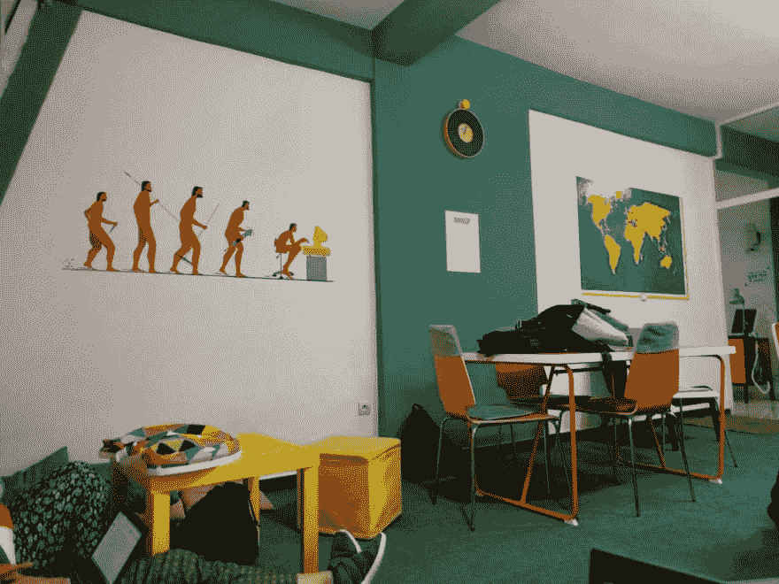
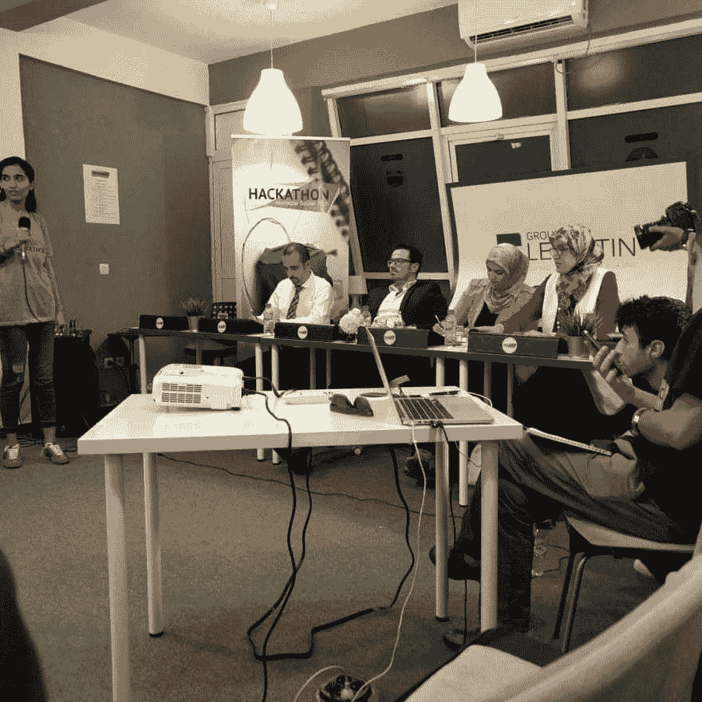
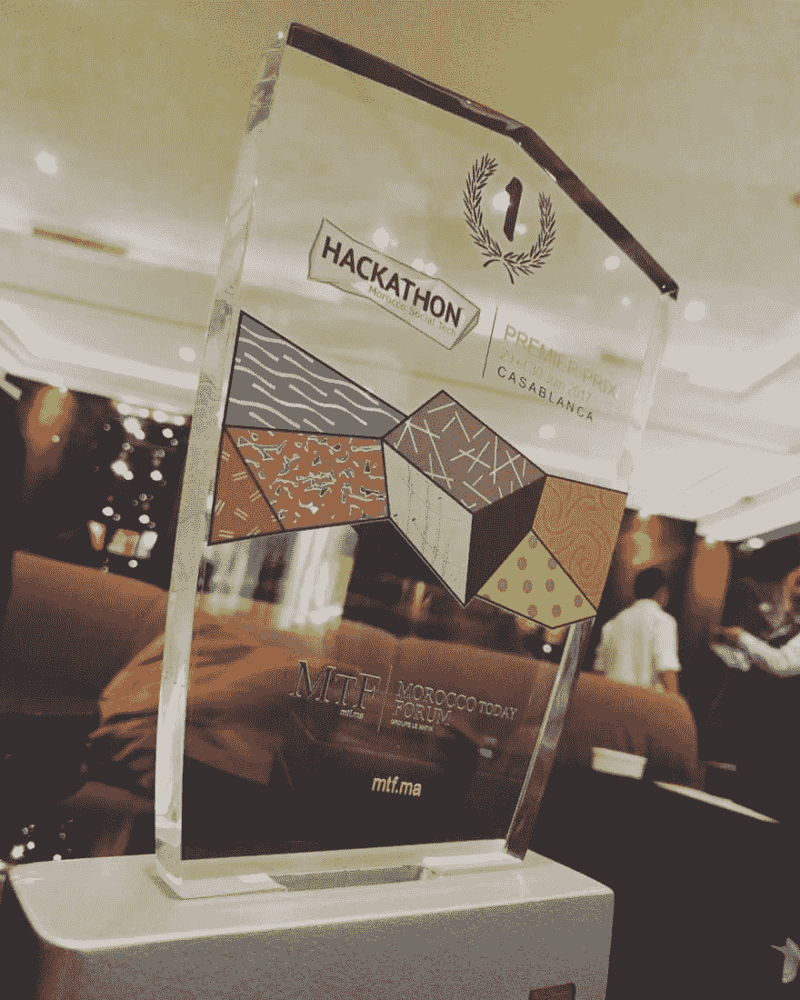

# 第一次在黑客马拉松中获得一等奖

> 原文：<https://dev.to/smakosh/first-time-getting-first-prize-at-a-hackathon-5akc>

> 这篇文章最初发表在我的个人博客 [Smakosh](https://smakosh.com/blog) 上。

和往常一样，为了准时到达，我整晚都醒着，所以那天晚上我像往常一样编码和设计。所以在[我拒绝了工作邀请](https://dev.to/getting-my-first-job-offer)后，我再次被邀请参加由 [Lematin](https://lematin.ma) 与 Screendy 合作组织的一个伟大的黑客马拉松，但是这个黑客马拉松有点严肃，因为他们开始只邀请有想法的人来挑选好的，然后他们邀请我们:设计师，开发者&营销人员来帮助他们制作原型。

[T2】](///static/coworking_space-257d514dd965b010b9aa2f02b88a643a-607e3.jpeg)

活动在 [Smart Center](https://smartcenter.ma/) 举行，这是一个很棒的合作场所，如果有一天你去摩洛哥的卡萨布兰卡市，我建议你去看看。

无论如何，正如每一次其他的黑客马拉松一样，Lematin 的首席执行官介绍并宣布了黑客马拉松的开始，想法持有者开始推销他们的想法，以便我们选择我们感兴趣的一个想法，所以一旦我听到一个伟大的家伙提出的 COOP 360 想法，我立即邀请他同时作为设计师和开发人员加入团队&在向他展示了我的作品后，他立即接受了。

由于这是一个电子商务平台，我不得不使用我自己的 github repo——[https://github.com/smakosh/Smartshop](https://github.com/smakosh/Smartshop)——一个用 php/mysql 构建的入门套件电子商务应用——是的，它缺少很多东西，但它作为一个原型工作——无论如何，我开始设计标志，插图，改变 sass 颜色变量&添加更多的页面，因为我们需要更多的功能，因为它不仅仅是一个在线商店，我没有睡觉，因为我专注于完成那个原型， 经过 36 个小时不间断的工作后，评审团进来了，项目持有人开始用原型演示来展示他们的想法。

[T2】](///static/jury-343f8701057dc4a23ec6a077d41e2ac6-5025c.jpeg)

老实说，我不相信我们会赢，因为我告诉我的朋友，当评审团即将宣布一等奖的获奖者时，我们不会赢，但是的，我错了，我们实际上赢了&被邀请参加一个会议，在那里我们将接受我们的奖励。

[T2】](///static/winners-7f3e46c6aac37fb08ebb72a7b290ae80-607e3.jpeg)

[T2】](///static/trophy-7d0e6802785d403d8152d083dd7772fd-e70b7.jpeg)

[新闻报道](https://lematin.ma/express/2017/remise-des-trophees-aux-gagnants-du-hackathon-laquo-morocco-social-tech-raquo-/274777.html)

总之，在这次黑客马拉松中，我真正学到的是永远不要放弃，尽你所能&超越你的障碍！！