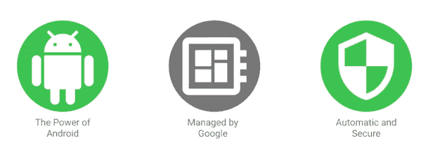
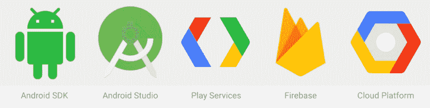
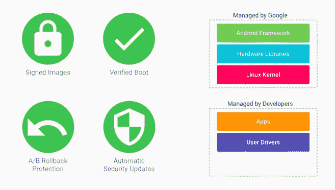
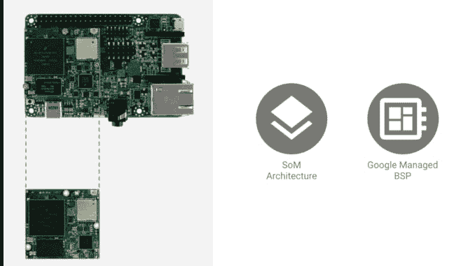
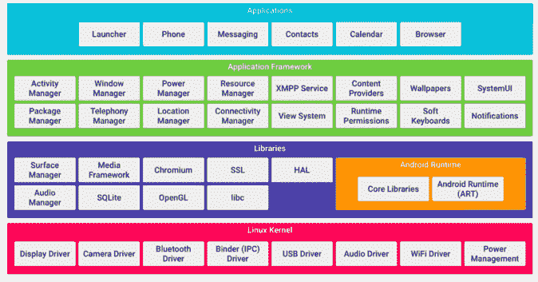
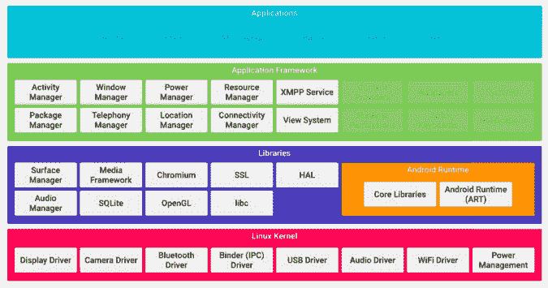
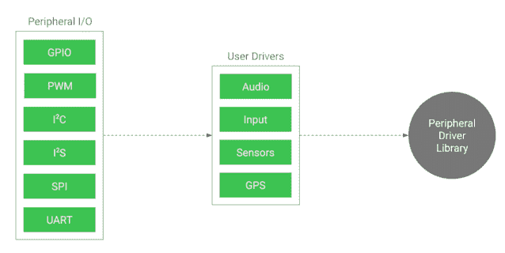
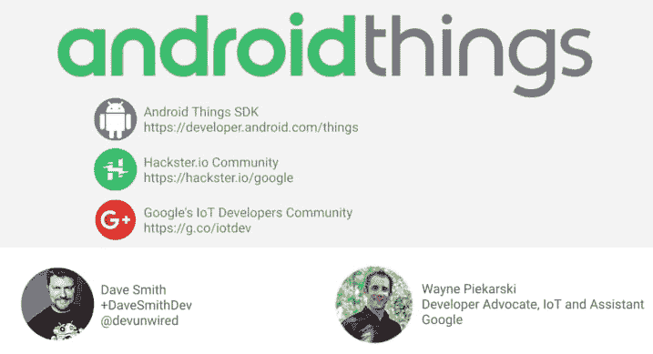

# AndroidThings 和 IoT 概述

> 原文:[https://dev.to/devfestnyc/androidthings-物联网-回顾-b87](https://dev.to/devfestnyc/androidthings--iot-recap-b87)

*Android Things 团队* [*今天举办了一场网络研讨会*](https://android-developers.googleblog.com/2017/06/android-things-hackster-community.html?hl=be) *为物联网开发者聚焦两大关键资源:* [*Android Things 平台*](https://developer.android.com/things/index.html)*&*[*hackster . io 社区*](https://www.hackster.io/google) *。*

> 【GDGNYC】@ gdg _ NYC“boos trapping IoT with[# AndroidThings](https://twitter.com/hashtag/AndroidThings)”网络研讨会今天中午 12 点！
> [register.gotowebinar.com/register/37724…](https://t.co/WS5c9nclYJ)
> 
> [# AndroidThings](https://twitter.com/hashtag/AndroidThings)八月事件！
> 2017 年 7 月 15:07PM-0710

*这是我们从那次通话中学到的内容的快速回顾。讲话被录了下来——跟随* [*GDG 纽约市*](https://medium.com/u/149ee411aa42) *以便在视频被公开分享时得到通知。*

### IoT 是什么？

在被称为**物联网(IoT)** 的领域，有很多宣传，但也有很多机会。

物联网愿景的核心是将物理对象连接到互联网，实现一个数字服务生态系统，该系统可以由这些对象生成的数据提供动力(*上下文感知*)或用于通过移动或网络应用远程控制它们*(驱动)*。Gartner 预测，这些“智能事物”将成为 2017 年的一项关键战略技术。

[Gartner 2017 年十大战略技术趋势——与 Gartner 一起变得更聪明](http://www.gartner.com/smarterwithgartner/gartners-top-10-technology-trends-2017/)

虽然物联网通常用于谈论消费行业的产品(智能家居、可穿戴设备、自动驾驶汽车)，但*工业物联网(IIoT)* 细分市场在企业中的发展势头越来越大，其重点是使用机器学习、连接和大数据来应对农业和采矿业等行业的健康、安全和效率挑战。

[2016 年物联网预测和市场评估综述](https://www.forbes.com/sites/louiscolumbus/2016/11/27/roundup-of-internet-of-things-forecasts-and-market-estimates-2016/#4ce97093292d)

分析师的估计各不相同，但普遍的共识是，到 2020 年，支持物联网的“东西”的数量将达到约 300 亿台设备，在物联网领域将有数十亿美元的消费者市场和数万亿美元的企业市场。

***那么物联网应用开发者面临的机遇和挑战是什么呢？*T3】**

机会存在于服务自动化、健身、协作计算、实时跟踪/警报、远程控制和量化自我等领域。新的探索领域包括可穿戴设备、智能玩具、自动驾驶汽车和教育。

挑战在于解决安全和数据隐私问题，管理将应用部署到不同硬件和软件平台的复杂性，处理监管审批，以及无缝集成到现有应用生态系统中以实现增长和盈利。

这就是机器人视觉的用武之地。T3】

### 什么是 AndroidThings？

[安卓的东西|安卓的东西](https://developer.android.com/things/index.html)

AndroidThings 是谷歌支持物联网生态系统开发和创新的举措。

> 以下所有图片均为网上研讨会的截图，仅用于说明。所有解释上的错误都是我的。

<figure> 

<figcaption>核心价值主张</figcaption>

</figure>

它的核心提供了三个价值主张——将 Android 生态系统的覆盖范围扩展到物联网，将硬件管理的复杂性委托给谷歌(并允许开发人员专注于构建定制的硬件扩展和丰富的软件体验)，以及利用谷歌提供的开箱即用的可信安全解决方案。

1.  **安卓的力量。**这有两种形式。首先，应用程序开发人员可以使用熟悉的语言(Java、Kotlin)和工具(Android Studio)来加快开发速度。其次，他们可以利用与其他谷歌服务(Play、Firebase、Cloud)的无缝集成，获得内置支持货币化、无服务器计算和大数据分析的全面解决方案。

[T2】](https://res.cloudinary.com/practicaldev/image/fetch/s--JaXtatTL--/c_limit%2Cf_auto%2Cfl_progressive%2Cq_auto%2Cw_880/https://cdn-images-1.medium.com/max/1002/1%2AH733xVsfmhnioG1tEIUSWQ.png)

**2。由谷歌管理。**谷歌管理着复杂的底层硬件、Linux 内核和 Android 核心组件的堆栈。更新(如安全或功能升级)会自动推送至设备——作为开发人员，您只需管理应用程序的更新和添加至平台的任何用户级驱动程序。

这不仅允许开发人员快速将他们的产品扩展到新的设备，而且还减少了花费在监督工作而不是产品改进上的时间/成本。新增加的 [AndroidThings 控制台](https://partner.android.com/things/console/u/0/)允许开发人员审查部署版本，并有可能在未来获得使用洞察和管理支持。

*注意:Google 拥护者提到，他们正在积极地继续添加驱动程序和库，以支持新的/流行的主板、传感器&附件——有您想要支持的吗？* [*向他们的物联网社区*](https://plus.google.com/communities/107507328426910012281) 发帖“询问”

[T2】](https://res.cloudinary.com/practicaldev/image/fetch/s--p3T9w2p6--/c_limit%2Cf_auto%2Cfl_progressive%2Cq_auto%2Cw_880/https://cdn-images-1.medium.com/max/657/1%2A3gaUT0BSjDCJ8HDe2xr87Q.png)

1.  **自动而安全。**默认情况下，会提供标准的安全措施，如签名映像和验证启动。不仅软件更新和安全补丁会主动推出，而且它们的 **A/B 回滚保护**功能可确保在最短的停机时间内完成。

补丁在后台下载和安装，设备在最佳状态下重启，以使补丁生效。如果在此更新过程中出现任何问题，该过程将自动回滚到上一个稳定的映像，确保您部署的硬件或软件解决方案永远不会处于不可用状态。

### 交钥匙硬件支持

作为一个不熟悉底层嵌入式系统架构或软件的人，AndroidThings 的这一方面很有吸引力。实际上，任何人都可以通过使用 [AndroidThings 认证开发板](https://developer.android.com/things/hardware/index.html)开始，该开发板使用[模块上系统(SOM)架构](https://en.wikipedia.org/wiki/System_on_module)来抽象复杂性并促进硬件级别的快速可组合性。点击了解更多关于[支持的硬件平台的信息。](https://developer.android.com/things/hardware/developer-kits.html)

**SoM 架构:**按照我的理解，SoM 类似于软件框架如何抽象底层操作系统的复杂性；作为一名开发人员，你只需将相关的 SoM 堆叠在基板上，就能获得快速原型&测试所需的硬件平台。当您最终想要构建/发布生产硬件时，您可以通过在单个 PCB 中重用这些模块来优化设计，确保最终结果一致，无需对更高级别的软件层进行任何更改。

<figure> 

<figcaption>*图片来源:*截图来自“物联网与安卓事物的自举”网络研讨会</figcaption>

</figure>

**谷歌管理的 BSP:** 谷歌维护 BSP ( [板支持包](https://en.wikipedia.org/wiki/Board_support_package))，确保设备用最新的软件和安全补丁更新，只需要最少的开发人员工作。这使得没有嵌入式系统经验的开发人员更容易自信地部署新的物联网解决方案，并将注意力集中在应用程序级别的软件上。

**简化认证和测试**。谷歌支持的所有模块都经过各种监管或行业测试标准的预认证。一旦你有了物联网解决方案的原型，将其推向市场需要你克服与硬件部署相关的监管障碍。因为 Google 支持的模块是预先认证的，所以您的产品准备时间/成本现在大大减少了。

### 平台是什么样子的？

首先了解一下**标准** Android 开发平台是什么样子的会有所帮助。默认架构建立在 Linux 操作系统和相关的本地库(为了效率和抽象)之上，其上堆叠了 Android 应用程序框架(高级的、可重用的服务/组件)和核心 Android 应用程序(高级的、流行的应用程序)，这两者都主要服务于注重交互式用户体验的消费者市场。

<figure> 

<figcaption>*标准 Android 架构(图片鸣谢:*“用 Android 东西的物联网引导”网络研讨会)</figcaption>

</figure>

AndroidThings 架构*“scrubs”*[_ like a“Brillo”pad*]([http://www . androidpolice . com/2016/12/13/Google-Brillo-internet-things-platform-now-Android-things-developer-preview-available-download/](http://www.androidpolice.com/2016/12/13/googles-brillo-internet-things-platform-now-android-things-developer-preview-available-download/))*_ 将标准架构下移，使其更适合资源受限的物联网平台。它通过两种方式做到这一点。首先，它消除了默认的 Android 应用程序(针对交互式用户)和部分框架(与“无头”或无显示设备无关)。其次，它还提供了其他组件的物联网就绪版本，这些版本仍然与 Android 开发人员预期的使用/行为兼容，但针对更多资源受限的硬件进行了优化。

[T2】](https://res.cloudinary.com/practicaldev/image/fetch/s--7pkecUsz--/c_limit%2Cf_auto%2Cfl_progressive%2Cq_auto%2Cw_880/https://cdn-images-1.medium.com/max/675/1%2A7Wygjt0XWjo_90aay5krqw.png)

它还向平台添加了一个新的*外设驱动程序库*，主要目的是支持应用程序与传感器和执行器提供的低级接口更好地对接。该库通过*用户驱动程序 API*将流行的外设连接到 Android 应用程序层，其中包含可用于大多数常见外设的预写驱动程序。外设驱动程序库是开源的，有各种示例供您入门——[点击此处了解更多信息](https://developer.android.com/things/sdk/driver-library.html)。

[T2】](https://res.cloudinary.com/practicaldev/image/fetch/s--A-dWOzCH--/c_limit%2Cf_auto%2Cfl_progressive%2Cq_auto%2Cw_880/https://cdn-images-1.medium.com/max/638/1%2A80bMOsQkcYDdCa76cmphEg.png)

### 资源&下一步:

可以去哪里了解更多？我们建议您首先执行以下操作:

*   ***追随*** 开发者拥护者:[戴夫·史密斯](https://medium.com/u/c91ac3b63127) & [韦恩·皮卡尔斯基](https://medium.com/u/b0d0b1a4ba7)
*   ***加入*** [谷歌纽约开发者小组](https://www.meetup.com/gdgnyc/)—[Android things](https://www.meetup.com/gdgnyc/events/234963772/)meetup 8 月
*   ***探索*** [谷歌开发者 Codelabs 物联网& AndroidThings](https://codelabs.developers.google.com/?cat=IoT)
*   ***观看***[Android Things @ Google IO 2017-YouTube 播放列表](https://www.youtube.com/playlist?list=PLOU2XLYxmsIIUtQeTRlRoDCdncUpWnR4M)

我们将用更多的资源更新这一部分(当我们有网上研讨会记录时，还会有一个链接),但这里有一些值得为重复访问和帮助做书签的资源(下面的图片有可点击的链接)

*   [安卓事物 SDK](https://developer.android.com/things/index.html)
*   [Hackster.io 社区](https://www.hackster.io/google)
*   [谷歌物联网开发者 G+社区](https://plus.google.com/communities/107507328426910012281)

[T2】](https://res.cloudinary.com/practicaldev/image/fetch/s--3m96973e--/c_limit%2Cf_auto%2Cfl_progressive%2Cq_auto%2Cw_880/https://cdn-images-1.medium.com/max/717/1%2AHh5gsBnTeliWUjjX2dYJzQ.png)

* * *