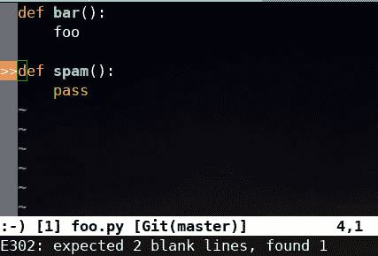

# 让我们喝一品脱啤酒吧！

> 原文:[https://dev.to/dmerejkowsky/lets-have-a-pint-of-vim-ale](https://dev.to/dmerejkowsky/lets-have-a-pint-of-vim-ale)

*原载于[我的博客](https://dmerej.info/blog/post/lets-have-a-pint-of-vim-ale/)T3。*

TL；维姆啤酒很棒，你应该试试！

# 简介:棉绒的崛起

我已经在博客上写了关于 linters 和我写 Python 代码时如何使用它们的内容。

让我们回顾一下:

*   我有一个调用几个 linters 的 shell 脚本。一个仅用于样式，几个用于静态分析。

```
#!/bin/bash -xe

pycodestyle .
python bin/run-pyflakes.py
python bin/run-mccabe.py 10
pylint mymodule 
```

<svg width="20px" height="20px" viewBox="0 0 24 24" class="highlight-action crayons-icon highlight-action--fullscreen-on"><title>Enter fullscreen mode</title></svg> <svg width="20px" height="20px" viewBox="0 0 24 24" class="highlight-action crayons-icon highlight-action--fullscreen-off"><title>Exit fullscreen mode</title></svg>

注意，该脚本首先运行快速的 linters(`pycodestyle`和`pyflakes`非常快)，然后运行`pylint`结束，这在大代码库上会变得非常慢。

*   我用:`:set makeprg=./lint.sh`
*   当我写完代码后，我输入:`:make`。
*   我等待脚本完成(当 *makeprg* 程序运行时，Neovim 不能用于编辑)
*   我使用 quickfix 窗口来修复 lint 错误。

当我使用 Python 时，这对我很有用，因为:

*   我非常了解代码风格，所以我很少出现风格错误
*   对我来说，运行`pylint`和运行测试一样慢，我也习惯了同步运行测试。
*   我喜欢使用`quickfix`窗口(顺便说一下，感谢非常好的 [vim-qf](https://github.com/romainl/vim-qf) 插件)

但是前段时间在工作中，我们都开始编写一些 Javascript 代码。

我们使用 [eslint](http://eslint.org) 用于代码风格， [flow](https://flow.org/) 用于类型检查， [mocha](https://mochajs.org/) 加 [chai](http://chaijs.com/) 用于测试。

由于我们使用 [GitLab](https://about.gitlab.com/) 来托管我们的源代码，我们当然有一个`.gitlab-ci.yml`文件来为每个合并请求运行所有这些。

# make PRG 方法的缺点

起初，我尝试使用与 Python 相同的工作流，但是我很快面临一些问题。

## 查找要运行的二进制文件

知道林挺程序使用哪种二进制文件可能很困难。有时候你可以使用在你的`$PATH`中的那个，但是有时候你想要在`node_modules/.bin`中的二进制

## 学习风格惯例

我们的`eslint`配置相当严格。(如果你好奇的话，它是基于来自 [Air B & B](https://www.npmjs.com/package/eslint-config-airbnb) 的一个版本)，我还不习惯 Javascript，所以我经常有风格问题，我的合并请求被阻止令人沮丧，因为我忘记运行`:make`并且有一堆风格问题。

## 错误格式

为了让 Neovim 填充 quickfix 窗口，它必须解析 linters 程序的输出。

默认情况下，`eslint`的输出如下所示

```
$  eslint foo.js
/path/to/foo.js
  1:5   error  'foo' is assigned a value but never used          no-unused-vars
  3:10  error  'bar' is defined but never used                   no-unused-vars
  5:1   error  Expected indentation of 1 tab but found 2 spaces  indent

✖ 3 problems (3 errors, 0 warnings)
  2 errors, 0 warnings potentially fixable with the `--fix` option. 
```

<svg width="20px" height="20px" viewBox="0 0 24 24" class="highlight-action crayons-icon highlight-action--fullscreen-on"><title>Enter fullscreen mode</title></svg> <svg width="20px" height="20px" viewBox="0 0 24 24" class="highlight-action crayons-icon highlight-action--fullscreen-off"><title>Exit fullscreen mode</title></svg>

它非常漂亮(我甚至没有给你看漂亮的颜色！)，但是你可以看到它对于其他程序来说有点难以解析。 <sup id="fnref1">[1](#fn1)</sup>

解决方法是像这样使用`--format`选项:

```
$  eslint --format compact foo.js
/path/to/foo.js: line 1, col 5, Error - 'foo' is assigned a value but never used. (no-unused-vars)
/path/to/foo.js: line 3, col 10, Error - 'bar' is defined but never used. (no-unused-vars)
/path/to/foo.js: line 5, col 1, Error - Expected indentation of 1 tab but found 2 spaces. (indent)

3 problems 
```

<svg width="20px" height="20px" viewBox="0 0 24 24" class="highlight-action crayons-icon highlight-action--fullscreen-on"><title>Enter fullscreen mode</title></svg> <svg width="20px" height="20px" viewBox="0 0 24 24" class="highlight-action crayons-icon highlight-action--fullscreen-off"><title>Exit fullscreen mode</title></svg>

但是默认情况下，Neovim 期望的输出与 gcc <sup id="fnref2">[2](#fn2)</sup>
完全一样

```
$  gcc foo.c
foo.c:3:3: error: ‘a’ undeclared (first use in this function)
foo.c:4:3: warning: implicit declaration of function ‘foo’ [-Wimplicit-function-declaration] 
```

<svg width="20px" height="20px" viewBox="0 0 24 24" class="highlight-action crayons-icon highlight-action--fullscreen-on"><title>Enter fullscreen mode</title></svg> <svg width="20px" height="20px" viewBox="0 0 24 24" class="highlight-action crayons-icon highlight-action--fullscreen-off"><title>Exit fullscreen mode</title></svg>

(没有“行”和“列”，也没有逗号)

所以为了正确解析行号和列，你必须使用一个名为`errorformat`
的变量

```
let errorformat =
 \ '%f:%l:%c: %trror: %m,' .
 \ '%f:%l:%c: %tarning: %m,' .
 \ '%f:%l:%c: %tote: %m' 
```

<svg width="20px" height="20px" viewBox="0 0 24 24" class="highlight-action crayons-icon highlight-action--fullscreen-on"><title>Enter fullscreen mode</title></svg> <svg width="20px" height="20px" viewBox="0 0 24 24" class="highlight-action crayons-icon highlight-action--fullscreen-off"><title>Exit fullscreen mode</title></svg>

即使你[阅读了文档](https://neovim.io/doc/user/quickfix.html)(第 7 章，“错误格式”)，也很难做对

## 同步运行

最后但同样重要的是，所有的 linters 都运行得相当快(甚至是`flow`，因为它使用了后台服务器)。

所以让编辑器在所有 linters 运行的几秒钟内没有反应也是很痛苦的。

# 切换到 vim-ale

在听说了 [vim-ale](https://github.com/w0rp/ale) 的优点后，我决定试一试，并且我*非常*高兴地注意到它能够在我们的 Javascript 项目中使用 *zero* 配置运行`eslint`和`flow`！

默认情况下,`vim-ale`是这样工作的:

*   首先，获取当前的`filetype`(这是由 Neovim 本身 <sup id="fnref3">[3](#fn3)</sup> 完成的)，在我们的例子中是`javascript`
*   然后，在匹配的 [ale_linters 文件夹](https://github.com/w0rp/ale/tree/master/ale_linters)中查找文件，以获得潜在 linters 的列表。
*   然后，在一小段不活动时间(默认为 200 毫秒)后，在后台同时运行上一步中找到的所有 linters。
*   然后，解析所有行的输出，并使用*符号槽*来显示有问题的行，如下所示:

[T2】](https://res.cloudinary.com/practicaldev/image/fetch/s--O3ysd98D--/c_limit%2Cf_auto%2Cfl_progressive%2Cq_auto%2Cw_880/https://dmerej.info/blog/pics/vim-ale-gutter.png)

请注意左侧栏中的红色尖括号，以及底部的详细信息。

此外，默认情况下，当 linters 没有发现任何东西时，整个槽会消失，这允许您立即知道您已经完成了 lint 错误的修复。

## 简单定制

在阅读了 [vim-ale 文档](https://github.com/w0rp/ale/blob/master/doc/ale.txt)之后，我能够调整一些细节:

我更喜欢在保存文件后才运行 linters，而不是连续运行，否则我会觉得太分散注意力:

```
let g:ale_lint_on_text_changed = 'never' 
```

<svg width="20px" height="20px" viewBox="0 0 24 24" class="highlight-action crayons-icon highlight-action--fullscreen-on"><title>Enter fullscreen mode</title></svg> <svg width="20px" height="20px" viewBox="0 0 24 24" class="highlight-action crayons-icon highlight-action--fullscreen-off"><title>Exit fullscreen mode</title></svg>

我也不喜欢在我打开一个文件后就运行

```
let g:ale_lint_on_enter = 0 
```

<svg width="20px" height="20px" viewBox="0 0 24 24" class="highlight-action crayons-icon highlight-action--fullscreen-on"><title>Enter fullscreen mode</title></svg> <svg width="20px" height="20px" viewBox="0 0 24 24" class="highlight-action crayons-icon highlight-action--fullscreen-off"><title>Exit fullscreen mode</title></svg>

## 位置列表

默认情况下，`vim-ale`使用所谓的*位置列表*。它看起来非常像*快速修复窗口*，但是:

*   每个窗口都有一个位置列表，而 *quickfix* 是全局的。
*   窗口一关闭，位置列表就被销毁
*   您可以使用相同的绑定来导航位置列表，使用前缀`l`而不是`c`。(例如`lprevious`和`lnext`而不是`cprevious`和`cnext`)

起初，我试图将`vim-ale`配置为使用 quickfix 窗口(这可以通过设置`g:ale_set_quickfix`变量来实现)，就像我对 Python 所做的那样，但是我决定尝试让`vim-ale`使用位置列表，原因如下:

*   我听说位置列表已经有一段时间了，但我从来没有真正使用过它，所以我很好奇，想知道它是否适合我的工作流程。
*   我已经使用了带有`:grep`和其他工具的 quickfix 窗口，我不喜欢它总是被`vim-ale`取代。

## 自定义映射

我已经习惯于键入`:cp`、`:cn`和`:cr` (: `cprevious`、`:cnext`和`:crewind`)来导航 quickfix 列表，但事实证明使用它们的位置列表副本更难:

*   `:ln`不能用于`:lnext`，因为它实际上被用作`:lnoremap`的快捷方式
*   我用键盘上的 [Dvorak 布局](https://www.dvorak-keyboard.com/)，在那里打`ln`、`lp`或`lr`比打`cn`、`cp`或`cr`难多了。

现在，Neovim 有了这个“leader”键的概念，您可以使用它作为所有自定义映射的前缀。

我用“逗号”来代替默认的(反斜杠)，我发现很难输入。

所以我当然可以为位置列表命令使用一个`<leader>`映射，但是不幸的是`<leader>p`、`<leader>n`和`<leader>r`已经被占用了。

那时我记得有人建议用“空格”作为引导键，所以我用了:

```
nnoremap <space>l :lnext<CR>
nnoremap <space>p :lprevious<CR>
nnoremap <space>r :lrewind<CR> 
```

<svg width="20px" height="20px" viewBox="0 0 24 24" class="highlight-action crayons-icon highlight-action--fullscreen-on"><title>Enter fullscreen mode</title></svg> <svg width="20px" height="20px" viewBox="0 0 24 24" class="highlight-action crayons-icon highlight-action--fullscreen-off"><title>Exit fullscreen mode</title></svg>

注意:这意味着我不能在正常模式下使用空格键，但是默认情况下，所有的空格键都是向前移动光标，所以这没什么大不了的。

## 回蟒

正如我之前所描述的，`vim-ale`非常聪明，并且预先配置了`pylint`和`pyflake`棉绒。

这意味着每次我在 Python 文件中保存代码时，`vim-ale`会在 *virtualenv* 或路径中找到`pylint`和`flake`，并使用默认选项运行它们。

这不是我想要的，但是很容易关掉:

```
let g:ale_linters = {
 \ 'python': [] ,
 \ } 
```

<svg width="20px" height="20px" viewBox="0 0 24 24" class="highlight-action crayons-icon highlight-action--fullscreen-on"><title>Enter fullscreen mode</title></svg> <svg width="20px" height="20px" viewBox="0 0 24 24" class="highlight-action crayons-icon highlight-action--fullscreen-off"><title>Exit fullscreen mode</title></svg>

(`ale_linters`字典的配置有点奇怪:它假设您想要为每个文件类型运行*所有*linters，因此您必须定义某种“黑名单”来关闭您不想运行的 linters)

但那时我开始怀念每次保存后检查风格的日子。

(这就是当你开始使用伟大的工具时会发生的事情:你希望你可以一直使用它们 <sup id="fnref4">[4](#fn4)</sup> )

不幸的是，`vim-ale`不知道`pycodestyle`所以我不得不修补插件的代码。

## 添加维姆-阿勒棉绒

在我们的例子中，`pycodestyle`输出看起来像这样:

```
$  pycodestyle foo.py
foo.py:4:1: E302 expected 2 blank lines, found 1 
```

<svg width="20px" height="20px" viewBox="0 0 24 24" class="highlight-action crayons-icon highlight-action--fullscreen-on"><title>Enter fullscreen mode</title></svg> <svg width="20px" height="20px" viewBox="0 0 24 24" class="highlight-action crayons-icon highlight-action--fullscreen-off"><title>Exit fullscreen mode</title></svg>

有文件名、行、列、一个短代码(例子中的`E302`)和一个详细的消息(*期望 2 个空行，找到 1 个*)

所以我开始在`ale_linters/python/pycodestyle.vim`中用代码添加一个新文件

以下是相关部分:

```
" By default, use `pycodestyle` from path, unless it is set
" in the `g;ale_python_pycodestyle_executable` variable:
let g:ale_python_pycodestyle_executable =
\   get(g:, 'ale_python_pycodestyle_executable', 'pycodestyle')

" Look for pycodestyle in the virtualenv, and only if not found
" in it, default to the previously set pycodestyle executable:
function! ale_linters#python#pycodestyle#GetExecutable(buffer) abort
  ...
  if !ale#Var(a:buffer, 'python_pycodestyle_use_global')
    let l:virtualenv = ale#python#FindVirtualenv(a:buffer)

    if !empty(l:virtualenv)
      let l:ve_pycodestyle = l:virtualenv . '/bin/pycodestyle'

      if executable(l:ve_pycodestyle)
        return l:ve_pycodestyle
      endif
    endif

  endif

  return ale#Var(a:buffer, 'python_pycodestyle_executable')

endfunction

" Get the full command line to run: append contents from the
" python_pycodestyle_options variable if it exists:
function! ale_linters#python#pycodestyle#GetCommand(buffer) abort
    return fnameescape(ale_linters#python#pycodestyle#GetExecutable(a:buffer))
 \   . ' ' . ale#Var(a:buffer, 'python_pycodestyle_options')
 \   . ' %s'
endfunction

" Register pycodestyle as a linter for the `python` filetype:
call ale#linter#Define('python', {
\   'name': 'pycodestyle',
\   'executable_callback': 'ale_linters#python#pycodestyle#GetExecutable',
\   'command_callback': 'ale_linters#python#pycodestyle#GetCommand',
\   'callback': 'ale#handlers#python#HandlePyCodeStyle',
...
\}) 
```

<svg width="20px" height="20px" viewBox="0 0 24 24" class="highlight-action crayons-icon highlight-action--fullscreen-on"><title>Enter fullscreen mode</title></svg> <svg width="20px" height="20px" viewBox="0 0 24 24" class="highlight-action crayons-icon highlight-action--fullscreen-off"><title>Exit fullscreen mode</title></svg>

您会注意到所有的事情都是通过回调来获得
可执行文件的路径、完整的命令行以及如何解析输出。

这里是`pycodestyle`输出解析器的实现。

```
function! ale#handlers#python#HandlePyCodeStyle(buffer, lines) abort
    " Regular expression to match messages:
    " They look like:
    " <file>:<line>:<col>: <code> <detailed text>
    let l:pattern = '\v^[a-zA-Z]?:?[^:]+:(\d+):?(\d+)?: \[?([[:alnum:]]+)\]? (.*)$'

    " For each match, update the l:output list:
    let l:output = []
    for l:match in ale#util#GetMatches(a:lines, l:pattern)
        let l:code = l:match[3]

        call add(l:output, {
 \   'lnum': l:match[1] + 0,
 \   'col': l:match[2] + 0,
 \   'text': l:code . ': ' . l:match[4],
 \})
    endfor

    return l:output
endfunction 
```

<svg width="20px" height="20px" viewBox="0 0 24 24" class="highlight-action crayons-icon highlight-action--fullscreen-on"><title>Enter fullscreen mode</title></svg> <svg width="20px" height="20px" viewBox="0 0 24 24" class="highlight-action crayons-icon highlight-action--fullscreen-off"><title>Exit fullscreen mode</title></svg>

您会注意到，这是通过用 helpers 函数编写“真正的”代码(尽管仍然是`vimscript`)来完成的，而不是试图用难以阅读的语法设置一个奇怪的`errorformat`选项。

这就是全部了。我所要做的就是将`ale_linters`字典设置为只运行`pycodestyle` :

```
let g:ale_linters = {
 \ 'python': [] ,
 \ } 
```

<svg width="20px" height="20px" viewBox="0 0 24 24" class="highlight-action crayons-icon highlight-action--fullscreen-on"><title>Enter fullscreen mode</title></svg> <svg width="20px" height="20px" viewBox="0 0 24 24" class="highlight-action crayons-icon highlight-action--fullscreen-off"><title>Exit fullscreen mode</title></svg>

然后我可以继续使用`:make`和 quickfix 窗口来处理速度较慢的 linters，就像以前一样:)

# 结论

`vim-ale`开箱即用只需很少的配置。异步特性真的很好(它们在 Neovim 和 Vim 8 中都有效)。
它有大量的定制选项，最后但同样重要的是，新的棉绒易于添加和定制。

我强烈建议你试一试。

干杯！

*感谢您阅读到目前为止:)*

我很想听听你的想法，所以请在下面留下你的评论，或者阅读[反馈页面](https://dmerej.info/blog/pages/feedback/)，了解更多与我联系的方式。

* * *

1.  关于 Javascript 工具的控制台输出，有一大堆要写，但是让我们把它留到以后再说... [↩](#fnref1)

2.  Vim 中有一堆代码假设你正在编写 c 代码，即使在今天也是如此(历史原因，正如他们所说) [↩](#fnref2)

3.  这是在 vim 脚本 [↩](#fnref3) 的 [2793 行中完成的](https://github.com/neovim/neovim/blob/master/runtime/filetype.vim)

4.  这个博客的老读者会注意到这正是我和↩的遭遇