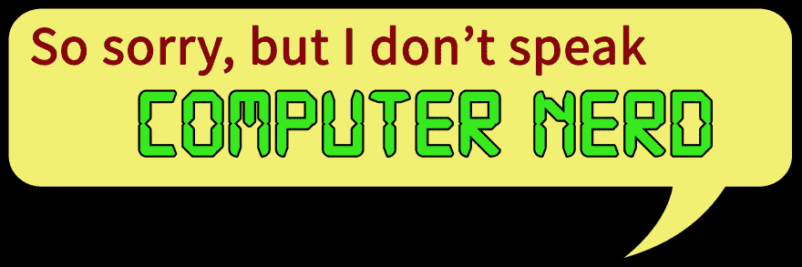

# 行话交易

> 原文：<https://dev.to/ryanhaber/the-jargon-bargain>

[T2】](https://res.cloudinary.com/practicaldev/image/fetch/s--jSdRjbbM--/c_limit%2Cf_auto%2Cfl_progressive%2Cq_auto%2Cw_880/http://api-ambassador.ghost.io/conteimg/2017/07/jargon.jpg)

一位同事最近发给我一个小测验，向应试者提出一系列术语。对于每个术语，您需要回答它是指某个大数据技术还是指某个口袋妖怪。

如果你决定参加测验，一定要自己记录分数，因为这是一个非常简单的表格，不会为你做的。但这确实是一个很好的观点。

[参加大数据口袋妖怪测验](https://docs.google.com/forms/d/e/1FAIpQLScRsfRHXPTuEXdNvUcI8DzJIU5iazqlpksWucPF0d8l2ztkkA/viewform?fbzx=-9098376705257727123)

这个测验既愚蠢又有趣，但却很有意义。如果你在玩口袋妖怪的时候不在 Hadoop 中存储数据或者不捕捉 Crebases，你很可能不知道哪个是大数据，哪个是动漫。这些话是行话。

行话还不错。行话使得专家们可以在不解释每一个细节的情况下快速地写出笔记。对于那些每天与他们打交道的人来说，读或写“在 COB 之前，我需要你关于 DoD POC 的 TPS”是很容易的。对他们来说，这比读或写更容易，“我需要你的测试程序规范，关于国防部的概念证明，在下班前。”在我自己的领域里，“高基数”这个词可能会被随意地传来传去，让一个新来者望尘莫及。但是如果是 A 和 B 的对话，并且 A 和 B 都知道高基数意味着什么，那也没关系。但是，如果你是为普通读者写作，请三思。

行话会把人拒之门外。如果你的目标是只包括其他专家，行话。偶然进入该页面的人通过他们是否理解行话来直觉判断他们是否是该页面的目标受众。如果我打开一页，却一点也看不懂，很有可能它是为专家而不是我写的。

[T2】](http://www.onhold.on.ca/jargon-words-remix-re-read/)

但如果你的意图是向人们解释他们需要知道但可能不知道的事情，行话就是一块石头。它会让你的用户慢下来，他们就像旅行者一样。如果你需要使用行话，尽量少用。链接到词汇表或快速解释。最重要的是，使用当人们将鼠标光标放在术语上时出现的工具提示。有一次，我遇到了一个面向业务用户的主题，该主题在没有解释的情况下使用了“异步”一词来描述流程。"这个过程与前一个过程是异步的."你知道这意味着什么吗？我知道，因为我从事网络开发工作。但是有多少商业用户知道这意味着什么呢？有多少人能够轻易地凭直觉理解其中的含义？这个特殊的术语很难理解，因为在软件开发中，它的用法与它的标准英语含义不同。最好是这样写，“在前一步完成之前，你不能开始这一步。”第一种措词可能会让人挠头，而第二种措词会指导用户。如果计算机能够同时运行进程，但不能，也不会告诉用户进程是异步的。在第一种情况下，这可能有助于澄清。在第二个例子中，这是不需要的，因为相反，我们告诉用户他或她真正需要知道的。猜猜我更喜欢哪种方法。

所以用行话来说，我们发现自己在我们的受众基础上取得了平衡。如果我们的读者是普通人，我们应该谨慎使用行话。我们应该在介绍和解释之后才使用任何特定的术语。缩略语也是如此。另一方面，如果我是为我所在领域的读者写作，我会用行话让人们省心。正如生活和写作中的许多事情一样，关键是要了解你的读者。

处理行话的提示:

优先选择容易理解的单词。只有在必要的时候才使用更难的单词。除非你的听众知道术语，否则只在必要时使用行业术语。只有在绝对必要时，才使用特定公司或特定产品的行话。

除非万不得已，否则不要创造新的术语。对于任何特定的事物，往往都有一个现成的、可以理解的词。用那个。你的工程师和产品经理经常想要创造一个新的术语，因为他们已经建立了一些与你的产品相关的新的*。文档不是他们炫耀成就的地方。它是你向用户解释事情的地方。*

**不要对外使用内部名称。**你的公司可能会给某样东西起一个内部名字。如果该名称出现在用户界面或产品本身上，您应该使用它。但是如果这个名字没有出现在产品上，用户不可能马上理解它，就不要使用它。就你的用户所知，这是在创造一个新的术语。也许你的程序员想出了一种漂亮的新型下拉菜单。但当你需要告诉用户从中选择一个选项时，就叫它“下拉菜单”吧。

所有这些都可以归结为一条建议:尽可能使用简单明了的语言。

这让我想到了一本书的推荐。这是我最喜欢的书之一:欧内斯特·高尔斯爵士的《简单的话》。

欧内斯特爵士写这本书是为了帮助英国公务员更好地与英国公众沟通。时至今日，英国政府的文件和网站在清晰度和易读性方面远远超过美国政府。这本书是以一口大小的片段写的，所以它是非常好的浴室或睡前读物。我每隔几天就阅读或重读一两篇文章，以帮助记住这些概念。

也就是说，请记住:行话不是敌人。这是一个强大的工具。不要把它洒满一页。通过故意使用行话来行善。

*本帖原载于[API-ambassador . ghost . io](http://api-ambassador.ghost.io/the-jargon-bargain/)T3】*