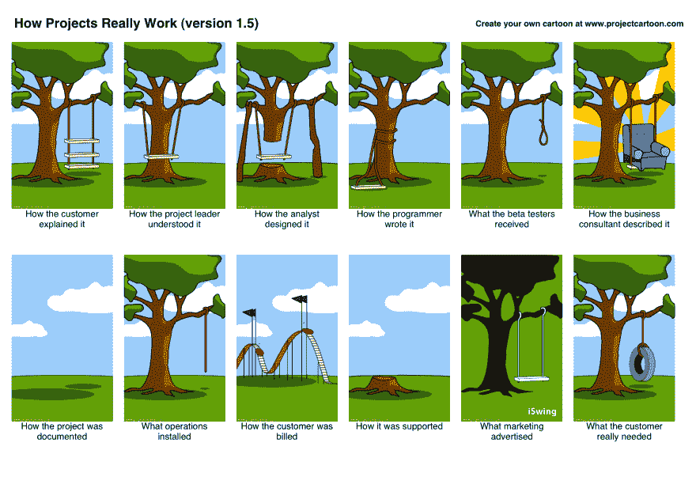

# BDD 到底是什么？

> 原文：<https://dev.to/theodesp/what-is-bddanyway>

在现代软件开发世界中，我们有各种各样的利益相关者，每个人都有自己的兴趣。一般来说，我们可以将利益相关者分为两组。第一组是**内部利益相关者**，包括企业主、经理和员工。他们的主要兴趣是推动公司走向成功，因为他们直接参与组织的运作。

另一组是**外部利益相关者**。他们不是企业内部的实体，而是关心企业绩效或受企业绩效影响的实体(如客户、投资者、供应商等)。

现在，每个小组都有自己的词汇，用于日常工作中。为了让所有的利益相关者都满意，经常会混淆实际需要做什么。

对于企业所有者来说，企业需要真正能够根据 ROI 来定义期望的结果。员工，尤其是开发人员，需要深刻理解需要构建什么来满足业务需求，用户需要使用功能来满足他们的需求。

为了有一个正式的、可验证的方法来检查业务需求是否与实际的应用程序特性一致，软件工程师、QA 分析师和工程/产品经理一起工作，创建**用户故事**。

一个**用户故事**是一个需求的非常高层次的定义，包含足够的信息，以便开发人员可以对实现和测试它的工作量做出合理的估计。*

本文将关注用户故事的**测试**方面。测试的目的是确保构建的系统按预期运行。这主要是因为软件错误无处不在的现实，并且由于修复一个没有在生产中测试和发现的错误几乎比在开发中发现和修复的成本[高 10 倍](http://blog.celerity.com/the-true-cost-of-a-software-bug)。

**你说我们如何测试软件？**测试有多种方法。我们来描述一下其中的一些。

有一种*最后测试的方法*，你先写代码，然后写测试来验证它。到目前为止，您可能一直在编写这样的代码。

有一种*测试优先的方法*，你先写测试，然后通过测试来驱动你的代码。其中一个应用是**测试驱动开发或 TDD** 。

当然，有些人会根本不写*测试，只依赖 QA 测试。*

在这些测试方法中，我们对 TDD 感兴趣。编写由测试驱动的代码的主要缺点是:

*   什么时候测试？
*   考什么？
*   如何知道是否符合规范？
*   代码交付商业价值了吗？

[T2】](https://res.cloudinary.com/practicaldev/image/fetch/s--iry9zObe--/c_limit%2Cf_auto%2Cfl_progressive%2Cq_auto%2Cw_880/https://thepracticaldev.s3.amazonaws.com/i/33z23kyd37e1446t13ve.jpg)

克服这些缺点就是为什么 **BDD** 是[出生](https://dannorth.net/introducing-bdd/)的原因。但是 BDD 到底是什么？请耐心等待，我们将通过调查一些事实来找出答案。

## 什么是事实

> 行为驱动开发与测试无关。

[行为驱动开发，与测试](https://www.thoughtworks.com/insights/blog/3-misconceptions-about-bdd)无关。测试是在软件存在之前你不能做的事情。我们编写测试来验证我们的假设是否如预期的那样工作。另一方面，BDD 是一种开发系统的方法或不同的过程，它专注于交付业务实际需要的东西，同时坚持用户需求。

> BDD 有助于团队内部的交流。

通过提供可读和可理解的词汇表，BDD 有助于在客户、开发人员和其他利益相关者之间架起沟通的桥梁。共享的语言确保每个人(技术或非技术)对项目的状态有足够的理解。这创建了一个协作环境，帮助业务和技术团队创建具有商业价值的软件。

> BDD 很容易开始。

BDD 利用了一个叫做 [Gherkin](https://github.com/cucumber/cucumber/wiki/Gherkin) 的小型 DSL，它非常简单易读，甚至用户都可以用它来添加特性或请求。你甚至可以把它们添加到他们的[母语](https://github.com/cucumber/cucumber/wiki/Spoken-languages)中。

这里是一个*的例子。特征*文件。我们在那种情况下使用黄瓜

```
Feature: Serve coffee
  Coffee should not be served until paid for
  Coffee should not be served until the button has been pressed
  If there is no coffee left then money should be refunded
Scenario: Buy last coffee
  Given there are 1 coffees left in the machine
  And I have deposited 1$
  When I press the coffee button
  Then I should be served a coffee 
```

下面是另一个需要测试多个输入值的例子:

```
Scenario Outline: eating
  Given there are <start> cucumbers
  When I eat <eat> cucumbers
  Then I should have <left> cucumbers
  Examples:
    | start | eat | left |
    |  12   |  5  |  7   |
    |  20   |  5  |  15  | 
```

在 BDD 中将使用术语“场景”和“规范”,而不是“测试”。

一般来说，BDD 规范回答了以下问题:

*   在这个过程中从哪里开始
*   测试什么和不测试什么
*   一次测试多少
*   如何称呼这些测试
*   如何理解测试失败的原因

这种类型的 DSL 可读性和可移植性很强，可以作为开发过程的一部分添加到用户故事标签中。这构建了一个所有内部涉众都可以访问的文档工件，他们可以贡献自己的力量。

## 还好够理论让代码

好吧，我有一个很好的练习给你。在这一节中，您将了解如何使用 BDD 和 Cucumber 构建一个真实的 Javascript 应用程序。

该项目类似于[这个](https://medium.com/r/?url=https%3A%2F%2Fgithub.com%2Ftbranyen%2Fgithub-viewer)虽然你可以使用任何你喜欢的框架。您需要构建一个简单的 GitHub 查看器。下面是主要的用户故事:

```
As a User I would like to have a Web application that connects to GitHub
Rest API and displays users from organizations. 
I need to be able to search for users and when I clicked on the user 
results I need to be able retrieve their repositories. 
Finally, I need to be able to click a repository so that
all the commits are displayed in order. 
If the project has many commits I would like
the results to be paginated by 50 or 100 commits. 
```

这可能来自朋友或客户，因此详细分析应用程序的需求以及我们需要开发的主要功能非常重要。因此，首先你需要完成以下任务:

1.  仔细阅读用户故事。试着记下一些对应于动作的关键词。例如， **connects** 表示使用 HTTP 访问或请求 GitHub API。

2.  在行动之外，你记下为每个行动写一些简单的场景。例如:

```
Scenario: Search for user that exists
  Given I have visited the main page
  And I have focused on the search input
  When I enter a name of a user that exists
  And I press enter
  Then I should be able to retrieve the users repositories 
```

1.  试着想想边缘情况，或者在你的请求或回应中会出现什么问题。也写下这些情景。

2.  在 GitHub 上创建一个项目，并安装所需的库。如果你不想 w8 你可以在这里克隆/分叉[这个回购。使用内置的](https://medium.com/r/?url=https%3A%2F%2Fgithub.com%2Ftheodesp%2Fbdd-javascript.git)[问题管理](https://guides.github.com/features/issues/)将你写下的场景添加为标签。

3.  对于每个问题/任务，您都提出了 write a[。特征文件](https://medium.com/r/?url=https%3A%2F%2Fgithub.com%2Fcucumber%2Fcucumber%2Fwiki%2FFeature-Introduction)并将其放入特征文件夹。确保该文件有一个相关的名称。

4.  用黄瓜做测试。它们当然都会失败，因为你需要开始实现它们！

5.  对于每个失败的测试，实现特性需求。如果在任何时候你认为你错过了什么，你可以添加更多的场景。重复以上步骤，直到完成所有场景。

6.  当您处理票证时，不要忘记更新问题跟踪器。

7.  **额外加分**:可以帮助你运行测试的工具是持续集成工具或 CI。你说的 CI 是什么？这是另一篇文章的主题。我建议你添加 [Travis](https://travis-ci.org/) ，因为它免费且易于使用。CI 将在每次提交后运行您的测试，并指出错误。

8.  **完成**:恭喜。我希望你喜欢用 BDD 进行测试，并且理解了很多。不要忘记向世界展示你的应用，把它添加到你的 LinkedIn 项目中，也要提到你的[杰出导师](https://theodespoudis.com/)。

以下链接可帮助您完成这项任务:

*   [GitHub 开发者 API](https://medium.com/r/?url=https%3A%2F%2Fdeveloper.github.com%2F) :用于与 GitHub API 接口
*   [Cucumber.js](https://github.com/cucumber/cucumber-js) : BDD 工具
*   华夫项目管理:Git 问题的替代项目管理工具。
*   [摩卡小黄瓜](https://github.com/mklabs/mocha-gherkin):如果要用摩卡和小黄瓜。

## 总结归纳

总而言之，BDD 背后的主要思想是，它被驱动来防止沟通差距，即让团队中的每个人更频繁、更好地沟通，并且基于真实世界的例子，而不是基于抽象和命令性的需求。因此，我们最终都会得到有意义的测试，这些测试是可移植的，易于阅读和验证的。

## 参考文献

[关于 bdd 的 3 个误区](https://www.thoughtworks.com/insights/blog/3-misconceptions-about-bdd)
[bdd 指南](https://inviqa.com/blog/bdd-guide)
[行为驱动开发](https://www.tutorialspoint.com/behavior_driven_development/index.htm)

如果这篇文章有帮助，请分享它，并关注我的其他文章。你可以在 [GitHub](https://github.com/theodesp) 和 [LinkedIn](https://www.linkedin.com/in/theofanis-despoudis-7bb30913/) 上关注我。如果你有任何想法和改进，请随时与我分享。

**快乐编码。**

** * [点击此处阅读原文](https://www.linkedin.com/pulse/what-bdd-anyway-theofanis-despoudis?published=t) * **