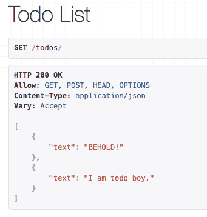

# 姜戈视图，第 3 部分

> 原文:[https://dev.to/rpalo/vue-on-django-part-3](https://dev.to/rpalo/vue-on-django-part-3)

这是我制作一个由 Django REST 后端支持的 Vue 应用程序的教程的第 3 部分。在第一部分，我们只设置了 Vue 端。在第 2 部分中，我们建立了数据模型并获得了它，这样我们就可以在浏览器中创建和清除我们的 Todos。第 3 部分将设置 Django 后端。最初，这将是最后一部分，我将包括进行前端 API 调用以获取和更新服务器端数据所需的工作。当我看到我所做的改变时，我意识到对于一篇文章来说，这些信息太多了。所以，你会有一个较短的第三部分和一个附加的相当短的第四部分。你真幸运！教程，现在多了 33%的帖子！这一部分将假设你已经掌握了 Django 的工作知识，或者至少已经浏览了他们的[民意测验教程](https://docs.djangoproject.com/en/1.11/intro/tutorial01/)，或者至少不害怕通过谷歌搜索来解决困难。如果你认为我应该做一个关于 Django 的基础教程，请告诉我。我很乐意，因为通常当我写一篇关于它的博文时，我会学得更好。总之，太多的散漫。让我们**这样做吧。**

## 0.设置

好了，我要对事情做几个假设。首先，我假设您一直在关注这个系列。如果你还没看过第一部分和第二部分的[和](https://dev.to/rpalo/vue-on-django-part-1)[。这将使你设置好我们正在使用的项目文件结构。我还将假设您使用的是 Python 3(或者您乐于在两者之间进行转换——应该没有太大区别)。首先，我们需要一个虚拟环境来保持我们的生活正常。](https://dev.to/rpalo/vue-on-django-part-2)

```
$ python3 -m venv .venv
# Create a virtual environment in the .venv/ directory
$ source .venv/bin/activate # Mac or Linux
$ .venv/Scripts/activate # Windows 
```

如果您喜欢这类东西，不要忘记将`.venv`目录添加到您的`.gitignore`文件中。如果你不小心犯了你的虚拟环境，你会讨厌生活。如果`which pip`给你指出`/path/to/your/todoapp/.venv/pip.exe`，那你就做对了。好了，让我们安装所需的软件包。

```
$ pip install django djangorestframework
...
$ pip freeze | tee requirements.txt # Just so we can see them.
Django==1.11.2
djangorestframework==3.6.3
pytz==2017.2 
```

## 1.建立姜戈

我们将不得不处理一些事情。在项目模板中，有一些我们不需要或损坏的东西。总有一天我会打开一个 pull 请求，但是现在，只需在您的`vuedj/settings.py`文件中编辑以下几行。

```
...
INSTALLED_APPS = [
    ...
    'rest_framework',
    'app',
    # Remove django_nose, we won't use a testing framework now.
] 
```

```
$ python manage.py migrate
...
$ python manage.py createsuperuser
# Fill in the relevant info so you can login to the
# backend in case of emergency 
```

## 2.好东西

### 模型

酷毙了。现在我们应该可以开始工作了。让我们创建我们的模型。打开`app/models.py`。

```
from django.db import models

class Todo(models.Model):

    text = models.CharField(max_length=200)

    def __str__(self):
        return "Todo: " + self.text 
```

幸运的是，我们选择了一个非常简单的对象来建模。如果你来自 Django 的背景，这并不令人兴奋。让我们进入正题。

### 串行器

创建`app/serializers.py`。

```
from .models import Todo
from rest_framework import serializers

class TodoSerializer(serializers.ModelSerializer):
    class Meta:
        model = Todo
        fields = ('text',) 
```

如果你熟悉[基于类的视图](https://docs.djangoproject.com/en/1.11/topics/class-based-views/)，这看起来应该是相似的。大部分繁重的工作已经在 Django Rest 框架提供的基类中完成了(因为我很懒，所以以下简称为 DRF)。序列化器是应用程序的主力，输出任何好的基于 JSON 的 REST 框架所需的 JSON。但是它是如何被使用的呢？

### 风景

我们来看看`app/views.py`。

```
from django.shortcuts import render
from django.http import HttpResponse

from rest_framework import viewsets
from rest_framework.decorators import list_route

from .models import Todo
from .serializers import TodoSerializer

def index(request):
    return render(request, 'index.html')

class TodoViewSet(viewsets.ModelViewSet):
    queryset = Todo.objects.all()
    serializer_class = TodoSerializer

    @list_route(methods=['delete'])
    def clear_todos(self, request):
        todos = Todo.objects.all()
        todos.delete()
        return HttpResponse(status=200)
        # It may be a good idea here to return [].  Not sure. 
```

这个视图，我们稍后会用它来展示我们的魅力。DRF 模型视图集提供了标准的 REST 列表、创建、检索、更新和销毁功能，并将其与模型联系起来。它使用我们在`serializers.py`中创建的序列化器来创建输出。你会注意到我们必须创建一个额外的动作，因为`delete many`通常不是一个标准的休息呼叫。`rest_framework`提供了两个装饰器，用于向视图集添加额外的方法:`@detail_route`和`@list_route`，这取决于您想要操作一个还是多个项目。正如你所看到的，我们只是简单地删除了所有的 Todos，以一种 Django 风格的方式。这个方法的名字(`clear_todos`)将在我们的 URL 中出现。说到这里:

### 网址

打开`vuedj/urls.py`。我知道我们通常会为我们的应用程序创建特定的 URL，但为了简单起见，我们跳过了这一步。

```
from django.conf.urls import url, include

from rest_framework import routers

from app import views

router = routers.SimpleRouter()
router.register(r'todos', views.TodoViewSet)

urlpatterns = [
    url(r'^$', views.index, name='home'),
    url(r'^', include(router.urls)),
] 
```

与`views.py`类似，我们创建一个到`index`视图的路由，并使用`SimpleRouter`创建我们需要的所有其余 url 路由。注意，我们用`todos`的`basename`注册了我们的视图集。这将影响所有的网址，你可以在 [DRF 文档](http://www.django-rest-framework.org/api-guide/routers/#simplerouter)的漂亮表格中看到。请注意，我们的额外视图`clear_todos`获得了路线`todos/clear_todos`。我们差不多完成了！

## 3.测试它

去终点站。

```
python manage.py makemigrations app
...
python manage.py migrate # To update the DB with the Todos table
...
python manage.py runserver 
```

前往`localhost:8000`。Blammo！模板错误。这很好，因为我们知道我们的 Vue 应用程序将通过我们的`index`视图提供，我们还没有完全绑定它。前往`localhost:8000/todos/`。

[T2】](https://res.cloudinary.com/practicaldev/image/fetch/s--CbNsMiWh--/c_limit%2Cf_auto%2Cfl_progressive%2Cq_66%2Cw_880/http://assertnotmagic.com/img/behold.gif)

您会看到一个不错的 API 参考。在底部你可以贴一些 todos。现在就做。

[T2】](https://res.cloudinary.com/practicaldev/image/fetch/s--LAMeMIcn--/c_limit%2Cf_auto%2Cfl_progressive%2Cq_auto%2Cw_880/http://assertnotmagic.com/img/vue-django-todo-api.png)

如果您没有看到多个待办事项，请尝试单击地址栏并按回车键(重新访问而不重新提交任何帖子请求)。你应该看看你的 todos！为了测试我们的`clear_todos`路由，会稍微困难一点，因为我们让它只期待一个删除请求，这在浏览器中很难做到(据我所知)。打开一个单独的终端。

```
$ python3

>>> import requests # pip3 install requests if you haven't yet
>>> requests.delete('http://localhost:8000/todos/clear_todos/')
<Response [200]> # Success! 
```

回头刷新你的 API 页面，你的 Todos 就没了！万岁。你现在有了一个可以工作的 API，我们将在下一篇也是最后一篇文章中用我们的前端来实现它。加油团队！

## 4.总结

所以希望我没有太快。我们基本上是以光速挤过了一个 Django 的 app。DRF 文献是蜜蜂的的[膝盖，所以如果你想知道更多，那是你应该去的第一个地方。正如我在开始所说的，如果一套基本的 Django 教程对你有帮助，或者你有任何其他问题，请告诉我。或者让我知道我是否做了可以做得更好的事情，或者我是否传播了最佳实践之外的东西！](https://www.youtube.com/watch?v=pCB3kGVc9ic)

下一集再见！

*最初发布于[我的博客](http://assertnotmagic.com)。封面图片鸣谢:[斯坦利·恩达吉](https://github.com/NdagiStanley)T5】*