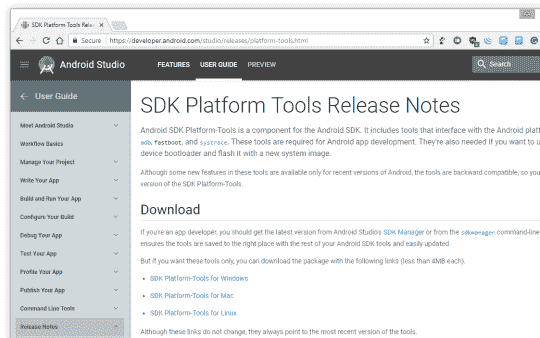
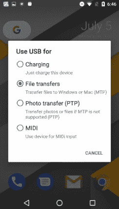
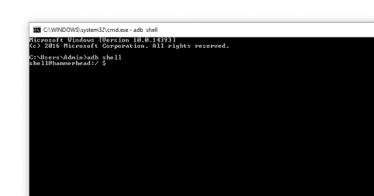
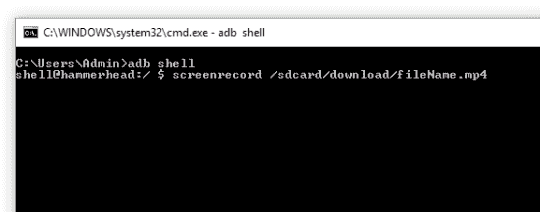
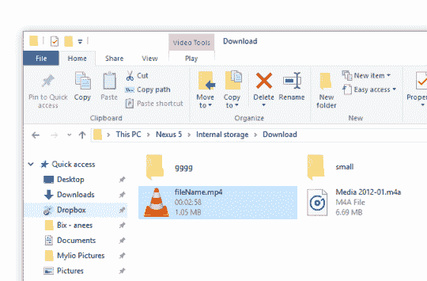

# 在 Android 上录制屏幕的最佳方式

> 原文:[https://dev . to/aneesahammed/best-way-to-record-your-screen-on-Android](https://dev.to/aneesahammed/best-way-to-record-your-screen-on-android)

我一直想写一段时间了。最后，正如 [@teamcoder](https://dev.to/teamcoder/give-up-perfection) 所说，决定放弃完美，这就是。

如果你想录制一个教程或者想创建一个应用程序的演示，你需要实时捕捉屏幕。如果不安装一些第三方的蹩脚软件，这是令人生畏的。因此，以下是你心中的极客可以遵循的简单步骤之一。

如果你没有安装[安卓工作室](https://en.wikipedia.org/wiki/Android_Studio)，请从下面的网址下载**平台工具**。

*   将您的 Android 手机连接到计算机。

*   确保您已经选择了“使用 USB 进行”选项来“文件传输” 

*   打开命令提示符(Win+R)

*   进入下面的命令
    ***亚行 shell 并按***【Enter】键 

*   编写下面的命令来录制屏幕
    ***screen record/SD card/download/filename . MP4***

*   完成屏幕录制后，按“Cntrl + C”停止

*   你现在可以浏览到你在命令中给出的同一个文件夹，得到文件 