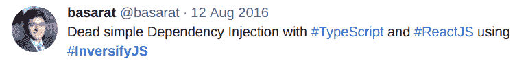
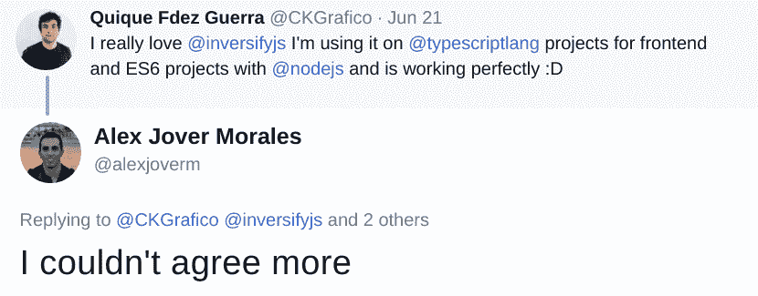

# InversifyJS 支持的 TypeScript 应用程序中的依赖注入

> 原文:[https://dev . to/remo Jansen/dependency-injection-in-typescript-applications-powered-by-inversifyjs](https://dev.to/remojansen/dependency-injection-in-typescript-applications-powered-by-inversifyjs)

## 关于

InversifyJS 是用于 TypeScript 和 JavaScript 应用程序的轻量级控制反转(IoC)容器。InversifyJS 使用注释来标识和注入它的依赖项。

InversifyJS API 受到了 Ninject 和 Angular 的影响，并鼓励使用最佳的 OOP 和 IoC 实践。

InversifyJS 的开发有 4 个主要目标:

1.  允许 JavaScript 开发人员编写符合坚实原则的代码。

2.  促进和鼓励遵守最佳面向对象和国际奥委会惯例。

3.  增加尽可能少的运行时开销。

4.  提供最先进的开发体验。

## 动机和背景

现在，ECMAScript 2015 版 JavaScript 支持类，TypeScript 为 JavaScript 应用程序带来了静态类型，这些坚实的原则在 JavaScript 应用程序的开发中变得比以往任何时候都更加重要。

InversifyJS 是由于需要工具来使 TypeScript 开发人员能够实现遵循可靠原则的应用程序而创建的。

几年前，我在开发一些 TypeScript 应用程序，我觉得需要一个对 TypeScript 有很大支持的 IoC 容器。当时，有一些 IoC 容器可用于 JavaScript 应用程序，但它们都不能提供我所期望的丰富的开发者体验，所以我决定尝试开发一些适合我需求的东西。

## 收养

InversifyJS 核心库的第一次提交发生在 2015 年 4 月 7 日，版本 1.0.0 于 10 天后在 npm 上发布。经过一年的开发，2.0.0 版本于 2016 年 9 月 11 日发布。最新版本(本文发布时为 4.2.0)发布于 2017 年 7 月。

自第一次发布以来，该项目已经在 GitHub 上获得了超过 1300 颗星，超过 30 名贡献者，并且在 npm 上获得了[近 40K 的月下载量。](https://npm-stat.com/charts.html?package=inversify)

[T2】](https://res.cloudinary.com/practicaldev/image/fetch/s--4WbJf7z8--/c_limit%2Cf_auto%2Cfl_progressive%2Cq_auto%2Cw_880/https://user-images.githubusercontent.com/10656223/27908410-909e892c-6243-11e7-9e1d-afa16806737d.png)

对我们来说，最重要的是用户的反馈非常积极:

[](https://res.cloudinary.com/practicaldev/image/fetch/s--b2rV3Zb6--/c_limit%2Cf_auto%2Cfl_progressive%2Cq_auto%2Cw_880/https://user-images.githubusercontent.com/10656223/27908418-9de1c9d2-6243-11e7-9848-e36f3502e538.png)
[](https://res.cloudinary.com/practicaldev/image/fetch/s--fOQx8y64--/c_limit%2Cf_auto%2Cfl_progressive%2Cq_auto%2Cw_880/https://user-images.githubusercontent.com/10656223/27908416-9dde39d4-6243-11e7-8274-170e4a158e5f.png)
[](https://res.cloudinary.com/practicaldev/image/fetch/s--wBWCZSVv--/c_limit%2Cf_auto%2Cfl_progressive%2Cq_auto%2Cw_880/https://user-images.githubusercontent.com/10656223/27908419-9de37ae8-6243-11e7-8136-0b28e8ba83aa.png)
[](https://res.cloudinary.com/practicaldev/image/fetch/s--Rl1_c3Vy--/c_limit%2Cf_auto%2Cfl_progressive%2Cq_auto%2Cw_880/https://user-images.githubusercontent.com/10656223/27908420-9de4317c-6243-11e7-8586-1322e6371df4.png)
[](https://res.cloudinary.com/practicaldev/image/fetch/s--ihBdImTl--/c_limit%2Cf_auto%2Cfl_progressive%2Cq_auto%2Cw_880/https://user-images.githubusercontent.com/10656223/27908421-9de671ee-6243-11e7-9ab1-ee3cb9509b17.png)
[T22】](https://res.cloudinary.com/practicaldev/image/fetch/s--uh8ZP0eM--/c_limit%2Cf_auto%2Cfl_progressive%2Cq_auto%2Cw_880/https://user-images.githubusercontent.com/10656223/27953854-49eb84a4-6305-11e7-99db-c5363c5ff5d1.png)

非常感谢我们所有的用户！

## 入门

在本教程中，我们将展示 InversifyJS 如何使用 Node.js 工作。InversifyJS 可以与 JavaScript 和 TypeScript 一起使用，但建议使用 TypeScript 以获得最佳开发人员体验。

要开始，你需要 Node.js。你可以从官方下载页面为你的操作系统下载 Node.js 二进制文件。

一旦安装了 Node.js，就需要安装 TypeScript。可以使用 npm 命令安装 TypeScript，该命令是默认的 Node.js 包管理器:

```
$ npm install -g typescript@2.4.1 
```

如果 Node.js 和 TypeScript 都已安装，您应该能够使用以下命令检查安装的版本。

```
$ node -v
$ tsc -v 
```

在本文发表时，发布的 Node.js 和 TypeScript 的最新版本分别是 8.1.0 和 2.4.1。

此时，您应该准备好创建一个新项目了。我们需要创建一个名为“inversify-nodejs-demo”的新文件夹，并在其中创建一个 package.json 文件。我们可以通过使用 npm init 命令来实现这一点，如下所示:

```
$ mkdir inversify-nodejs-demo
$ cd inversify-nodejs-demo
$ npm init --yes 
```

前面的命令应该在“inversify-nodejs-demo”下生成名为“package.json”的文件。然后我们可以使用 Node.js 包管理器安装“inversify”和“reflect-metadata”包:

```
$ npm install --save inversify@4.2.0
$ npm install --save reflect-metadata@0.1.10 
```

“反射-元数据”模块是 InversifyJS 所需的反射元数据 API 的聚合填充。

我们还需要创建一个名为“tsconfig.json”的文件。该文件包含 TypeScript 编译器的配置。我们可以使用下面的命令创建一个“tsconfig.json”文件:

```
$ tsc -init 
```

然后，您可以将以下内容复制到生成的“tsconfig.json”中:

```
{
  "compilerOptions": {
    "lib": ["es6"],
    "module": "commonjs",
    "target": "es5",
    "experimentalDecorators": true,
    "emitDecoratorMetadata": true
  }
} 
```

前面的配置文件包含 InversifyJS 所需的一些编译。至此，我们已经准备好编写一个小演示了。让我们创建一个名为“index.ts”的新类型脚本文件:

```
$ touch index.ts 
```

让我们将下面的类型脚本代码复制到“index.ts”文件中:

```
import "reflect-metadata";
import { interfaces, injectable, inject, Container } from "inversify";

// 1\. Declare interfaces
interface Warrior {
  fight(): string;
  sneak(): string;
}

interface Weapon {
  hit(): string;
}

interface ThrowableWeapon {
  throw(): string;
}

// 2\. Declare types
const TYPES = {
  Warrior: Symbol("Warrior"),
  Weapon: Symbol("Weapon"),
  ThrowableWeapon: Symbol("ThrowableWeapon")
};

// 3\. Declare classes
@injectable()
class Katana implements Weapon {
  public hit() {
    return "cut!";
  }
}

@injectable()
class Shuriken implements ThrowableWeapon {
  public throw() {
    return "hit!";
  }
}

@injectable()
class Ninja implements Warrior {

  private _katana: Weapon;
  private _shuriken: ThrowableWeapon;

  public constructor(
    @inject(TYPES.Weapon) katana: Weapon,
    @inject(TYPES.ThrowableWeapon) shuriken: ThrowableWeapon
  ) {
    this._katana = katana;
    this._shuriken = shuriken;
  }

  public fight() { return this._katana.hit(); };
  public sneak() { return this._shuriken.throw(); };

}

// 4\. Create instance of Container & declare type bindings
const myContainer = new Container();
myContainer.bind<Warrior>(TYPES.Warrior).to(Ninja);
myContainer.bind<Weapon>(TYPES.Weapon).to(Katana);
myContainer.bind<ThrowableWeapon>(TYPES.ThrowableWeapon).to(Shuriken);

// 5\. Resolve Warrior type
const ninja = myContainer.get<Warrior>(TYPES.Warrior);

// 6\. Check “Katana” and “Shuriken” has been injected into “Ninja”
console.log(ninja.fight()); // "cut!"
console.log(ninja.sneak()); // "hit!" 
```

上述文件执行以下任务:

1.  导入所需的依赖项“reflect-metadata”和“inversify”。

2.  声明一些接口和一些类型。类型是用于在运行时表示接口的唯一标识符。我们需要这些唯一的标识符，因为 TypeScript 被编译成 JavaScript，而 JavaScript 不支持像接口这样的静态类型。我们使用类型来识别哪些类型需要注入到一个类中。

3.  声明一些实现我们之前声明的接口的类。这些类将由 IoC 容器实例化，因此它们需要使用“@ injectable”装饰器进行装饰。我们还需要使用“@ inject”decorator 来指示哪些类型需要注入到一个类中。

4.  声明“容器”类的一个实例，然后声明一些类型绑定。类型绑定是一个连接抽象(类型)和实现(具体类)的字典条目。

5.  使用之前声明的 IoC 容器实例来解析“Warrior”类型。我们在“Warrior”类型和“Ninja”类之间声明了一个类型绑定，因此我们可以期望 IoC 容器返回“Ninja”类的一个实例。因为“Ninja”类依赖于“Weapon”和“ThrowableWapon”类型，并且我们为这些类型声明了一些绑定，所以我们可以期望“Katana”和“Shuriken”类的实例被实例化并注入到“Ninja”类中。

6.  使用“控制台”对象中的“日志”方法来检查武士刀和手里剑的实例是否已经正确地注入到“忍者”实例中。

在运行前面的 TypeScript 代码片段之前，我们需要将其编译成 JavaScript。我们可以使用“TSC”(TypeScript 编译器)命令和项目选项“-p”来使用我们之前在“tsconfig.json”文件中定义的编译选项:

```
$ tsc -p tsconfig.json 
```

前面的命令应该在当前目录下生成一个名为“index.js”的文件。然后我们可以使用 Node.js
运行生成的 JavaScript 文件

```
$ node index.js 
```

如果一切顺利，我们应该会看到控制台中显示以下文本:

```
cut!
hit! 
```

如果我们跟踪源代码，我们可以看到这个文本是如何来自“Katana”和“Shuriken”类中的方法，这些方法是通过“Ninja”类调用的。这证明了“武士刀”和“手里剑”类已经成功注入“忍者”类。

## 现实世界 Node.js 应用中的 InversifyJS(inversify-express-utils)

我们刚刚在本文的前一部分看到的是核心 InversifyJS API 的基本演示。当我们通过 Express.js 使用 TypeScript 和 InversifyJS 实现一个真实的 enterprise Node.js 应用程序时，我们将最终编写如下代码:

```
import * as express from "express";
import { response, requestParams, controller, httpGet, httpPost, httpPut } from "inversify-express-utils";
import { injectable, inject } from "inversify";
import { interfaces } from "./interfaces";
import { Type } from "./types";
import { authorize } from "./middleware";
import { Feature } from "./features";

@injectable()
@controller(
  "/api/user"
  authorize({ feature: Feature.UserManagement })
)
class UserController {

  @inject(Type.UserRepository) private readonly _userRepository: interfaces.UserRepository;
  @inject(Type.Logger) private readonly _logger: interfaces.Logger;

  @httpGet("/")
  public async get(
    @request() req: express.Request,
    @response() res: express.Response
  ) {
    try {
      this._logger.info(`HTTP ${req.method}  ${req.url}`);
      return await this._userRepository.readAll();
    } catch (e) {
      this._logger.error(`HTTP ERROR ${req.method}  ${req.url}`, e);
      res.status(500).json([]);
    }
  }

  @httpGet("/:email")
  public async getByEmail(
    @requestParams("email") email: string,
    @request() req: express.Request,
    @response() res: express.Response
  ) {
    try {
      this._logger.info(`HTTP ${req.method}  ${req.url}`);
      return await this._userRepository.readAll({ where: { email: email } });
    } catch (e) {
      this._logger.error(`HTTP ERROR ${req.method}  ${req.url}`, e);
      res.status(500).json([]);
    }
  }
} 
```

正如我们在前面的代码片段中看到的，`inversify-express-utils`包允许我们实现路由、依赖注入，甚至使用一个非常声明性和开发者友好的 API 应用一些 Express.js 中间件。多亏了 InversifyJS 和 TypeScript，这就是我们想要的那种开发者体验。

## 功能&工具

核心 InversifyJS 有一个丰富的 API，并支持许多用例及功能，包括支持类、支持符号、容器 API、控制依赖关系的范围、注入常量或动态值、创建自己的标签装饰器、命名绑定、循环依赖关系

除了广泛的功能列表，我们还希望为开发人员提供出色的用户体验，我们正在开发一系列辅助项目，以促进 InversifyJS 与多个框架的集成，并为开发人员提供出色的开发体验:

*   [反转绑定装饰者](https://github.com/inversify/inversify-binding-decorators)
*   [反转注入装饰者](https://github.com/inversify/inversify-inject-decorators)
*   [inves ify-express-utils](https://github.com/inversify/inversify-express-utils)
*   [inversify-restify-utils](https://github.com/inversify/inversify-restify-utils)
*   [inversify-vanillajs-helpers](https://github.com/inversify/inversify-)
*   [investify-tracer](https://www.npmjs.com/package/inversify-tracer)
*   [调查-记录-中间件](https://github.com/inversify/inversify-logger-middleware)
*   [inves ify-devtools(WIP)](https://github.com/inversify/inversify-devtools)
*   [inves ify-express-doc](https://www.npmjs.com/package/inversify-express-doc)

## 未来发展

InverisfyJS 项目的主要焦点是核心库。我们希望继续倾听库用户的需求，并不断添加新功能来支持这些用例。我们还想确保我们为用户提供实用程序，以方便 InversifyJS 与他们正在使用的任何框架的集成。

## 总结

InversifyJS 是一个依赖注入库，具有丰富的特性集和丰富的生态系统。如果您希望了解更多关于 InversifyJS 的信息，请参考以下链接:

*   [官方 InversifyJS 库](https://github.com/inversify/InversifyJS/)
*   [推特上的 InversifyJS](https://twitter.com/inversifyjs)
*   [Remo H. Jansen 在推特上](https://twitter.com/RemoHJansen)