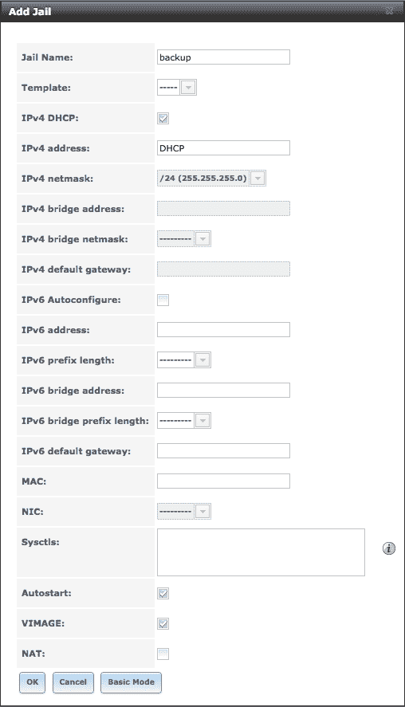

# FreeNAS ZFS 快照备份到亚马逊 S3

> 原文:[https://dev . to/jmourtada/freenas-ZFS-snapshot-backup-to-Amazon-S3](https://dev.to/jmourtada/freenas-zfs-snapshot-backup-to-amazon-s3)

最初发布于 [www.mourtada.se](https://www.mourtada.se/freenas-zfs-snapshot-backup-amazon-s3/)

我一直在寻找一种将我的 FreeNAS ZFS 快照备份到异地位置的方法。我没有找到太多如何做到这一点的信息，所以我必须想出自己的解决方案。

在这篇文章中，我将向你展示如何在亚马逊 S3 保存你的加密 ZFS 快照。我们将和 [GnuPG](https://www.gnupg.org/) 和 [s3cmd](https://github.com/s3tools/s3cmd) 一起使用 FreeBSD 监狱。

## 在弗里纳斯增加一座监狱

转到 FreeNAS web 用户界面，然后单击 Jails。单击添加并选择名称。如果你点击这里的高级，你可以改变监狱的 ip 地址(我想用 DHCP)。

[T2】](https://res.cloudinary.com/practicaldev/image/fetch/s--iRdpCb6---/c_limit%2Cf_auto%2Cfl_progressive%2Cq_auto%2Cw_880/https://www.mourtada.se/wp-content/uploads/2017/07/Screen-Shot-2017-07-05-at-15.40.09.png)

点击确定，FreeNAS 将为你设置一个新的监狱，这需要一两分钟。

从现在开始，我们必须在 FreeNAS shell 中工作(必须在 Web UI 中的 services 下启用 SSH)。

要列出在您的 FreeNAS 主机上运行的所有 jails，我们可以运行:

```
$ jls

```

验证您创建的监狱是否已列出。

要进入监狱运行:

```
$ jexec your_jail_name
$ # Verify that your in the jail
$ hostname
backup

```

我们需要安装一些软件包。首先，我们需要 GnuPG 来加密我们的快照。然后，我们将需要 s3cmd，它用于将我们的快照上传到 Amazon s3。

```
$ pkg install security/gnupg
$ pkg install net/py-s3cmd
```

I'm going to use symmetric AES256 encryption with a passphrase file because i don't want to store my data in the cloud unencrypted. So generate a random passphrase which you will need to store at multiple locations(not just inside the jail). Because if the passphrase is lost your backups will be worthless. The passphrase file needs to be accessible by the backupscript. I have placed my passphrase file in in the root directory.

```
$ echo "mypassphrase" > /root/snapshot-gpg-passphrase
$ chmod 400 /root/snapshot-gpg-passphrase

```

接下来，我们将创建一个文件夹，保存我们要与 S3 保持同步的当前快照列表。

```
$ mkdir /root/s3_sync_bucket
$ chmod 600 /root/s3_sync_bucket

```

我们还需要配置 s3cmd，以便运行并回答所有问题:

```
$ s3cmd --configure

```

## 备份脚本

这个脚本应该在 FreeNAS 主机上运行。什么是:

1.  创建指定数据集的快照
2.  将其发送到备份监狱，在那里加密并保存到文件中
3.  删除 FreeNAS 主机上的快照
4.  删除所有超过 7 天的快照
5.  使用 s3cmd 将本地 s3 存储桶目录与 S3 同步

```
#!/bin/sh

# The first argument should be the name of the dataset to backup
if test -z $1; then echo "Please specify a valid dataset"
  exit 1
fi

# Passphrase file
passphrase_file=/root/snapshot-gpg-passphrase

# Local directory to syn with Amazon S3 
bucket_dir=/root/s3_sync_bucket

# The S3 bucket url
s3_bucket="s3://your-bucket/"

# Generate a snapshot name
snapshot_name="$1@$(date +%Y-%m-%d)"

# Convert to valid filename
filename=$(echo $snapshot_name | sed "s/\//-/g").gpg

echo "Using bucket_dir: $bucket_dir"
echo "Using s3 bucket: $s3_bucket"
echo "Using snapshot_name: $snapshot_name"
echo "Using filename: $filename"

# Create the snapshot, send it to the jail, encrypt it 
zfs snapshot $snapshot_name
zfs send -v $snapshot_name | jexec backup gpg --batch --symmetric --cipher-algo AES256 --passphrase-file $passphrase_file --output $bucket_dir/$filename
zfs destroy $snapshot_name

# Remove old snapshots
search_word=$(echo $filename | sed "s/@.*$//g")
echo "Searching for \"$search_word\" in $bucket_dir older than 7 days"
jexec backup find $bucket_dir -name $search_word* -mtime +7 -exec rm {} \;

# Sync to s3
jexec backup s3cmd sync --delete-removed $bucket_dir $s3_bucket 
```

创建脚本并手动运行或使用 crontab 运行

```
$ touch /root/backup_script.sh
$ chmod 700 /root/backup_script.sh
$ /root/backup_script.sh my-pool/my-dataset

```

编辑脚本以满足您的需求。

## 解密备份

要解密备份:

```
$ gpg --batch --decrypt --passphrase-file /root/pass-gpg < backup_file
```