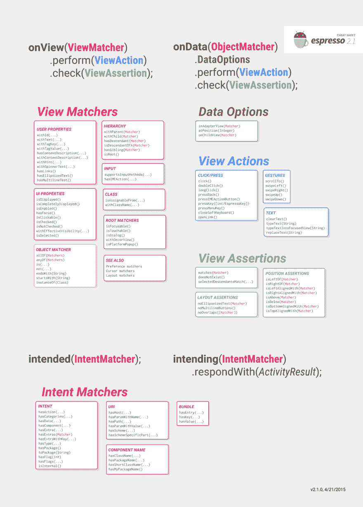
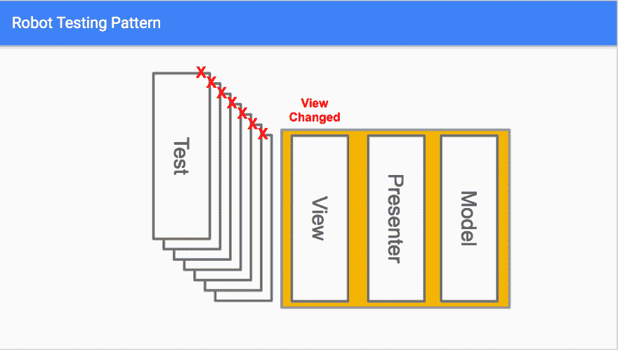
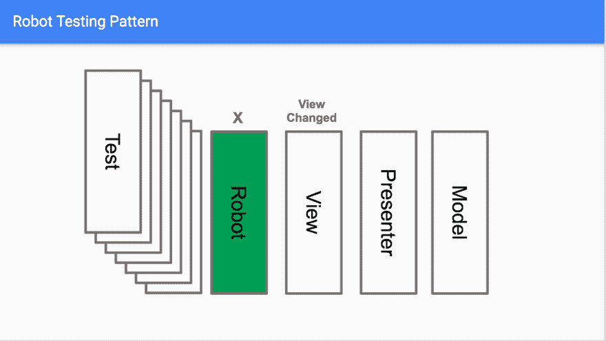

# 利用机器人模式进行浓缩咖啡测试

> 原文:[https://dev . to/Adam MC 331/leveling-the-robot-pattern for-espresso-tests](https://dev.to/adammc331/leveraging-the-robot-pattern-for-espresso-tests)

原载于[安卓精华](https://androidessence.com/android/leveraging-the-robot-pattern-for-espresso-tests/)。

Espresso 是一个用于 Android 的[测试框架，它允许开发者为他们的应用程序编写自动化测试。自动化测试的好处在于，你可以编写一个测试计划，然后点击 run，毫不费力地测试你的应用程序中的所有重要特性，并且可以说比手工测试更加一致和全面。毫无疑问是快了很多。](https://developer.android.com/training/testing/ui-testing/espresso-testing.html)

然而，自动化测试的一个鲜为人知的开发模式是 robot 模式，它使得编写测试更加容易，同时提供了一种在应用程序发生变化时更新测试的无痛方法。让我们更深入地探究是什么让 robot 模式如此强大，以及如何在您的下一个测试套件中实现它。

本教程将假设一个 Android 开发的基本知识。接触浓缩咖啡已经有所帮助了，但是我们先来快速浏览一下。

# 样品

首先，让我们看看我们正在构建的一个示例。这是一个简单的应用程序，它带您进入一个新的活动，输入一个人的信息，然后在原始活动中显示这个人的名字:

[T2】](https://res.cloudinary.com/practicaldev/image/fetch/s--IQaQEqzu--/c_limit%2Cf_auto%2Cfl_progressive%2Cq_66%2Cw_880/https://thepracticaldev.s3.amazonaws.com/i/klrs13hxdlva1ri6o0xt.gif)

# 浓缩咖啡备忘单

下面是使用浓缩咖啡的快速秘籍。我们将使用您在下面看到的每个类别:

[T2】](https://res.cloudinary.com/practicaldev/image/fetch/s--6GD4Mglq--/c_limit%2Cf_auto%2Cfl_progressive%2Cq_auto%2Cw_880/https://thepracticaldev.s3.amazonaws.com/i/ekbhihut2fmxk62ja48d.png)

如果你是浓缩咖啡的新手，以下是从那张备忘单中得到的启示:

*   ViewMatcher:这是描述您想要与之交互的视图的东西——无论是 id、文本、父视图还是上面表单中的各种其他匹配器。
*   视图操作:这是一个您可以在视图上执行的操作，例如单击它、键入文本和其他操作。
*   ViewAssertion:这用于断言视图的某些信息，比如它的位置或者它是否符合某些条件。
*   onView(ViewMatcher):该方法返回一个视图的 ViewInteraction，我们可以对该视图执行操作或进行断言。
*   check(ViewAssertion):该方法验证 ViewInteraction 是否满足给定的标准。
*   perform(ViewAction):该方法完成 ViewInteraction 上提供的操作。

# 测试添加一个人

在我们进入机器人模式之前，理解它所解决的问题是很重要的。在上面的应用程序中，我们可能希望自动化一个测试，该测试转到 add person 活动，输入他们的信息，单击 submit，并验证这个人是否被添加到了列表中。我们可以这样做:

```
 @Test
    fun addPersonSuccess() {
        // Click the FAB
        onView(withId(R.id.fab)).perform(click())

        // Enter all their information and click submit
        onView(withId(R.id.first_name)).perform(clearText(), typeText(testPerson.firstName), closeSoftKeyboard())
        onView(withId(R.id.last_name)).perform(clearText(), typeText(testPerson.lastName), closeSoftKeyboard())
        onView(withId(R.id.age)).perform(clearText(), typeText(testPerson.age.toString()), closeSoftKeyboard())
        onView(withId(R.id.email_address)).perform(clearText(), typeText(testPerson.emailAddress), closeSoftKeyboard())
        onView(withId(R.id.submit)).perform(click())

        // Make sure we came back, check for item to be displayed
        onView(withId(R.id.fab)).check(matches(isDisplayed()))
        onView(withText(testPerson.fullName)).check(matches(isDisplayed()))
    } 
```

<svg width="20px" height="20px" viewBox="0 0 24 24" class="highlight-action crayons-icon highlight-action--fullscreen-on"><title>Enter fullscreen mode</title></svg> <svg width="20px" height="20px" viewBox="0 0 24 24" class="highlight-action crayons-icon highlight-action--fullscreen-off"><title>Exit fullscreen mode</title></svg>

我们的测试是这样的:

1.  单击 id 为“fab”的视图
2.  找到 id 为“first_name”的视图，清除文本，键入名字，然后关闭键盘。对每个输入重复上述步骤。
3.  找到一个 id 为“submit”的视图，然后单击它。
4.  验证是否显示了浮动操作按钮(这意味着我们返回到了第一个活动)。
5.  验证是否显示了带有我们输入人员姓名的视图(这是 RecyclerView 中的第一行)。

现在我们可以获取这段代码，复制它，并修改它来测试所有的错误场景，比如一个空输入，并验证是否显示了错误。这带来的一个问题是，你有许多难以阅读的测试(你开始在视图上看到...另一个原因是，当你写更多的测试时，如果你的观点改变了，你将有更多的工作要做。

Sam Edwards 在[的演示中展示了这种衰落，您可以看到，如果您的观点发生变化，您需要进入并更新每一项测试:](https://www.youtube.com/watch?v=fhx_Ji5s3p4)

[T2】](https://res.cloudinary.com/practicaldev/image/fetch/s--xxFZPBXW--/c_limit%2Cf_auto%2Cfl_progressive%2Cq_auto%2Cw_880/https://thepracticaldev.s3.amazonaws.com/i/zgk9ffdaqbsoysx5wi0b.png)

# 机器人模式

现在，想象你有一个机器人，你可以用它来为你完成每一个动作。如果您的观点发生了变化，您就不必再更新每个单独的测试了——您只需要更新您的机器人。我们上面的图表现在看起来像这样:

[T2】](https://res.cloudinary.com/practicaldev/image/fetch/s--DW6-xSON--/c_limit%2Cf_auto%2Cfl_progressive%2Cq_auto%2Cw_880/https://thepracticaldev.s3.amazonaws.com/i/382i61si3ho16sbvu5we.png)

在我们展示机器人类代码之前，让我们看一下实现:

```
 @Test
    fun addPersonSuccess() {
        onView(withId(R.id.fab)).perform(click())

        AddPersonRobot()
                .firstName(testPerson.firstName)
                .lastName(testPerson.lastName)
                .age(testPerson.age)
                .emailAddress(testPerson.emailAddress)
                .submit()

        // Make sure we came back, check for item to be displayed
        onView(withId(R.id.fab)).check(matches(isDisplayed()))
        onView(withText(testPerson.fullName)).check(matches(isDisplayed()))
    } 
```

<svg width="20px" height="20px" viewBox="0 0 24 24" class="highlight-action crayons-icon highlight-action--fullscreen-on"><title>Enter fullscreen mode</title></svg> <svg width="20px" height="20px" viewBox="0 0 24 24" class="highlight-action crayons-icon highlight-action--fullscreen-off"><title>Exit fullscreen mode</title></svg>

就我们的测试而言，我们通过使用机器人获得了两大好处:

1.  增加可读性——不再需要在头脑中解析`onView(...)`代码，根据方法名就可以清楚地知道发生了什么。
2.  从测试中抽象出逻辑，只关注顺序。例如，我们的测试不再关心名字是如何输入的，它只关心名字是首先输入的。

有了这个，我们可以一次编写一个机器人，并在任何地方使用它，这使得编写实际的测试更加有趣。没有它，我可能不想花时间去写四个负面测试(四个字段中的每一个都有一个错误的输入)。然而，有了机器人，编写这些测试将花费更少的时间。其实是非常类似的代码量，我们讨论的已经比原来少很多了:

```
 @Test
    fun checkFirstNameError() {
        onView(withId(R.id.fab)).perform(click())

        AddPersonRobot()
                .lastName(testPerson.lastName)
                .age(testPerson.age)
                .emailAddress(testPerson.emailAddress)
                .submit()
                .matchFirstNameError(rule.activity.getString(R.string.err_first_name_blank))
    } 
```

<svg width="20px" height="20px" viewBox="0 0 24 24" class="highlight-action crayons-icon highlight-action--fullscreen-on"><title>Enter fullscreen mode</title></svg> <svg width="20px" height="20px" viewBox="0 0 24 24" class="highlight-action crayons-icon highlight-action--fullscreen-off"><title>Exit fullscreen mode</title></svg>

正如你在上面看到的，我们的机器人应该使用[构建器模式](http://www.javaworld.com/article/2074938/core-java/too-many-parameters-in-java-methods-part-3-builder-pattern.html)，这将允许我们轻松地将调用链接在一起。下面是我们的`AddPersonRobot.kt`类:

```
 class AddPersonRobot {
        fun firstName(firstName: String): AddPersonRobot {
            onView(FIRST_NAME_MATCHER).perform(clearText(), typeText(firstName), ViewActions.closeSoftKeyboard())
            return this
        }

        fun lastName(lastName: String): AddPersonRobot {
            onView(LAST_NAME_MATCHER).perform(clearText(), typeText(lastName), ViewActions.closeSoftKeyboard())
            return this
        }

        // ...

        fun submit(): AddPersonRobot {
            onView(SUBMIT_MATCHER).perform(click())
            return this
        }

        fun matchFirstNameError(error: String): AddPersonRobot {
            onView(FIRST_NAME_MATCHER).check(matches(hasErrorText(error)))
            return this
        }

        fun matchLastNameError(error: String): AddPersonRobot {
            onView(LAST_NAME_MATCHER).check(matches(hasErrorText(error)))
            return this
        }

        // ...

        companion object {
            val FIRST_NAME_MATCHER: Matcher<View> = withId(R.id.first_name)
            val LAST_NAME_MATCHER: Matcher<View> = withId(R.id.last_name)
            // ...
        }
    } 
```

<svg width="20px" height="20px" viewBox="0 0 24 24" class="highlight-action crayons-icon highlight-action--fullscreen-on"><title>Enter fullscreen mode</title></svg> <svg width="20px" height="20px" viewBox="0 0 24 24" class="highlight-action crayons-icon highlight-action--fullscreen-off"><title>Exit fullscreen mode</title></svg>

为了简单起见，我省略了一些代码，但这演示了我建议为您的机器人类做的事情:

1.  为你的视图创建静态匹配器，这样如果你改变了视图本身的一些东西(比如它的 id ),你只需要接触一个点。
2.  为每个输入创建一个方法，为每个错误创建一个检查方法。您可能有抽象这一点的冲动，但我喜欢能够将每个输入分开。我也喜欢这给我的测试类本身的可读性。

这就是为您的测试实现机器人模式所需的全部内容。如上所述，来自 Droidcon 2016 的 Sam Edwards 演示更深入地介绍了如何利用这种机器人模式在测试的每一步进行截图。我希望您发现这很有用，这向您展示了自动化测试并不像听起来那样令人生畏！

示例应用程序的完整代码可以在 [GitHub](https://github.com/androidessence/EspressoSample) 上找到。