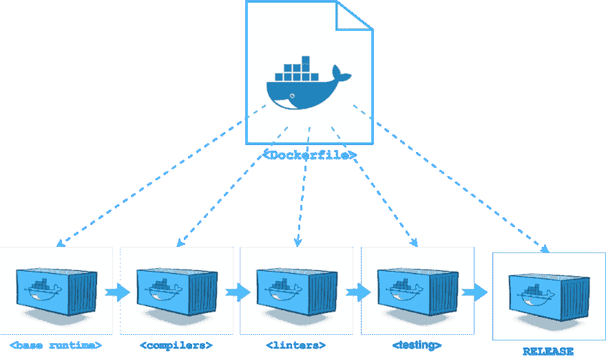

# 用于 Golang 应用程序的多级 docker 文件

> 原文:[https://dev . to/plutov/multi-stage-docker file-for-golang-application](https://dev.to/plutov/multi-stage-dockerfile-for-golang-application)

[T2】](https://res.cloudinary.com/practicaldev/image/fetch/s--8UavXwkh--/c_limit%2Cf_auto%2Cfl_progressive%2Cq_auto%2Cw_880/http://pliutau.com/multi-stage.png)

在 Docker 中构建 Golang 应用程序的一个常见解决方法是使用两个 Docker 文件——一个用于执行构建，另一个用于在第一个映像中不使用工具的情况下发布第一个构建的结果。它叫`Builder Pattern`。

从 Docker `v17.0.5`开始，可以使用多阶段构建通过单个 Docker 文件来实现。

### 申请

先说“Hello world”应用:

```
package main

import "fmt"

func main() {
    fmt.Println("Hello world!")
} 
```

<svg width="20px" height="20px" viewBox="0 0 24 24" class="highlight-action crayons-icon highlight-action--fullscreen-on"><title>Enter fullscreen mode</title></svg> <svg width="20px" height="20px" viewBox="0 0 24 24" class="highlight-action crayons-icon highlight-action--fullscreen-off"><title>Exit fullscreen mode</title></svg>

### 单 Dockerfile

对于多阶段构建，Dockerfile 允许多个 FROM 指令，映像是通过 Dockerfile 的最后一个 FROM 指令创建的。

`COPY –from=0`从上一阶段获取文件`app`并将其复制到`WORKDIR`。这基本上复制了前一阶段创建的编译后的 go 二进制文件。

`--from`标志对阶段使用从零开始的索引。您可以通过使用偏移量(如`--from=0`)或名称来引用阶段。要命名阶段，请使用[image]中的语法作为[name]。

```
FROM golang:1.8.1

WORKDIR /go/src/github.com/plutov/golang-multi-stage/

COPY main.go .

RUN GOOS=linux go build -o app .

FROM alpine:latest
RUN apk --no-cache add ca-certificates

WORKDIR /root/

COPY --from=0 /go/src/github.com/plutov/golang-multi-stage/app .

CMD ["./app"] 
```

<svg width="20px" height="20px" viewBox="0 0 24 24" class="highlight-action crayons-icon highlight-action--fullscreen-on"><title>Enter fullscreen mode</title></svg> <svg width="20px" height="20px" viewBox="0 0 24 24" class="highlight-action crayons-icon highlight-action--fullscreen-off"><title>Exit fullscreen mode</title></svg>

### 建造并检查尺寸

```
docker build . 
```

<svg width="20px" height="20px" viewBox="0 0 24 24" class="highlight-action crayons-icon highlight-action--fullscreen-on"><title>Enter fullscreen mode</title></svg> <svg width="20px" height="20px" viewBox="0 0 24 24" class="highlight-action crayons-icon highlight-action--fullscreen-off"><title>Exit fullscreen mode</title></svg>

容器大小现在很小，因为它只包含二进制文件。

```
docker ps
REPOSITORY          TAG     IMAGE ID            CREATED           SIZE

golang-multi-stage  latest  bcbbf69a9b59        6 minutes ago     6.7MB 
```

<svg width="20px" height="20px" viewBox="0 0 24 24" class="highlight-action crayons-icon highlight-action--fullscreen-on"><title>Enter fullscreen mode</title></svg> <svg width="20px" height="20px" viewBox="0 0 24 24" class="highlight-action crayons-icon highlight-action--fullscreen-off"><title>Exit fullscreen mode</title></svg>

[原文发布在我的博客上](http://pliutau.com/multi-stage-dockerfile-for-golang-application/)