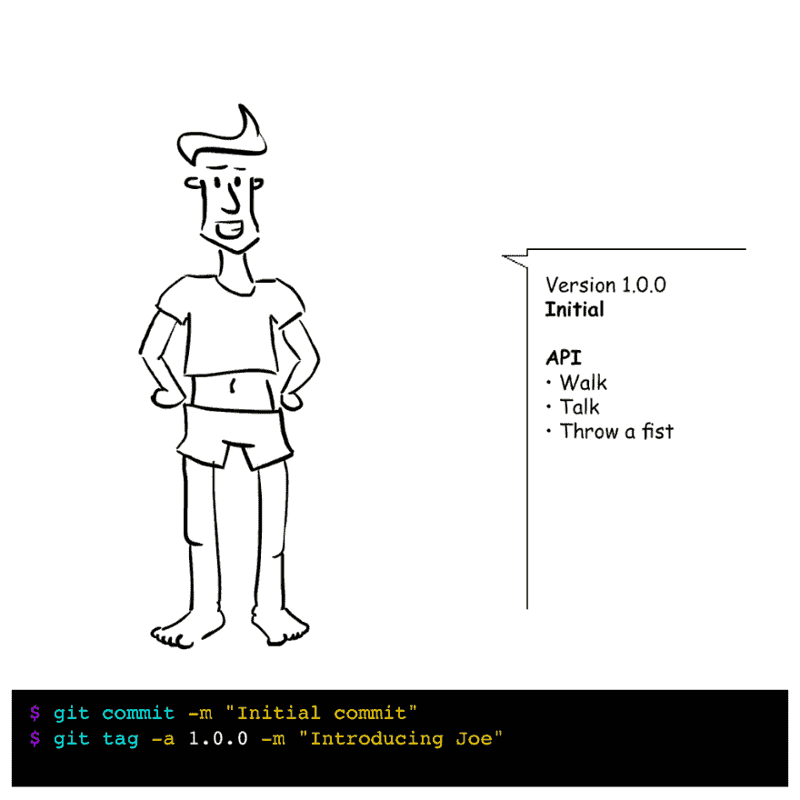
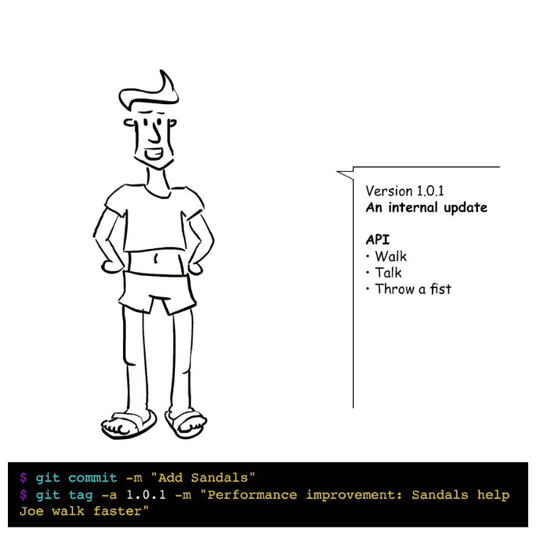
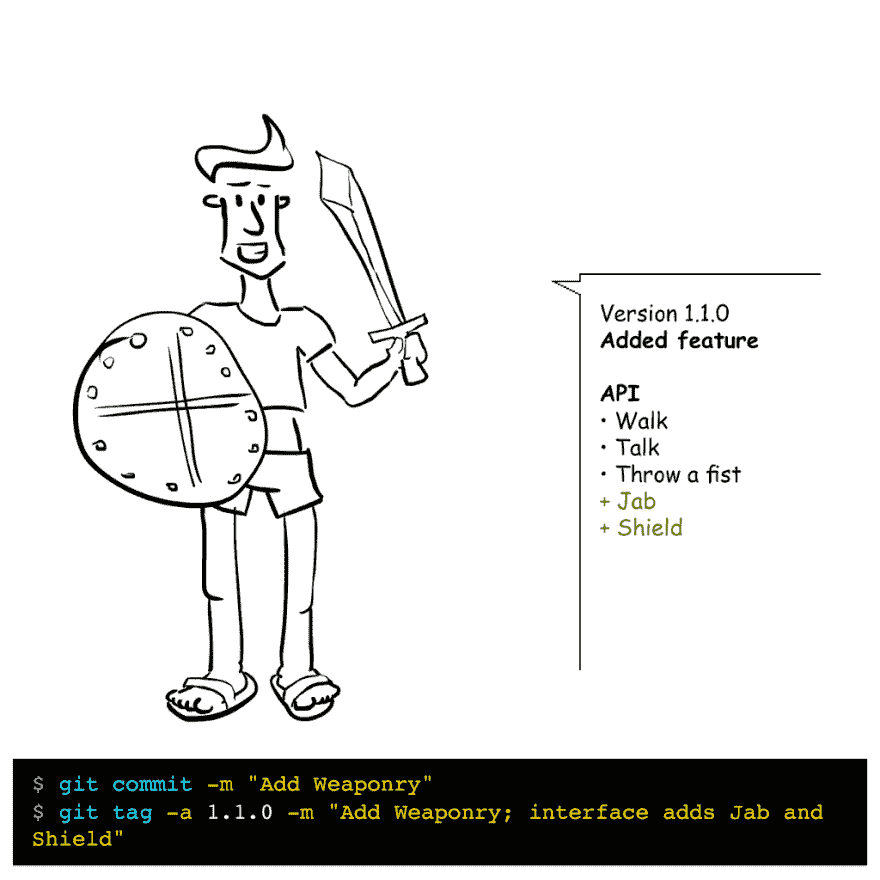
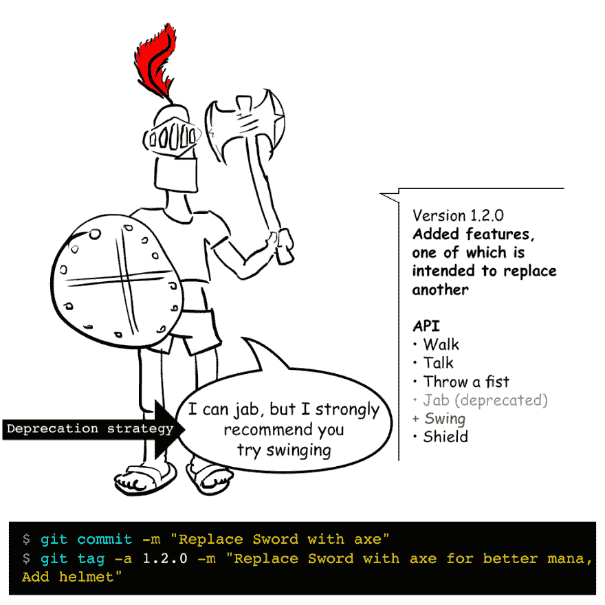
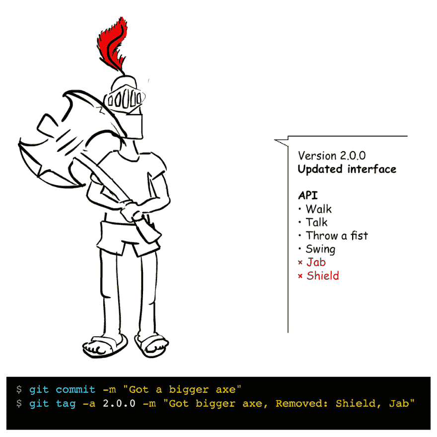
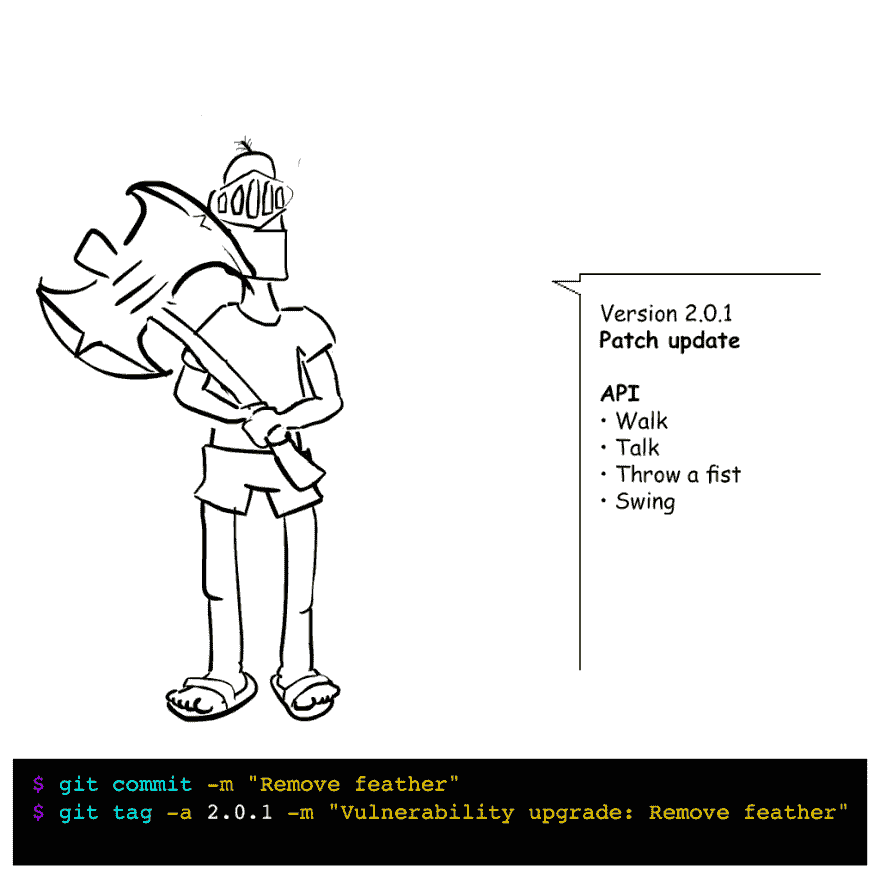
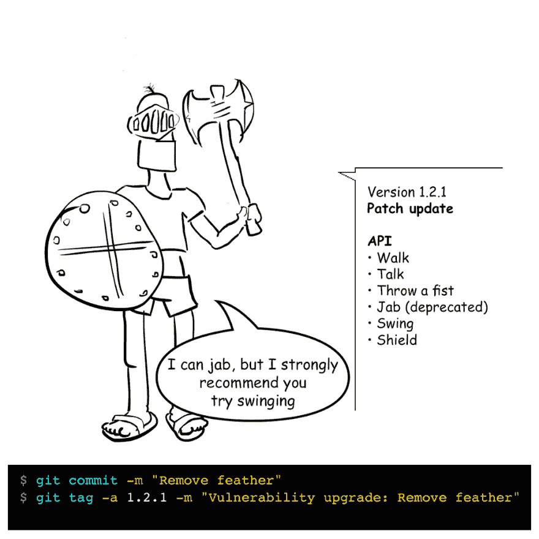

# 少校。小补丁

> 原文:[https://dev.to/omrilotan/major-minor-patch-5a7h](https://dev.to/omrilotan/major-minor-patch-5a7h)

语义版本化图解指南

### TL；速度三角形定位法(dead reckoning)

一个程序的版本并不代表软件的状态，而是为用户提供了一个关于 API 的声明。

语义版本化并不反映更新的规模，而是软件的公共 API 中的**变化。**

### 简介

作为 Fiverr 分解单一应用程序的一部分，我们正在使用各种策略在程序之间共享大量功能，以创建独立的、可互换的软件；Ruby Gems、节点包、Godeps 等等。从现在开始，我们将把它们都称为“模块”。

与最高补丁(`~`)或者甚至最高次要补丁(`^`)匹配的软件的松散依赖性是非常普遍的，并且在不同的时间产生新的映像可能导致不同机器上的不同版本的模块。这是理想的行为。我们希望能够运行具有最新性能改进和漏洞修复的最新版本的模块，而无需手动更新代码。

在适用的情况下，我们使用语义版本化来管理这一点。遵循版本化规则以避免破坏是很重要的。糟糕的版本控制会导致意想不到的行为，从不同的包输出导致不同的服务器指纹，到我们没有更新的项目中的操作直接中断。这些实例可能是最难定位和调试的，因为它们不涉及直接的代码更改。

### 输入乔

Joe 将帮助我们说明版本控制的目的。

[](https://res.cloudinary.com/practicaldev/image/fetch/s--bu3sXrYD--/c_limit%2Cf_auto%2Cfl_progressive%2Cq_auto%2Cw_880/https://cdn-images-1.medium.com/max/1024/1%2AaUe2P61OqhpFIOeEXgJwQA.png) 

<figcaption>乔希莫 1.0.0</figcaption>

这就是我们遇到乔的地方，在乔的第一个主要版本中。Joe 是一个具有内部逻辑和 API 的软件，使他的消费者可以使用他的功能(他可以走路、说话和挥拳)。

### 补丁

补丁更新是可互换的，这意味着消费者可以自由升级或降级。

> **内容:**内部修复
> 
> **举例:** Bug 修复、性能提升、环境或内部微调
> 
> **政策:**消费者**应该**毫不犹豫地更新自己的软件

[](https://res.cloudinary.com/practicaldev/image/fetch/s--lnIJwBlZ--/c_limit%2Cf_auto%2Cfl_progressive%2Cq_auto%2Cw_880/https://cdn-images-1.medium.com/max/1024/1%2AI15EJjMbthCRhvl3-6rUuQ.png) 

<figcaption>乔希莫 1.0.1</figcaption>

我们认为乔有点迟钝。研究表明，凉鞋真的可以帮助乔加快步伐。这是一次**内部**更新，它并没有改变乔的任何行为或能力，而是在现有的基础上有所改进。我们将更新一个补丁，让我们的消费者知道他们**应该**更新。

### 小调

小更新是向后兼容的，这意味着消费者可以自由升级。

> **内容:**界面变化完全向后兼容
> 
> **示例:**新功能，端点声明已弃用
> 
> **策略:**更新您的软件以获得一些新功能。什么都不会打破

[](https://res.cloudinary.com/practicaldev/image/fetch/s--EEB7juwh--/c_limit%2Cf_auto%2Cfl_progressive%2Cq_auto%2Cw_880/https://cdn-images-1.medium.com/max/1024/1%2APpM6zkVwA7Zqim061hUmqA.png) 

<figcaption>乔什莫 1.1.0</figcaption>

当我们和 Joe 一起冒险时，我们决定**给 Joe 的界面添加一些功能**。我们增加了一些武器。现在，乔能够更激烈地战斗，应对更具挑战性的努力。

因为我们已经给 Joe 的界面增加了一个小版本。乔可以做他以前做的一切，甚至更多！

[](https://res.cloudinary.com/practicaldev/image/fetch/s--bcgA5O00--/c_limit%2Cf_auto%2Cfl_progressive%2Cq_auto%2Cw_880/https://cdn-images-1.medium.com/max/1024/1%2AuK2kFfI4E8S6qS_dm_m9cQ.png) 

<figcaption>乔希莫 1.2.0</figcaption>

我们将继续为 Joe 升级新功能，但我们的测试表明 Joe 使用斧头比使用剑表现更好。因为我们希望 Joe 的用户不断更新，而不用担心旧功能被破坏，所以我们决定给他一把小斧子，他仍然可以用它戳，但我们建议用户开始摆动。这被称为**弃用策略**。

### 专业

主要更新是不兼容的，这意味着消费者**不能在不改变他们的软件的情况下升级**。

> **内容:**接口更改打破向后兼容性
> 
> **示例:**更改 API 端点名称或签名，删除一个端点
> 
> **策略:**广泛测试您的系统 post 更新。
> 
> 迁移文件可能会出现问题

[](https://res.cloudinary.com/practicaldev/image/fetch/s--r4lsVbCh--/c_limit%2Cf_auto%2Cfl_progressive%2Cq_auto%2Cw_880/https://cdn-images-1.medium.com/max/1024/1%2AZ4kNjAVKYhDAduUPJ4xmOw.png) 

<figcaption>乔什莫 2.0.0</figcaption>

最后，我们决定是时候继续乔的大男孩的斧头。要做到这一点，我们需要释放乔的另一只手，这意味着他不能再使用他的盾牌。我们删除了 Joe 的一些功能，这意味着这个版本**不完全向后兼容**。这意味着依赖 Joe 行为的用户应该小心地更新，并替换掉他们在他的屏蔽上的实例(如果有的话)。如果他们不测试他们的用法，他们的程序可能会崩溃。当我们破坏兼容性时，我们也将放弃对 Jab 的支持。

### 补丁

[](https://res.cloudinary.com/practicaldev/image/fetch/s--7UICK3bI--/c_limit%2Cf_auto%2Cfl_progressive%2Cq_auto%2Cw_880/https://cdn-images-1.medium.com/max/1024/1%2A0QqfRK2R5Nwz_HXkbhlA0A.png) 

<figcaption>乔什莫 2.0.0</figcaption>

我们注意到，一只乔有一种由他的羽毛引起的弱点。这让他在战场上太显眼了，我们决定去掉它。因为这是一个补丁，我们的用户知道他们可以安全地升级，而不需要严格测试他们的程序。

[](https://res.cloudinary.com/practicaldev/image/fetch/s--CNGtYRSN--/c_limit%2Cf_auto%2Cfl_progressive%2Cq_auto%2Cw_880/https://cdn-images-1.medium.com/max/1024/1%2AI0qifuxi7fFpqioxeWYhRw.png) 

<figcaption>乔希莫 1.2.1</figcaption>

但是羽毛并没有在这个主要版本中引入，它是在一个旧版本中引入的。如果我们想继续支持我们的用户群，我们也应该发布旧版本的补丁。

这就是标记的用武之地。您可能已经注意到了，我们还发布了标签(我们软件的命名版本)，并使用我们的版本号作为标签名。现在，我们可以轻松地返回并发布一个补丁，然后在旧版本上增加一个补丁。

### 分机

#### 预发布

α(或β等。)版本被认为是不稳定的，不遵守版本限制。

```
$ git tag -a 1.0.0-alpha.1 -m "Testing the new interface" 
```

发布候选意味着这个版本正在考虑发布。

```
$ git tag -a 2.1.0-rc.3 -m "Still performing some tests, but pretty sure this is the interface we'll be using" 
```

#### 建立编号

构建通常是代码工作版本的内部软件发布。

认为构建仅在构建元数据上不同。它们通常接受时间戳或后续数字作为名称。惯例是在它们后面加上一个加号:

```
2.1.9-beta.4+20170630230016
2.1.9-beta.4+0001 
```

> 内部版本之间没有任何优先关系。

### 当*不*更新

偶尔，维护者或贡献者只建议可读性或文档修复。重命名私有变量或方法；添加或修复文档和代码示例或一些约定技术。

由于这些变化只是为了其他维护者，或者指导**如何**更好地使用程序，它们不影响程序的操作，也不应该触发版本更新(当然不包括内部版本号扩展)。

### 异常情况

在版本 1.0.0
下，公共 API 不应被视为稳定的

```
$ git tag -a 0.0.4 -m "removed half of the interface ¯\_(ツ)\_/¯" 
```

### 资源

[塞弗知识库](https://github.com/mojombo/semver)，[塞弗网站](http://semver.org/)

* * *