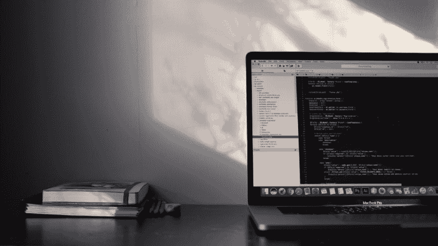

# 五分钟可访问性:按钮

> 原文:[https://dev . to/kennethlarsen/five-minute-accessibility-buttons-4m 34](https://dev.to/kennethlarsen/five-minute-accessibility-buttons-4m34)

<figure> 

<figcaption>照片:Emile peron</figcaption>

</figure>

似乎很多前端开发人员要么不知道为易访问性编码，要么不关心。当然，在不关注可访问性的组织中很难实现。但是开发一个包容性的网站总是开发者(和设计者)的责任。

在系列*五分钟可访问性*中，我将介绍一个你可以做的简单的事情来提高你的项目的可访问性。在这篇文章中，你将学习按钮。

### 按钮

按钮用于触发动作或事件，如提交表单或关闭模式。它们如此普遍，以至于大多数开发人员已经不再考虑如何正确地编写按钮代码。可悲的是，结果很难得到。

创建按钮的经验法则是，它们应该能够通过 tab 键导航。这是通过添加 tabindex="0 "来实现的。通过添加 role="button "，它们还应该具有按钮的角色。

一般来说有三种类型的按钮是 [WAI-ARIA 支持的](https://www.w3.org/WAI/intro/aria)。

*   普通的按钮
*   切换按钮
*   菜单按钮

普通按钮是最简单形式的按钮。你可以按下它，它会触发一个动作或事件。

切换按钮有两种状态，即开或关。要通知辅助技术这是一个切换按钮，您应该为属性 [aria-pressed](https://www.w3.org/TR/wai-aria-1.1/#aria-pressed) 指定一个值。切换按钮上的标签在按下时不会改变值，这一点非常重要。在某些情况下，如果通过设计一个切换按钮将标签从*静音*切换到*非静音*，则可以避免咏叹调按压属性。这样，标签就提供了上下文。

菜单按钮可以显示通常在页面加载时隐藏的菜单。可以通过使用 [aria-haspopup](https://www.w3.org/TR/wai-aria-1.1/#aria-haspopup) 帮助辅助技术知道按钮是菜单按钮。此属性指示可由元素触发的交互式弹出元素的可用性和类型，如菜单或对话框。

要知道很多辅助技术都是用键盘来触发按钮动作的。原生`<button>`元素通过使用 enter 或 space 自动支持触发动作，但是如果您不使用原生元素，那么请测试它是否与 enter 和 space 一起工作。

### 例子