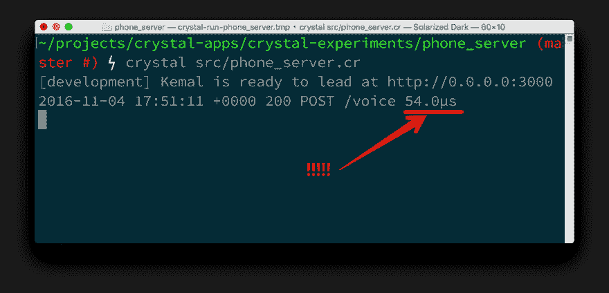
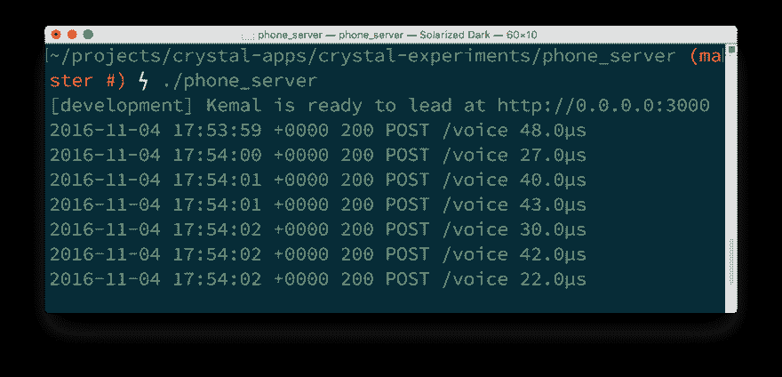

# 打电话给克里斯托和特维利奥

> 原文:[https://dev . to/twilio/用水晶和 twilio 打电话](https://dev.to/twilio/make-phone-calls-with-crystal-and-twilio)

我们已经学习了如何使用 Crystal 发送 [SMS 消息，这是一种看起来像 Ruby 但运行起来像 c 的新语言。这样做需要从我们的 Crystal 应用程序向 Twilio API 发出一个简单的](https://dev.to/philnash/send-sms-messages-with-crystal-and-twilio) [HTTP 请求](https://dev.to/philnash/send-sms-messages-with-crystal-and-twilio)。

现在是时候深入一点，看看如何用 Crystal 打电话。打电话不仅需要一个 HTTP 请求，还需要[接收一个 webhook](https://www.twilio.com/docs/api/twiml/twilio_request) ，我们需要用 [TwiML](https://www.twilio.com/docs/api/twiml) 来响应。

## 入门

如果你想加入，你需要安装 Crystal，文档中有[安装说明。你还需要](https://crystal-lang.org/docs/installation/index.html)[一个 Twilio 账户，如果你还没有的话可以免费获得](https://www.twilio.com/try-twilio)，以及一个能够打电话的 [Twilio 号码](https://www.twilio.com/console/phone-numbers/incoming)。

我们将使用前一篇文章中的代码作为这个项目的起点。你可以浏览那个帖子，学习[如何用 Crystal](https://dev.to/philnash/send-sms-messages-with-crystal-and-twilio) 发送短信，然后回到这里打电话，或者[从 GitHub](https://github.com/philnash/crystal-experiments/blob/master/src/sms.cr) 获取那个帖子的完整代码。

## 用水晶打电话

让我们首先创建一个新的 Crystal 文件来编写打电话的代码。

```
$ touch phone.cr 
```

<svg width="20px" height="20px" viewBox="0 0 24 24" class="highlight-action crayons-icon highlight-action--fullscreen-on"><title>Enter fullscreen mode</title></svg> <svg width="20px" height="20px" viewBox="0 0 24 24" class="highlight-action crayons-icon highlight-action--fullscreen-off"><title>Exit fullscreen mode</title></svg>

我们将使用我们写在 [`sms.cr`](https://github.com/philnash/crystal-experiments/blob/master/src/sms.cr) 文件中的代码作为打电话的起点，因此打开该文件并将代码从其中复制并粘贴到`phone.cr`中。

现在我们可以做一些修改，这样我们就可以打电话而不是发信息了。

首先，为我们的 call 对象创建一个简单的 JSON 映射。

接下来，将函数从`send_sms`重命名为`make_calls`，并将最后一个参数从`body`更改为`url`。`url`将需要指向一个能够处理传入 HTTP 请求的应用程序。当呼叫接通时，Twilio 将向`url`发出一个请求，称为 webhook，以找出下一步该做什么。稍后我们将看到这是如何实现的。

更改`post_form` URL，以便我们调用[调用资源](https://www.twilio.com/docs/api/rest/making-calls)。

最后将 Twilio 的响应解析成一个 Call 对象。下面是完整的代码:

```
require "http/client"
require "json"

class Call
  JSON.mapping(
    sid: String
  )
end

class Error
  JSON.mapping(
    message: String,
    status: Int32
  )
end

def make_call(to, from, url)
  client = HTTP::Client.new("api.twilio.com", 443, true) do |client|
    client.basic_auth(ENV["TWILIO_ACCOUNT_SID"], ENV["TWILIO_AUTH_TOKEN"])
    response = client.post_form("/2010-04-01/Accounts/#{ENV["TWILIO_ACCOUNT_SID"]}/Calls.json", {
      "To"   => to,
      "From" => from,
      "Url" => url,
    })
    if response.success?
      call = Call.from_json(response.body)
      puts call.sid
    else
      error = Error.from_json(response.body)
      puts error.status, error.message
    end
  end
end 
```

<svg width="20px" height="20px" viewBox="0 0 24 24" class="highlight-action crayons-icon highlight-action--fullscreen-on"><title>Enter fullscreen mode</title></svg> <svg width="20px" height="20px" viewBox="0 0 24 24" class="highlight-action crayons-icon highlight-action--fullscreen-off"><title>Exit fullscreen mode</title></svg>

在这个文件中添加最后一行，用您自己的电话号码、您的 Twilio 号码和设置为`"https://dl.dropboxusercontent.com/u/2554/crystal-call.xml"`的 URL 来调用`make_call`。

```
make_call(YOUR_NUMBER, YOUR_TWILIO_NUMBER, "https://dl.dropboxusercontent.com/u/2554/crystal-call.xml") 
```

<svg width="20px" height="20px" viewBox="0 0 24 24" class="highlight-action crayons-icon highlight-action--fullscreen-on"><title>Enter fullscreen mode</title></svg> <svg width="20px" height="20px" viewBox="0 0 24 24" class="highlight-action crayons-icon highlight-action--fullscreen-off"><title>Exit fullscreen mode</title></svg>

保存文件，编译并运行它。

```
$ crystal phone.cr 
```

<svg width="20px" height="20px" viewBox="0 0 24 24" class="highlight-action crayons-icon highlight-action--fullscreen-on"><title>Enter fullscreen mode</title></svg> <svg width="20px" height="20px" viewBox="0 0 24 24" class="highlight-action crayons-icon highlight-action--fullscreen-off"><title>Exit fullscreen mode</title></svg>

你应该会接到一个电话，然后告诉你下一步该做什么。

提示:它告诉你继续读下去。

我们进行了一次调用，并使用静态 TwiML 响应了传入的 webhook。为了制作更多的交互式应用程序，最好在 Crystal 中创建动态 TwiML。让我们研究一下如何做到这一点，首先从 Crystal 的`HTTP::Server`类开始。

## 在 Crystal 中构建 HTTP 服务器

为我们的服务器创建一个新的水晶文件。

```
$ touch server.cr 
```

<svg width="20px" height="20px" viewBox="0 0 24 24" class="highlight-action crayons-icon highlight-action--fullscreen-on"><title>Enter fullscreen mode</title></svg> <svg width="20px" height="20px" viewBox="0 0 24 24" class="highlight-action crayons-icon highlight-action--fullscreen-off"><title>Exit fullscreen mode</title></svg>

打开该文件，从标准库中的`http/server`模块开始。

```
require "http/server" 
```

<svg width="20px" height="20px" viewBox="0 0 24 24" class="highlight-action crayons-icon highlight-action--fullscreen-on"><title>Enter fullscreen mode</title></svg> <svg width="20px" height="20px" viewBox="0 0 24 24" class="highlight-action crayons-icon highlight-action--fullscreen-off"><title>Exit fullscreen mode</title></svg>

`HTTP::Server`很容易上手。创建一个`HTTP::Server`实例，传递您希望它监听的端口。我们还传递一个将处理传入请求的块。

```
require "http/server"

server = HTTP::Server.new(3000) do |context|

end 
```

<svg width="20px" height="20px" viewBox="0 0 24 24" class="highlight-action crayons-icon highlight-action--fullscreen-on"><title>Enter fullscreen mode</title></svg> <svg width="20px" height="20px" viewBox="0 0 24 24" class="highlight-action crayons-icon highlight-action--fullscreen-off"><title>Exit fullscreen mode</title></svg>

`context`是一个 [`HTTP::Server::Context`](https://crystal-lang.org/api/0.20.0/HTTP/Server/Context.html) ，当服务器收到请求时，它被传递给我们的处理程序。它引用了请求和响应对象。我们可以使用响应将内容类型设置为`text/xml`，因为我们将返回 TwiML。

```
require "http/server"

server = HTTP::Server.new(3000) do |context|
  context.response.content_type = "text/xml" 
end 
```

<svg width="20px" height="20px" viewBox="0 0 24 24" class="highlight-action crayons-icon highlight-action--fullscreen-on"><title>Enter fullscreen mode</title></svg> <svg width="20px" height="20px" viewBox="0 0 24 24" class="highlight-action crayons-icon highlight-action--fullscreen-off"><title>Exit fullscreen mode</title></svg>

然后，出于本文的目的，我们也可以将 TwiML 直接打印到响应中。为了说明这是动态创建 TwiML，我们将打印一条随时间变化的消息。

```
require "http/server"

server = HTTP::Server.new(3000) do |context|
  context.response.content_type = "text/xml" 
  time = Time.now
  message = if time.hour < 12
              "Good morning"
            elsif time.hour < 18
              "Good afternoon"
            else
              "Good night"
            end
  context.response.print "<Response><Say>#{message} from Crystal!</Say></Response>"
end 
```

<svg width="20px" height="20px" viewBox="0 0 24 24" class="highlight-action crayons-icon highlight-action--fullscreen-on"><title>Enter fullscreen mode</title></svg> <svg width="20px" height="20px" viewBox="0 0 24 24" class="highlight-action crayons-icon highlight-action--fullscreen-off"><title>Exit fullscreen mode</title></svg>

为了结束这个非常简单的服务器，我们需要告诉服务器开始监听传入的连接。我们还向终端打印一条消息，这样我们就可以看到服务器已经启动。

```
require "http/server"

server = HTTP::Server.new(3000) do |context|
  context.response.content_type = "text/xml"
  time = Time.now
  message = if time.hour < 12
              "Good morning"
            elsif time.hour < 18
              "Good afternoon"
            else
              "Good night"
            end
  context.response.print "<Response><Say>#{message} from Crystal!</Say></Response>"
end

puts "Listening on http://0.0.0.0:3000"
server.listen 
```

<svg width="20px" height="20px" viewBox="0 0 24 24" class="highlight-action crayons-icon highlight-action--fullscreen-on"><title>Enter fullscreen mode</title></svg> <svg width="20px" height="20px" viewBox="0 0 24 24" class="highlight-action crayons-icon highlight-action--fullscreen-off"><title>Exit fullscreen mode</title></svg>

编译并运行服务器:

```
$ crystal server.cr 
```

<svg width="20px" height="20px" viewBox="0 0 24 24" class="highlight-action crayons-icon highlight-action--fullscreen-on"><title>Enter fullscreen mode</title></svg> <svg width="20px" height="20px" viewBox="0 0 24 24" class="highlight-action crayons-icon highlight-action--fullscreen-off"><title>Exit fullscreen mode</title></svg>

打开你的浏览器到[http://localhost:3000](http://localhost:3000)你就会看到你的 TwiML。我们现在可以使用这个服务器来驱动我们的呼叫。为此，我们需要向外部请求开放我们的开发服务器。[我喜欢用 ngrok 做这个，你可以在这里找到如何安装和使用它](https://www.twilio.com/blog/2015/09/6-awesome-reasons-to-use-ngrok-when-testing-webhooks.html)。如果您有 ngrok 设置，请打开一个到端口 3000 的隧道。

```
$ ngrok http 3000 
```

<svg width="20px" height="20px" viewBox="0 0 24 24" class="highlight-action crayons-icon highlight-action--fullscreen-on"><title>Enter fullscreen mode</title></svg> <svg width="20px" height="20px" viewBox="0 0 24 24" class="highlight-action crayons-icon highlight-action--fullscreen-off"><title>Exit fullscreen mode</title></svg>

复制您的 ngrok URL 并再次打开`phone.cr`。用你的 ngrok URL 替换对`make_call`的调用中的 DropBox 链接，编译并再次运行`phone.cr`。

```
$ crystal phone.cr 
```

<svg width="20px" height="20px" viewBox="0 0 24 24" class="highlight-action crayons-icon highlight-action--fullscreen-on"><title>Enter fullscreen mode</title></svg> <svg width="20px" height="20px" viewBox="0 0 24 24" class="highlight-action crayons-icon highlight-action--fullscreen-off"><title>Exit fullscreen mode</title></svg>

这一次，当你的电话响起时，你会听到你在`server.cr`中写的信息。

## 更好的服务器

到目前为止，我们已经使用标准库构建了一个非常原始的服务器。我们可以做一些工作来构建对动态路径、主体解析、HTTP 动词等的支持，但是像在任何语言中一样，看看社区提供了什么是很好的。Crystal 附带了一个集成的包管理器，并且已经有[个包，称为碎片，可用](http://crystalshards.xyz/)。

为了改进我们的服务器产品，我们将把我们的基本 HTTP 服务器替换为 Kemal T1，这是 Ruby 的 T2 Sinatra T3 的晶体等价物。

这一次，我们将使用 Crystal 的`init`工具生成我们的项目。你可以初始化一个应用程序或一个库，我们现在想要一个应用程序。

```
$ crystal init app phone_server
$ cd phone_server
$ ls LICENSE        README.md         shard.yml        spec        src 
```

<svg width="20px" height="20px" viewBox="0 0 24 24" class="highlight-action crayons-icon highlight-action--fullscreen-on"><title>Enter fullscreen mode</title></svg> <svg width="20px" height="20px" viewBox="0 0 24 24" class="highlight-action crayons-icon highlight-action--fullscreen-off"><title>Exit fullscreen mode</title></svg>

`init`给出了一个基本的项目结构，包括一个`shard.yml`文件。打开它，添加对凯末尔的依赖。

```
name: phone_server
version: 0.1.0

license: MIT

dependencies:
  kemal:
    github: kemalcr/kemal
    branch: master 
```

<svg width="20px" height="20px" viewBox="0 0 24 24" class="highlight-action crayons-icon highlight-action--fullscreen-on"><title>Enter fullscreen mode</title></svg> <svg width="20px" height="20px" viewBox="0 0 24 24" class="highlight-action crayons-icon highlight-action--fullscreen-off"><title>Exit fullscreen mode</title></svg>

在命令行上安装依赖项:

```
$ shards install 
```

<svg width="20px" height="20px" viewBox="0 0 24 24" class="highlight-action crayons-icon highlight-action--fullscreen-on"><title>Enter fullscreen mode</title></svg> <svg width="20px" height="20px" viewBox="0 0 24 24" class="highlight-action crayons-icon highlight-action--fullscreen-off"><title>Exit fullscreen mode</title></svg>

打开`src/phone_server.cr`。并将文件中的所有内容替换为:

```
require "kemal" 
```

<svg width="20px" height="20px" viewBox="0 0 24 24" class="highlight-action crayons-icon highlight-action--fullscreen-on"><title>Enter fullscreen mode</title></svg> <svg width="20px" height="20px" viewBox="0 0 24 24" class="highlight-action crayons-icon highlight-action--fullscreen-off"><title>Exit fullscreen mode</title></svg>

默认情况下，Twilio 通过 POST 请求创建 webhooks。在 Kemal 中，我们通过我们想要处理的 HTTP 动词来定义路由，我们简单的`HTTP::Server`对一切做出响应。要处理 webhook，请在“/voice”处为 POST 请求创建一个端点。Kemal 中的处理程序得到一个与`HTTP::Server`相似的上下文对象。

```
require "kemal"

post "/voice" do |context|

end 
```

<svg width="20px" height="20px" viewBox="0 0 24 24" class="highlight-action crayons-icon highlight-action--fullscreen-on"><title>Enter fullscreen mode</title></svg> <svg width="20px" height="20px" viewBox="0 0 24 24" class="highlight-action crayons-icon highlight-action--fullscreen-off"><title>Exit fullscreen mode</title></svg>

我们可以使用上下文的 response 属性来设置头。

```
require "kemal"

post "/voice" do |context|
  context.response.content_type = "text/xml"
end 
```

<svg width="20px" height="20px" viewBox="0 0 24 24" class="highlight-action crayons-icon highlight-action--fullscreen-on"><title>Enter fullscreen mode</title></svg> <svg width="20px" height="20px" viewBox="0 0 24 24" class="highlight-action crayons-icon highlight-action--fullscreen-off"><title>Exit fullscreen mode</title></svg>

然后我们只需要像在普通的`HTTP::Server`例子中那样返回 TwiML。

```
require "kemal"

post "/voice" do |context|
  context.response.content_type = "text/xml"
  time = Time.now
  message = if time.hour < 12
              "Good morning"
            elsif time.hour < 18
              "Good afternoon"
            else
              "Good night"
            end
  "<?xml version="1.0" encoding="UTF-8"?>
  <Response>
    <Say>#{message} from Kemal and Crystal!</Say>
  </Response>"
end 
```

<svg width="20px" height="20px" viewBox="0 0 24 24" class="highlight-action crayons-icon highlight-action--fullscreen-on"><title>Enter fullscreen mode</title></svg> <svg width="20px" height="20px" viewBox="0 0 24 24" class="highlight-action crayons-icon highlight-action--fullscreen-off"><title>Exit fullscreen mode</title></svg>

最后经营凯末尔。

```
require "kemal"

post "/voice" do |context|
  context.response.content_type = "text/xml"
  time = Time.now
  message = if time.hour < 12
              "Good morning"
            elsif time.hour < 18
              "Good afternoon"
            else
              "Good night"
            end
  "<?xml version="1.0" encoding="UTF-8"?>
  <Response>
    <Say>#{message} from Kemal and Crystal!</Say>
  </Response>"
end

Kemal.run 
```

<svg width="20px" height="20px" viewBox="0 0 24 24" class="highlight-action crayons-icon highlight-action--fullscreen-on"><title>Enter fullscreen mode</title></svg> <svg width="20px" height="20px" viewBox="0 0 24 24" class="highlight-action crayons-icon highlight-action--fullscreen-off"><title>Exit fullscreen mode</title></svg>

如果你还没有，用 Ctrl C 停止你的旧服务器。现在编译并运行新的，基于 Kemal 的服务器:

```
$ crystal src/phone_server.cr
[development] Kemal is ready to lead at http://0.0.0.0:3000 
```

<svg width="20px" height="20px" viewBox="0 0 24 24" class="highlight-action crayons-icon highlight-action--fullscreen-on"><title>Enter fullscreen mode</title></svg> <svg width="20px" height="20px" viewBox="0 0 24 24" class="highlight-action crayons-icon highlight-action--fullscreen-off"><title>Exit fullscreen mode</title></svg>

希望您还在运行 ngrok，否则重新启动它，并将 ngrok URL 复制到您在`phone.cr`中的`make_call`函数。这次一定要加上“/voice”路径。你的网址应该看起来像，“【http://RANDOM.ngrok.io/voice】”。

再次编译并运行`phone.cr`。这一次，当你接听电话时，你会听到你在 Kemal 服务器上写的信息。

## 我告诉过你它很快

我在关于 Crystal 的第一篇文章中提到，它的速度惊人。在你关闭你的 Kemal 服务器之前，我希望你记下它报告的响应时间。以下是我所看到的:

[T2】](https://res.cloudinary.com/practicaldev/image/fetch/s--xj2UPajp--/c_limit%2Cf_auto%2Cfl_progressive%2Cq_auto%2Cw_880/https://twilioinc.wpengine.com/wp-content/uploads/2016/12/MoNIbOHfYSM8J7vB1ERXGeiMifhjbFyM9tkyBwDlfs3pUyQgY9bF_5FW4UUyekgg10S-6h7e9WAqv5nb0aQOEgxtZcayjWTjKA3jPpoV4jcu0OJA3bao_EQtSzlGg7QUGagoojc.png)

是的，上面写着 54 微秒。我意识到这个端点非常简单，但是框架的原始性能确实给我留下了深刻的印象。这还不是全部。这是在调试模式下编译的。使用
编译发布应用程序

```
$ crystal build src/phone_server.cr &mdash;release 
```

<svg width="20px" height="20px" viewBox="0 0 24 24" class="highlight-action crayons-icon highlight-action--fullscreen-on"><title>Enter fullscreen mode</title></svg> <svg width="20px" height="20px" viewBox="0 0 24 24" class="highlight-action crayons-icon highlight-action--fullscreen-off"><title>Exit fullscreen mode</title></svg>

然后运行可执行文件，事情会变得更快。

[T2】](https://res.cloudinary.com/practicaldev/image/fetch/s--xVm060k7--/c_limit%2Cf_auto%2Cfl_progressive%2Cq_auto%2Cw_880/https://twilioinc.wpengine.com/wp-content/uploads/2016/12/9vAmf8IVXpxqzEyVJw9_dMR3iJoC9UuHX28flUH-DBpvjowP7HPqYkg9BcylctIV0Tt8DHsJ11VmmeHh9K_KRZ0NU81Q8ze_qruXXKkMhQvf7bk0WhazS3PaO1_fKBPTeHGtCfk.png)

## 拿水晶兜一圈

所以我们有它，我们已经发送[短信](https://dev.to/philnash/send-sms-messages-with-crystal-and-twilio)和打电话与水晶。我们已经了解了如何使用`HTTP::Client`、JSON 映射、`HTTP::Server`、shards 和 Kemal。你可以在[GitHub repo](https://github.com/philnash/crystal-experiments)的两篇博客文章中查看我们写的所有代码。

如果你想更深入地了解 Crystal，那就去看看[文档](https://crystal-lang.org/docs/)、[标准库](https://crystal-lang.org/api/0.19.4/)、 [Kemal 的文档](http://kemalcr.com/docs/getting_started/)、可用的 [CrystalShards 列表](http://crystalshards.xyz/)，甚至是 Crystal 的[源代码](https://github.com/crystal-lang/crystal)(都是用 Crystal 写的！).

喜欢水晶的样子？请在下面的评论中告诉我，或者给我发一封电子邮件或者在推特上留言，地址是[@菲尔纳什](https://twitter.com/philnash)。

* * *

*[《与克里斯托和朱婷打电话》](https://www.twilio.com/blog/2016/12/make-phone-calls-crystal-twilio.html)原载于 2016 年 12 月 2 日[朱婷博客](https://www.twilio.com/blog)。*