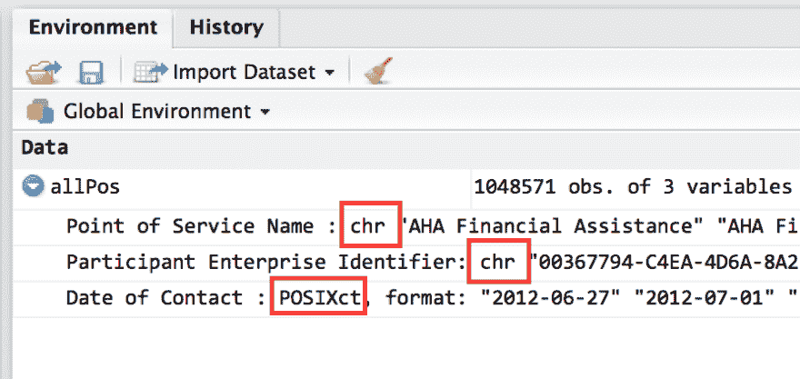
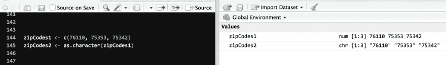

# 在 SQLdf 中使用日期

> 原文:[https://dev.to/ladvien/working-with-dates-in-sqldf-530h](https://dev.to/ladvien/working-with-dates-in-sqldf-530h)

混合使用 R 和 SQL 是非常强大的。实现这种组合的最简单的方法之一是使用 R 库 SQLdf。

如果 TL；博士，跳到底部的`Coerce Date Types into Strings before Passing to SQLdf`。

## SQLdf

SQLdf 的强大之处在于它能够动态地将数据帧转换成 SQLite 数据库。对于用户来说，看起来并没有什么特别的事情发生，但是在幕后，R 正在与 SQLite 客户机一起创建一个表，可以通过 ANSI SQL 调用来查询和操作这个表。

例如，

```
dataFrame1  <-  read.csv(pathToData)  library("sqldf")  dataFrame2  <-  sqldf("SELECT FirstName FROM dataFrame") 
```

<svg width="20px" height="20px" viewBox="0 0 24 24" class="highlight-action crayons-icon highlight-action--fullscreen-on"><title>Enter fullscreen mode</title></svg> <svg width="20px" height="20px" viewBox="0 0 24 24" class="highlight-action crayons-icon highlight-action--fullscreen-off"><title>Exit fullscreen mode</title></svg>

这三行做了很多。它从 CSV 加载数据，加载将 R 数据帧转换成 SQLite 数据库的函数库，然后调用`sqldf()`函数一次做两件事。它将 R dataframe 转换成 SQLite 数据库，然后在其中查询 FirstName 列。

如果我们假设 dataFrame1 变量包含如下数据:

| 个人 id | 西方人名的第一个字 | 姓 |
| --- | --- | --- |
| b 7 yiojigf 9 CDP 6 Fv 7 tanqxlmqrmmbtvtb | 上下移动 | 人 |
| asgj 4 f 95 hs 85n 39 DJ 12 ajb 094m 59 DJ 45 | 简（女子名） | 人 |

然后，`dataFrame2 <- sqldf("SELECT FirstName FROM dataFrame)`将创建一个名为`dataFrame2`的变量，它包含 dataFrame1 中的 FirstName 列

| 西方人名的第一个字 |
| --- |
| 上下移动 |
| 简（女子名） |

这就是我们如何以 R-SQL 的方式塑造我们的数据。

## 数据类型

关于计算机，人类可以学到的最重要的东西之一就是数据类型。当计算机处理信息时，它们需要人类的一点帮助，试图理解如何处理这些信息。比如，这些数字对你意味着什么？

```
76110, 444-325-7645, 10/24/1980 
```

<svg width="20px" height="20px" viewBox="0 0 24 24" class="highlight-action crayons-icon highlight-action--fullscreen-on"><title>Enter fullscreen mode</title></svg> <svg width="20px" height="20px" viewBox="0 0 24 24" class="highlight-action crayons-icon highlight-action--fullscreen-off"><title>Exit fullscreen mode</title></svg>

大多数人(至少在美国)知道第一个数字是邮政编码，第二个是电话号码，最后一个是日期。人类知道这一点，因为我们的大脑已经学会了如何从上下文中辨别。在邮政编码的情况下，它正好是 5 个数字，电话在确切的位置包含破折号，日期在我们期望的日期的确切位置包含斜线。

不幸的是，计算机在这方面有一点困难。如今，大多数电脑足够智能，可以知道电话号码和出生日期，但邮政编码会让电脑不知所措。

电脑看到邮政编码的第一反应是，“哦，你是说 76110。这是一个很大的数字。”实际上，这个数字代表一个地理位置。

好吧，让我们把这个和 HMIS 的工作联系起来。帮助计算机理解数字代表什么的方法是告诉计算机某一列是什么类型的数据。这被称为数据类型。对我们来说，我们实际上只处理很少的数据类型，但是他们有成千上万的数据类型。

在 R 中，您可以通过单击全局环境变量中数据帧名称旁边的蓝色按钮来查看数据帧的列的数据类型。

[T2】](https://res.cloudinary.com/practicaldev/image/fetch/s--nwVSZ7RM--/c_limit%2Cf_auto%2Cfl_progressive%2Cq_auto%2Cw_880/https://ladvien.cimg/r-datatypes.png)

我们将处理以下问题:

*   日期(在 R 中称为“POSXct”)
*   字符串(在 R 中称为“chr”)
*   数字
*   工厂

当然，每一种编程语言都可以用不同的名字来调用这些数据类型，从而进一步混淆。(我的意思是，来吧，编程已经够简单了——我们必须让它*有点挑战性。)*

### 日期

日期数据类型通常如下:

```
10/24/1980 
```

<svg width="20px" height="20px" viewBox="0 0 24 24" class="highlight-action crayons-icon highlight-action--fullscreen-on"><title>Enter fullscreen mode</title></svg> <svg width="20px" height="20px" viewBox="0 0 24 24" class="highlight-action crayons-icon highlight-action--fullscreen-off"><title>Exit fullscreen mode</title></svg>

但是它可以有许多不同的格式。最好区分一下*数据类型*和*数据格式*。数据类型描述了信息应该如何使用——这对计算机很重要。数据格式描述了计算机应该如何向人类显示信息——因此，它对人类很有用。

相同数据的不同格式的例子:

```
10/24/1980  1980-10-24  102480 
```

<svg width="20px" height="20px" viewBox="0 0 24 24" class="highlight-action crayons-icon highlight-action--fullscreen-on"><title>Enter fullscreen mode</title></svg> <svg width="20px" height="20px" viewBox="0 0 24 24" class="highlight-action crayons-icon highlight-action--fullscreen-off"><title>Exit fullscreen mode</title></svg>

好了，回到日期数据类型。它在处理日期时使用。通过将一个变量声明为具有日期数据类型，它告诉计算机无论我们将什么放入该变量都要解释为日期。很简单。

### 字符串

当我们谈论绳子时，我们不是在谈论小猫追逐的模糊的东西。字符串数据类型是串在一起的一系列字符(字符串的一部分)。*任何东西*都可以是字符串。它们可能是最重要的数据类型，因为它们可以告诉计算机看到一个数字，同时看到其他的东西。迷茫？让我们看一些例子。

我们告诉计算机数据是一个字符串是通过把它放在双引号`"this is a string"`或单引号`'this is also a string'`中。

这里有一个在 R 中给字符串赋值的例子:

```
myFirstString  <-  "this is a string" 
```

<svg width="20px" height="20px" viewBox="0 0 24 24" class="highlight-action crayons-icon highlight-action--fullscreen-on"><title>Enter fullscreen mode</title></svg> <svg width="20px" height="20px" viewBox="0 0 24 24" class="highlight-action crayons-icon highlight-action--fullscreen-off"><title>Exit fullscreen mode</title></svg>

太好了！但是我们能用它做什么呢？嗯，很多。

假设我们想将一个文件的路径传递给一个`read.csv()`函数。我们可以通过提供字符串形式的路径来实现。

```
dataFrame  <-  read.csv("/Users/user/Downloads/Client.csv") 
```

<svg width="20px" height="20px" viewBox="0 0 24 24" class="highlight-action crayons-icon highlight-action--fullscreen-on"><title>Enter fullscreen mode</title></svg> <svg width="20px" height="20px" viewBox="0 0 24 24" class="highlight-action crayons-icon highlight-action--fullscreen-off"><title>Exit fullscreen mode</title></svg>

上面将加载位于`/Users/user/Downloads/`目录的 Client.csv 文件——计算机知道如何读取路径，因为它是一个字符串。

但是为什么字符串如此重要呢？嗯，它们允许我们告诉计算机超越它的基本本能，将一段数据视为计算机猜测之外的东西。

返回邮政编码。

```
notAZipCode  <-  76110  myZipCode  <-  "76110" 
```

<svg width="20px" height="20px" viewBox="0 0 24 24" class="highlight-action crayons-icon highlight-action--fullscreen-on"><title>Enter fullscreen mode</title></svg> <svg width="20px" height="20px" viewBox="0 0 24 24" class="highlight-action crayons-icon highlight-action--fullscreen-off"><title>Exit fullscreen mode</title></svg>

这些变量赋值可能看起来完全一样，然而，第一个创建了一个变量作为一个数，但第二个告诉计算机，“这是一个不是数，是别的东西——请不要假装理解它。稍后我会告诉你具体该怎么做。”

### 数字

数字数据类型很简单。这很像计算机试图查看你提供给它的所有数据的方式。数字的一个重要特征是，你可以让计算机对数字执行数学运算，而你不能对字符串执行。

```
dataframe1  <-  12  *  12  datafram2  <-  "12"  *  "12" 
```

<svg width="20px" height="20px" viewBox="0 0 24 24" class="highlight-action crayons-icon highlight-action--fullscreen-on"><title>Enter fullscreen mode</title></svg> <svg width="20px" height="20px" viewBox="0 0 24 24" class="highlight-action crayons-icon highlight-action--fullscreen-off"><title>Exit fullscreen mode</title></svg>

以上，`dataframe1`被执行后将包含 144。但是如果试图执行第二行，计算机会抓狂，“这是一个字符串！我不会加弦！你告诉过我你会告诉我该怎么处置他们……”

### 因素

因子是 R 中一种特殊的数据类型。我们在 R 中装载的大多数变量都是以因子的形式开始的。本质上，因素是数据的类别。

```
Red,  Orange,  Green,  Blue,  Indigo,  Violet 
```

<svg width="20px" height="20px" viewBox="0 0 24 24" class="highlight-action crayons-icon highlight-action--fullscreen-on"><title>Enter fullscreen mode</title></svg> <svg width="20px" height="20px" viewBox="0 0 24 24" class="highlight-action crayons-icon highlight-action--fullscreen-off"><title>Exit fullscreen mode</title></svg>

是因素的一个例子。它们是数据的类别。随着我们在 r 中学习这些教程，这些因素的重要性将变得更加明显。

*如果你不了解因素，这很酷。就当它们是弦吧。*不过，如果你不懂字符串，请在下面的评论中提问。理解它们对于使用 SQLdf 至关重要。

## SQLdf 和数据类型

任何时候当你混合两种不同的语言时，都要注意词义。正如我曾经通过谈论我喜欢的馅饼而了解到的——我发现，这对于学习英语的西班牙朋友来说很有趣。(显然 pie 是西班牙语的 foot？)

当混合使用 R 和 SQL 时，我们必须注意这两种语言如何看待数据类型。在 R 中，它将日期视为一种`POSXct`数据类型(这实际上是一种奇特的`date`数据类型。[你想知道更多的](http://biostat.mc.vanderbilt.edu/wiki/pub/Main/ColeBeck/datestimes.pdf)吗？)

这一切都很好，但是当我们将命令从 R 传递给 SQL 时，它们都是作为字符串传递的。

```
dataFrame2  <-  sqldf("SELECT * FROM dataFrame1") 
```

<svg width="20px" height="20px" viewBox="0 0 24 24" class="highlight-action crayons-icon highlight-action--fullscreen-on"><title>Enter fullscreen mode</title></svg> <svg width="20px" height="20px" viewBox="0 0 24 24" class="highlight-action crayons-icon highlight-action--fullscreen-off"><title>Exit fullscreen mode</title></svg>

注意`SELECT * FROM dataFrame1`都在引号里？这将它转换成一个字符串，然后传递给 SQLite，它对我们是隐藏的。

如果这一切有点让人不知所措，没关系。将此页加入书签，以便日后参考。只要记住以下几点:

在将日期列传递给 SQL 之前，必须将其转换为`chr`数据类型*。我们如何转换数据类型？这非常简单。我们使用一种叫做数据强制的东西。*

## 强制数据类型

让我们回到那个邮政编码和号码的例子。假设计算机从一个文件中读取你所有的邮政编码作为一个数字。这种情况经常发生，因为对计算机来说这就是它看起来的样子——所以它猜测这就是你想要的。

但是不，我们希望这些邮政编码是字符串。要做到这一点，我们可以从数据帧中获得一个特定的列，方法是先写数据帧的名称，然后写列的名称。例如，`datafram$zipCodes`将只从 dataframe 返回列`zipCodes`。

好了，现在我们有办法从数据帧中选择一列，我们可以尝试转换这一列的数据类型。为此，使用`as.character()`命令。

```
dataframe$zipCodes  <-  as.character(dataFrame$zipCodes) 
```

<svg width="20px" height="20px" viewBox="0 0 24 24" class="highlight-action crayons-icon highlight-action--fullscreen-on"><title>Enter fullscreen mode</title></svg> <svg width="20px" height="20px" viewBox="0 0 24 24" class="highlight-action crayons-icon highlight-action--fullscreen-off"><title>Exit fullscreen mode</title></svg>

[T2】](https://res.cloudinary.com/practicaldev/image/fetch/s--GnMHDX8s--/c_limit%2Cf_auto%2Cfl_progressive%2Cq_auto%2Cw_880/https://ladvien.cimg/zip-codes-number-to-string.png)

这将把 zipCode 列从一个数字转换成一个字符串，然后将它赋回 zipCodes 列。嘣！我们已经告诉计算机不要试图把邮政编码变成数字。而是把它当成一个字符串。就这样，我们稍后会告诉计算机如何使用邮政编码。

## 在传递给 SQLdf 之前，将日期类型强制转换为字符串

好了，现在来看看这篇文章的原因。在向 SQLdf 传递任何日期之前，我们需要首先将它们转换为字符串。否则，SQLdf 会试图将它们视为数字——这将导致很多令人心痛的事情。

例如，Client.csv 文件应该有一个`DateCreated`列。这表示案例经理将数据输入 HMIS 的日期。数据应该是这样的:

| ... | 创建日期 | 更新日期 |
| --- | --- | --- |
| ... | 10/23/14 0:01 | 4/23/15 15:27 |
| ... | 5/22/13 9:23 | 10/15/16 1:29 |
| ... | 6/3/15 19:22 | 3/17/17 21:09 |

让我们试着找到所有 2014 年 10 月 1 日之后进入的客户。

```
dataFramContainingDates  <-  read.csv("/Users/user/Downloads/Client.csv")  datesEntered  <-  sqldf("SELECT * FROM dataFramContainingDates WHERE DateCreated > '2014-10-01'") 
```

<svg width="20px" height="20px" viewBox="0 0 24 24" class="highlight-action crayons-icon highlight-action--fullscreen-on"><title>Enter fullscreen mode</title></svg> <svg width="20px" height="20px" viewBox="0 0 24 24" class="highlight-action crayons-icon highlight-action--fullscreen-off"><title>Exit fullscreen mode</title></svg>

上面的代码应该提供 DateCreated date 大于 2014-10-01 的每一列。但是，相反，它将导致一个空的数据帧。哇哇。

本质上，这是因为 SQL 正在比较一个数字和一个字符串。它会把电脑吓坏的。

相反，我们应该将`DateCreated`列转换成字符串而不是日期。然后，SQL 会将其从字符串转换为日期。

迷茫？想象一下当我试图自己解决这个问题的时候。

好吧，那么，外卖呢？在将任何日期传递给 SQL 之前，将它们转换为字符串。

```
dataFramContainingDates  <-  read.csv("/Users/user/Downloads/Client.csv")  dataFrameContaingDates$DateCreated  <-  as.character(dataFrameContaingDates$DateCreated)  datesEntered  <-  sqldf("SELECT * FROM dataFramContainingDates WHERE DateCreated > '2014-10-01'") 
```

<svg width="20px" height="20px" viewBox="0 0 24 24" class="highlight-action crayons-icon highlight-action--fullscreen-on"><title>Enter fullscreen mode</title></svg> <svg width="20px" height="20px" viewBox="0 0 24 24" class="highlight-action crayons-icon highlight-action--fullscreen-off"><title>Exit fullscreen mode</title></svg>

通过使用`as.character`函数将`DateCreated`列转换为一个字符串，然后将其赋回 dateframe，它设置 SQL 来正确地进行日期比较。使用上面的日期框架，应该会得到下表:

| ... | 创建日期 | 更新日期 |
| --- | --- | --- |
| ... | 10/23/14 0:01 | 4/23/15 15:27 |
| ... | 6/3/15 19:22 | 3/17/17 21:09 |

非常困惑？欢迎在下面的评论中提问！