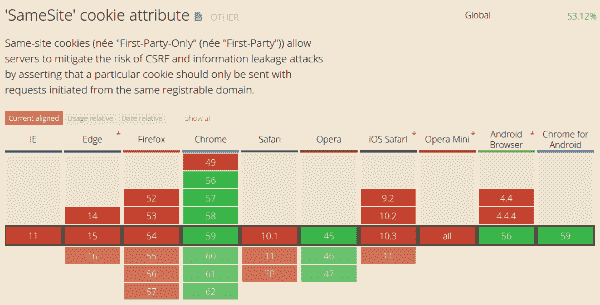

# 使用相同的站点属性将您的 cookies 保护到下一个级别

> 原文:[https://dev . to/damienjubeau/secure-your-cookies-to-the-next-level-with-same site-attribute](https://dev.to/damienjubeau/secure-your-cookies-to-the-next-level-with-samesite-attribute)

*读完我们上一篇关于[如何保护你的饼干](https://blog.dareboost.com/en/2016/12/secure-cookies-secure-httponly-flags/)的文章后，你可能(应该？)已经在使用安全和 HttpOnly 标志。提醒一下,“安全”可防止在不安全的网页上发送 cookie，而“HttpOnly”可防止客户端使用给定的 cookie。
现在是时候为您的 cookies 增加一个属性，让您的网站安全性更上一层楼了！让我们讨论一下 SameSite 指令，它允许防止跨站点请求伪造(CSRF)攻击和跨站点脚本包含(XSSI)。*
[](https://res.cloudinary.com/practicaldev/image/fetch/s--NL-LVlUU--/c_limit%2Cf_auto%2Cfl_progressive%2Cq_auto%2Cw_880/https://blog.dareboost.com/wp-content/uploads/2017/06/Cookies-security.jpg)

### SameSite 属性，用于管理何时应该或不应该发送 cookie

相同站点背后的主要概念类似于 HTTPOnly 和安全特性:获得对 cookie 行为的控制，更准确地说，定义何时不应发送 cookie。SameSite 属性有两个策略，由它的值定义(不区分大小写):严格(默认)和宽松。

#### 同站点 Cookie 的严格策略

只有当请求来自同一个站点时，才会发送定义的 cookie。

```
_Set-Cookie: SID=31d4d96e407aad42; SameSite=Strict_
```

#### 对同站点 Cookie 的宽松策略

Lax 模式为 cookie 的发送增加了一个例外，如果我们不在同一个站点的上下文中:定义的 cookie 也将被发送给使用安全方法(对于 most 是 GET 方法)进行顶级导航的请求(基本上会导致 web 浏览器地址栏中的 URL 发生变化)。
严格模式将阻止任何会话 cookie 被发送到通过跟随外部链接(来自电子邮件、来自搜索引擎结果等)到达的网站。)，导致用户无法登录。(如果我们在 dareboost.com 的[上使用严格的同一个站点，通过点击这个链接，你将不会被检测为登录，无论你是否连接)。
这种行为可能会让最终用户感到困惑，因此您更喜欢使用 Lax 模式。](https://www.dareboost.com/)

```
_Set-Cookie: SID=31d4d96e407aad42; SameSite=Lax_
```

**警告:** Strict 是默认模式，任何输入 Lax 值的错误都会导致 Strict 行为。

### 跨站请求伪造，初始问题

正如 OWASP 所定义的，跨站点请求伪造(CSRF)是一种攻击，它迫使最终用户在他们当前已被认证的 web 应用程序中执行不想要的操作。
让我们考虑一个可预测的网址，比如这个(我们可以假设它会激发用户的电子邮件进行更新):
[https://myapp.com/updateUserEmail?newEmail=myemail@example.com](https://myapp.com/updateUserEmail?newEmail=myemail@example.com)

攻击者成功地让登录的用户执行此请求，并将攻击者的电子邮件作为参数，就可以访问该用户的帐户。社交工程经常被用来欺骗最终用户，让他们触发类似的请求，例如通过包含一个具有该 URL 作为 SRC 属性的图像。(顺便说一下，大多数邮件客户端现在默认屏蔽图片，以限制 CSRF 攻击。
到目前为止，通过检查 Referer 报头和 CSRF 令牌(由服务器提供给 web 浏览器的令牌，将由浏览器在受保护的请求中发送)来防止跨站点请求伪造攻击。如果请求没有嵌入有效的令牌，它将被拒绝)。
使用同一个站点 Cookie(使用严格模式)可以防止 CSRF 攻击，除非——正如规范所指出的——如果攻击者将它的攻击与 XSS 攻击结合起来(不要忘记使用 [CSP](https://blog.dareboost.com/en/2016/08/content-security-policy-secure-your-website/) ！).

### 同地支持

同样的网站要抵御 CSRF 的攻击还有其他的限制，第一个限制是 web 浏览器对同样网站支持的现状。
[](https://res.cloudinary.com/practicaldev/image/fetch/s--mF3vv5Qp--/c_limit%2Cf_auto%2Cfl_progressive%2Cq_auto%2Cw_880/https://blog.dareboost.com/wp-content/uploads/2017/06/caniuse-samesite-support.png) 
即使火狐已经明确表示支持同网站，Chrome 和 Opera 也是目前仅有的处理新指令的浏览器。不支持该属性的 web 浏览器会简单地忽略它，您不必担心任何兼容性问题。

### 功能强大，但不防弹

作为一个结论，如果你的网站为你的用户提供敏感的行为，或者如果你有很大的流量，那么相同的网站肯定是你应该考虑的。你必须注意到，同一个站点，也允许减轻 XSSI(跨站点脚本包含)和时序攻击，如规范所述。请记住，这只是一个额外的安全层:它不可能是你网站抵御这些攻击的唯一手段。这在规范中有明确的详细说明:

> 强烈建议开发人员部署常用的服务器端防御措施(CSRF 令牌，确保“安全”的 HTTP 方法是等幂的，等等)来更全面地降低风险

* * *

*这篇文章最初出现在 [Dareboost](https://www.dareboost.com/) 的博客上。*