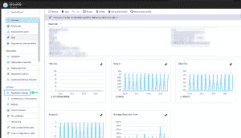
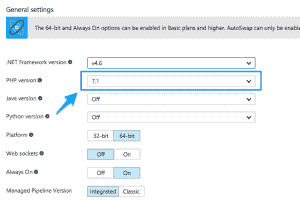
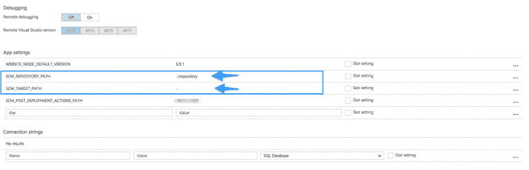
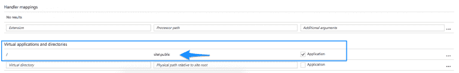
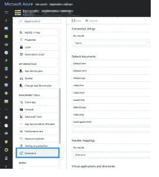
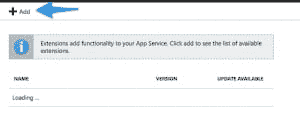
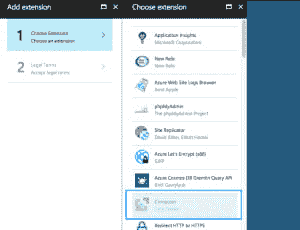
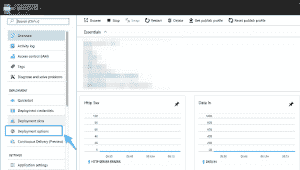
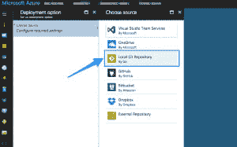

# 如何将 Laravel 5.4 (PHP)应用程序部署到 Microsoft Azure WebApp 服务

> 原文:[https://dev . to/ophasnoname/how-to-deploy-a-laravel-54-PHP-application-to-Microsoft-azure-web app-service](https://dev.to/ophasnoname/how-to-deploy-a-laravel-54-php-application-to-microsoft-azure-webapp-service)

你肯定注意到了，只是有一点沉默。
这主要是因为我的雇主发生了变化，在一家能源公司工作了 20 年后，我离开了一家规模较小的德国“初创公司( [ZENNER IoT Solutions](https://zenner-iot.com) ),这会花费我一些时间(这对我来说完全没问题！)我们做什么？构建一个伟大的物联网平台！

在那里我们很乐意参与微软的 BizSpark 计划，
这意味着一些资源，比如测试微软的 Azure 云。
现在，我的任务是将基于 Laravel 5.4 fFramework 的 PHP 应用程序引入微软的 web 应用程序。说到托管，微软的 WebApps 是他们的 PaaS 产品..惊喜:网络应用。

WebApps 的基础是一个 iiS 服务器，这使得整个故事比用 PHP 部署到 08/15 Apache 要复杂一些..iiS 更适合微软的语言，如 ASP.NET 等。然而，没有什么是不可能的。下面是一个小故事，讲的是如何将一个 Laravel App 部署到微软 Azure WebApp 服务上(剧透:运行的很好，如果运行的话！).

让我们假设你的应用已经完成，你已经设置了
一个 Azure WebApp(这很琐碎)。现在我们必须做一些准备。

## Azure web app 的 PHP 设置

让我们从 WebApp 的新 PHP 版本开始。幸运的是，微软支持 PHP 7.1，我们现在也可以在应用程序设置中选择 PHP 7.1。

[T2】](https://res.cloudinary.com/practicaldev/image/fetch/s--FXnRSpr2--/c_limit%2Cf_auto%2Cfl_progressive%2Cq_auto%2Cw_880/https://thepracticaldev.s3.amazonaws.com/i/14agxl0heta4xiq6i7js.png)

[T2】](https://res.cloudinary.com/practicaldev/image/fetch/s--O1TV0rIZ--/c_limit%2Cf_auto%2Cfl_progressive%2Cq_auto%2Cw_880/https://thepracticaldev.s3.amazonaws.com/i/v24asmvj1ev7n6ow0452.png)

## 为 Laravel 配置 Azure WebApp

在同一页面上，这里有一些我们必须设置的变量，这样 Azure 才能很好地与 Laravel 配合。

-SCM_REPOSITORY_PATH 到:..\存储库
-SCM_TARGET_PATH 到:..

[T2】](https://res.cloudinary.com/practicaldev/image/fetch/s--QZFzqr67--/c_limit%2Cf_auto%2Cfl_progressive%2Cq_auto%2Cw_880/https://thepracticaldev.s3.amazonaws.com/i/ibc5vqvb3q9eq7b2vb5k.png)

现在是时候改变我们网站的入口点了，Azure 的默认是“/site/index.html”，但是 Laravel 想要的是:“site/public”。但是，嘿，我们也可以在同一个页面上这样做。

[T2】](https://res.cloudinary.com/practicaldev/image/fetch/s--z-neKJ54--/c_limit%2Cf_auto%2Cfl_progressive%2Cq_auto%2Cw_880/https://thepracticaldev.s3.amazonaws.com/i/jjwxfpqttjm2331tmwzi.png)

阿帕奇的对等物。htaccess 是 iiS 的 web.config 文件，幸运的是 Laravel 附带了一个默认文件，我们可以在应用程序中使用它。所以我们没有工作。

## web app 的 Composer 扩展

现在设置合适了，让我们的生活更轻松的是一个扩展，您可以简单地激活它，这样您就可以确保在部署期间执行 composer，而不必手动执行。

[T2】](https://res.cloudinary.com/practicaldev/image/fetch/s--44JY9paX--/c_limit%2Cf_auto%2Cfl_progressive%2Cq_auto%2Cw_880/https://thepracticaldev.s3.amazonaws.com/i/1n55iugj6f74ruulegph.png)

[T2】](https://res.cloudinary.com/practicaldev/image/fetch/s--A20fR19k--/c_limit%2Cf_auto%2Cfl_progressive%2Cq_auto%2Cw_880/https://thepracticaldev.s3.amazonaws.com/i/uyib7wczed49e4esdryk.png)

[T2】](https://res.cloudinary.com/practicaldev/image/fetch/s--upFBzMbb--/c_limit%2Cf_auto%2Cfl_progressive%2Cq_auto%2Cw_880/https://thepracticaldev.s3.amazonaws.com/i/yk81s43jf1jfxaxqvamp.png)

## 为我们的 Azure WebApp 部署“管道

最后一步:我们必须想办法把我们的应用程序放到 Azure 上。就个人而言，我更喜欢通过 GIT 进行部署，我们克隆了某种本地存储库，并将我们的代码复制到其中。在短暂的“git push”之后，我们上线了，万岁。

[T2】](https://res.cloudinary.com/practicaldev/image/fetch/s--eQSXuDsY--/c_limit%2Cf_auto%2Cfl_progressive%2Cq_auto%2Cw_880/https://thepracticaldev.s3.amazonaws.com/i/axuno343hrt0n09xsy1y.png)

[T2】](https://res.cloudinary.com/practicaldev/image/fetch/s--yPBJJcff--/c_limit%2Cf_auto%2Cfl_progressive%2Cq_auto%2Cw_880/https://thepracticaldev.s3.amazonaws.com/i/i0rixc5cbx474m7j8686.png)