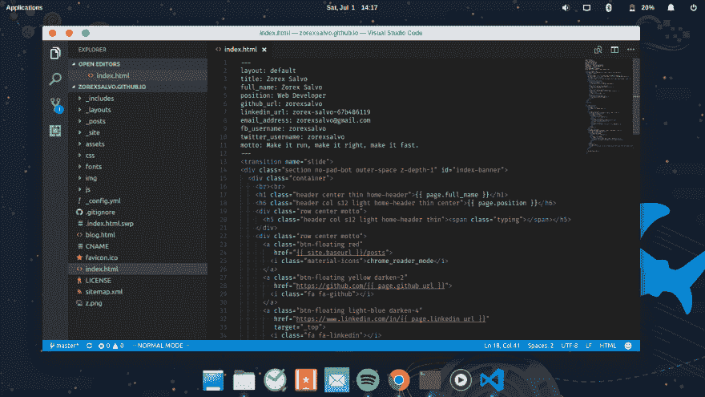
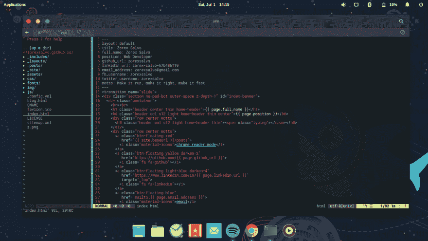

# 我的文字编辑广阔世界之旅

> 原文:[https://dev . to/zorexalvo/my-journey-to-the-vast-world-of-text-editors](https://dev.to/zorexsalvo/my-journey-to-the-vast-world-of-text-editors)

让我们从我开始编程之旅以来使用的文本编辑器开始。

我学习的第一门语言是 C 语言，那是在我大学的第一年。我不记得编辑的名字了。它就像一个命令提示符，有霓虹蓝色的背景，灰色的菜单和状态栏，明亮的绿色字体。但是我不认为它适用于 C 之外的语言。

在大学的第二年，我们的课程中有 Cobol、Java 和 C#。在 Cobol 上，我们使用记事本。在 Java 上，我们使用 Notepad++是因为普通的 Notepad 缺少很多功能，比如撤销、语法高亮等等。然后 MS Visual Studio 来了，一个非常强大的编辑器/IDE，非常强大，每次都让我的笔记本电脑(3GB ram + core 2 duo)达到极限，虽然那时候我一直认为 Visual Studio 是来自天堂的礼物，因为它的功能齐全。拖放、智能感知、图形界面、编译器、调试和许多其他好的开发工具。从第二年到第四年，我一直在使用它。我认为为了更容易的开发，牺牲我的笔记本电脑到那个资源饥渴的编辑器/IDE 是值得的。

实习。我被一家创业公司录取了。启动，通常没有专有软件，因为昂贵的许可证，所以微软技术对他们来说是没有的。我们做的第一件事是安装一个基于 Ubuntu 的 linux 发行版——Lubuntu...Linux 意味着告别我的最爱，Visual Studio*sobbles*。

在我的实习期间，我使用了崇高 2，这也是好的，比 Visual Studio 轻。我花了一段时间才真正适应这个新的文本编辑器，因为它缺少花哨的功能。但是这次文本编辑器的转变对我和我的笔记本电脑都有好处，因为我的笔记本电脑已经在衰退(为我服务了将近 7 年)，不使用 intellisense 让我在编程方面有所提高。

[T2】](https://res.cloudinary.com/practicaldev/image/fetch/s--6ra4vQxd--/c_limit%2Cf_auto%2Cfl_progressive%2Cq_auto%2Cw_880/http://zorexsalvo.com/img/vscode_2.png)

作为专业人士。有一段时间，我继续使用 sublime，但 Visual Studio 代码来了，现在是开源的，所以我很快从 Sublime 转移到 VSCode，我再也没有使用 Sublime。Visual Studio 再次展示了有前途的特性，比如集成终端、git 支持、插件。

[T2】](https://res.cloudinary.com/practicaldev/image/fetch/s--4mxVzm1y--/c_limit%2Cf_auto%2Cfl_progressive%2Cq_auto%2Cw_880/http://zorexsalvo.com/img/vim.png)

我很高兴地使用 VSCode，直到我的鼠标手出现了拉伤。我寻找其他方法来减少我握着鼠标的次数，然后我发现了 Vim。在 Vim 之前，我没有练习正确的打字，这导致了我的手紧张，但是在学习 Vim 时，我必须练习 home 键，因为导航、命令等只依赖于键盘。h，j，k，l 代表上，下，左，右，I 代表插入，v 代表视觉。如果你不知道如何正确地将手指放在键盘上，这些命令真的很难按下。我喜欢 Vim 的地方是它非常轻量级，可以在终端上运行，并且高度可配置。你可以配置它像其他文本编辑器一样工作，因为有很多开源插件。下面是我的最小 vim 配置: [vimrc](https://github.com/zorexsalvo/vimrc) 。

尽管 Vim 的学习曲线很陡，但我还不打算脱离这个文本编辑器。也许我需要在这里停留一段时间。因为这个文本编辑器和它的插件本身就是一个完全不同的旅程。