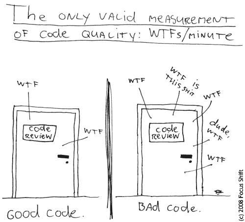

# 为可读性而设计你的代码

> 原文:[https://dev.to/ice_lenor/design-your-code-for-readability](https://dev.to/ice_lenor/design-your-code-for-readability)

[*本文最初发表于我的博客 smartpuffin.com。*T3】](http://smartpuffin.com/design-for-readability/)

那么，你一般是怎么编码的呢？

你有一个任务:把这个东西加到那个地方。你做的第一件事——你找到“那个地方”在哪里，如何得到“这个东西”。要做到这一点，你需要阅读代码。每当你需要做某事时，阅读就会发生，不是吗？如果有些东西不工作，或者你需要优化它，或者添加一个更小的东西，你在代码中搜索位置并再次读取它。再一次。

开发人员阅读代码的次数比编写代码的次数多得多[1]。即使你从头开始写一个全新的东西，你仍然会回到相对“老”的代码部分去修改它们。虽然开始时你记得关于你的代码的一切，但过一段时间后你开始忘记。在修改一段代码之前，你开始阅读越来越多的内容。然后另一个开发人员来帮助你，或者做他们自己的事情，他们也读你的代码。

在一个大公司里，成千上万的开发人员会阅读你的代码，并随着时间的推移修改它。

* * *

" " " " " " "
这就是为什么写可读的代码是如此重要的原因。我怎么强调都不为过。

我个人认为，这是年轻开发人员应该学习的第一件事。这似乎是显而易见的，但在实践中，并不是每个人都注意编写可读的代码。

“可读性”是一个非常广泛的概念。让我列出一些我自己包括在里面的东西。

[T2】](https://res.cloudinary.com/practicaldev/image/fetch/s--xrA-Phpp--/c_limit%2Cf_auto%2Cfl_progressive%2Cq_auto%2Cw_880/https://blog.codinghorror.com/conteimg/uploads/2009/02/6a0120a85dcdae970b012877707a45970c-pi.png)

# 避开巧妙的诡计和晦涩的特征

您刚刚在一本 Perl 书中读到，如果一个显式的`return`语句丢失，函数将返回最后一个语句的结果。

太棒了。

它节省了你输入回报的时间，从而提高了你的速度。现在每次都可以用！

你写这个。

```
sub do_something_important {
  # ... some code here
  if ($condition) {
    @array = some_function(@array);
  } else {
     another_function(@array);
  }
} 
```

现在，你的新同事正在阅读这段代码。他们有 10 年使用 Java 和 C++的经验，但对 Perl 的经验不多。他们很可能认为这个函数不返回任何东西，对吗？在 Java 中，你必须显式地返回值。或者，即使他们知道 Perl 返回最后一个值，他们也会认为如果没有人真正关心键入`return`，这并不重要，返回值也不会在任何地方赋值。

所以，你的同事在函数的末尾添加了一条语句。突然页面停止加载。
你的同事花了一些时间调试和搜索，但最终明白了问题所在。嗯，这位同事想，我会在我的陈述后面加一个。但是我应该回报什么呢？
if 的主体相当清晰，它返回`@array`。但是 else 块中返回的是什么呢？他们去了`another_function`，但是里面也没有任何返回声明...会是数字吗？一根绳子？是`@array`还是其他什么阵？

不打回单为你节省了 20 秒。但是你的同事会多花多少时间呢？

*剧透:我就是这个不幸的同事，我花了不少钱。*

我有更多的例子，当我试着去读它们的时候，它们让我震惊。

```
unless (a1 && b1) {
  if (!a2 || b2) {
     # ...
  }
} 
```

或者这个。这只是黑色的 Perl 魔法，不是吗？

```
$hash_ref->{"some_name_$hash_ref->{some_other_name}"} = 1; 
```

# 使用常数

```
if (value == 605 || value == 606 || value == 8000) {
  // ...
} 
```

这些数字是什么意思？是什么让它们在世界上所有其他整数中如此特别，从`-2147483648`到`2147483647`甚至更远？

为什么只有那三个？如果我在主列表中添加了一个新项目，我应该把它添加到那个列表中吗？

如果我应该有，但我没有偶然发现这个列表，我应该如何找到它？

当然，这段代码的问题甚至更深。如果我没有添加一个新的数字，这是否意味着我们在应用程序中显示不一致的信息？我们损害了客户的体验吗？

# 有意义的命名

名称应该是描述性的。它们不应该为了减少打字而被缩短。再说一次，你读的比写的多，所以最终你会节省时间让它们可读。`ProcessWordMatrix`比`Run`好。`SetEmptyToFullRatio`比`SetRatio`好。

# 撰写有用的评论

这伴随着命名。一个名字只能有这么长，但是向读者解释*你为什么*写这段代码是非常重要的。

有些人提出的论点是，评论很快变得无关紧要，所以最好不要有。但是你应该把注释当作代码的一部分，它们必须是最新的，和代码本身一样好。评论必须有助于读者，而不是混淆他们。如果你修改代码，不要忘记修改注释！

评论不是为了说“对不起，我知道这段代码不好”。它们表示“由于法律原因，我们应该显示这个消息”，或者“这是字体的基类”。

# 短功能，小模块

根据我的经验，我见过像`40000`行那么大的文件。*四万*。我想我会避免在这里贴例子:)。

40000 行大约是*魔戒*书的长度。你不可能阅读和理解这么长的一段代码。毕竟，你只是一个人。

将代码分成小段有助于您浏览代码，理解模块的每一部分是做什么的，并方便地添加新内容。

一个显而易见的建议是:每一个函数都应该有一个明确的目的，并反映在名字中。您应该能够快速滚动以查看名称和描述。我的意思是:没有 2000 行的函数。我的隧道综合症不允许我滚动那么久。

这同样适用于每个模块、类、包和任何其他代码单元。

# 清理未使用的代码

代码中有一个函数，它似乎做了一些有用的事情。它被调用，计算一些东西，结果被赋给一个变量。但是该变量从未被使用过。或者是？这个函数是否有一些你不知道的副作用，因而必须被调用？或者有人只是忘记了它，现在它就像*飞行的荷兰人*一样，毫无目的地在无尽的代码水域中游荡？人们花时间阅读它，偶尔修改和支持它，但它已经死了。

悲伤的故事，我知道。

# 结论

如果你不在乎你的代码是否可读，会发生什么？好吧，明显的短期问题是有人会花更多的时间阅读你的代码。好像没什么大不了的，对吧？但是如果他们不完全理解你的代码，因为它是模糊和棘手的，他们可能会用一个 bug 来实现他们的功能。他们可能会破解你的代码。他们会浪费一整个晚上来调试。一段时间后，其他人会浪费另一个晚上。然后有人会浪费一个上午，他们的一整天就毁了。

这一切在大公司里尤其重要。它有各种经验的人，比如 10 年的 Java 经验，20 年的 C++经验，或者大学毕业没有编程经验的人。我们需要他们快速加入，立即开始编码并带来价值。当然，在修改代码之前，他们需要阅读代码。如果代码可读性不够，他们会比可读性更好的代码花费更多的时间来添加新功能。对于公司来说，这意味着金钱。

下一次，当你完成编码，但在你按下它之前:停下来一会儿，看看你的代码。设身处地为他人着想。可读性强吗？初级开发者能看懂吗？一年后你能理解吗？如果没有，那就把它做得更好，再试一次！当然，这需要一些时间。但是其他开发者要花更多的时间来阅读它。你在向他们借。这不公平。"""""" ""

* * *

[1]“花在阅读和写作上的时间比远远超过 10 比 1”，罗伯特·c·马丁在《干净的代码》一书中说道。我倾向于同意，虽然我没有确切的数字。

* * *

[*本文最初发表于我的博客 smartpuffin.com。*T3】](http://smartpuffin.com/design-for-readability/)