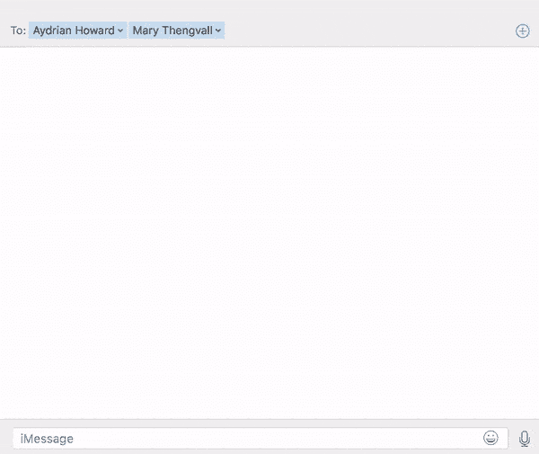

# 几乎在任何地方都使用松弛的表情符号

> 原文：<https://dev.to/sparkpost/using-slack-emojis-almost-everywhere>

现代工作场所中的任何人可能都熟悉像 [Slack](https://slack.com/) 这样的工具，这是一个面向团队的聊天平台，用于完成工作。我最喜欢的功能之一是表情符号快捷方式，它允许你简单地输入`:emoji-name:`来插入相应的表情符号。这使得添加情感变得非常容易，而不需要寻找你想到的特定表情符号。每天在 Slack 中生活几个小时后，我发现自己在其他应用程序中尝试了这个快捷方式，但令人失望的是，它不起作用。我一直在关注这个第一世界问题的解决方案，并且最终找到了一个！

## 但如何？ðŸ "

在我们上次的公司假日聚会上，[艾德里安](https://twitter.com/aydrianh)提到他最近在他的 iPhone 上添加了一个自动纠正匹配功能，用`¯\_(ツ)_/¯`取代了`shrug`。我喜欢这个想法，所以当我回家后，我把所有我喜欢的 Slack 表情符号快捷方式添加到我的 Mac 自动更正功能中。

要在 Mac 上这样做，请前往`System Preferences > Keyboard > Text`，然后添加表情符号快捷方式。对于 iPhone 来说，这是相同的过程，见`Settings > General > Keyboard > Text Replacement`。就这么简单！这是我最常用的表情符号列表。

| 捷径 | 绘文字 |
| --- | --- |
| :_1: | 👎 |
| 👍 | ' ' |
| 😊 | 您的 |
| :哭 _:_ | ðÿ˜¢ |
| :眼球转动: | ðÿ™„ |
| :鬼脸: | 他是谁 |
| 😯 | 😠|
| 😂 | 😂 |
| 💋 | ðÿ˜˜ |
| 😷 | ðÿ˜· |
| :金钱: | "她" |
| 🐒 | ðÿ™ˆ |
| :呆子: | 他说 |
| :当事人: | 她在哪里 |
| :和平: | 哦，天啊 |
| :平面向下: | 🛠|
| :平面向上: | 她是谁 |
| :平面: | 哦，天啊 |
| 💩 | 她吗 |
| :耸肩: | `¯\_(ツ)_/¯` |
| :生病: | ðÿ˜· |
| :睡眠: | ðÿ˜´ |
| 🤔 | 她是谁 |
| 👋 | “”选项卡 |

## 但是这有用吗

我对它的工作方式很满意。请查看实际情况。🎉

[T2】](https://res.cloudinary.com/practicaldev/image/fetch/s--xJF_pUUs--/c_limit%2Cf_auto%2Cfl_progressive%2Cq_66%2Cw_880/https://media.sparkpost.com/uploads/2017/06/emoji.gif)

希望这个技巧能帮助你在任何地方保持你的表情技能。有时你会想使用一个你没有添加快捷键的表情符号，尽管ðÿ˜ÿ，你可以用键盘快捷键`ctrl + cmd + space`ðÿž‰让你的表情符号保持高速运转

## 更爱表情符号

### 表情符号在你的代码ðÿ–

虽然这可能不是最好的主意，但是在你的代码和评论中使用表情符号是可能的。更实际的是，如果你像我一样，喜欢在代码编辑器中写作，能够轻松地添加表情符号是一个很好的功能(我实际上正在用它来写这篇博客——get ' meta)。有很多插件可以帮助解决这个问题。以下是我听到的一些好消息:

*   Atom: [自动完成+表情符号建议](https://github.com/atom/autocomplete-emojis)
*   崇高文字 3: [GithubEmoji](https://github.com/akatopo/GithubEmoji)
*   JetBrains: [表情符号支持插件](https://plugins.jetbrains.com/plugin/9174-emoji-support-plugin)

### 表情符号作为你的代号ðÿ˜

在稍微有点异想天开的方面，有一个名为 [Emojicode](http://www.emojicode.org/) 的开源项目，这是一种完全基于表情符号的语言。你绝对应该[试一试](http://www.emojicode.org/docs/guides/install.html)。

请务必评论或发 [tweet](http://twitter.com/sparkpost) 给我们你最喜欢的 slack 表情符号。我总是在寻找新花样！

附注:在 SparkPost，我们喜欢所有松弛的东西——如果你感兴趣，可以看看科尔的帖子:

*   [我们对松弛机器人和生产力的痴迷](https://www.sparkpost.com/blog/slack-bots-productivity/)
*   [我们如何在 SparkPost 使用机器人](https://www.sparkpost.com/blog/using-slack-bots-sparkpost/)

几乎到处使用松弛表情符号的帖子首先出现在[的 SparkPost](https://www.sparkpost.com) 上。