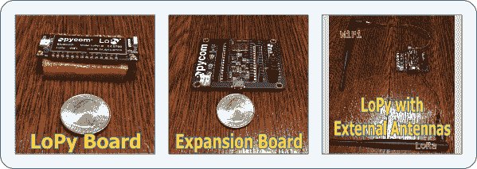

# LoPy 微控制器综述

> 原文：<https://dev.to/kenwalger/a-review-of-the-lopy-microcontroller>

为了跟上微控制器的发展，我最近挑选了一款支持 MicroPython 的新设备 LoPy。就像曾经流行的[node MCU ESP8266](https://www.amazon.com/gp/product/B071RNQPHV/ref=as_li_tl?ie=UTF8&camp=1789&creative=9325&creativeASIN=B071RNQPHV&linkCode=as2&tag=kenwalgersite-20&linkId=3e6a21f0e19073f53a43d9be70d6e4f2)一样，它能够利用许多不同的组件和小工具。然而，LoPy 安装了 MicroPython，所以用 Python 写项目时[刷新设备](https://www.kenwalger.com/blog/iot/micropython-and-nodemcu-esp8266/)是不必要的。

LoPy [板](https://www.amazon.com/gp/product/B06W9GBL2W/ref=as_li_tl?ie=UTF8&camp=1789&creative=9325&creativeASIN=B06W9GBL2W&linkCode=as2&tag=kenwalgersite-20&linkId=11f52ad3f601e4e50c7a7799699da948)  由总部位于英国的 [PyCom](https://www.pycom.io/) 生产，于 2016 年底发布。它比 NodeMCU 更强大，功能更丰富，而 node MCU 会推高 ESP8266 板的价格。它还需要使用一个[扩展板](https://www.amazon.com/gp/product/B01HFASA8G/ref=as_li_tl?ie=UTF8&camp=1789&creative=9325&creativeASIN=B01HFASA8G&linkCode=as2&tag=kenwalgersite-20&linkId=82797a5f1df24e116bce3e53b2934c04)  来构建项目。好吧，requires 可能不完全准确，强烈推荐可能更好。幸运的是，扩展板也可以与 PyCom 的其他产品一起使用。

### LoPy 规格

LoPy 配有 512kB 的 RAM，而 ESP8266 配有 160kB 的 RAM。它还可以处理多达四倍的闪存(4MB)，并使用 Espressif ESP32 芯片组。所有这些都为更大的物联网项目开辟了道路。LoPy 的一个非常酷和有趣的功能是除了其他无线电系统之外还增加了一个 LoRa 无线电频率系统

这块小板子上有三个不同的无线电系统。

*   劳拉
*   WiFi (802.11 兆字节/克/兆字节/秒，16 兆字节/秒)
*   蓝牙，传统蓝牙和低能耗蓝牙(BLE)

设备接受，事实上，在 LoRa 需要使用外部天线的情况下，有一个 [WiFi 天线](https://www.amazon.com/gp/product/B01KJS6C1I/ref=as_li_tl?ie=UTF8&camp=1789&creative=9325&creativeASIN=B01KJS6C1I&linkCode=as2&tag=kenwalgersite-20&linkId=5b38cb9d1829834bab62a6f91afece95)  和一个 [LoRa 天线](https://www.amazon.com/gp/product/B06X6CRVKX/ref=as_li_tl?ie=UTF8&camp=1789&creative=9325&creativeASIN=B06X6CRVKX&linkCode=as2&tag=kenwalgersite-20&linkId=838f67163e4b98867fd14c3183290c40)  的连接器。外部天线的使用产生了一些令人印象深刻的作用距离。对于 WiFi，报告的范围是 1 公里，对于 LoRa，在作为网络节点的完美条件下，范围被指定为 40 公里。

[T2】](https://www.kenwalger.com/blog/wp-content/uploads/2017/06/lopy-board.png)

它支持多种安全和散列/加密方法，如 [TLS/SSL](https://www.kenwalger.com/blog/iot/iot-security-ssltls/) 。对于电源，它需要 3.3V - 5.5V 的输入，使用扩展板可以通过 USB 连接轻松连接到电源。此外，它还允许连接一个[电池](https://www.amazon.com/gp/product/B00Q5RFA8E/ref=as_li_tl?ie=UTF8&camp=1789&creative=9325&creativeASIN=B00Q5RFA8E&linkCode=as2&tag=kenwalgersite-20&linkId=a42b74fc6c12a85365dab865c422251a)  来为远离 USB 连接的计算机的设备供电。

### 劳拉

我假设大多数人对 WiFi 和蓝牙技术都很熟悉。我还假设大多数人都不熟悉 LoRa，所以让我们花一点时间来讨论它。

总的来说，LoRa 被设计为称为低功耗无线广域网(LoRaWAN)的中等范围无线网络的一部分。LoRaWAN 的重点是为物联网设备提供一个标准的无缝通信系统，以便在覆盖大区域的物联网设备之间进行通信。在 LoRaWAN 网络中，数据以数字方式从一个节点发送到相邻节点。如果该节点是**而不是**数据的最终目的地，它将继续转发，直到到达最终目的地。这个最终目的地通常是连接到互联网的网关，允许全球范围内的访问。

谈到网络接入，我们大多数发达国家的人都习惯于非常高的速度。例如，我刚刚测试了我的网速，下载速度刚刚超过 48 Mbps，上传速度为 6 Mbps。洛拉万只能梦想这些速度。LoRaWAN 的最大速度大约是 50 Kbps，是的，这是 K。在慢速端，低于 0.5 Kbps 是常见的。乍一看，这可能会让你不寒而栗，但说真的，物联网设备通常会发送哪些类型的数据？大多数应用程序正在发送基本的传感器数据，而不是流式视频或音频。

### LoPy LoRa 设置

正如我们大多数人痛苦地意识到的那样，当涉及到无线电波等事物的管理时，有全球性的力量在起作用。这同样适用于 LoRa 的工作频率。

| 地区 | 频率单位为 MHz |
| 北美、南美、澳大利亚和新西兰 | 915 兆赫 |
| 欧洲 | 868 兆赫 |

您需要配置 LoPy 以使用正确的频率。这是通过选择国家更新固件来完成的。幸运的是，这些频率和设备属于 ISM 频段的低功率发射机类别，不需要获得许可。

### 包裹

这些特性、电源要求和无线电功能使 LoPy 成为一款非常有趣的物联网设备。尤其是对于那些希望能够利用 Python 风格来构建项目的人来说。事实上，LoPy 是网状网络中节点的绝佳候选。我将在以后的文章中讨论网状网络的概念。

我希望这个对 LoPy 的简要概述已经展示了一些有趣的特征。或许它将拓展您的物联网项目的可能性。使用 LoRaWAN 网络覆盖长距离通信的能力特别吸引人。

* * *

在 Twitter [@kenwalger](https://www.twitter.com/kenwalger) 上关注我，获取我在 MicroPython 和 IoT 上发布的最新消息，让我知道你正在用 MicroPython 构建什么。如果你喜欢这篇文章，或者有问题，请在下面留下评论。或者在我的[博客](https://www.kenwalger.com/blog)上看到原文。