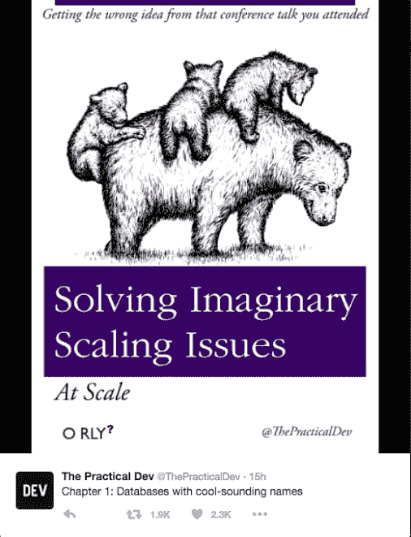

# 软件的七大致命浪费

> 原文:[https://dev.to/jezhalford/softwares-seven-deadly-wastes](https://dev.to/jezhalford/softwares-seven-deadly-wastes)

有七件事会让你的软件团队慢下来。学会克服每一个障碍是更快交付的关键。
七种浪费来自精益制造的原则，这一理念起源于 20 世纪初的日本工业。这似乎离今天的软件行业还有很长的路要走，但是这些经验同样适用于现代软件开发。通过消除流程中的七种浪费，你很快就会发现你的交货时间缩短了。
我们来看看他们每一个人。

## 运输

[T2】](https://res.cloudinary.com/practicaldev/image/fetch/s--2bILYMj---/c_limit%2Cf_auto%2Cfl_progressive%2Cq_auto%2Cw_880/https://cdn-images-1.medium.com/max/2000/0%2Aw_r_m-91ppJ4Nlhr.jpg)

这是材料从一个地方到另一个地方的移动。不难看出这是如何降低制造速度的——一个分设在两个地点的工厂显然难以运营——但在软件运输中，浪费通常更难发现。考虑团队之间的交接。如果您的开发人员必须将工作传递给一个测试团队(或个人)，然后它转移到另一个人的接受或签署的责任，然后再次发布，您就有了运输浪费。减少运输浪费可以像将测试人员与开发人员配对一样简单，但是建立持续集成(CI)系统或持续交付(CD)管道也是很好的解决方案。

## 盘点

这是未交付的东西塞满了生产线。那些已经开始但被更高优先级的工作遗留下来的特性被认为是库存，就像那些技术上已经完成但还没有交付给客户的特性一样。随身携带这些东西会占用大脑空间，混淆画面，降低团队的工作效率。如果你的分支策略意味着你有很多未合并的分支，这可能是一个特别大的问题。减少库存最简单的方法就是同意在你完成其他事情之前不要开始做事。每一个功能都应该从概念到交付有一个平稳的过程，而不是在这个过程中停滞不前。在看板上想象你的工作是一个很好的方法，可以看到你的库存在哪里，并帮助减少库存。

## 运动

运动是人们围绕手头工作的运动。这可能很简单，就像必须到另一层楼去找会议室，或者在办公桌轮用环境中寻找空间。它也可以更抽象——由于不得不频繁切换任务，或者处理来自其他人和问题的持续干扰而导致的延迟。运动通常是由于携带过多的存货造成的，所以上面的许多步骤都有助于减少运动。考虑物理环境，同意固定的会议而不是临时的中断也是如此。

## 等待

[T2】](https://res.cloudinary.com/practicaldev/image/fetch/s--1f3aA_KQ--/c_limit%2Cf_auto%2Cfl_progressive%2Cq_auto%2Cw_880/https://cdn-images-1.medium.com/max/1350/0%2Addv9HPmGuUQKSygb.jpg)

很简单，等待就是等待延误。等待一个产品问题的答案，等待一个外部系统准备好，或者等待另一个团队完成他们的工作，这些都会减慢这个过程。你可以通过以下方式减少等待:小心不要在功能被充分理解之前启动它，以及确保任何外部团队或个人在他们的时间表中有一些空闲，以便他们在需要的时候是空闲的。

## 过度加工

在制造过程中，这广义上是指工作过度——制造不必要的细微公差或抛光将隐藏在最终产品中的东西。在软件中，这符合 YAGNI 原则(“你不会需要它”)。这指的是为想象中的规模水平编码、构建无用的缓存或者为一个简单产品的架构而苦恼。倾向于频繁发布的团队精神是你对抗这种镀金的最好武器，但是必须注意在交付的紧迫性和做好工作之间取得平衡。

[T2】](https://res.cloudinary.com/practicaldev/image/fetch/s--kuG0iI6e--/c_limit%2Cf_auto%2Cfl_progressive%2Cq_auto%2Cw_880/https://cdn-images-1.medium.com/max/1350/0%2AbN2ur4p7pUXKPQ8K.png)

## 生产过剩

简单来说，这是在构建无用的功能。一个经常流传的数字是，大约 64%的构建软件特性很少或从不使用。这来自 2002 年的一项有限研究，因此整个行业的实际数字可能会有所不同。然而，建造没人用的东西的荒谬之处并不难理解。谨慎的产品所有权和良好的用户反馈有助于解决这个问题。

## 缺陷

有一个关于一家制造汽油割草机的公司的老故事。如果割草机离开生产线后第一次没有启动，他们就把它当作废品扔掉。花时间修复缺陷对他们来说没有经济意义。

软件也许没有那么千篇一律，但是在开发过程中追踪 bug 肯定会浪费时间。自动化测试是解决这个问题的好办法，但是一个好的产品所有者也可以通过确保需求在第一时间被理解来减少缺陷。

* * *

这七种浪费在不同的团队中会有不同的表现，你减少它们的方式会因你的情况而异。然而，记住它们是你寻求更快交付的一个非常有用的工具。

* * *

走得更快:加速软件团队的每周提示。在[tinyletter.com/goingfaster](http://tinyletter.com/goingfaster)T3】订阅

Jez Halford 是一名软件开发顾问，帮助团队更频繁地交付更好的软件。访问[jezhalford.com](https://jezhalford.com)了解更多信息。