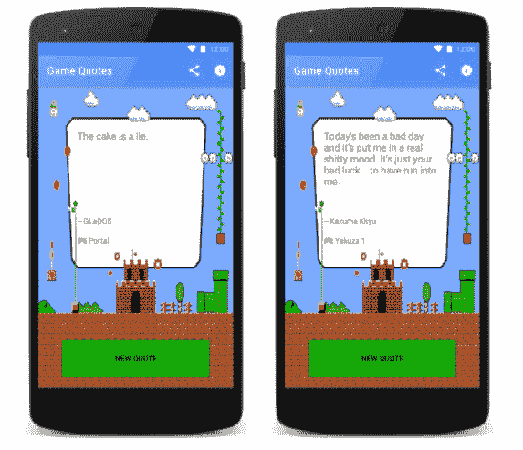
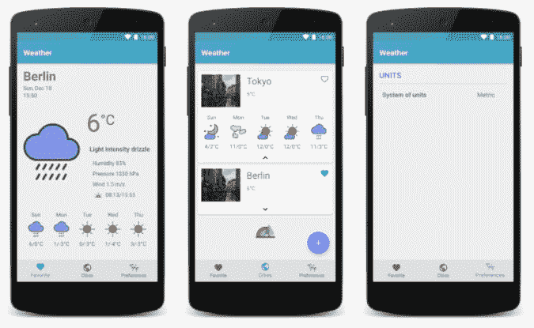
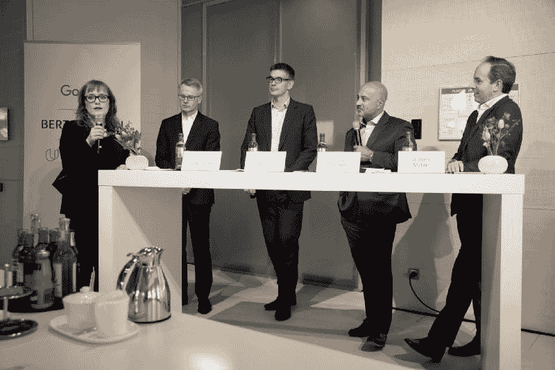
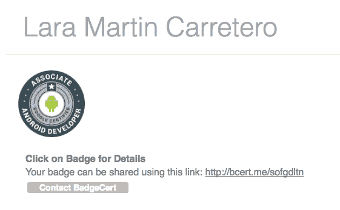

# 安卓的一年

> 原文:[https://dev.to/lariki/a-year-of-android](https://dev.to/lariki/a-year-of-android)

我叫 Lara Martin，我写这个系列来记录我学习 Android 的历程。在我的第一篇文章中，我写了我如何从生物转向科技，如何迈出编程的第一步，以及如何找到我的第一份工作，成为一名 QA 测试员。

在这里，我将通过强调我如何开始学习 Android，我如何提高我的技能，以及我如何成为一名 Android 开发人员来继续这个故事。

在这篇文章中，你会发现在我试图掌握这项技术的第一年里，我为学习 Android 开发所做的一切。希望能帮你实现目标！

请注意，我学习 Android 的所有工作都必须在工作时间之外完成，因为我已经有一份全职工作要管理。我花了很多周末和晚上学习，但我仍然不能说我完成了。但是在这篇文章涵盖的时间里，我只是从 QA 过渡到 Android 开发人员的角色。

# 安卓学习堵塞

这一切都始于 2016 年 3 月，当时我开始参加由柏林[女性技术制造商](http://wtmberlin.com/)和[柏林机器人开发者小组](http://berlindroid.de/)组织的机器人研究大会。

在 4 个月的时间里，我们学生参加了 Udacity 的免费在线 [Android 初学者开发](https://www.udacity.com/course/android-development-for-beginners--ud837)课程，同时我们每月与来自当地 Android 社区的志愿者教练进行两次 T2 问答。

最后，我们制作了一个小应用程序，并将其展示给团队的其他成员。我的应用被评为最佳应用之一，我还获得了安卓基础纳米学位奖学金。直到最后我才知道这是一个选项——这真是一个惊喜！

[T2】](https://res.cloudinary.com/practicaldev/image/fetch/s--PU8F348Y--/c_limit%2Cf_auto%2Cfl_progressive%2Cq_auto%2Cw_880/https://cdn-images-1.medium.com/max/800/1%2AcJ25UOK5aOQr9PjtCLg0ZA.png)

# Android meetups

在开始安卓学习聚会后不久，我开始参加由 GDG 安卓柏林组织的每月一次的安卓聚会。

我知道开始理解提出的主题需要时间。第一次我几乎什么都没得到，第二次我得到了一点，以此类推。

参加活动有助于我跟上当前的潮流，同时也能学到我以前没有探索过的新东西。另外，成为社区的一员很有趣，让我认识了很多好人。

# 安卓基础纳米度

我继续做 Udacity 的内容，做我通过 Android Study Jam 赢得的 [Android 基础 Nanodegree](https://www.udacity.com/course/android-basics-nanodegree-by-google--nd803) 项目。

在第一个课程中，我学习了基本的视图，如何在布局上排列它们，以及一些简单的用户交互。Nanodegree 项目的下一个课程教我如何管理不同的屏幕、片段和应用导航。接下来还有两门课程，一门解释了网络基础，另一门是 SQLite 数据库。

我必须准备我必须提交的不同项目，这些项目由 Udacity 的评审员进行评估。最大的挑战总是要得到正确的需求。让其他开发人员审查项目很有帮助，因为我可以从他们的建议中学到很多东西。

我在 10 月左右完成了纳米学位项目。

# 会议

2016 年 10 月我去参加了我的第一次科技大会，多亏了我拿到的一张票，但我并没有太享受，因为我是一个人去的，对议题没有太大兴趣。我认为如果事情没有像预期的那样进行，那也没什么，这不应该阻止你去尝试其他的事情。

然而，我很喜欢接下来的会议。我去了汉堡发展节，一个由 GDG 汉堡组织的会议。有一个专门的 Android 轨道，我看到了关于 MVVM，境界，Firebase，虚拟现实，谷歌地图等话题，其中许多是我不会检查的话题。参加会议是了解当前趋势和新事物的好方法。

显然我不能错过柏林电影节！我在活动期间自愿回馈社区，感谢他们在这些活动中付出的辛勤劳动。再说一次，DevFest 是如此有趣！

我期待着参加更多的 DevFest 活动和其他会议，如 droidcon！希望有一天我会参加谷歌 I/o…ðÿ˜

# 宠物项目:天气 App

我想练习我的新技能，每个人都向我推荐了一个宠物项目，在那里我可以尝试新事物。

所以，我创建了一个小天气应用程序，目的是尝试新的库、架构模式和设计思想。

[T2】](https://res.cloudinary.com/practicaldev/image/fetch/s--UBFkzozM--/c_limit%2Cf_auto%2Cfl_progressive%2Cq_auto%2Cw_880/https://cdn-images-1.medium.com/max/800/1%2Ajblc-7zVqCt--myAk0SSRQ.png)

这里有一个 GitHub 回购的链接:[laramartin/Android _ weather](https://github.com/laramartin/android_weather)

# 谷歌增长引擎

不久之后，柏林 Udacity 联系我，让我成为他们新的欧洲奖学金活动的成功故事之一。这段经历对我的旅程很重要，并激励我继续学习。

作为活动的一部分，包括专业的照片拍摄，以及回答谷歌公共关系部门的问题——这后来发表在谷歌增长引擎网站上。此外，在启动奖学金的那天，我在柏林与 Udacity 的一次新闻发布会上发表了讲话，在一次有 100 人参加的活动中，我与另外两名 Udacity 的学生和经理一起发表了讲话。

[T2】](https://res.cloudinary.com/practicaldev/image/fetch/s--AaQr0EN4--/c_limit%2Cf_auto%2Cfl_progressive%2Cq_auto%2Cw_880/https://cdn-images-1.medium.com/max/800/1%2AkzmLLgLXGCQIa4Uhmk4aRg.jpeg)

> 成员[@ women techmakers](https://twitter.com/WomenTechmakers)[@ lariki](https://twitter.com/lariki)正在分享她是如何通过 [@udacity](https://twitter.com/udacity) 进入 Android 开发的——听起来很棒的故事！[pic.twitter.com/dg27mLXR8M](https://t.co/dg27mLXR8M)
> 
> — Tim Messerschmidt (@SeraAndroid) [November 28, 2016](https://twitter.com/SeraAndroid/status/803317186597101568)

# 安卓快速通道和准开发者证书

作为该活动的一部分，我获得了一份 [Android 快速通道](https://www.udacity.com/course/associate-android-developer-fast-track--nd818)奖学金，这样我就可以准备助理 Android 开发人员证书考试了。

我有三个月的时间准备，这包括有机会完成 Android 开发者纳米学位项目的第一批课程中的两门。

课程内容包括更高级的主题，如内容提供者和服务。

2017 年 4 月，我请了一周假去参加考试和面试。他们首先给你 48 小时来修复和添加功能到一个坏的 Android 项目，然后在那之后，你必须通过一个简短的在线面试。我不必为此准备太多，因为我对课程内容记忆犹新。

第一次尝试就通过了测试，拿到了开发者认证。😄

[T2】](https://res.cloudinary.com/practicaldev/image/fetch/s--HyzZHMws--/c_limit%2Cf_auto%2Cfl_progressive%2Cq_auto%2Cw_880/https://cdn-images-1.medium.com/max/800/1%2ACx5CrSfnAHOUthEJ6vbUWg.png)

# 安卓开发者纳米度

获得认证后，我继续进行 Android 开发者纳米学位项目。这个项目不同于基础项目，它有更高级的内容，并以期末项目结束。它需要一些 Android 开发背景和熟悉 Java，并为您开始作为 Android 开发人员工作做准备。

在撰写本文时，我已经完成了这个纳米学位项目的 70%。

# 有导师

导师是指导你的人。导师不应该解决你的问题，也不应该教你；而是引导你学习。

你的导师不需要是你爱的人或者专家。你的导师会让你对自己的进步负责，在你需要的时候给你动力和支持。

我很幸运家里有一个导师。我老公在我卡住的时候辅导我，在我想放弃的时候催我继续学习。

# 还剩下什么

我的团队已经正式表示，他们希望我成为一名 Android 开发人员。因此，我目前正从我的 QA 角色过渡到 Android 开发人员，并做我的第一个编程任务。

我目前的重点是习惯这个新角色。我还想完成 Android Developer Nanodegree 项目，我还想学习很多其他的东西:

*   我的锅
*   Java 语言(一种计算机语言，尤用于创建网站)
*   干净的代码/架构和最佳实践
*   RxJava
*   动画、过渡等。
*   Dagger(以及一般的依赖注入)
*   普通计算机科学

我觉得我永远也学不完。没有最后的时刻你会说你完成了。不是因为我觉得我还是个新手，而是因为我在我的朋友身上看到的就是这样，即使他们有了多年的经验，他们还在继续摆弄新的东西。软件开发人员职业要求你不断学习新事物，跟上技术的发展——这也有助于你更具竞争力，实现持续改进。

# 最终字

我要感谢柏林的女性科技创客们，感谢她们为科技领域的女性提供更多机会所做的一切； *Udacity* 和 *Google* 创造了所有令人惊叹的课程内容；柏林的 Android 社区如此热情；我的团队也给了我机会，让我在努力学习 Android 的过程中晋升到开发人员的角色，并最终成为一名 Android 开发人员。

*[原发于我的媒介博客。](https://medium.com/@laramartin/a-year-of-android-ffba9f3e40b6)T3】*