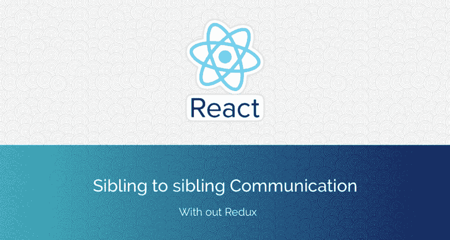
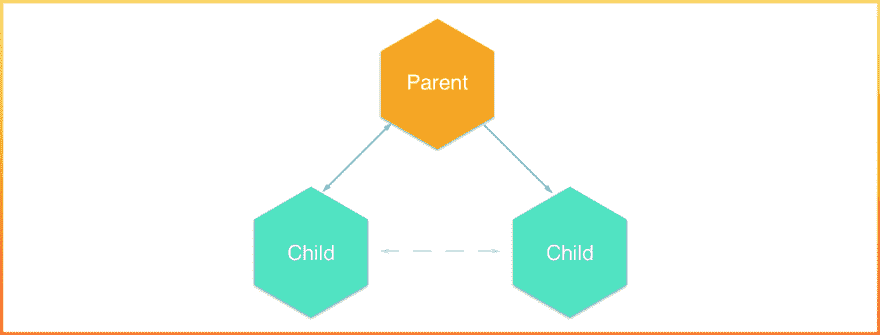
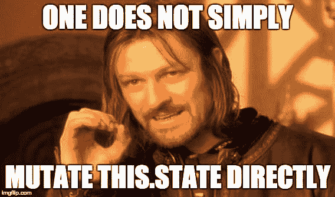

# 兄弟姐妹交流的无冗余策略

> 原文:[https://dev . to/sarathsantoshdamaraju/no-redux-strategy-for-siblings-communication-52ed](https://dev.to/sarathsantoshdamaraju/no-redux-strategy-for-siblings-communication-52ed)

[T2】](https://res.cloudinary.com/practicaldev/image/fetch/s--x1oXAgNE--/c_limit%2Cf_auto%2Cfl_progressive%2Cq_auto%2Cw_880/https://cdn-images-1.medium.com/max/1024/1%2AW_QA-TIucxHOklD0ZUIrZQ.png)

Redux 很棒，但在使用任何框架或库之前，我们也必须了解基础知识，对吗？这就是我在学习 bootstrap 之前所做的，并且用 Redux 和 ReactJs 做了同样的事情。所以，这篇文章是关于仅仅使用 ReactJs 建立基本的通信通道 b/w 兄弟的。

让我们来讨论一下需求，*我的应用程序有一个子组件，它必须与它的兄弟组件*通信。因此，它必须通过一个从**父节点到** **子节点 1** 的回调方法发生，该回调方法将从子节点 1 获取值，并将**将其作为道具传递给另一个子节点**。

很简单，不是吗？

### 数据流

<figure>[](https://res.cloudinary.com/practicaldev/image/fetch/s--Pl8O0XdU--/c_limit%2Cf_auto%2Cfl_progressive%2Cq_auto%2Cw_880/https://cdn-images-1.medium.com/max/1024/0%2A7HiCeD2uqenE8WZ8.png) 

<figcaption>数据通信流程</figcaption>

</figure>

### 流量

Req: **Child1** 有一个输入字段，输入值必须通过父节点发送到 **child2** 组件

### 父组件

首先，**在父**中定义一个回调函数，并将其作为道具发送给子 1

```
constructor(){ super(); this.state= { data : "" } }

formChild1(params) { this.setState({ data : params }) } 
```

我已经设置了一个**状态**变量*数据*，并使用来自 Child1 的回调函数**更新其值，并将状态值发送给 Child2。*为什么使用状态？因为道具是不可变的，将状态作为道具传递总是更好。如果你想传递静态数据，总是使用道具。使用状态传递动态数据。*** 

```
render() { return( \<div\> \<p\>Parent\</p\> \<Child callback={this.formChild1.bind(this)} /\> \<Child2 data={this.state.data} /\> \</div\> ); } 
```

### 子-1

安装道具类型，因为**有反应。PropTypes** 被弃用，React 建议您使用 prop-types。[了解更多](https://facebook.github.io/react/docs/typechecking-with-proptypes.html)

```
npm install prop-types 
```

**将道具类型导入子 1**

```
import PropTypes from 'prop-types'; 
```

定义子组件

```
class Child1 extends Component {

getContent(event) { this.props.callback(event.target.value); }

render() { return ( \<div\> \<p\>Child One\</p\> \<input type="text" onChange={this.getContent.bind(this)} placeholder="Type Something in Child One"/\> \</div\> ); } } 
```

**getContent** 获取输入值***onChange****会通过回调函数*发送给 parent。

为孩子 1 :
定义**道具类型**

```
Child1.protoTypes = { callback : PropTypes.func, } 
```

我们正在对回调函数进行类型检查。

### 子-2

定义一个简单的组件，该组件使用从父发送给它的**属性**值*来呈现*

*标签。* 

```
class Child2 extends Component {

render() { return( \<p\>Child2 : {this.props.data}\</p\> ); }

} 
```

就是这样。我们现在已经*建立了兄弟姐妹之间的沟通渠道*。**和** **如果你有单独的父文件、子文件 1 和子文件 2** ，不要忘记导出子组件。

> 请参考[代码](http://github.com/SarathSantoshDamaraju/reactComponentsTalk/blob/siblingToSibling)

最后，

<figure>[](https://res.cloudinary.com/practicaldev/image/fetch/s--DxY_v4lR--/c_limit%2Cf_auto%2Cfl_progressive%2Cq_auto%2Cw_880/https://cdn-images-1.medium.com/max/568/1%2AFKucqDjCP8gb3lVoBeh8xw.png) 

<figcaption>牢记在心！！！</figcaption>

</figure>

> 感谢您阅读我的帖子。我想在评论中听到你的想法。如果你喜欢这篇文章，请点击💚下面，以便更多的人可以阅读它。

* * *