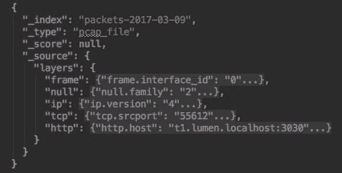
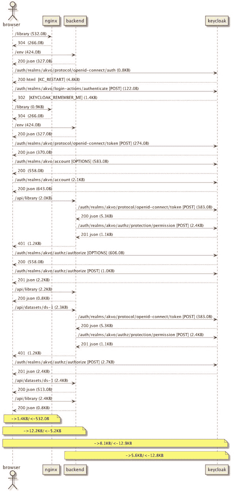

# 记录你的架构:Wireshark，PlantUML 和一个 REPL 来粘合它们。

> 原文:[https://dev . to/danlebrero/documentating-your-architecture-wireshark-plant UML-and-a-repl-to-glue-them-all](https://dev.to/danlebrero/documenting-your-architecture-wireshark-plantuml-and-a-repl-to-glue-them-all)

*本文原载于[我的博客](http://danlebrero.com/2017/04/06/documenting-your-architecture-wireshark-plantuml-and-a-repl/)T3】*

我最近不得不记录一个新系统的评估结果。

该系统的概念验证包括六种可能的配置，每个选项都对系统的体系结构有重大影响。

为了理解这六个方面，我仔细查看了来自服务器和 Chrome DevTools 网络面板的日志，试图将请求和响应以及服务器之间的流量联系起来。

作为文档的一部分，我认为用一些序列图来解释系统不同部分之间的协议是很重要的。

但是当我试图画出序列图时，我意识到眯着眼只能让我抓住选项之间差异的总体感觉，但不足以写下每个选项的正确和准确的描述。

此外，打开我最不讨厌的 UML 工具，花几个小时拖拽盒子，摆弄线条，这种预期的厌倦并没有让我充满喜悦。

考虑到我已经有了六种组合来进行概念验证，难道我不能利用这一点吗？

## 工具

首先，我们需要找出系统组件之间的所有流量。为此我们将使用久负盛名的 [Wireshark](https://www.wireshark.org/) 。

Wireshark 将允许我们捕获任何网络流量，过滤掉任何不必要的内容，此外，它还附带了一个方便的[导出到 json](http://stackoverflow.com/a/40540149) 的功能，以简化输出的解析。

HTTP 请求的一个片段:

[T2】](https://res.cloudinary.com/practicaldev/image/fetch/s--5NGugr1Y--/c_limit%2Cf_auto%2Cfl_progressive%2Cq_auto%2Cw_880/http://danlebrero.cimg/blog/wireshark-json-example.jpg)

其次，我们需要生成 UML 图。为此，我们将使用 [PlantUML](http://plantuml.com) ，它是一个基于文本的 UML DSL，附带有生成图像的库。由于是基于文本的，我们生成 UML 图的问题变成了字符串连接的问题。

最后，我们需要一些胶水将 Wireshark JSON 文件转换成 PlantUML 文本文件。我们将使用 Clojure，但任何图灵完整语言都可以。当然，Clojure REPL 让这项任务变得更加愉快。

## 结果

首先，为了展示一下，让我们看看其中一个图是什么样子的:

[T2】](https://res.cloudinary.com/practicaldev/image/fetch/s--BeBeVdh4--/c_limit%2Cf_auto%2Cfl_progressive%2Cq_auto%2Cw_880/http://danlebrero.cimg/blog/bearer-only-uma-authz.jpg)

这个图需要 40 行 PlantUML，看起来像:

```
browser -> backend: /api/datasets/ds-1 (536.0B)
browser <-- backend: 200 json (0.7KB)
browser -> backend: /api/library (525.0B)
browser <-- backend: 200 json (1.0KB)
note over browser, nginx: ->1.2KB/<-532.0B
note over browser, backend: ->4.4KB/<-5.3KB 
```

<svg width="20px" height="20px" viewBox="0 0 24 24" class="highlight-action crayons-icon highlight-action--fullscreen-on"><title>Enter fullscreen mode</title></svg> <svg width="20px" height="20px" viewBox="0 0 24 24" class="highlight-action crayons-icon highlight-action--fullscreen-off"><title>Exit fullscreen mode</title></svg>

整个 PlantUML 代码在这里是[，代码可以在这里](https://gist.githubusercontent.com/dlebrero/acf5d1ba5156bc10048d006d6f18705c/raw/fb432f56cb7ec043f027d6d3d3373f5b69283987/plantuml.puml)找到[。](https://github.com/dlebrero/wireshark-plantuml)

如果你好奇的话，这个图对应于加载一个[单页面应用](https://en.wikipedia.org/wiki/Single-page_application)，用 [OpenID Connect](https://en.wikipedia.org/wiki/OpenID_Connect) 进行认证，用[用户管理访问](https://en.wikipedia.org/wiki/User-Managed_Access)授权一个 API 端点。

## 好处

使用这三种工具的好处是:

1.  我们能够生成一组准确的图表，让您确信没有遗漏任何东西。假设解析代码中没有错误。
2.  因为这组图是使用相同的代码生成的，所以它们看起来都是一致的，无论是它们包含的数据还是它们的外观。
3.  数据、图表和生成它们的代码都是文本，这意味着可以进行版本控制，并在需要时进行手动检查或调整。
4.  如果我们决定改变图表的任何细节，更新所有的图表将不会花费时间。
5.  也许生成图表的代码可以在其他项目中使用。
6.  图表具有所需的详细程度。例如，在图表中，我们已经删除了图像、css 和 javascript 文件的加载。
7.  您可以向图中添加大量的细节，因为数据捕获甚至有请求/响应，所以您可以解析它们并提取与您的系统相关的信息。
8.  您可以在您最喜欢的 IDE 中以交互方式完成所有操作:

## 弊端

当然也有一些缺点:

1.  我们必须让系统工作，我们必须能够嗅出流量。
2.  数据捕获可能非常庞大，因此在捕获阶段进行一些预过滤可能是必要的。
3.  捕获中可能存在敏感数据。注意安全！

## 更多福利！

最后，但可能是最重要的好处是，我们将一项乏味的任务变成了一项令人愉快的任务。

我从没想过我会这么说，但是...快乐记录！