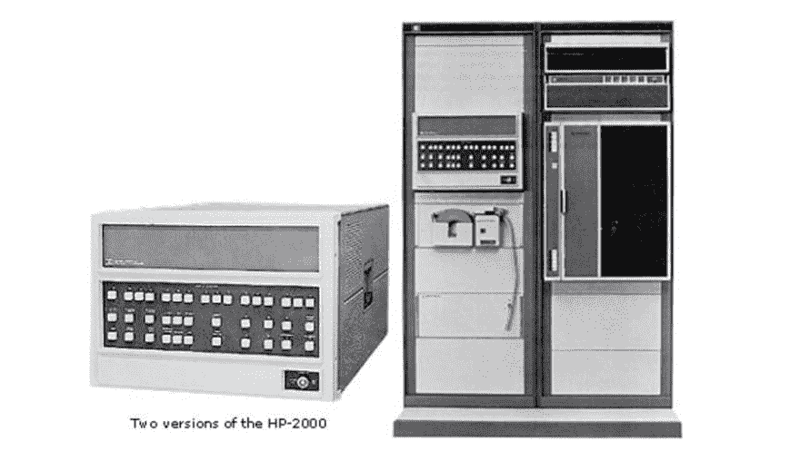
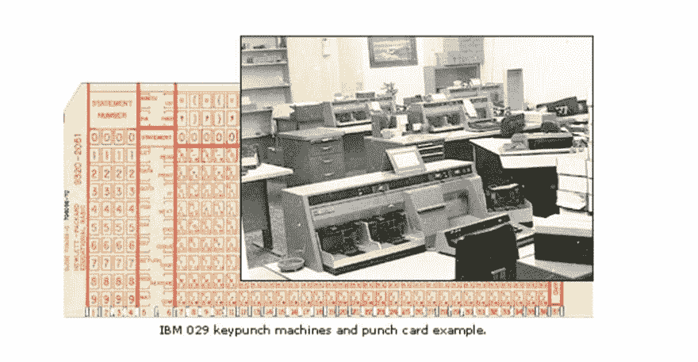
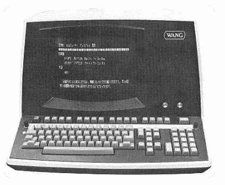

# 从编程中提升出来

> 原文：<https://dev.to/figspville/promoted-out-of-programming>

#### 这一切是如何开始的

这一切都始于 1976 年，我母亲说我应该成为一名律师。我不可能在大学毕业后花时间去法学院。“你应该去商学院”；商学院里没有很多女性，这意味着你毕业后会有工作。嗯。好的，我会去商学院学习金融。毕竟，我在高中时因为速记成绩最高而获得了“速记奖”,而且我喜欢计算数字，非常注重细节…

所以，我在罗德岛选择了一所以商业为专业的小学院。那很无聊，所以一年后我转学到了佐治亚大学(是的，佐治亚雅典的一所非常大的公立学校)。他们有一所声誉很好的商学院，我可以住在学校的宿舍里。在这一点上，我想要不同于金融的东西。UGA 大学把商业和计算机结合起来的课程听起来很不错，所以我成为了商业信息系统专业的学生。

我真的不太懂电脑，去一栋巨大建筑的地下室看电脑有点让人受不了。他们占据了整栋建筑的 10000 或者 20000 平方英尺，我们可以透过大窗户看到我们的工作在其中一台电脑上运行。它看起来像许多带有小表盘和许多经常闪烁的灯的大金属盒——我不知道里面发生了什么。我在那栋大楼里呆了几个小时，几个小时我的鼻子贴在窗户的玻璃上，看着电脑。

我会做我的 COBOL 编程作业，把它写在纸上带到计算机中心，不知怎么的，它被运行来看看它是否工作。

[T2】](https://res.cloudinary.com/practicaldev/image/fetch/s--vwZn0h2c--/c_limit%2Cf_auto%2Cfl_progressive%2Cq_auto%2Cw_880/https://thepracticaldev.s3.amazonaws.com/i/5i9lgbzd6tg4zpp29dzn.png)

#### 我的第一份工作

我毕业于 UGA，受雇于纽约电话公司。我在毕业前几个月得到了这份工作，我的室友非常嫉妒我 17500 美元的起薪。那是一份丰厚的薪水。我参加了一个为信息服务系的大学毕业生准备的项目。现在回想起来，“电话公司”是非常进步的。信息系统部门的负责人是一位女性。她的名声是她很强硬，你不会真的想和她过不去。我不认为我真的见过她。

在这个职位上，我使用输入计算机的穿孔卡片。我正在使用作业控制语言(JCL ),这是一种告诉计算机(一台大型 IBM 大型机)如何在计算机中已启动的所有作业中分配时间和空间资源的代码。这些作业在后台运行，称为批处理作业。代码告诉计算机何时在没有用户交互的情况下运行这些类型的作业。打印作业就是批处理作业的一个例子。我的第一次商务旅行是带着三大箱穿孔卡片去纽约奥尔巴尼的一个公司大楼，那里有一台需要更换 JCL 的电脑。我们三个人去了，每个人都必须保护其中一盒卡片，确保它们不会出故障。我们慢慢地小心地把大约 2 英寸的卡片一次输入电脑。测试花了我们 3 天时间。

[T2】](https://res.cloudinary.com/practicaldev/image/fetch/s--Y8wUnywM--/c_limit%2Cf_auto%2Cfl_progressive%2Cq_auto%2Cw_880/https://thepracticaldev.s3.amazonaws.com/i/ymyr533sa0qena00bpdm.png)

#### 编程学校

6 个月后，我觉得自己并不是真的在编程，不想失去在大学里学到的 COBOL 编程知识，于是和老板进行了一次坦诚的聊天，谈到了自己的计算机编程技能是如何被浪费的。接下来我所知道的就是，我参加了纽约电话训练营的 Cobol 编程项目。那太有趣了；这就像回到了大学，但得到了报酬。我们一群人在 4 个月的时间里每天都去曼哈顿市中心的一个更休闲的建筑学习 Cobol。周五，我们早早出门，这很好，因为是夏天。在那个项目中，我交了一些很好的朋友。事实上，其中一个人把我介绍给了现在是我丈夫的人。

#### 工资编程

在完成 COBOL 学校的学习后，我被安排回到曼哈顿中城的 IS 小组，负责编写非常复杂的工资单系统，为 65，000 多名员工支付工资。我负责计算非传统工人的工资。从事季节性或临时性工作的人。

把程序写在纸上，老板匆匆点头后，我就坐在王银行的终端机前，把程序输入“系统”。一堆这样的终端在桌子上排成一排。这是一个工作的社交场所，但经常会让人分心，因为你和其他人坐在一起编程完全不同的东西。

[T2】](https://res.cloudinary.com/practicaldev/image/fetch/s--v3KN5oH6--/c_limit%2Cf_auto%2Cfl_progressive%2Cq_auto%2Cw_880/https://thepracticaldev.s3.amazonaws.com/i/675lwt6clwa5n4br9fx1.png)

这项工作需要很大的耐心。没有即时的满足感。当我需要对程序进行更改时，我会提交我的更改，然后第二天来看看它进行得如何。如果地板上有一大叠第一页有我名字的纸，我的零钱就不起作用了。你会从最小的错误中得到一个数据转储——丢失逗号，错误的斜线等。实际上有数百页，当我通读这一堆时，常常要花几个小时才能找出哪里出了问题。哦，每个人都知道你犯了一个错误。我会纠正错误，然后再次等到第二天，看看它是否有效。所有的测试都在晚上进行，只是因为实时系统必须在白天运行。早上，如果你来到一个漂亮的四分之一英寸到半英寸的纸堆，你可能是金色的。您知道至少您的语法是正确的，并且希望您试图完成的工作也是有效的。我怀疑今天编写代码的一些人会有当时所需要的耐心。

#### 寻找下一次晋升

我在薪资编程部门转了一圈，学到了不少东西，但两年后，我在寻找晋升的机会。结果，“下一步”是业务分析师。这份工作需要和商务人士一起工作，了解他们对计算机程序的要求。这让我脱离了实际的编程，更多的是倾听和试图理解需求。在接下来的几年里，当我在公司里步步高升时；我离编程越来越远，越来越深入到一般的商业世界。没过多久就不小心溜进了人力资源部。我的技术经验帮助我成为了健康与健身部的主管。医疗主任喜欢有人跟踪信息并报告的想法。我自学了 Dreamweaver，并使用它创建了一份每月健康通讯。与编程原理相同——使用符号而不是文字来格式化和放置文本。这是一份有趣的工作，直到医疗主任退休，在纽约电话/ny NEX/贝尔大西洋/威瑞森工作了 18 年后，我的工作被取消了。

#### 继续前进

作为一名工资表的 Cobol 程序员，帮助我在富士胶片找到了下一份工作。他们需要一个懂工资的人。我理解了后端和前端。作为更大的人力资源系统的一部分，工资系统将得到加强。完美——我了解工资单的前后端，而且我有人力资源经验。我现在是工资和人力资源信息系统(HRIS)经理。我喜欢回到数据和系统工作中。我理解了协同工作的表的概念以及将这些表联系在一起的关键字段。我实现了一个电子时间系统来管理人们的时间。当时，这是一个独特的系统，打卡的人必须扫描他们的手。它被称为生物手部扫描仪，我负责实施，然后对经理和员工进行使用培训。它在新泽西州、乔治亚州和加利福尼亚州的配送中心实施。

我继续了我的工资单和 HRIS 经理的职业生涯，并开始了我在再保险行业的下一份工作。除了一个 excel 电子表格，里面有一列又一列的员工数据之外，根本没有人力资源系统。在看了很多系统之后，我决定使用 NuView 系统。这似乎是一个很好的系统，一个很好的合作公司。该系统得到了实施，但它花了很长时间。就在我认为我已经完成了一个模块的时候，我的人力资源部门决定他们还需要另一个定制。我仍在管理工资单，现在是公司的福利，并试图与软件公司一起完成这个巨大的实施。人力资源部没有人有时间帮忙或测试，所以我只能继续埋头苦干。

很快，这项工作变得太大了，一个更有技术和经验的 HRIS 经理被雇用了。我很高兴摆脱了我的工作，并继续关注工资系统的技术方面以及与供应商系统的集成，但最重要的是，我在管理人员。当我离开那份工作的时候，我不想要工资。管理工资意味着在办公室里庆祝圣诞节和新年。这意味着整天和国税局的审计员坐在一起，微笑着给他们提供蛋糕和咖啡。

我的下一份工作是管理员工福利。一份和优秀的人在一起的好工作。一点也不技术性，但我能够利用我的一些技术经验将一些任务放到网上，如 FSA 注册。

当我写这篇文章的时候，我想知道是谁先出现的——是分析性和逻辑性强的人成为了一名优秀的 COBOL 程序员，还是学会了分析性和逻辑性很强的 COBOL 程序员。无论如何，拥有程序员的技能是我生活中积极的一部分。

时不时地，我会看到一份 COBOL 程序员的工作。工资很高，我想知道我是否能重新获得足够的技能回去。这有点伤感，但逻辑上的我很快就摆脱了这种想法。