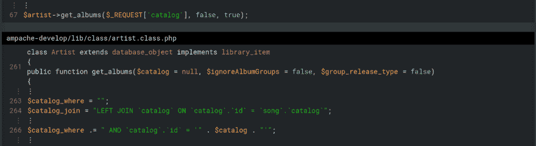

# 黑客攻击开源软件是为了娱乐和非盈利

> 原文：<https://dev.to/fenceposterror/hacking-open-source-software-for-fun-and-non-profit>

*原文章发布于[fence posterror . github . io](https://fenceposterror.github.io/2017/06/16/Hacking-For-Fun-And-Non-Profit.html)T3】*

安全研究员同事 [@addelindh](https://twitter.com/addelindh) 的[博客文章](http://haxx.ml/post/137946990286/hacking-open-source-software-for-fun-and)的标题是为了乐趣和非盈利目的而入侵开源软件。测试开源软件(OSS)在我的任务清单上已经有一段时间了，因为我确信应该为此投入一定的时间。原因很简单:我坚信要回报一个我每天都依赖的社区。这篇博文是关于正在进行的对 [Ampache](http://ampache.org) 流媒体服务器的审计，发现的漏洞和吸取的教训。

[T2】](https://res.cloudinary.com/practicaldev/image/fetch/s--WdvHRmvG--/c_limit%2Cf_auto%2Cfl_progressive%2Cq_auto%2Cw_880/https://thepracticaldev.s3.amazonaws.com/i/7ih55faysl7ykv6xz3je.png)

来自 Ampache 网站:

> 一个基于网络的音频/视频流应用程序和文件管理器，允许您使用几乎任何支持互联网的设备从任何地方访问您的音乐和视频。

## 目标

三个主要目标是:

1.  回馈社会
2.  了解有关代码审核的更多信息
3.  尝试 RIPS

有一段时间，我对 [RIPS](https://www.ripstech.com) 很好奇，部分是因为它们[PHP 应用程序漏洞](https://www.ripstech.com/blog/2016/apav-advent-of-php-application-vulnerabilities/)的出现。当我想购买按需许可证时，他们非常慷慨，在听说我想用它做什么后，给了我一次免费试用。谢谢伙计们。

## 教训

### 无引号的 SQL 注入

我以前为我的雇主进行的大多数审计都是在没有代码的情况下进行的——手动搜索已部署实例中的漏洞。直接处理代码让我有点过于急切，我报告了一个我认为特别酷的漏洞:无引号的 SQL 注入。我这么做是匆忙的，没有经过核实，并且报告了一个假阳性。很少涉及未引用的 SQL 注入。如果您没有读过关于未加引号的 SQL 注入的文章，我强烈推荐您阅读文章[The Unexpected SQL Injection](http://www.webappsec.org/projects/articles/091007.txt)。在 RIPS 博客上可以找到一篇讨论利用未引用的 SQL 注入的文章，标题为[客座博文:Vtiger 6.5.0 - SQL 注入](https://www.ripstech.com/blog/2016/vtiger-sql-injection/)。

### 绕过引号()

我回去检查哪里出了问题，并了解到一些有趣的事情。在[dba.class.php](https://github.com/ampache/ampache-debian/blob/master/lib/class/dba.class.php#L132)中有一个名为`escape`的方法，我忽略了

```
132        public static function escape($var)
133        {
134            $dbh = self::dbh();
135            if (!$dbh) {
136                debug_event('Dba', 'Wrong dbh.', 1);
137                exit;
138            }
139            $var = $dbh->quote($var);
140            // This is slightly less ugly than it was, but still ugly
141            return substr($var, 1, -1);
142        } 
```

Enter fullscreen mode Exit fullscreen mode

如果我看了一次，我会注意到事情被引用了，因此应该是好的，跳过了开发人员的麻烦。有趣的部分在第 141 行的第二次查看中。`substr`可以断开一个正确引用的字符串。虽然在这种情况下它没有，但 RIPS 知道这一点是很好的——不仅仅假设该方法是安全的是值得的。RIPS 还提供了配置选项，用户可以设置不自动发现的验证器和杀毒器。

### 查找非活动代码中的漏洞

纯手工测试的一个缺陷是，您看不到未配置的功能。Ampache 有一个记录用户成功登录的功能。在该功能中，它还记录用户代理。

```
911    $agent = Dba::escape($_SERVER['HTTP_USER_AGENT']); 
```

Enter fullscreen mode Exit fullscreen mode

如果`track_user_ip`的默认设置没有更改为`true`，则永远不会到达该代码。虽然这个实例是安全的，但是还有更多的功能，比如在其他特性中连接到其他服务，这些我还没有研究过。默认情况下，它们是关闭的。似乎还有更多。

### 用静态代码分析很难发现逻辑错误

在一开始的快速手动检查中，我注意到该应用程序缺少一个用于更改密码的 CSRF 令牌，而且它也不要求旧密码。由于我以前没有怎么使用过静态代码分析器，它们的缺点对我来说并不明显。然而，使用这种方法是不可能找到它们的，因为它们是逻辑应用程序错误。顺便提一下，当我想报告密码更改问题时，我注意到，它已经被报告为[问题 539](https://github.com/ampache/ampache/issues/539) ，但这还没有得到解决。

### 相同的 PHP 对象实例化但不同

我最喜欢的问题，可能是因为我还没有解决它，是 PHP 对象实例化，可以考虑 PHP 对象注入(POI)的子类。通常，当谈到 POI 漏洞时，人们会想到非序列化和神奇的函数。这个不一样。

快速游览:Ampache 支持多用户播放列表。播放列表播放时，其他用户可以为歌曲投票或推荐歌曲。根据投票结果，下一首歌将会被选出。当选择民主作为流媒体播放类型时，将调用此功能。投票功能中存在以下漏洞。

首先，GET 参数`type`在 democratic.ajax.php 的第 43 行被接收，并被传递给`add_vote`方法。

```
43      $democratic->add_vote(array(array('object_type' => $_REQUEST['type'], 'object_id' => $_REQUEST['object_id']))); 
```

Enter fullscreen mode Exit fullscreen mode

该方法在[democratic.class.php](https://github.com/ampache/ampache/blob/develop/lib/class/democratic.class.php#L348)中定义。

```
348        public function add_vote($items)
349        {
350            /* Iterate through the objects if no vote, add to playlist and vote */
351            foreach ($items as $element) {
352                $type      = array_shift($element);
353                $object_id = array_shift($element);
354                if (!$this->has_vote($object_id, $type)) {
355                    $this->_add_vote($object_id, $type);
356                }
357            } // end foreach
358        } // vote 
```

Enter fullscreen mode Exit fullscreen mode

在第 355 行`type`中，参数被传递给`_add_vote`。

```
396        private function _add_vote($object_id, $object_type = 'song')
397        {
398            if (!$this->tmp_playlist) {
399                return false;
400            }
401    
402            $media = new $object_type($object_id);
403                  ... 
```

Enter fullscreen mode Exit fullscreen mode

最后，在行 402 中，对象被实例化。

找这种 POI 的时候，上面的资料很少。我发现了这个[安全交流帖子](https://t.co/tWctpDI45H)， [@floyd_ch](https://www.twitter.com/floyd_ch) 非常友好地给我指出了关于这个主题的最好的文章: [PHP 对象实例化](https://blog.leakfree.nl/2015/03/12/php-object-instantiation-cve-2015-1033/)。如果有人尝试一下，我很想知道他们是否找到了一个可以利用的链条。

RIPS 还找到了各种认证的反射 XSS(问题 [1533](https://github.com/ampache/ampache/issues/1533) 、 [1532](https://github.com/ampache/ampache/issues/1532) 和 [1541](https://github.com/ampache/ampache/issues/1541) )，还认证了 SQLi(问题 [1536](https://github.com/ampache/ampache/issues/1536) )。最好的文件总是在票本身。我将把可能的漏洞链留给读者去想象。

### 组织问题

关于审计 OSS 的组织方面，如何向没有设置专用电子邮件地址的开源项目报告漏洞？在这种情况下，我事先询问了邮件列表，他们说只需提交一个问题。如果能够将问题报告为“私人问题，那么只有报告者和管理员可以看到这个问题，那就太好了。这将是 Github 实现的一个很好的特性。

## 结论

首先，我还没说完，如果有其他值得讨论的事情冒出来，我会再写一篇博文。

如果您不太熟悉代码库，将浏览器中检测到的漏洞映射到代码是一项有趣的活动。反过来做也很有趣。手动查找内容，然后尝试查找 RIPS 的匹配内容。

值得指出的是，OSS 很难。这个项目完全是由志愿者完成的，而不是在工作时间完成。一些漏洞很快就被关闭了。其他的还开着。我还没有报告所有的事情，给开发者一个机会一个接一个地关闭，而不是一次给他们发送太多的报告。看起来他们很快会发布一个包含补丁的最后版本，然后尝试将项目移植到 Laravel 框架。

感谢 RIPStech 让我玩他们的代码分析解决方案，为开源做贡献！它易于使用，有一个舒适的 GUI，让您可以非常舒适地探索代码。值得注意的是，该解决方案是由使用它的人自己开发的——提供了为 bug 猎人量身定制的特性。最后但并非最不重要的是，呼吁安全研究人员、圣灵降临者、白帽子或任何你自称的人:如果你有一些空闲时间，考虑黑客开源软件。让我们尽自己的一份力量，贡献自己的一份力量。