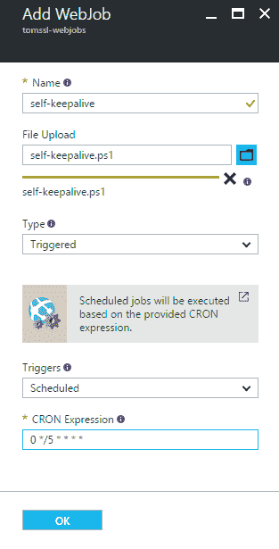

# 使用 Azure WebJobs 实现自动化

> 原文：<https://dev.to/funkysi1701/using-azure-webjobs-to-automate-stuff-38mj>

我一直听说 Azure WebJobs，但我从未使用过它们。是时候改变这一切了。

WebJobs 是 Azure App Service 的一项功能，可以在特定时间运行脚本。在我的情况下，我想每天在同一时间点击我的网站的特定 url。

 在右边你可以看到 Azure 门户网站上的 WebJobs 表单示例，你需要填写该表单。

您需要为您的 webjob 提供一个名称。

您需要上传将在我的情况下运行的脚本，我使用了 powershell 脚本。我的脚本基本上只加载指定的 url。

`$progressPreference = "silentlyContinue";
$result = Invoke-WebRequest -Uri ("https://www.google.com") -Method Get -UseBasicParsing;`

类型是指如果您的作业将被触发或连续运行，我希望它被触发。

触发器是指如果您希望它是计划的或手动的，您可以在特定的基础上运行。我当然想预定。

如果你熟悉 linux CRON，那么下一个盒子对你来说是有意义的，对其他人来说，我会试着理解它。该框由 6 个数字组成，可以是一个值或一个*。这些数字对应于以下{秒} {分} {小时} {天} {月} {星期几}。

每小时工作将被表示为 0 0 * * * *，即一周中的每一天、每月、每天、每小时，并且仅当分钟和秒钟等于零时。要获得更多帮助，请查阅 MSDN 的相关文档。我想使用 0 30 21 * * *在每天晚上 9:30 运行。

这就是一切设置，现在时间等待，看看它是否工作。

哦，不！

它未能在指定时间运行。

这是因为调度程序要求始终打开功能，而这在免费应用程序服务中是不可用的。在你掏出钱包之前，我在这篇[博客文章](https://tomssl.com/2016/12/20/how-to-get-azure-webjobs-to-run-indefinitely-for-free/)中找到了一个解决方案，可以让它们在免费层运行。

这种解决方案背后的想法是，你需要保持网站全天活跃，因此 Tom 创建了一个脚本来实现这一点。他的剧本可以在他的博客或者他的 github 页面上找到。

如上例所示，将该脚本设置为每 5 分钟运行一次(0 */5 * * * *)。

接下来你需要做的是在应用设置刀片中创建一个名为 SecretThing 的自定义连接字符串。汤姆的脚本引用这个来访问网站并保持它的活力。您需要输入的密码可以在您的发布配置文件中找到(从 Azure 门户的 Overview blade 下载)。更多细节和更好的解释，请查看汤姆的博客。

关于 WebJobs 最后要提到的一点是，您可以在 https://[your web appname]. SCM . azure websites . net/azure jobs/#/jobs 上查看有关它们何时运行的详细信息，这是帮助调试脚本的一个好地方。