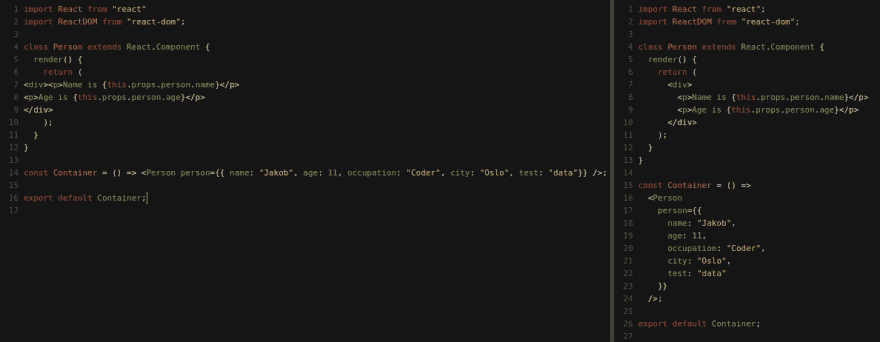
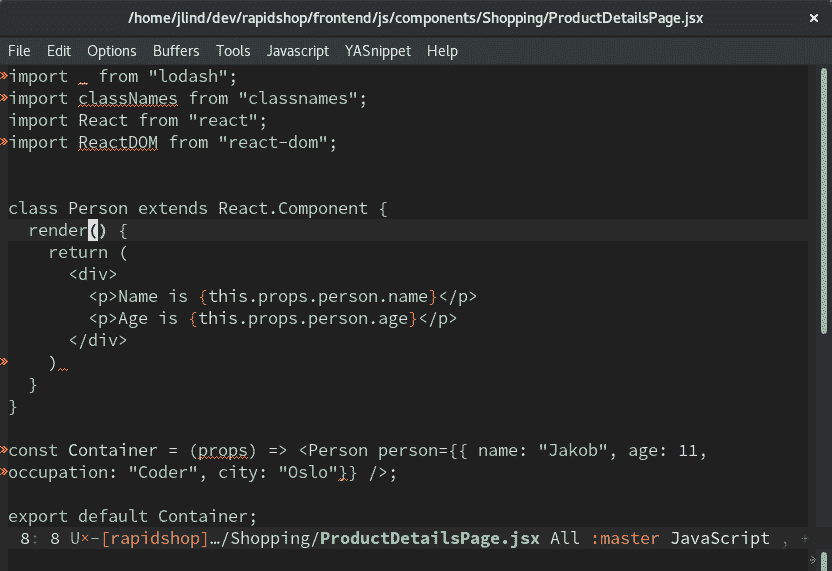
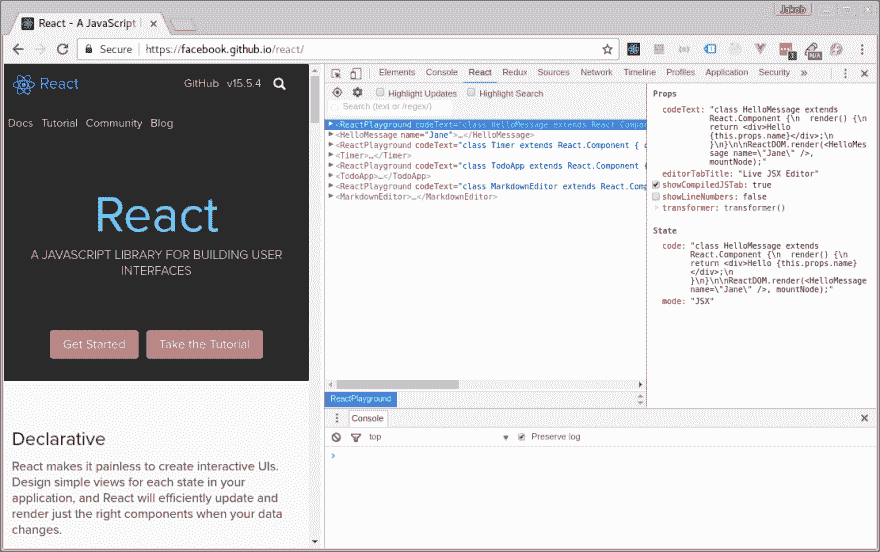
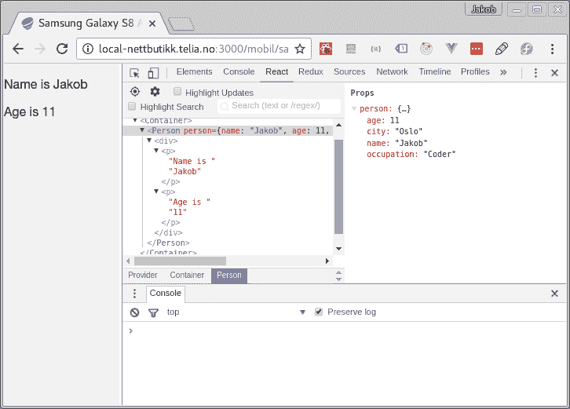

# 如何成为更高效的 React 开发人员

> 原文:[https://dev . to/jakoblind/how-to-be-a-productive-react-developer](https://dev.to/jakoblind/how-to-become-a-more-productive-react-developer)

开发复杂的 React 应用程序是……嗯，很复杂。你需要同时把很多事情记在脑子里，而且超级容易走神，注意力不集中。

有强大的工具可以帮助你跟上潮流，让你更有效率。在这篇文章中，我收集了“必备品”。

# 自动代码格式化程序:更漂亮

是一个固执己见的 JavaScript 代码格式化程序。您不需要考虑缩进代码和在正确的位置添加新行——pretty 会自动为您完成。
[ ](https://res.cloudinary.com/practicaldev/image/fetch/s--wlQA5_om--/c_limit%2Cf_auto%2Cfl_progressive%2Cq_auto%2Cw_880/http://blog.jakoblind.no/wp-content/uploads/2017/06/Screenshot-from-2017-06-09-08-03-53.png) *前靠左，后靠右*

"但是等一下，我的 IDE 已经这样做了？"

是的，但是 pretty 的工作方式完全不同:它将 JavaScript 解析成抽象语法树(AST)并漂亮地打印 AST，**完全忽略原始格式**。这使得它更加“聪明”,并持续产生更好的结果。

Prettier 对 React 有很好的支持，脸书官方推荐使用它。

不需要做任何配置就可以上手。你可以自己摆弄一下，看看它是如何工作的:[https://prettier.github.io/prettier/](https://prettier.github.io/prettier/)

我建议在您的编辑器中添加一个 keybinding，以便开发时方便访问。大多数流行编辑器都有[插件](https://github.com/prettier/prettier#editor-integration)。

# 编辑器中的错误和警告:eslint

Eslint 是一个用于 Javascript 的林挺工具。你可以用它在你的编辑器中直接显示错误和警告，它甚至可以自动修复这些错误/警告。您可以从头开始配置它，或者使用现有的配置并对其进行调整。许多人喜欢从 [airbnb eslint 配置](https://www.npmjs.com/package/eslint-config-airbnb)开始。

[](https://res.cloudinary.com/practicaldev/image/fetch/s--Hq6U4izf--/c_limit%2Cf_auto%2Cfl_progressive%2Cq_auto%2Cw_880/http://blog.jakoblind.no/wp-content/uploads/2017/06/Screenshot-from-2017-06-09-07-59-31.png)*Emacs 中的 Eslint:警告用黄色下划线，错误用红色。*

Eslint 和 prettier 配合得非常好，而且大多数流行的编辑器都有编辑器插件。

# DevTools for React/Redux 作为浏览器插件

Chrome 和 Firefox 都有开发者插件:

*   [React Chrome 开发者工具](https://chrome.google.com/webstore/detail/react-developer-tools/fmkadmapgofadopljbjfkapdkoienihi)
*   [为 Chrome 重新开发工具](https://chrome.google.com/webstore/detail/redux-devtools/lmhkpmbekcpmknklioeibfkpmmfibljd)
*   [React Firefox 开发工具](https://addons.mozilla.org/en-us/firefox/addon/react-devtools/)
*   用于 Firefox 的 Redux dev tools

它会将自己作为一个新标签添加到您最熟悉的“检查元素”区域:

[T2】](https://res.cloudinary.com/practicaldev/image/fetch/s--js8v-5Ja--/c_limit%2Cf_auto%2Cfl_progressive%2Cq_auto%2Cw_880/http://blog.jakoblind.no/wp-content/uploads/2017/06/Screenshot-from-2017-06-07-12-49-13.png)

从那里你可以直观地检查你的所有组件，并且你可以看到每个组件的道具和状态。非常方便！

如果你是 React/Redux 开发人员，React 和 Redux 开发工具都是必备的。

那么你能用它们做什么呢？我主要用它们做两件事:调试和检查数据。

## 如何用 Devtools 调试

假设您已经编写了一个 Redux Action/Reducer，并且您已经将 React 组件`connect()`存储到了存储中。当您单击一个按钮时，您希望组件中发生一些变化。你的问题是当你点击按钮时什么都不会发生。

对此进行调试的一种方法是在浏览器中使用 devtools 遵循 Redux 流程:

1.  首先要检查的是动作是否是由动作创建者发出的。您可以在 Redux devtools 中准确地看到分派了哪些操作。
2.  如果动作被正确调度，下一步就是检查 reducer 是否正确地更新了状态。再次检查 Redux devtools 中的状态差异。
3.  如果状态更新正确，我们继续检查 React 组件是否在其 props 中接收到数据。这些信息可以在 React devtool 中获得。

你不再需要四处扔东西来了解正在发生的事情。相反，您可以使用 devtools 在浏览器中跟踪数据流！

## 检查数据

devtools 的另一个很好的用例是，当您需要检查 props 中的数据结构和组件状态时。以下组件就是一个例子:

```
class Person extends React.Component {
  render() {
    return (
      <div>
        <p>Name is {this.props.person.name}</p>
        <p>Age is {this.props.person.age}</p>
      </div>
    );
  }
} 
```

<svg width="20px" height="20px" viewBox="0 0 24 24" class="highlight-action crayons-icon highlight-action--fullscreen-on"><title>Enter fullscreen mode</title></svg> <svg width="20px" height="20px" viewBox="0 0 24 24" class="highlight-action crayons-icon highlight-action--fullscreen-off"><title>Exit fullscreen mode</title></svg>

假设您需要显示关于这个人的更多信息。然后你需要知道数据结构`this.props.person`是什么样子的。你会怎么做？

很简单，看看 devtools 中的真实数据。

[](https://res.cloudinary.com/practicaldev/image/fetch/s--f0eNOWPH--/c_limit%2Cf_auto%2Cfl_progressive%2Cq_auto%2Cw_880/http://blog.jakoblind.no/wp-content/uploads/2017/06/Screenshot-from-2017-06-09-07-58-12.png) 
我们可以看到它也有我们可以利用的城市和职业！

# 反应热装载机

React 热加载器 (RHL)实时重新加载你的代码。这意味着当你编辑完代码后保存时，你的浏览器会自动获得新的修改，而不需要你手动重新加载。最棒的是，您不会像手动刷新网页时那样丢失 Redux 状态。

我想承认 RHL 并不完美。有时它不能热重装，你必须手动重装。

## 可以用它做什么？

除了用于编写客户端 JavaScript 代码之外，CSS 也是一个很好的用例(要求 JS 中有 CSS)。使用 CSS 时，经常要来回调整像素和颜色。许多人在浏览器的开发工具中进行调整。这种策略的唯一缺点是，如果您对您的更改满意，您必须将您的更改复制到您的代码中。如果你做了很多改变，要把每件事都做对可能有点棘手。

当使用 RHL 时，你可以直接在你自己的代码中编辑你的 CSS，并且仍然可以在浏览器中得到实时的修改。完成后，除了将代码提交给 git 之外，您不需要做任何事情！

# 结论

有许多很棒的工具和技术可以消除干扰，自动完成重复性的任务，这样你就可以专注于创造价值。使用它们！它会显著加快你的开发速度！