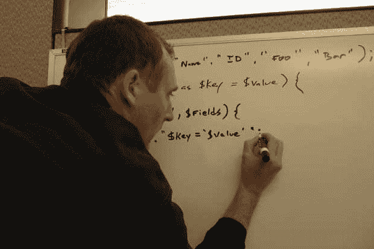

# 过去 3 年的 9 个软件工程求职和面试技巧

> 原文:[https://dev . to/cavezza/9-软件-工程-求职-面试-过去三年的小贴士-1bhb](https://dev.to/cavezza/9-software-engineering-job-search-and-interview-tips-from-the-last-3-years-1bhb)

在过去的三年里，我在一家初创公司，一家大公司，以及一家大公司中的一家小公司。我面试过。我已经面试过了。我是决定性的一票，我看着伟大的人被忽略。我见过白板、结对编程、coderpad 技术面试、黑客等级挑战、带回家的作业、笔试，以及几乎所有你能想象到的东西。

以下是我这段时间学到的东西。如果你正在寻找新的机会，如果你最近被解雇，或者如果你刚从大学或编码学校毕业，这篇文章会对你有所帮助。

# 寻找机会

## 列出你想为之工作的公司

这大概是我找新工作最喜欢的部分。你有一张空白的画布。你可以在任何地方工作。想过住在夏威夷吗？见鬼，现在是时候了。有没有想过为 EA Sports、谷歌或脸书这样的酷公司工作？把它放在你的清单上。世界是你的。不要把自己局限在与你过去工作过的公司相似的公司。

还有——忽略招聘信息。许多优秀的职位都是由内部推荐的人来填补的，从来不会发布到招聘网站上。如果你肯花时间，你应该可以为你想申请的几乎任何一家公司找到推荐人。

我建议列出至少 15 家公司，让你有机会尝试许多不同类型的公司。你不会想把你的搜索范围限制在几个公司，而是更大的范围。有些人你会发邮件，但永远不会回复。如果你只是在等一封邮件，这可能会令人沮丧，但如果你同时在看 15 家不同的公司，你就不会盯着一个人不回复你。你也应该把它看作一个转换漏斗。你申请的工作中有 X%会给你打电话。这个数字的某个百分比会让你接到另一个电话进行技术面试。这个数字的一部分会让你参加一次面对面的面试。这个数字的一个百分比会给你一个提议。在理想的情况下，你会有多种选择。

这可能很难跟踪，所以我强烈建议保留一个所有当前机会的谷歌电子表格。此外，你应该把公司加入销售渠道，因为机会不会变成报价。

## 永远寻找引荐

你应该总是为任何机会寻找推荐人。

一个做 HR 的朋友曾经跟我说，雇一个朋友，不如雇一个朋友的朋友。雇用朋友的朋友比从同事那里推荐要好。同事的推荐比求职公告板上的随机简历要好。

当涉及到决定雇佣某人时，如果有人为那个人担保——即使是微妙的担保——总会让招聘经理感觉好一点。站在招聘经理的角度想想。随机人群是有风险的。没有人为他们担保。

在理想情况下，你最好的朋友在你申请的公司工作，但更有可能的是你们有一个共同的 LinkedIn 联系。当你这样做的时候，去寻找共同的联系。让他们知道你有兴趣在他们联系的公司工作，然后通过电子邮件或 LinkedIn 请求介绍。

如果是你共同的朋友发来的介绍，你应该感谢你朋友的介绍，然后请对方喝杯咖啡。我会告诉他们我是一名工程师，我对他们公司的机会感兴趣。我还想说，我想更多地了解那里的文化，以及在那里工作的感觉。

如果共同的朋友没有发送介绍，你可以直接给你想联系的人发电子邮件(或者在 LinkedIn 上向他们发送请求)。如果你想直接给他们发电子邮件，有一个名为 [hunter.io](http://hunter.io) 的 chrome 扩展，可以很容易找到他们的电子邮件地址。

## 接受不同的机会

在你找工作的过程中，你会收到关于不同工作机会的随机邮件和 LinkedIn 信息。当你收到这类邮件时，给公司一个机会。真的没有坏处。即使你最初对这家公司不感兴趣，你也可能会喜欢那里的人和文化。

几年前我找工作的时候，一个朋友在我找工作的早期提到了 Liberty Mutual 的机会。我没有给这个机会太多的考虑。我知道我想在创业环境中工作，而不是在大公司。伙计，我错了！我真的很幸运，我改变了主意，在自由探索机会，因为它最终非常适合我。如果我没有给它一个机会，我永远不会发现它有多棒。

# 面试

## 了解技术面试前的格式

问技术面试的形式没问题。大多数时候，公司会告诉你会发生什么。如果你知道在面试中你应该想到的问题类型，你就能练习和准备特定的格式。如果你在白板上写东西和在电脑上写东西，这是一种不同的思维模式。

我经常犯的一个错误是，我会试图改进上次技术面试中的弱点，而不是努力在下一次技术面试中取得成功。虽然你需要确保自己弥补了自己的弱点，但你也需要为下一次面试做好准备。

知道伪代码是否可以或者你是否需要知道特定的语法是很重要的。白板是一种不同于在电脑上写作的思维方式。限时黑客等级挑战不同于 [coderpad](http://coderpad.io) 上的练习和带回家的技术作业。就像任何期中考试一样，了解考试的形式将有助于你做好准备。

[T2】](https://ibuildmvps.com////wp-content/uploads/2017/06/programming_whiteboard-620x465-100594253-primary.idge_.jpg)

## 不要提及你的弱点

我坚信评估你的技术能力是公司在技术面试中的工作。

如果你觉得你的前端体验比后端体验差，不要让他们知道。首先，评估你的技能是他们的工作。第二，开发者往往对自己比对别人更苛刻。仅仅因为你不喜欢你的前端技能，并不意味着其他人不会羡慕你能做什么。

此外，不要在编码时找借口。我目睹了这一切。我过去做过。我也在采访汇报中听到过这一点。如果你提到你不擅长某件事，你的面试官会记住你的话，以后再提。即使你很谦虚，但在技术面试中，你说的话往往会成为“真理”。让他们为难。不要谈论你的缺点。全力以赴。要自信。让他们知道你在工作的各个方面都有能力，并把工作交给他们，让他们能够证明自己不是这样。

## 确保你有所准备

调查公司对[玻璃门](http://glassdoor.com)的采访评论。不要假设问题会是相同的，但是根据可用的评论，您可以预期类似的问题。

[破解编码面试书](https://www.amazon.com/Cracking-Coding-Interview-Programming-Questions/dp/0984782850)——这本书太棒了！如果是面试的话我强烈推荐。它有许多常见的行为和技术问题。它帮助你复习 CS 基础知识和常见的 MVC 和 OOP 问题。如果是面试，一定要买这本书！

经历 [HackerRank](http://hackerrank.com) 挑战——许多公司会使用 HackerRank 这样的工具来决定是否应该把你带到办公室给你一次面对面的面试。如果公司正在使用这个，你应该使用这个平台来练习。它们为算法、数据结构和其他类型的挑战提供了许多不同的选项。他们也有几十种语言可供你编码。

看看[面试蛋糕](https://www.interviewcake.com/)。面试蛋糕是编程面试中保守得最好的秘密之一。如果你不擅长技术面试，可以看看这个网站。这是唯一一个重建技术算法面试的在线资源(当面试官要求你使用 [coderpad](https://coderpad.io/) 时，你经常会看到)。它会让你创建一个初始解决方案。它会问你是否能做得更好。它将向您展示如何做得更好，以及如何提高解决方案的算法效率。它会教你如何 ace 算法面试。这可能是你能在网上找到的帮助你解决这些挑战的最佳资源。不要相信我的话，去尝试他们的演示，你会看到为什么它是如此之大！

# 岗位面试

## 从每次面试中学习

我在找工作的时候有一本“面试笔记本”。在里面，我会写下每一个我不完全理解的术语。如果有人问我一个问题，而我对自己的回答不满意，我会把它写下来。注意你的错误是改正错误的第一步。

我建议在面试过程中把这些事情写下来。如果你觉得这样做不合适，确保面试一结束就打开你的笔记本，把你记得的不能有效回答的事情都写下来。

如果你有一次不知道某个问题的答案，没关系——这是常有的事。如果你在多次面试中都没有回答同一个问题，那是你自己的错。当你回家的时候，一定要在这个笔记本上查阅你没有完全理解的内容。软件开发是关于持续学习的。

## 回到基本面

根据你面试的公司，他们可能希望你知道很多关于大 O 符号、数据结构和算法的知识。这是自学成才的开发人员经常遇到的问题。您可以免费参加 2 门在线课程，以提升您的技能并充分理解这些概念。我强烈推荐史蒂夫·斯基纳的算法课和 T2 的布莱恩·哈维的计算机科学导论课。

即使你从来没有学过，计算机科学的基础知识也不会太难学。我建议去看看 teachyourselfcs.com，并按照他们的建议来填补知识空白。

[T2】](https://ibuildmvps.com////blog/wp-content/uploads/2017/06/learning-from-mistakes-8-638.jpg)

## 明确地向面试官寻求反馈

你应该已经写下你认为你在面试中做错了什么。然而，这并不总是足够好。如果你没有得到工作机会，你还需要找出面试官拒绝你的原因。

我建议明确地问面试官为什么他们会放过你。你应该向面试官寻求反馈。你应该提到你一直在努力提高，你需要找到关注点。问问他们是否能对你的面试提供反馈，或者建议你在继续找工作时应该关注什么。

公司没有给你这种反馈的动机，但是如果你明确要求，一些公司会给你。并非所有的反馈都是平等的，但是你从公司得到的任何负面反馈都是一份礼物。它确切地告诉你你需要改进什么。它告诉你为什么你没有得到这份工作。你不会总是得到它，但确保你跟进，并在面试后至少询问两次反馈。

**阅读更多尽在我的博客**【http://ibuildmvps.com】

**接我**
[http://twitter.com/cavezza](http://twitter.com/cavezza)
[http://linkedin.com/in/cavezza](http://linkedin.com/in/cavezza)