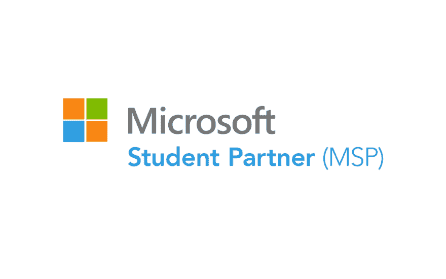
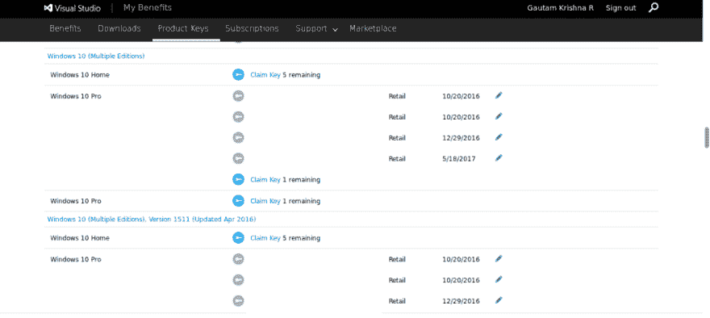
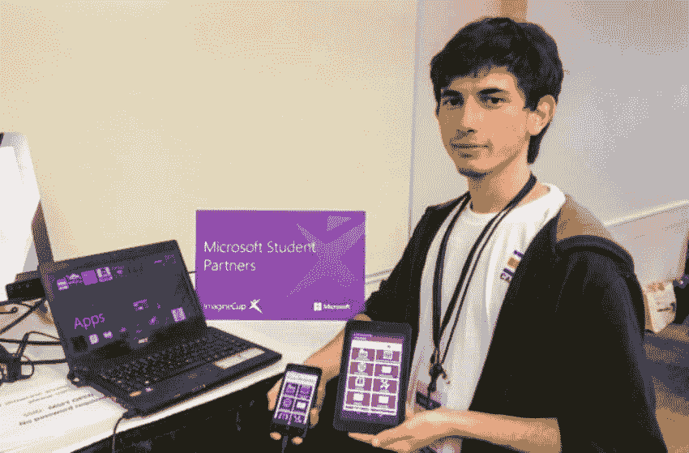

# 微软学生合作伙伴——极客是新的摇滚明星

> 原文:[https://dev.to/gautamkrishnar/microsoft-student-partners 极客是新的摇滚明星](https://dev.to/gautamkrishnar/microsoft-student-partners--geek-is-the-new-rockstar)

2017 年微软学生合作伙伴(MSPs)招聘将于 7 月 13 日至 10 日举行。这是对所有在这里的学生的大喊……不要错过成为这个神奇的社区的一部分的机会……ðÿ™‚

### 谁是微软的学生伙伴

来自[维基百科](https://en.wikipedia.org/wiki/Microsoft_Student_Partners) :
*“微软学生合作伙伴(Microsoft Student Partners)是一项全球公认的计划，旨在资助技术相关专业的学生。MSP 计划通过提供学术界通常不教授的技能培训，包括微软技术知识，提高了学生的就业能力。”*

简单地说，微软学生计划是学生参与技术世界的一个很好的方式。这是微软推出的一项伟大计划，旨在增强对微软技术充满热情的学生的能力。

微软学生合作伙伴做了令人难以置信的事情:

*   举办研讨会和黑客马拉松
*   在校园里举办技术活动和演示
*   与微软专业人员一起工作，在黑客马拉松和活动中协助他们
*   参加微软独家培训活动，了解最新技术
*   在校园和网上发展和培养学生和教师群体
*   增强他们的技能和职业机会
*   获得惊人的工作和更多…

[https://www.youtube.com/embed/fYhn7-vWbuI](https://www.youtube.com/embed/fYhn7-vWbuI)

### 成为 MSP 的好处

这是大多数学生都会问的关于这个项目的问题。做 MSP 值得吗？。为什么是 MSP？，让我们找出…

#### 专属活动邀请函

成为 MSP 将增加您在 Microsoft 邀请活动、会议和聚会中被选中的机会。在这些活动中，你会遇到很棒的人。

#### 免费 MSDN 订阅

这是我作为 MSP 最喜欢的福利之一。作为一个 MSP，微软会给你一个免费的 MSDN (Visual studio enterprise)订阅(大约花费 5999 美元)。它将让你免费使用所有微软产品。您可以从 MSDN 订阅门户网站轻松下载和使用正版 Microsoft 产品。对于大多数产品，您可以免费获得多达 5 个正版序列号。我最喜欢 MSDN 订阅的地方是它免费给了我 Visual studio Enterprise 和 Windows 10 Enterprise。它还包括免费的 Azure 信用，可以同时运行多达 3 个高端 VPS 虚拟机。它还对所有微软产品提供一对一的支持。
[T3】](https://res.cloudinary.com/practicaldev/image/fetch/s--o6jw2pFs--/c_limit%2Cf_auto%2Cfl_progressive%2Cq_auto%2Cw_880/https://thepracticaldev.s3.amazonaws.com/i/s4jb6ki9yk1oa647sw45.png)

#### 学习新技术和编程语言

作为 MSP，您将获得许多在线学习平台的独家访问权，如微软电子学习、Xamarin 大学等。这将帮助你积累技能，提高你目前的技能。

#### 人脉机会

作为一名 MSP，您将被添加到一个由 MSP 和微软员工组成的封闭小组中。您将收到一个@studentpartner.com 电子邮件 ID，它将允许您访问 Yammer 网络和 office 365 门户。使用此电子邮件 ID，您将有资格获得 1TB 的 microsoft one drive 云存储空间。您还将获得一个免费的 office 365 及其所有第三方扩展。参加微软活动将让你与 MVP 和微软员工一起拓展你的人脉。无论你对地球上的任何事情有任何疑问，在我们的社区里至少会有一个人帮助你。

#### 实习&招聘

如果你作为 MSP 表现出色，微软可能会给你提供实习机会。如果你是最好的，你也可能得到一份工作。

#### 提升你的简历

作为一名 MSP 的经历肯定会是你简历中最好的内容。它会让你鹤立鸡群。这肯定会引起招聘人员的注意。

#### Beta 测试

微软宣布对其大部分产品进行内部测试。作为学生搭档。如果你申请任何微软的测试程序，你有很大的机会被选中。我用我的学生伙伴 ID 申请了微软的 Zo 项目，我被选为 beta 测试员。成为 MSP 将使您了解微软的新产品及其发布的最新消息。

#### 赃物，赃物，赃物…

无论你是参加微软活动还是主持活动，微软都会给你带来许许多多的好东西，比如 t 恤、耳机，甚至是一部全新的 windows phone 手机……ðÿ˜€

### MSP 2017 的资格标准

所有申请学生必须在 2017 年 7 月 1 日至 2018 年 6 月 1 日期间在经认证的学术机构全日制注册，并且所有学生必须持有有效身份证明。

任何满足上述要求的人都可以申请这个项目。申请 MSP 项目的人不必是计算机科学专业的学生。我知道许多 MSP 是商学院的学生，我的一个朋友 MSP 甚至在攻读植物学的学士学位。

#### 先决条件

你必须确保你手里有以下东西(取自官方页面):

*   学生验证:扫描你的大学身份证并上传到一个在线驱动器中。上传的身份证链接应该是直接可见的，图像应该是正确可见的。
*   视频挑战:请制作一个 1 分钟或不到 1 分钟的视频，解释为什么你应该在你的校园里成为微软学生伙伴。详述你所参与的技术技能和事件，并描述你将如何激励你的校园学生学习技术。这段视频应该上传到 Youtube 上，并公开。只有完整的视频申请将被审查。你可以从[这里](https://support.google.com/youtube/answer/57407?co=GENIE.Platform%3DDesktop&hl=en)参考如何上传视频到 Youtube

如果您对 MSP 项目或申请过程有任何疑问，请联系:[newmsp@microsoft.com](mailto:newmsp@microsoft.com)

##### 那么你还在等什么？立即申请！😀

了解更多:[https://msdn . Microsoft . com/en-in/microsoftstudentpartners . aspx](https://msdn.microsoft.com/en-in/microsoftstudentpartners.aspx)
立即申请:[https://aka.ms/JoinMSP2017](https://aka.ms/JoinMSP2017)T5】立即申请(印度):[https://www . Microsoft . com/en-in/campaign/MSP 2017/default . aspx](https://www.microsoft.com/en-in/campaign/msp2017/default.aspx)

最初发表于[http://www.gautamkrishnar.com/microsoft-student-partners/](http://www.gautamkrishnar.com/microsoft-student-partners/)