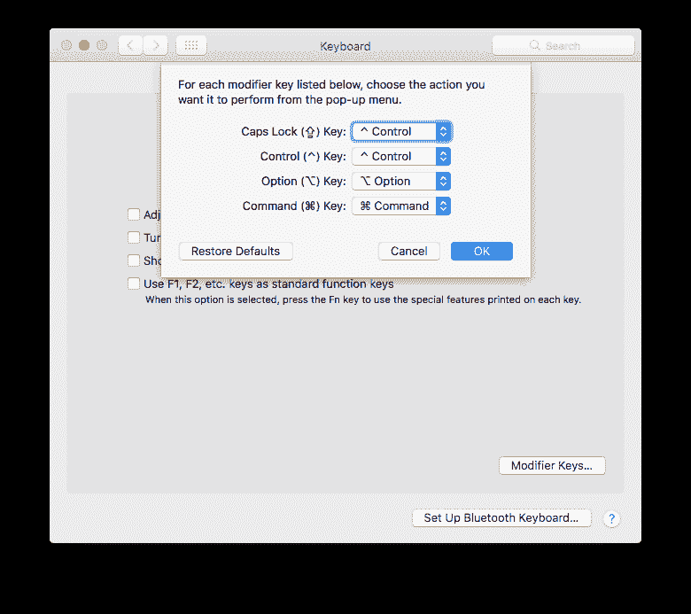
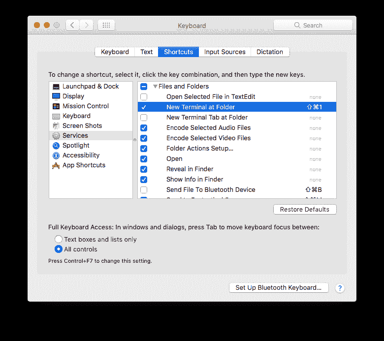
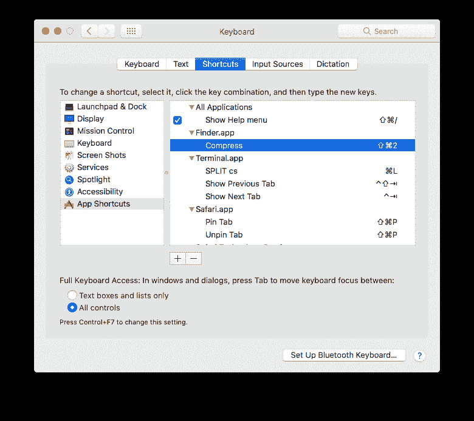

# 快捷键

> 原文:[https://dev.to/hweetty/keyboard-shortcuts](https://dev.to/hweetty/keyboard-shortcuts)

### *开场白:PSA*

控制键在许多快捷键中起着重要的作用，但它的位置需要人们伸展肌腱。如果你想避免 RSI 问题，那就不好了！相反，您可以将 Caps Lock 映射到控制键，这在 Mac 上非常简单([见下面的](#p28-Instructions))。

* * *

键盘快捷键是我工作流程的一大部分，因为最小化鼠标键盘切换节省了大量时间和疲劳。以下是我认为最有用的快捷方式列表。

## 文本字段

Control-F

Move cursor *forward* one character

Control-B

Move cursor *backward* one character

Control-P

Move cursor *up* one character

Control-N

Move cursor *down* one character

Control-A

Move cursor to *beginning* of line

Control-E

Move cursor to *end* of line

Control-K

Delete entire line after cursor

Control-O

Insert new line after cursor

## 崇高正文 3

Command-D

Selects entire word at cursor. Really useful for quickly selecting and deleting a word. (Keep pressing to expand selection to next occurrence.)

Command-K [U/L]

Converts selected text to Upper / Lower case

Command-T <file name>

Quickly open a file by name

Control-1

Selects the first group. You can also use 2, 3, … if you have more groups

Control-Tab

Alternates between last used tab (like a stack)

Control-G <line number>

Go to line number. Very useful for navigating to somewhere far away without using the mouse

Control-Minus

Jumps back to previous cursor position. Great if used in combination with above. You can use *Ctrl-Shift-Minus* to jump forward

Control-T

If you have multiple selections, this shortcut will “rotate the selection round-robin style. (If you have two selections it swaps them)

Control-Shift-J

Reveal current file in sidebar. I remapped this to be the same as the default shortcut combination in Xcode

Control-R

Switches to matching header/implementation file. This was a lot easier to press compared to the default Command-Option-Up

## 查找器

请参见下方的[说明来设置这些自定义快捷键。](#p28-instructions-terminal)

Command-Shift-1

Open terminal at selected folder. Unfortunately this requires actually selecting a folder. If anyone knows how to do this without selecting please let me know!

Command-Shift-2

Create a ZIP archive of selected files.

## Xcode

前三个快捷方式是非常有用的补充:

Command-Shift-J

Show current finder in sidebar

Command-Shift-C

Move cursor to console area

Command-J

Move cursor to code editor

Command-Control-R

Continue running (when stopped at breakpoint)

Command-Shift-O

Open Quickly any file. (Vastly improved to add emacs support in Xcode 9!)

自定义快捷方式:

Option-Shift-S

Select iPhone SE simulator as destination

Option-Shift-6

Select iPhone 6 simulator as destination

Option-Shift-J

Select my iPhone as destination

## 说明

下图:映射大写锁定控制

下图:新建终端 at 文件夹

下图:压缩(存档)文件

* * *

你知道一些不出名的捷径或者有你自己喜欢的吗？分享到评论里吧！