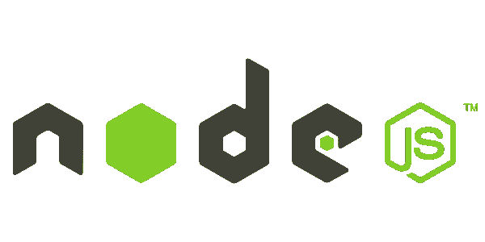
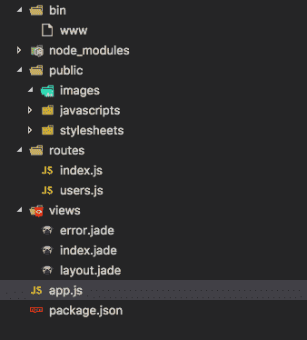
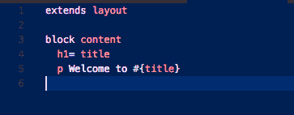
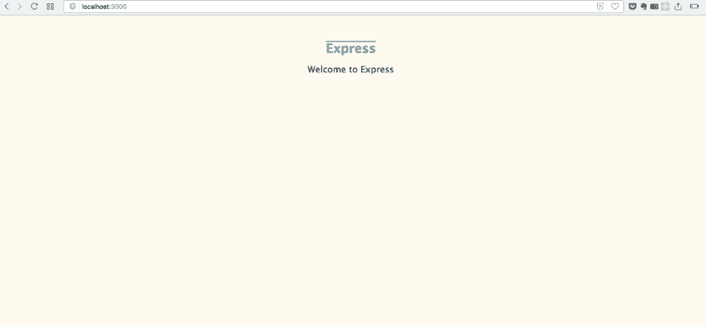

# 初学者使用 Grunt 和 NodeJS 设置 SASS 的 5 个步骤

> 原文：<https://dev.to/sarathsantoshdamaraju/5-steps-to-setup-sass-with-grunt-and-nodejs-for-beginners-42dn>

[T2】](https://res.cloudinary.com/practicaldev/image/fetch/s--_aV7Mu7z--/c_limit%2Cf_auto%2Cfl_progressive%2Cq_auto%2Cw_880/https://cdn-images-1.medium.com/max/1024/1%2AWXViiNWw1Eg55USSFFGJAA.png)

本教程涵盖了，

✅使用 Express 设置节点

✅安装 SASS

✅用咕噜声设置观察任务

🎉完成的..！！

### 步骤 1 —安装节点

[T2】](https://res.cloudinary.com/practicaldev/image/fetch/s---YqtrsBT--/c_limit%2Cf_auto%2Cfl_progressive%2Cq_auto%2Cw_880/https://cdn-images-1.medium.com/max/600/1%2AFnNMOC7TImY0wP68rfIksQ.png)

在您的系统中安装 NodeJS。什么是 NodeJS？— *简单来说，JavaScript 在你的浏览器中运行，也就是说在客户端。有了 NodeJS，它甚至可以在服务器端运行，这样你就可以使用 JS 而不是 PHP 或任何后端语言。*

> [https://nodejs . org/en/download/](https://nodejs.org/en/download/)

下载 **LTS** 版本(写这篇文章时是 6.11.0)。

### 步骤 2 —安装 Express

[T2】](https://res.cloudinary.com/practicaldev/image/fetch/s--b06toGaB--/c_limit%2Cf_auto%2Cfl_progressive%2Cq_auto%2Cw_880/https://cdn-images-1.medium.com/max/465/1%2AB8RdqA2khkEZTtQbf02bog.png)

在接下来的几个步骤中，您必须在某个位置设置一个文件夹。转到你想要设置文件夹的位置，打开终端/命令提示符( **shift +右键**在**窗口**，**右键>服务>打开终端在文件夹**在 **Mac** )。

> 如果你在 Mac 中没有看到任何选项，进入**系统偏好设置**，选择**键盘>快捷键>服务**，尝试再次重复上述步骤。

在终端中，键入-

```
npm install express-generator -g

express foldername 
```

Enter fullscreen mode Exit fullscreen mode

然后用
进入你在上面步骤中刚刚创建的文件夹

```
cd foldername 
```

Enter fullscreen mode Exit fullscreen mode

并键入

```
npm install 
```

Enter fullscreen mode Exit fullscreen mode

这将基本上安装我们的应用程序将需要的所有必需的包(你可以在 node_modules 中找到它们)。您可以使用 **npm 向应用程序添加任何包。**

<figure>[](https://res.cloudinary.com/practicaldev/image/fetch/s--GTwZ2y3O--/c_limit%2Cf_auto%2Cfl_progressive%2Cq_auto%2Cw_880/https://cdn-images-1.medium.com/max/338/1%2ABSXX9ndV-ptPVu-SwmMGIw.png) 

<figcaption>你的文件夹结构看起来会类似于这个</figcaption>

</figure>

您已经完成了服务器的设置。您可以通过运行
来测试它

```
npm start 
```

Enter fullscreen mode Exit fullscreen mode

并在浏览器中打开 localhost:3000。

### 步骤 3 —安装 SASS

[T2】](https://res.cloudinary.com/practicaldev/image/fetch/s--uaBtKuAR--/c_limit%2Cf_auto%2Cfl_progressive%2Cq_auto%2Cw_880/https://cdn-images-1.medium.com/max/600/1%2AT8QrANjTy4fGDIWTHXPfcQ.png)

**SASS——语法上很棒的样式表**是一个 CSS 预编译器。它提供了额外的能力，比如使用变量、继承、混合、嵌套规则等..致 CSS。这是为了开发人员的利益，你 SASS 代码将最终转换成 CSS。

SASS 需要 RUBY，如果你没有 RUBY，先从这里安装

> [www.ruby-lang.org/en/documentation/installation/](http://www.ruby-lang.org/en/documentation/installation/)

并选择您的操作系统类型。如果您使用的是 windows，请单击下面的并下载。 **exe** 文件

> https://ruby installer . org

现在，打开终端，输入

```
gem install sass

--or--

sudo gem install sass

(use if you get any permission(s) related error message, but I won't suggest this) 
```

Enter fullscreen mode Exit fullscreen mode

安装 SASS。萨斯是一个红宝石宝石，这就是为什么我们使用**宝石**而不是 **npm。**

### 步骤 4 —安装 Grunt 及其依赖项

[T2】](https://res.cloudinary.com/practicaldev/image/fetch/s--7dom3qhs--/c_limit%2Cf_auto%2Cfl_progressive%2Cq_auto%2Cw_880/https://cdn-images-1.medium.com/max/570/1%2AQ-nvSptL2r41MFtr8kaAnw.png)

太棒了，我们几乎已经完成设置。现在让我们安装 Grunt 及其依赖项。

**什么是 GruntJS？—**

作为一名前端开发人员，您可能需要处理许多任务，例如

*   处理一小块 JS 和 CSS 并将它们合并成一个文件，
*   图像优化
*   压缩 CSS 和 JS 缩小
*   使用 CSS 预处理程序，如 SASS

这样的例子不胜枚举。Grunt 帮助您自动完成这些任务。

在您的终端
中键入以下内容

```
npm install grunt 
```

Enter fullscreen mode Exit fullscreen mode

在你的**/public/styles/**中创建 **style.sass** 文件，在你的**根目录**中创建 **gruntfile.js** 文件，粘贴以下代码并保存。

```
module.exports = function(grunt) { grunt.initConfig({ pkg: grunt.file.readJSON('package.json'), express : { dev: { options: { script: 'app.js' } } }, sass: { dist: { files: { 'public/stylesheets/style.css' : 'public/stylesheets/style.sass' } } }, watch: { css: { files: '\*\*/\*.sass', tasks: ['sass'] } } }); grunt.loadNpmTasks('grunt-contrib-sass'); grunt.loadNpmTasks('grunt-contrib-watch'); grunt.loadNpmTasks('grunt-express-server'); grunt.registerTask('dev',['express','sass','watch']); } 
```

Enter fullscreen mode Exit fullscreen mode

这看起来可能很复杂，但理解起来非常简单。我们正在编写一个函数

*   它从 **package.json** 中读取依赖项
*   我们使用类似 **SASS** 的 grunt 包将某个位置的 ***style.sass*** 文件转换为 ***style.css* ，观看**以观察 **SASS** 中的文件变化，并运行 **SASS** 编译任务**和 express** 以运行服务器。而且这些任务都注册在 **dev** 下(可以用其他名字)。所以当你跑步的时候

```
grunt dev 
```

Enter fullscreen mode Exit fullscreen mode

我们上面提到的**的**三个任务**都会自动运行**。同样，你也可以设置一个缩小任务来自动缩小你的 CSS 或 JS，节省你很多时间。

*   我们必须为上面讨论的三个任务安装必需的 grunt 包。在您的终端中运行以下命令

```
npm install grunt-contrib-sass && npm install grunt-contrib-watch && npm install grunt-express-server 
```

Enter fullscreen mode Exit fullscreen mode

我们使用 **& &一次安装所有三个软件包。**

干得好！！您已经将您的环境设置为使用带有 npm 的 SASS。

### 步骤 5——编写简单的 SASS 代码

让我们先看看你的网页是什么样子，在你的终端上运行这个命令

```
grunt dev 
```

Enter fullscreen mode Exit fullscreen mode

并打开 localhost:3000，它看起来必须与此类似

[T2】](https://res.cloudinary.com/practicaldev/image/fetch/s--8kcSfAEa--/c_limit%2Cf_auto%2Cfl_progressive%2Cq_auto%2Cw_880/https://cdn-images-1.medium.com/max/1024/1%2A_QF5h3HmZofG5xDRVl5hOg.png)

这是从 views/中的 index.jade 文件提供的。打开它，看看结构

[T2】](https://res.cloudinary.com/practicaldev/image/fetch/s--qThNPWL6--/c_limit%2Cf_auto%2Cfl_progressive%2Cq_auto%2Cw_880/https://cdn-images-1.medium.com/max/363/1%2AjucHKDJDDAh17xODPaL4_Q.png)

它只有两个组件一个< **h1>T1】和**T8】p>。**让我们来设计它们，打开你的 **style.sass** 文件并设计它们。这是我的代码的样子，** 

```
body padding: 50px font: 14px "Lucida Grande", Helvetica, Arial, sans-serif background-color: floralwhite text-align: center h1 margin: auto color: cadetblue text-decoration: overline

p color: #333 font-size: 20px 
```

Enter fullscreen mode Exit fullscreen mode

并在浏览器中查看更改。

<figure>[](https://res.cloudinary.com/practicaldev/image/fetch/s--Get6VrGH--/c_limit%2Cf_auto%2Cfl_progressive%2Cq_auto%2Cw_880/https://cdn-images-1.medium.com/max/1024/1%2ADyk56vIfclCu04iOl0jKUw.png) 

<figcaption>最终输出</figcaption>

</figure>

#### 牛逼是不是？

如果你愿意，你可以在这里找到源代码。

> 感谢您阅读我的帖子。我想在评论中听到你的想法。如果你喜欢这篇文章，请点击💚下面，以便更多的人可以阅读它。

* * *