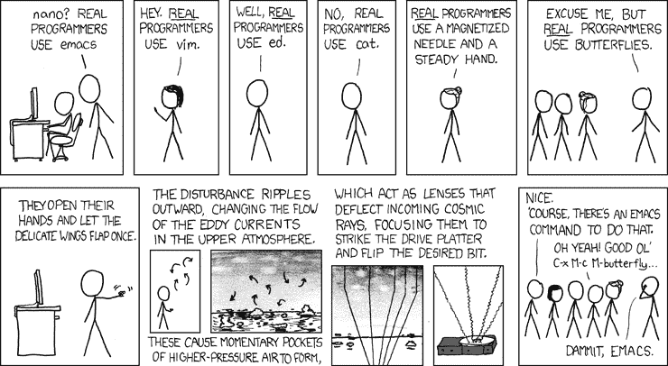

# 应该学什么编程语言:或者为什么不重要

> 原文：<https://dev.to/joshghent/what-programming-language-should-i-learn-or-why-it-doesnt-matter--496l>

搜索'[我应该学习什么编程语言](http://google.com/search?q=what+programming+language+should+I+learn&gws_rd=cr&ei=5lNMWbaFPMyKgAbD74zIDQ)'将为您返回**超过 700 万个**结果。第一个说 [Javascript](https://medium.freecodecamp.com/what-programming-language-should-i-learn-first-%CA%87d%C4%B1%C9%B9%C9%94s%C9%90%CA%8C%C9%90%C9%BE-%C9%B9%C7%9D%CA%8Dsu%C9%90-19a33b0a467d) ，下一个 PHP，另一个赞美 Java 和静态类型语言的优点。你可能会问什么是静态类型语言？我只想为我的手机做应用！

这是初学者学习编程的挣扎——甚至是我自己，当我在寻找第二种语言学习的时候。噪音太大，没有清晰的路径。现在我不打算在所有这些文章的基础上再给你推荐另一种语言。

相反，我将推广一个新的想法——没关系。真的没有！让我出去。

没有一种编程语言能统治一切。虽然有许多人认为 Javascript 可以在任何地方使用，因此是最好的，但 React Native 适用于移动和桌面上的原生应用程序，Node JS 位于服务器上，普通的 ol' Javascript 直接嵌入浏览器。这听起来是一个非常令人信服的论点。的确如此。我认为 Javascript 对任何人来说都是一门很好的语言。然而，说了这么多，让我们看看编程语言和框架的历史。

根据 TIOBE 指数，到目前为止，Java 稳坐第一把交椅。Javascript 有望超越它，但就在不久前，市场上最酷的语言还是 [Perl](https://en.wikipedia.org/wiki/Perl) 甚至 [Fortran](https://en.wikipedia.org/wiki/Fortran) 。我在这里的观点是，尽管一种语言现在看起来很流行，但技术是一种极其邪恶的景观。随着偏好的消长和新技术对老技术的青睐，这种情况一直在变化。

甚至在 Javascript 生态系统中，仅在一年前 Angular 还是个东西。然后 React 出现了，所有人都跳船了。Angular 2 后来发布时没什么人感兴趣——Angular 1 的使用继续减少。它可以瞬间翻转。许多人理所当然地感到愤怒，因为他们花了这么多时间学习一个框架，而这个框架现在就像死了一样。

我的观点是这样的…

> **语言和框架，来来去去。概念在这里停留。**

这里以 [React](https://facebook.github.io/react/docs/thinking-in-react.html) 为例。我的观点是，尽管 React 不会长久存在。React 背后的概念和基本原则肯定会一直存在。React 的方式促进了分层组件结构，并通过该结构传输数据；它只是重新呈现组件中状态发生变化的部分，这种方式非常神奇。

现在，你是否选择学习 React 是你的选择，但它背后的概念将很快应用于其他语言。在这一点上，如果你理解 React，你将能够在 React 语言版本中构建你的应用时采用这种思维方式。

在大获成功的游戏[传送门](https://en.wikipedia.org/wiki/Portal_(video_game))中，旁白评论道“[现在你在用传送门](https://www.youtube.com/watch?v=TluRVBhmf8w)思考”。这句话的意思是，现在你在用你所拥有的技术思考，在这种情况下，玩家使用传送门枪来创建一个相互连接的传送门的两端。

我们可以把这句话应用到我们工作的技术上。当你最终破解了数据如何从你的模型传递到你的视图的概念时，你可以说“现在我在用 [MVC](https://medium.freecodecamp.com/model-view-controller-mvc-explained-through-ordering-drinks-at-the-bar-efcba6255053) 思考”。

<figure> 

<figcaption>如果你不做这个#obvi(来源:[https://xkcd.com/378/](https://xkcd.com/378/)</figcaption>

</figure>

)

试图进入这个领域并成为一名开发人员可能是一个可怕的地方，但不要害怕！编程是关于你开发的解决问题的技能。而不是你碰巧使用了什么闪亮的语法。许多人使用一种他们在那份工作之前从未使用过的语言(包括我自己)。在学习编程的时候，你会自然而然地获得这些技能。这是我刚开始学习编程时被告知的事情，当时我认为要得到一份工作，你必须是这个 NASA 级别的天才，已经制作了 10 个应用程序和 6 个网站(提示:你不需要这个——尽管它肯定有帮助！)，我不相信他们说的话。我简直无法理解你刚刚‘获得’的这种难以形容的技能，就好像是通过某种瘴气一样。嗯，这是真的。相信我。

我的一条具体建议是**尽快开始建造东西**。他们不一定要惊艳，也不一定要原创。它们必须是你想尝试的东西。 [Freecodecamp](https://www.freecodecamp.com/) 在他们的课程中很好地做到了这一点。我的第一个项目是一个计算器。我参加那个项目是因为我知道计算器如何工作，我知道如何加减乘除。从我对编程的学习中，我知道为了跟踪用户按下的按钮，我可以将它存储在一个变量中。我知道我需要连接这些按钮来触发一个能做各种事情的功能。我几乎不知道这个应用程序的内部工作原理。但是**非常重要的是**我知道它应该如何运作的概念。将同样的原则应用到你所建造的东西上，你会走得更远。这也很棒，因为你可以像在工作一样解决实际的问题。和调试，就像你在工作中一样。90%的编程都是在调试你写的东西——所以要习惯它！此外，自己做一个项目会让你理解代码是做什么的。许多教程采取“打这个，做那个”的心态，很少解释这个东西是什么或者如何工作的。花时间阅读文档，真正理解你写的东西。**如果不马上，也没关系**。花些时间，仔细考虑一下，以后再来讨论。这是学习这些概念的一部分。

作为这个项目建设的一个奖励，在最后，你会得到一些很酷的东西，你可以给你的妈妈、爸爸、猫或心爱的家庭成员/宠物看。

不断学习。不要气馁。玩得开心，做一些很酷的东西，编程就像数字魔法，使用你的能力！

*补充阅读*

*   [https://www . Reddit . com/r/learn programming/wiki/FAQ # wiki _ which _ programming _ language _ should _ I _ start _ with . 3f](https://www.reddit.com/r/learnprogramming/wiki/faq#wiki_which_programming_language_should_i_start_with.3F)

* * *