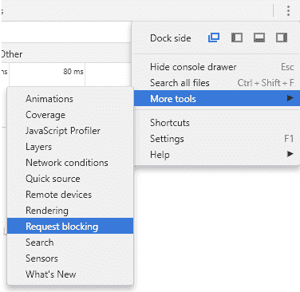
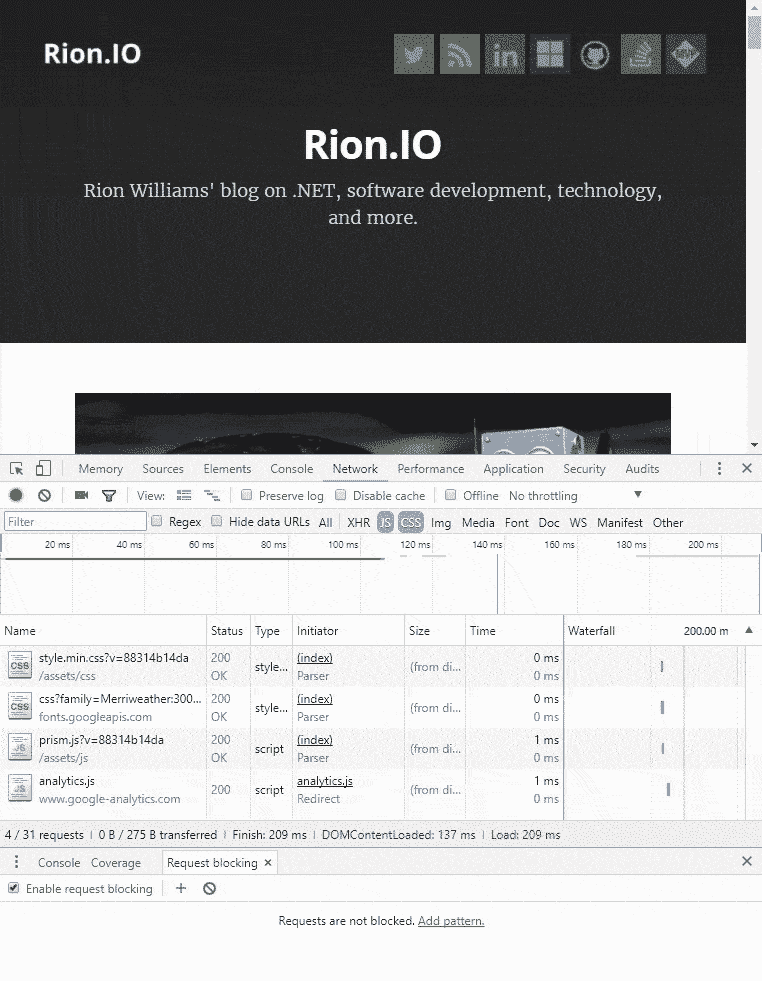
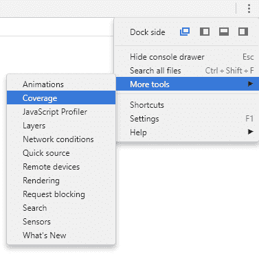
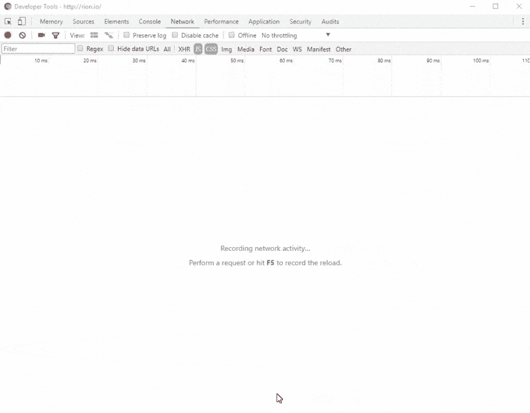
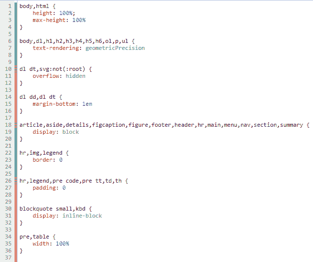
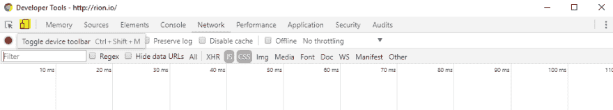

# 值得一提的是更新的 Chrome 调试工具

> 原文：<https://dev.to/rionmonster/updated-chrome-debugging-tools-worth-mentioning>

*这篇文章最初发表在[我的博客](http://rion.io)上。*

作为一名 web 开发人员，我绝对离不开优秀的浏览器内开发工具。我每天都在使用它们，它们肯定会让你的生活变得更加轻松。通常我选择的浏览器是 Chrome，所以我想我会花些时间在最新版本中引入一些非常非常酷的新功能。

因此，谷歌浏览器的最新版本(59)有很多值得一提的新功能，我将在这篇文章中简要回顾一下:

*   **显式请求阻塞**
*   **CSS 和 Javascript 代码覆盖率**
*   **整页截图**
*   **异步等待步过**

## 明确请求阻塞

对未知或意外情况进行故障排除有时会很困难。模拟你的 CDN 是否关闭，或者给定的资源是否无法加载*可以完成，但最新的 Chrome 功能使它变得更加容易。*

 *Chrome 现在允许你简单地阻止一个请求的解析，允许你的特定的后备逻辑启动，看看你的站点如何反应。**该功能可通过两种方式设置，一种是明确定义一些模式，使用菜单>更多工具>请求阻止:**

[T2】](https://res.cloudinary.com/practicaldev/image/fetch/s--yw97iuJY--/c_limit%2Cf_auto%2Cfl_progressive%2Cq_auto%2Cw_880/https://rion.io/conteimg/2017/06/request-blocking-menu.PNG)

**或者在网络菜单中右键单击您想要禁止的特定请求，然后选择“阻止请求”选项:**

[T2】](https://res.cloudinary.com/practicaldev/image/fetch/s--huzCrf2w--/c_limit%2Cf_auto%2Cfl_progressive%2Cq_66%2Cw_880/https://rion.io/conteimg/2017/06/request-blocking.gif)

## CSS 和 Javascript 代码覆盖率

作为开发人员，我们应该一直努力做到更好，在 web 应用领域，这通常意味着尽可能快(高效)地让客户得到他们需要的东西。

一般来说，您可以使用诸如缩小和捆绑之类的技术来帮助减少通过管道发送的资源的总体大小。但是如果你甚至不需要全部呢？如果您有办法准确地确定给定页面正在使用哪个 CSS 选择器，或者特定页面正在调用哪个函数，会怎么样？有了 CSS 和 Javascript 代码覆盖特性，你就可以了！

**要利用这一点，您需要通过点击省略号菜单，选择更多工具并选择 Coverage:** 来明确启用 Coverage 选项卡

[T2】](https://res.cloudinary.com/practicaldev/image/fetch/s--B7WCj0Fi--/c_limit%2Cf_auto%2Cfl_progressive%2Cq_auto%2Cw_880/https://rion.io/conteimg/2017/06/coverage-menu.PNG)

现在，当你在一个页面上打开你的开发者工具时， **Chrome 会向你显示该文件中的代码实际被使用的百分比:**

[T2】](https://res.cloudinary.com/practicaldev/image/fetch/s--yrhMoByL--/c_limit%2Cf_auto%2Cfl_progressive%2Cq_66%2Cw_880/https://rion.io/conteimg/2017/06/site-coverage.gif)

最后，最重要的是，您可以单击 Coverage 选项卡中的特定文件，它会准确显示您的站点中使用和未使用的线路:

[T2】](https://res.cloudinary.com/practicaldev/image/fetch/s--cGI2hExW--/c_limit%2Cf_auto%2Cfl_progressive%2Cq_auto%2Cw_880/https://rion.io/conteimg/2017/06/used-and-unused.PNG)

这在某些情况下非常有用，因为它允许您微调您的资源，确保您不会因为发送不需要的内容而浪费宝贵的字节。现在情况可能不总是这样，但这肯定是你可以改进的地方。

## 全页截图

如果你曾经需要重现一个网站的视觉问题，或者你可能想对一个网站做一些修改，只是需要一个模型来借鉴:这个可能适合你。

当使用 Snipping 工具连续地拍摄一个站点的快照时，多滚动一点，拍摄另一个，然后使用 Paint 将它们拼凑在一起可以工作——它通常看起来像一个可怕的混乱。令人欣慰的是，Chrome 现在可以使用设备仿真设置自动对当前视图进行整页截图。

**要启用这一功能，你需要使用 Chrome 的内置设备模拟器，点击开发者工具中的移动图标即可找到:**

[T2】](https://res.cloudinary.com/practicaldev/image/fetch/s--cV8tVwc9--/c_limit%2Cf_auto%2Cfl_progressive%2Cq_auto%2Cw_880/https://rion.io/conteimg/2017/06/toggle-device.PNG)

现在，您应该会看到一个略有不同的站点版本，以及各种不同的过滤器来模拟不同的设备。**只需选择您想要截图的设备，并从省略号菜单中选择“捕获整页截图”选项:**

[T2】](https://res.cloudinary.com/practicaldev/image/fetch/s--hQ_WnxpT--/c_limit%2Cf_auto%2Cfl_progressive%2Cq_66%2Cw_880/https://rion.io/conteimg/2017/06/screenshot-example.gif)

## 异步等待步骤结束

异步是复杂的，如果没有工具的帮助，调试异步代码片段真的是一场噩梦。假设您有一段如下所示的代码:

```
function wait(ms) {
  return new Promise(r => setTimeout(r, ms)).then(() => "Yay");
}

// do some work in background.
setInterval(() => 42, 200);

async function test() {
  debugger;
  const hello = "world";
  const response = await fetch('index.html');
  const tmp = await wait(1000);
  console.log(tmp);
  return hello;
}

async function runTest() {
  let result = await test();
  console.log(result);
} 
```

过去，当您的`setInterval()`代码决定中断您的调试并需要您的注意时，您可能正在逐步执行`test()`函数。Chrome 现在将从第一行单步执行到最后一行，尽管任何其他异步调用都是一致执行的，这使得调试异步操作更加顺畅。

## 包装完毕

希望从这四个特征中，至少有一个能进入你的每日(或每周)清单。如果没有，那么当有一天你需要做类似下面的事情:

*   性能调整并确保没有字节闲置..
*   确保您的异步代码按预期运行。
*   检查你的网站是否能在大规模的 CDN 服务中断中生存下来，而不会看起来像个废物。
*   让市场部的 Pam 把网站的巨大截图拿来画画。

您可以放心，在您的浏览器中有一个工具，只需点击几下鼠标。

[代码项目](http://www.codeproject.com)*