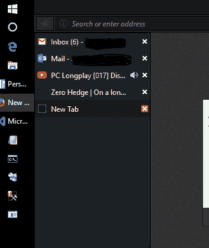

# 我仍然使用火狐浏览器

> 原文:[https://dev.to/antonfrattaroli/i-still-use-firefox](https://dev.to/antonfrattaroli/i-still-use-firefox)

Chrome 真的很受欢迎。我很确定每个人都知道。[图表确认](http://gs.statcounter.com/browser-market-share)。我现在还用火狐。

### 侧标签页

一个好的侧标签扩展是我使用 Firefox 的主要原因。顶部的一排标签是有史以来最糟糕的事情。列表很棒:

[T2】](https://res.cloudinary.com/practicaldev/image/fetch/s--GRi3SWvO--/c_limit%2Cf_auto%2Cfl_progressive%2Cq_auto%2Cw_880/https://thepracticaldev.s3.amazonaws.com/i/48uta77gpvm5sclv84h4.png)

我使用“标签树”扩展(谢谢谢尔盖泽伦佐夫)。Chrome 有一些侧边标签扩展，但我认为它们不可用。

### 就是这样

侧边标签是我使用 Firefox 的唯一原因。

### 有什么不同？

由于我在笔记本电脑上使用 Firefox，我希望所有内容都能同步到我的手机上，这样我就不用重新输入所有密码了。相比 Chrome，我更喜欢 Android 标签屏的 Firefox。这是我注意到的唯一区别，所以效果很好。

我一整天都在使用开发工具，我发现 Firefox 开发工具更直观。Chrome 可以把它的“元素”、“源代码”、“应用程序”标签塞进去——我更喜欢“检查器”、“调试器”、“存储”。老实说，对我来说没什么区别。一些人对开发工具有强烈的感觉。

如果我曾经调试过跨浏览器的问题，我的其他(更流行的)浏览器是全新安装的。很高兴有。

Firefox 不支持集成 windows 身份验证。我没意见。

我不明白为什么更多的人不要求侧标签。