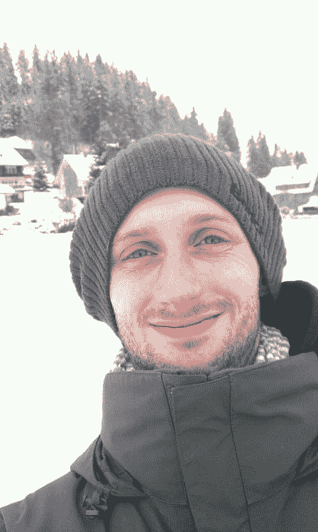

# 嗨，我是马可，尼斯 2 美图

> 原文：<https://dev.to/nice2meatu/hi-im-marco-nice2meatu>

我结婚了，有两个很棒的女儿。我们四个住在德国的弗赖堡，在黑森林的门口。

这张照片显示了我坐在雪橇上下山后的雪景。好玩的时代: 

我做编码快 10 年了，职业生涯初期一直在非常小的公司工作(比如一个老板，我，就是这样)。2016 年 11 月起，我在巴德克罗津根 [NIMIUS GmbH](http://nimius.net) 工作(离弗莱堡很近)。在这之前我一直在用[砸杂志](https://smashingmagazine.com)。

你可以在推特上找到我，我的名字是 [@nice2meatu](https://twitter.com/nice2meatu)

我主要用这些语言编程:HTML、CSS，目前正在学习更多关于 Vue.js 的知识。

很高兴见到你。