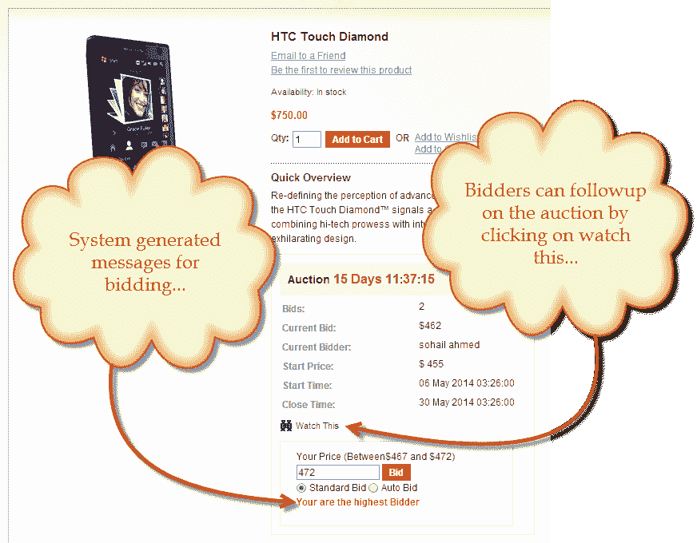
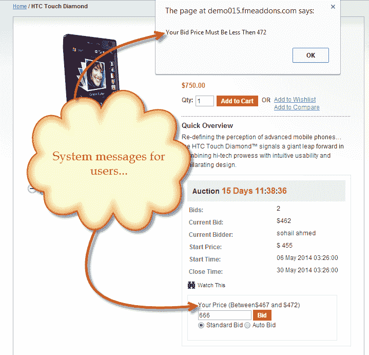

# FMEAddons 的 Magento 拍卖扩展

> 原文:[https://dev . to/fmeaddons/magento-auction-extension-by-fmeaddons](https://dev.to/fmeaddons/magento-auction-extension-by-fmeaddons)

FMEAddons 的 Magento auction extension 是一个在 Magento 中运行拍卖程序的电子商务解决方案。该扩展在您的电子商店上创建了一个单独的页面，向客户显示可供投标的产品。Magento 的拍卖扩展也允许用户手动出价和设置自动出价。这个插件支持在你的电子商店上进行电子湾风格的竞价，这是最值得称赞的竞价风格。

**Magento 拍卖扩展的特性**

*   手动和自动投标
*   通知客户有关投标更新的信息
*   使用 Ajax 技术
*   允许多个获奖者
*   获奖者的含税和不含税
*   100%退款保证
*   免费终身支持和升级

[T2】](https://res.cloudinary.com/practicaldev/image/fetch/s--rHYMUzZk--/c_limit%2Cf_auto%2Cfl_progressive%2Cq_auto%2Cw_880/https://thepracticaldev.s3.amazonaws.com/i/xzxv4z2prrpcuu7vog7e.png)

[T2】](https://res.cloudinary.com/practicaldev/image/fetch/s--JcCmO5QY--/c_limit%2Cf_auto%2Cfl_progressive%2Cq_auto%2Cw_880/https://thepracticaldev.s3.amazonaws.com/i/rr0laz5r2bnz4ivvylk7.png)