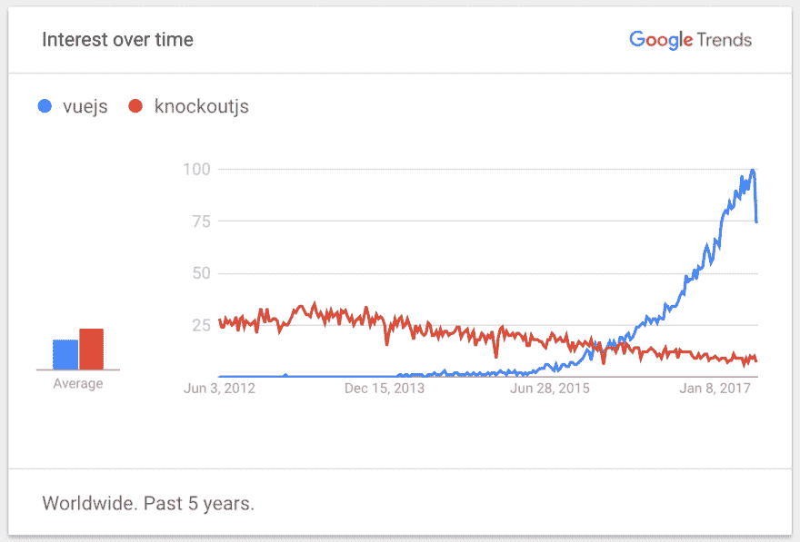

# 从 KnockoutJS 迁移到 VueJS

> 原文:[https://dev.to/jesalg/migrating-from-knockoutjs-to-vuejs](https://dev.to/jesalg/migrating-from-knockoutjs-to-vuejs)

最近，我一直在寻找一个框架来替换现有应用程序中的 KnockoutJS。虽然 KO 很好地实现了它的目的，但是多年来它并没有得到积极的维护，并且在特性和社区采用方面很大程度上没有跟上新的 JS 框架。

在做了一些研究来寻找它的替代品后，我选择了 VueJS。它似乎最符合 Knockout 的 MVVM 模式，同时具有足够的模块化和可扩展性，如果需要，可以使用其官方的[状态管理](https://vuex.vuejs.org/en/) & [路由](http://router.vuejs.org/en/)库作为一个完整的 MVC 框架。最重要的是，它似乎有一个[繁荣的社区](https://github.com/vuejs/awesome-vue)，这在考虑一个框架时很重要。

因此，作为一名 KnockoutJS 开发人员，让我们来了解一下该框架的一些最熟悉的方面，看看它是如何转化为 VueJS 的。

## viewmode

在 KO 中，VM 可以像一个对象文字或函数一样简单。这里有一个简单的例子:

```
var yourViewModel = function(args) {
  this.someObv = ko.observable();
  this.someObv.subscribe(function(newValue) {
    //...
  });
  this.computedSomeObv = ko.computed(function() {
    //...
  });
  this.someMethod = function(item, event) {
    //...
  }
}; 
```

<svg width="20px" height="20px" viewBox="0 0 24 24" class="highlight-action crayons-icon highlight-action--fullscreen-on"><title>Enter fullscreen mode</title></svg> <svg width="20px" height="20px" viewBox="0 0 24 24" class="highlight-action crayons-icon highlight-action--fullscreen-off"><title>Exit fullscreen mode</title></svg>

**用法** :

```
ko.applyBindings(new yourViewModel(someArgs), document.getElementById("element_id")); 
```

<svg width="20px" height="20px" viewBox="0 0 24 24" class="highlight-action crayons-icon highlight-action--fullscreen-on"><title>Enter fullscreen mode</title></svg> <svg width="20px" height="20px" viewBox="0 0 24 24" class="highlight-action crayons-icon highlight-action--fullscreen-off"><title>Exit fullscreen mode</title></svg>

VueJS 有一个非常相似的概念，尽管 VM 总是一个传入 Vue 实例的对象文字。它还提供了更多的结构和更丰富的事件模型。VueJS 中有一个虚拟机存根:

```
var yourViewModel = new Vue({
  data: {
    someKey: someValue
  },
  watch: {
    someKey: function(val) {
      // Val has changed, do something, equivalent to ko's subscribe
    }
  },
  computed: {
    computedKey: function() {
      // Return computed value, equivalent to ko's computed observables
    }
  },
  methods: {
    someMethod: function() { ... }
  },
  created: function () {
    // Called synchronously after the instance is created.
  },
  mounted: function () {
    // Called after the instance has just been mounted where el is replaced by the newly created vm.$el
  },
  updated: function () {
    // Called after a data change causes the virtual DOM to be re-rendered and patched.
  },
  destroyed: function () {
    // Called after a Vue instance has been destroyed
  },
}); 
```

<svg width="20px" height="20px" viewBox="0 0 24 24" class="highlight-action crayons-icon highlight-action--fullscreen-on"><title>Enter fullscreen mode</title></svg> <svg width="20px" height="20px" viewBox="0 0 24 24" class="highlight-action crayons-icon highlight-action--fullscreen-off"><title>Exit fullscreen mode</title></svg>

为了简洁起见，我没有列出这个例子中的所有事件挂钩。我建议查看这个[生命周期图](https://vuejs.org/v2/guide/instance.html#Lifecycle-Diagram)以获得完整的图片。

VueJS 还提供了一种有趣的方式，使用一种叫做 Mixins 的东西在虚拟机之间组织和共享公共代码。使用一个 [Mixin](https://vuejs.org/v2/guide/mixins.html#ad) 与仅仅使用一个旧的 JS 库相比，有一些优点和缺点，但是这是值得研究的。

**用法** :

```
yourViewModel.$mount(document.getElementById("element_id")); 
```

<svg width="20px" height="20px" viewBox="0 0 24 24" class="highlight-action crayons-icon highlight-action--fullscreen-on"><title>Enter fullscreen mode</title></svg> <svg width="20px" height="20px" viewBox="0 0 24 24" class="highlight-action crayons-icon highlight-action--fullscreen-off"><title>Exit fullscreen mode</title></svg>

关于上面的语法需要注意的是，它完全是可选的。您还可以将 VM 中的`el`属性的值设置为`#element_id`，并跳过对 mount 函数的显式调用。

## 绑定

KO 开发人员非常熟悉绑定的概念。我确信在使用 KO 的整个过程中，我们都创建或使用了许多自定义绑定。下面是定制绑定存根在 KO:
中的样子

```
ko.bindingHandlers.yourBindingName = {
  init: function(element, valueAccessor, allBindings, viewModel, bindingContext) {
    // This will be called when the binding is first applied to an element
    // Set up any initial state, event handlers, etc. here
  },
  update: function(element, valueAccessor, allBindings, viewModel, bindingContext) {
    // This will be called once when the binding is first applied to an element,
    // and again whenever any observables/computeds that are accessed change
    // Update the DOM element based on the supplied values here.
  }
}; 
```

<svg width="20px" height="20px" viewBox="0 0 24 24" class="highlight-action crayons-icon highlight-action--fullscreen-on"><title>Enter fullscreen mode</title></svg> <svg width="20px" height="20px" viewBox="0 0 24 24" class="highlight-action crayons-icon highlight-action--fullscreen-off"><title>Exit fullscreen mode</title></svg>

**用法** :

```
<span data-bind="yourBindingName: { some: args }" /> 
```

<svg width="20px" height="20px" viewBox="0 0 24 24" class="highlight-action crayons-icon highlight-action--fullscreen-on"><title>Enter fullscreen mode</title></svg> <svg width="20px" height="20px" viewBox="0 0 24 24" class="highlight-action crayons-icon highlight-action--fullscreen-off"><title>Exit fullscreen mode</title></svg>

VueJS 有一些类似的东西，但它被称为“指令”。下面是 VueJS 指令存根:

```
Vue.directive('yourDirectiveName', {
  bind: function(element, binding, vnode) {
   // called only once, when the directive is first bound to the element. This is where you can do one-time setup work.
  },
  inserted: function (element, binding, vnode) {
    // called when the bound element has been inserted into its parent node (this only guarantees parent node presence, not           // necessarily in-document).
  },
  update: function(element, binding, vnode, oldVnode) {
    // called after the containing component has updated, but possibly before its children have updated. The directive’s value may     // or may not have changed, but you can skip unnecessary updates by comparing the binding’s current and old values
  },
  componentUpdated: function(element, binding, vnode, oldVnode) {
    // called after the containing component and its children have updated.
  },
  unbind: function(element, binding, vnode) {
    // called only once, when the directive is unbound from the element.
  },
}) 
```

<svg width="20px" height="20px" viewBox="0 0 24 24" class="highlight-action crayons-icon highlight-action--fullscreen-on"><title>Enter fullscreen mode</title></svg> <svg width="20px" height="20px" viewBox="0 0 24 24" class="highlight-action crayons-icon highlight-action--fullscreen-off"><title>Exit fullscreen mode</title></svg>

**用法** :

```
<span v-bind="{yourDirectiveName: '{ some: args }' }" /> 
```

<svg width="20px" height="20px" viewBox="0 0 24 24" class="highlight-action crayons-icon highlight-action--fullscreen-on"><title>Enter fullscreen mode</title></svg> <svg width="20px" height="20px" viewBox="0 0 24 24" class="highlight-action crayons-icon highlight-action--fullscreen-off"><title>Exit fullscreen mode</title></svg>

如你所见，VueJS 提供了几个额外的生命周期挂钩，但在大多数情况下，它与 KnockoutJS 非常相似。所以将旧的绑定转换成新的指令并不太难。

在大多数情况下，您应该能够将`init`函数中的所有内容移动到`inserted`函数中。就`update`功能而言，它基本上保持不变，但是你现在可以比较`vnode`和`oldVnode`来避免必要的更新。最后，如果您的自定义绑定使用了 KO 的处置回调函数，即`ko.utils.domNodeDisposal.addDisposeCallback`，您可以将该逻辑移到`unbind`函数中。

你会注意到的另一件事是用法语法有点不同，VueJS 使用不同的前缀为`v-`的属性来处理各种事情，例如`v-bind`用于绑定属性，`v-on`用于绑定事件，`v-if/for`用于条件/循环，等等。

除此之外，还有一个简写的语法，它可能会在一开始使事情变得混乱，这可能是开发者从 Knockout 过渡到 Vue 的最大问题。所以我建议花些时间浏览一下[模板语法](https://vuejs.org/v2/guide/syntax.html)文档。

## 扩展器

KO 中另一个我们非常熟悉的工具是 extender 的概念，它对于增加可观测量非常有用。这里有一个简单的扩展器存根:

```
ko.extenders.yourExtender = function (target, args) {
  // Observe / manipulate the target based on args and returns the value
}; 
```

<svg width="20px" height="20px" viewBox="0 0 24 24" class="highlight-action crayons-icon highlight-action--fullscreen-on"><title>Enter fullscreen mode</title></svg> <svg width="20px" height="20px" viewBox="0 0 24 24" class="highlight-action crayons-icon highlight-action--fullscreen-off"><title>Exit fullscreen mode</title></svg>

**用法** :

```
<span data-bind="text: yourObv.extend({ yourExtender: args })" /> 
```

<svg width="20px" height="20px" viewBox="0 0 24 24" class="highlight-action crayons-icon highlight-action--fullscreen-on"><title>Enter fullscreen mode</title></svg> <svg width="20px" height="20px" viewBox="0 0 24 24" class="highlight-action crayons-icon highlight-action--fullscreen-off"><title>Exit fullscreen mode</title></svg>

VueJS 中最接近扩展器的是“过滤器”的概念，它可以用来实现类似的目标。下面是一个过滤存根的样子:

```
Vue.filter('yourFilter', function (value, args) {
  // Manipulate the value based on the args and return the result
}); 
```

<svg width="20px" height="20px" viewBox="0 0 24 24" class="highlight-action crayons-icon highlight-action--fullscreen-on"><title>Enter fullscreen mode</title></svg> <svg width="20px" height="20px" viewBox="0 0 24 24" class="highlight-action crayons-icon highlight-action--fullscreen-off"><title>Exit fullscreen mode</title></svg>

**用法** :

```
<span>{{ "{{" }} yourVar | yourFilter(args) }}</span> 
```

<svg width="20px" height="20px" viewBox="0 0 24 24" class="highlight-action crayons-icon highlight-action--fullscreen-on"><title>Enter fullscreen mode</title></svg> <svg width="20px" height="20px" viewBox="0 0 24 24" class="highlight-action crayons-icon highlight-action--fullscreen-off"><title>Exit fullscreen mode</title></svg>

或者，您也可以在`v-bind`属性
中调用一个过滤函数

```
<span v-bind='{style: {width: $options.filters.yourFilter(yourVar, args)}}'/> 
```

<svg width="20px" height="20px" viewBox="0 0 24 24" class="highlight-action crayons-icon highlight-action--fullscreen-on"><title>Enter fullscreen mode</title></svg> <svg width="20px" height="20px" viewBox="0 0 24 24" class="highlight-action crayons-icon highlight-action--fullscreen-off"><title>Exit fullscreen mode</title></svg>

## 组件

KO 提供了创建组件的能力，以帮助将 UI 代码组织成独立的、可重用的块。这里有一个简单的组件存根:

```
ko.components.register('your-component', {
  viewModel: function(params) {
    this.someObv = ko.observable(params.someValue);
  },
  template: { element: 'your-component-template' },
}); 
```

<svg width="20px" height="20px" viewBox="0 0 24 24" class="highlight-action crayons-icon highlight-action--fullscreen-on"><title>Enter fullscreen mode</title></svg> <svg width="20px" height="20px" viewBox="0 0 24 24" class="highlight-action crayons-icon highlight-action--fullscreen-off"><title>Exit fullscreen mode</title></svg>

**用法** :

```
<your-component params='someValue: "Hello, world!"'></your-component> 
```

<svg width="20px" height="20px" viewBox="0 0 24 24" class="highlight-action crayons-icon highlight-action--fullscreen-on"><title>Enter fullscreen mode</title></svg> <svg width="20px" height="20px" viewBox="0 0 24 24" class="highlight-action crayons-icon highlight-action--fullscreen-off"><title>Exit fullscreen mode</title></svg>

VueJS 还能够创建组件。与 KO 相比，它们的功能更加丰富，拥有更好的生命周期挂钩。他们也对这个框架感到更加“熟悉”。Vue 中有一个简单的组件存根:

```
Vue.component('your-component', {
  props: ['someValue']
  data: function () {
     return {
       someKey: this.someValue
     }
  },
  template: '#your-component-template'
}) 
```

<svg width="20px" height="20px" viewBox="0 0 24 24" class="highlight-action crayons-icon highlight-action--fullscreen-on"><title>Enter fullscreen mode</title></svg> <svg width="20px" height="20px" viewBox="0 0 24 24" class="highlight-action crayons-icon highlight-action--fullscreen-off"><title>Exit fullscreen mode</title></svg>

**用法** :

```
<your-component someValue="Hello, world!"></your-component> 
```

<svg width="20px" height="20px" viewBox="0 0 24 24" class="highlight-action crayons-icon highlight-action--fullscreen-on"><title>Enter fullscreen mode</title></svg> <svg width="20px" height="20px" viewBox="0 0 24 24" class="highlight-action crayons-icon highlight-action--fullscreen-off"><title>Exit fullscreen mode</title></svg>

这只是触及了 Vue 中组件的一些皮毛。它们绝对值得深入研究。也许我会在另一篇文章中介绍更多。

## 第三方插件/库/工具

**映射**-knockout js 生态系统中常用的插件之一是 [ko.mapping](http://knockoutjs.com/documentation/plugins-mapping.html) 插件，它帮助将 JavaScript 对象转换成适当的可观察对象。对于 VueJS，这是不需要的，因为 Vue 通过遍历 VM 的所有属性并使用`Object.defineProperty`将它们转换为 getter/setter 来处理这些问题。这使得 Vue 可以在属性被访问或修改时执行依赖跟踪和更改通知，同时对用户保持不可见。

**验证** -除了作图，[敲除-验证](https://github.com/Knockout-Contrib/Knockout-Validation)文库是生态系统的另一个支柱。有了 VueJS， [vee-validate](https://github.com/logaretm/vee-validate) 就是它的流行对应物，提供开箱即用的类似特性。

**调试** -有一个好的调试工具对于开发来说很重要。KnockoutJS 有 [Knockoutjs 上下文调试器](https://github.com/Knockout-Contrib/Knockout-Validation)，而 VueJS 提供了与 [Vue.js devtools](https://chrome.google.com/webstore/detail/vuejs-devtools/nhdogjmejiglipccpnnnanhbledajbpd) 类似的东西

## 最后...

VueJS 是一个功能极其丰富的框架，具有各种定制和代码组织选项。它是发展最快的框架之一，被一些知名项目采用，如 Laravel、GitLab 和 PageKit 等。希望这将成为未来的一个好赌注！

我将留给你们这个图表，它很好地总结了这两个框架的故事:

[T2】](https://res.cloudinary.com/practicaldev/image/fetch/s--ii6_Bn6B--/c_limit%2Cf_auto%2Cfl_progressive%2Cq_auto%2Cw_880/https://jes.al/public/wp-content/uploads/Screen%2520Shot%25202017-05-29%2520at%252010.36.00%2520PM.png)

*这篇文章最初发表在[我的博客](https://jes.al/2017/05/migrating-from-knockoutjs-to-vuejs/)上。如果你喜欢这篇文章，请在社交媒体上分享，并在推特上关注我！*