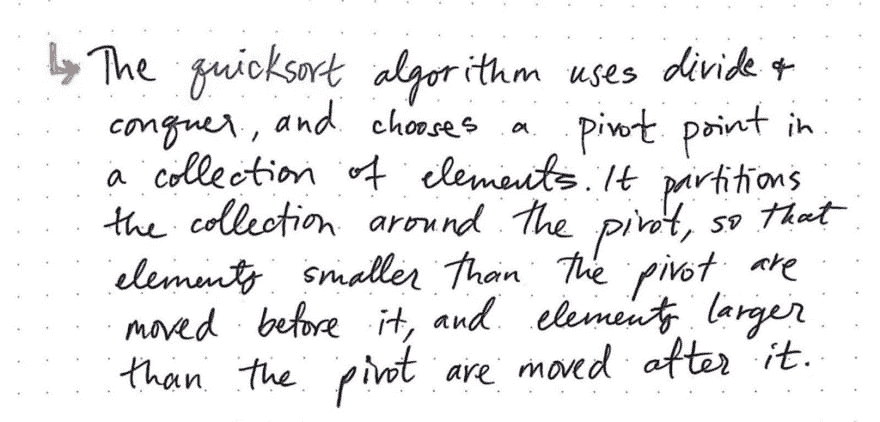
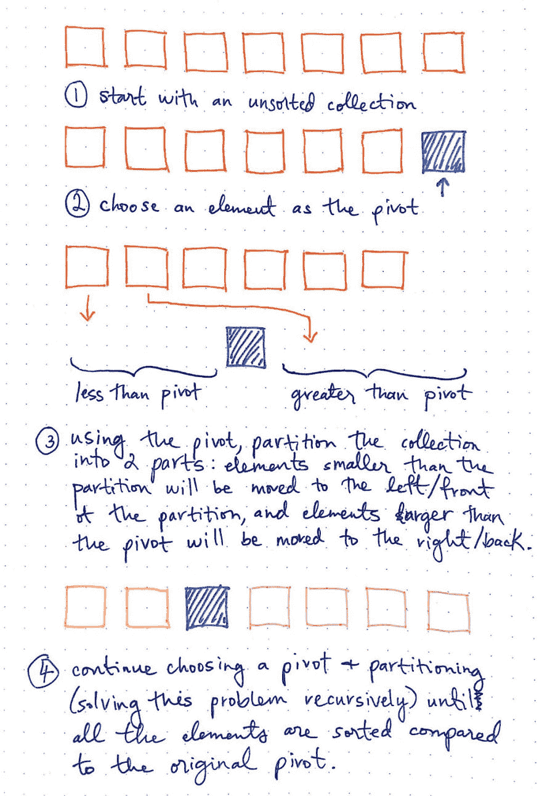
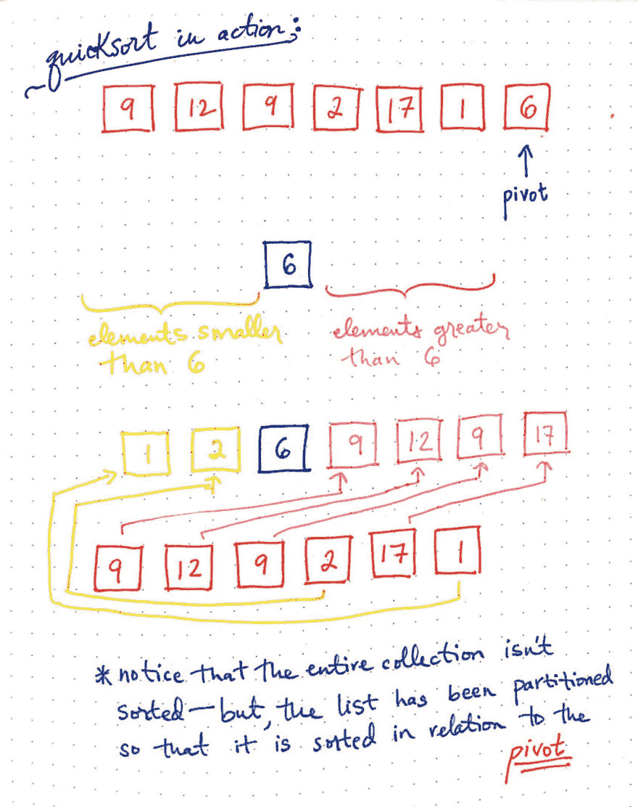
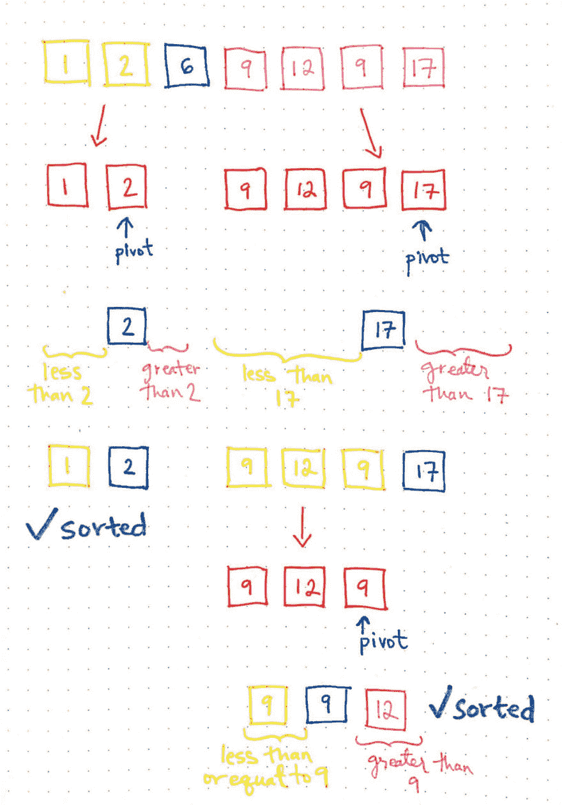
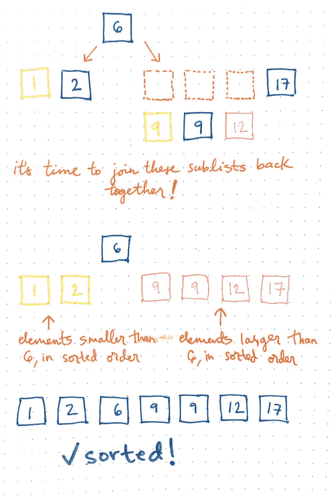
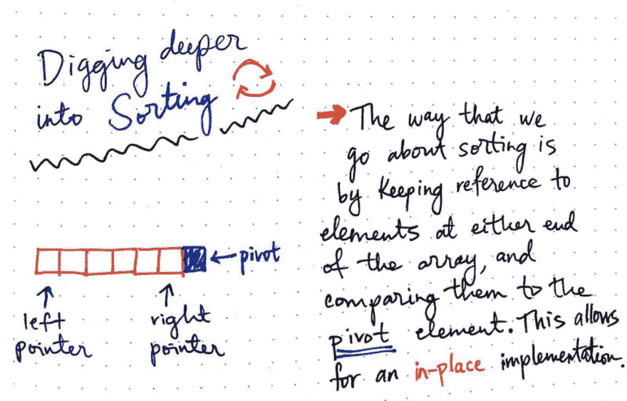
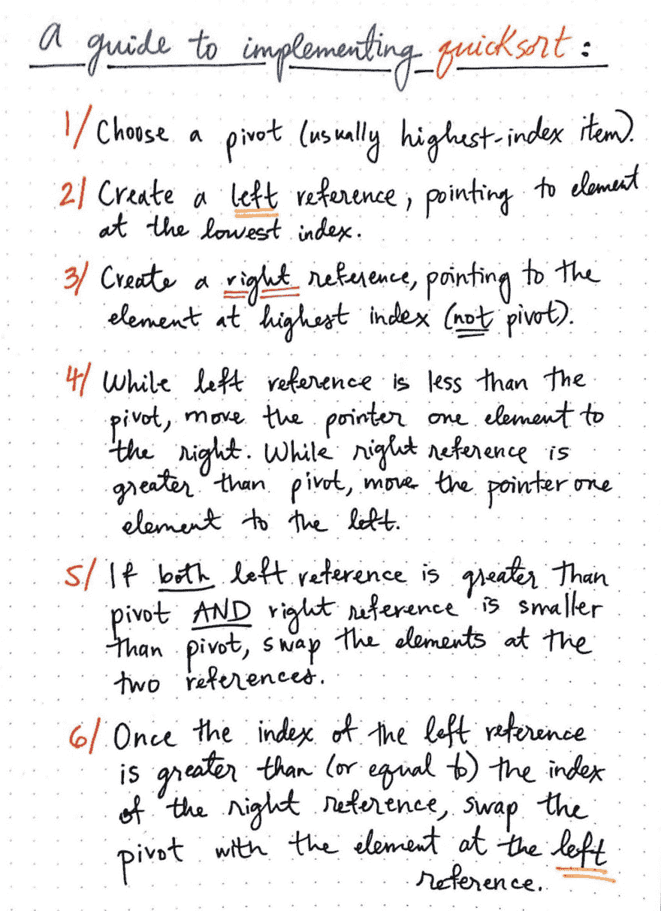
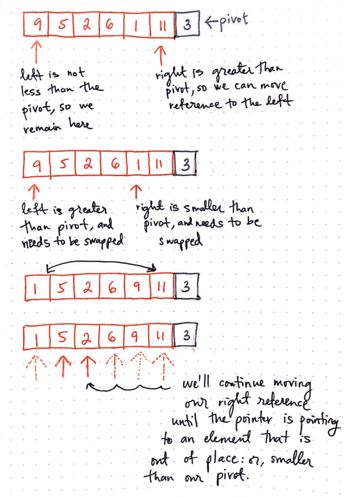
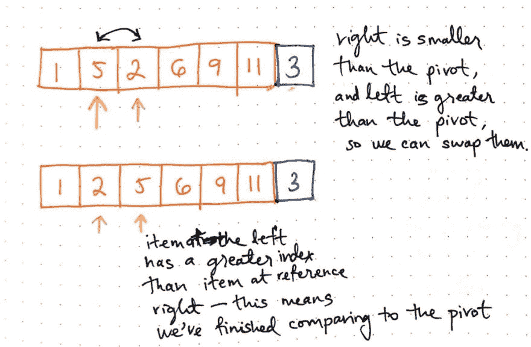
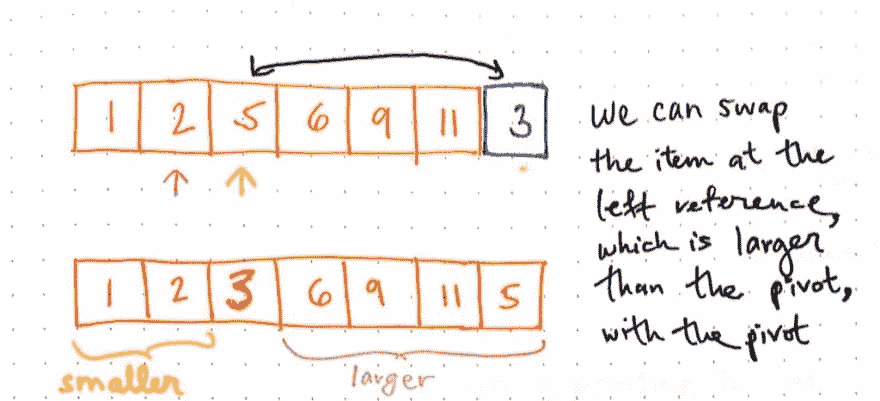

# 透视理解快速排序[第 1 部分]

> 原文：<https://dev.to/vaidehijoshi/pivoting-to-understand-quicksort-part-1>

不管你是排序算法的新手还是已经熟悉了其中的一些，你可能已经在不同的上下文中听说过或读到过当今的算法。它的名声往往是名不虚传的！

快速排序——我们将在本周和下周学习的算法——被许多人称为“最快”和“最有效”的排序算法。事实上，在我和其他程序员关于排序算法的几次对话中，quicksort 几乎总是作为最好的算法出现，而且似乎很少有人对这个事实进行争论。

但是，什么是快速排序呢？每个人都说它很棒，我们应该使用它，而且算法的问题已经基本解决了！然而我们中的一些人——包括我自己——甚至不知道那是什么！是时候改变这种状况了。如果我们要成为真正的算法大师，我们必须对这个臭名昭著的算法了如指掌！

是时候支点了，终于明白一个快速排序算法是怎么运作的了！

### 快速学习快速排序基础知识

快速排序算法是一个特别有趣的算法，我花了一段时间才理解它。我们将首先关注它的内部工作和功能。

关于 quicksort，至少有一点我们已经很熟悉了——我们可能还不知道。这个算法做了一些我们以前见过的事情:它把一个大问题分解成更小的子问题。我们可能还记得这个概念，当我们[学习合并排序](https://dev.to/vaidehijoshi/making-sense-of-merge-sort-part-2)的时候！这也被称为*分治算法*，它将一个问题分解成更简单的版本。如果这还不明显，不要担心；稍后，当我们浏览算法本身时，它会变得更加清晰。

好的，那么这个算法*到底做了什么*？ ***快速排序算法*** 是一种排序算法，通过选择一个支点，并围绕该支点对集合进行分区，使小于该支点的元素在它之前，大于该支点的元素在它之后，来对集合进行排序。它继续选择一个支点，将集合分解为单个元素的列表，然后将它们重新组合在一起，形成一个排序列表。

<figure>[](https://res.cloudinary.com/practicaldev/image/fetch/s--yNrX7ORL--/c_limit%2Cf_auto%2Cfl_progressive%2Cq_auto%2Cw_880/https://cdn-images-1.medium.com/max/1024/1%2AnaIVyW99FsqfTZhw06YJ0g.jpeg) 

<figcaption>快速排序:一个定义</figcaption>

</figure>

如果我们再读一遍我们的定义，我们会发现这个算法实际上有两个核心部分。

1.  首先，quicksort 确定了一个叫做 ***pivot*** 的东西，它是集合中一个*有点*的任意元素。
2.  接下来，使用支点， ***将*** (或划分)较大的未排序集合分成两个较小的列表。它使用一些智能逻辑来决定如何进行分区:它将所有小于 pivot 的元素移到 pivot 元素的左边(前面),将所有大于 pivot 的元素移到 pivot 元素的右边(后面)。

等等，这有什么好的？为什么要对较大的列表进行划分，使得小于轴心的元素排在第一位，大于轴心的元素排在最后？好吧，让我们看一个简单的例子，还没有任何真正的内容，看看我们是否能确定这个算法的巧妙之处。

在下图中，我们从一个未排序的集合开始。

<figure>[](https://res.cloudinary.com/practicaldev/image/fetch/s--IngrIXLo--/c_limit%2Cf_auto%2Cfl_progressive%2Cq_auto%2Cw_880/https://cdn-images-1.medium.com/max/1024/1%2AcHKEM0Ni1YaU8WeEgepq3g.jpeg) 

<figcaption>快速排序如何工作</figcaption>

</figure>

我们现在选择最后一个元素作为枢纽。事实证明，选择 pivot 元素有许多不同的方式，您选择什么样的确实很重要——但稍后会更详细。以最后一个元素为轴心的 quicksort 实现很常见，所以这也是我们在这里要做的。

好，我们选择最后一个元素作为支点。现在，我们的快速排序算法将获取所有剩余的其他元素，并对它们进行重新排序，以使所有比我们的 pivot 的小的项目*在它的前面或左边，而所有比我们的 pivot 的*大的项目*在它的后面或右边。*

既然我们知道 quicksort 是一个分治算法，我们也知道它将实现与我们刚刚在两个分区子列表上看到的完全相同的逻辑！换句话说，它将在这里使用递归:它将为两个子列表中的每一个选择一个 pivot 元素，然后将每个子列表分成它自己的两半:一半包含所有小于 pivot 的元素，另一半包含所有大于 pivot 的元素。它将继续递归地调用自己的*直到每个列表中只有一个元素——记住，根据定义，列表中的一个元素是有序的。*

那么，这个为什么强大呢？好吧，让我们更仔细地看看我们从这里开始的两个分区。用黄色标记的左侧分区代表所有小于轴心的项目。右边的分区用粉红色标记，代表所有大于枢轴的项目。

> 尽管列表还没有完全排序，但我们知道项目相对于枢纽的顺序是正确的。这意味着我们永远不需要比较分区左边的元素和右边的元素。我们已经知道它们在相对于支点的正确位置上。

既然我们已经了解了 quicksort 在分区方面有多聪明，那么最好提一下它是如何选择一个支点——或者至少，它应该如何选择一个支点。前面，我们了解到枢轴是集合中一个*有点*任意的元素。pivot 元素要稍微随机一点，但是我们选择什么作为 pivot 超级重要！

随着我们对快速排序算法的了解越来越多，我们将看到不同的实现将以不同的方式确定 pivot 元素。从本质上来说，一个支点没有对错之分。然而，有几件事要记住。

<figure>[](https://res.cloudinary.com/practicaldev/image/fetch/s--Ja6WQ2HG--/c_limit%2Cf_auto%2Cfl_progressive%2Cq_auto%2Cw_880/https://cdn-images-1.medium.com/max/1024/1%2AsNTntI4oR51kdp9-CQEqxg.jpeg) 

<figcaption>我们选择什么作为支点很重要！</figcaption>

</figure>

快速排序算法应该总是选择最中间的元素作为枢纽。有些算法会*字面上的*选择最中心的项目作为枢纽，而其他算法会选择第一个或最后一个元素。但是当我们说“最中间的元素”时，我们的意思是在整个未排序集合的 ***中间*** 的元素。这最终变得非常重要，因为我们希望被划分的两半——小于轴心的元素和大于轴心的元素——几乎相等。如果他们不平等或不平衡，我们会遇到一些大问题！

我们将在下周深入探讨为什么这很重要；现在，只要知道我们如何选择支点是重要的，但它不一定是一个特别的元素。

### 快速排序的快速工作

现在我们对 quicksort 的工作原理有了更多的了解，是时候让我们看看它的实际应用了！我们将通过快速排序对一个小的数字集合进行排序来做到这一点，这些数字可能看起来像这样:[9，12，9，2，17，1，6]。

<figure>[](https://res.cloudinary.com/practicaldev/image/fetch/s--8mdvPJuB--/c_limit%2Cf_auto%2Cfl_progressive%2Cq_auto%2Cw_880/https://cdn-images-1.medium.com/max/1024/1%2ArjpGqzlhNO8SdqgQYAp76w.jpeg) 

<figcaption>快速行动排序:第一部分。</figcaption>

</figure>

我们将坚持我们目前所做的，并选择最后一个元素作为我们的支点。在这种情况下，最后一个元素是 6，所以这将是我们的枢纽元素。

在这里显示的例子中，我们将移动剩余的项目，这样所有比元素 6 小的都在元素 6 的左边，所有比元素 6 大的都在元素 6 的右边。

例如，第一个元素是 9，我们知道它大于 6。因此，它被移动到正确的分区。这同样适用于未排序列表中的下几个元素:12 和 9。但是，2 小于 6，所以它被移动到左侧分区。

请注意，一旦我们完成了所有元素相对于轴心的移动，我们仍然没有完成！整个集合尚未根据所有元素进行排序；但是，我们知道集合已经相对于 pivot 元素进行了排序。这很有帮助，因为我们不需要比较左分区中的元素和右分区中的元素，这将为我们节省一些时间。

那么，如果我们还没有完成，我们下一步需要做什么？快速排序是一种分治算法，这意味着它被设计成在更小的子问题上使用相同的解决方案。换句话说，我们可以递归地采取与刚才完全相同的步骤，并将它们应用到仍然需要排序的左右分区。

<figure>[](https://res.cloudinary.com/practicaldev/image/fetch/s--6qodFgkR--/c_limit%2Cf_auto%2Cfl_progressive%2Cq_auto%2Cw_880/https://cdn-images-1.medium.com/max/1024/1%2Amd0dT0BAlkRiWlWnbH61GQ.jpeg) 

<figcaption>快速行动排序:part 2</figcaption>

</figure>

让我们看看那会是什么样子。

在快速排序演练的第二部分中，我们将对左右分区应用相同的步骤。查看这里显示的插图，我们可以看到我们再次选择两个子列表的最后一个元素作为它们各自的枢纽元素。对于左边的子列表，分区是 2，对于右边的子列表，分区是 17。

接下来，让我们看看左边的子列表。除了 pivot 之外，这个列表中只有一个元素:1。碰巧的是，1 已经在正确的位置了:在枢轴的左边，2，因为它比枢轴小。所以，这个列表是有效排序的！

然而，对于右边的子列表，情况略有不同。除了枢轴之外，还有三个元素:9、12 和 9。它们都比支点小，17，它们都在支点的左边。因此，在给定枢轴的情况下，它们在正确的分区中。但是，我们仍然需要对它们进行分类！

因此，我们将把这三个元素进一步分解成它们自己的子列表:选择一个枢轴(9)，对剩下的两个项目进行排序，使大于 9 的项目在右边，小于或等于 9 的项目在左边。

<figure>[](https://res.cloudinary.com/practicaldev/image/fetch/s--1ghHXmTr--/c_limit%2Cf_auto%2Cfl_progressive%2Cq_auto%2Cw_880/https://cdn-images-1.medium.com/max/1024/1%2Ad5Ampu8dRE_N0X3MLcGBOw.jpeg) 

<figcaption>快速行动排序:part 3</figcaption>

</figure>

太好了！现在所有的子列表都已经排序了，只剩下一件事要做:当然是将所有的条目重新组合在一起！

我们排序的最后一个子列表包含这三个元素:[9，9，12]。我们将把这个子列表和它的父子列表连接起来，这样它就包含了这些元素:[9，9，12，17]。

拉德。现在我们可以将这个子列表与左边的分区子列表结合起来:[1，2]。

注意这里的两个分区，左边的*和右边的*，都是相对于枢纽和所有元素进行排序的。换句话说，所有的项目都是有序的！

注意这和我们最近看到的[合并排序](https://dev.to/vaidehijoshi/making-sense-of-merge-sort-part-2)是多么的相似！我们可能会在这里看到一些重复的模式，它们甚至可能有点让人想起[二分搜索法](https://dev.to/vaidehijoshi/leaf-it-up-to-binary-trees)！下周，当我们在运行时查看快速排序的时间复杂度时，我们将会看到这些是如何关联的。但是现在，只要注意到这里的*是*某种模式就足够了。

### 速射对换

我们已经了解了 quicksort 是如何运行的，以及它如何使用递归在越来越小的子列表上一次又一次地实现相同的算法。但是有一件事还不完全清楚:quicksort 实际上是如何将元素分类到左分区和右分区的？我们知道它会移动所有的元素并重新排序——但是这是怎么发生的呢？

我们可能会想到，快速排序只是创建一个全新的数组，并以正确的顺序复制元素，对吗？不完全是。快速排序是首选算法的众多原因之一是因为它在排序时不会占用大量额外空间！这意味着它不能创建重复的数组，因为那样会占用大量的空间和内存。

相反，这种算法就地对元素进行排序，当我们第一次学习排序算法时，我们可能还记得这一点。这意味着 quicksor 直接对输入的数据进行操作，只需要一点点额外的内存空间——通常是恒定的空间量。

那么，如果它不把元素复制到一个新的数组中，它是如何对它们进行排序的呢？答案是:靠*互换*！这可能是快速排序算法中最复杂的部分；然而，一旦我们理解了它，这个算法就更有意义了。

<figure>[](https://res.cloudinary.com/practicaldev/image/fetch/s--e8IdMCke--/c_limit%2Cf_auto%2Cfl_progressive%2Cq_auto%2Cw_880/https://cdn-images-1.medium.com/max/1024/1%2AyNJ2ouI0KNGBJlvxS3ntTA.jpeg) 

<figcaption>深挖整理</figcaption>

</figure>

quicksort 在选择一个枢纽后将元素分类到相应分区的方法是，保持对数组或列表任一端的元素的引用，然后将这些引用处的元素与枢纽进行比较。

> 如果快速排序算法确定两个元素顺序不对，它会依靠其引用将它们交换到集合中正确的位置。

实现交换功能的基本步骤可能有点复杂，所以在运行示例之前，让我们先看看需要采取的步骤。

<figure>[](https://res.cloudinary.com/practicaldev/image/fetch/s--JWJmX5ah--/c_limit%2Cf_auto%2Cfl_progressive%2Cq_auto%2Cw_880/https://cdn-images-1.medium.com/max/1024/1%2AVRpkrRX_WdPnH3duP0Ak_A.jpeg) 

<figcaption>快速排序实施指南</figcaption>

</figure>

首先，我们要选择一个枢轴(通常是最后一个元素)

然后，我们需要创建一个最低索引(第一个)元素的左引用。我们需要创建一个对最高索引(最后一个)元素的右引用——不包括透视。

接下来，我们需要独立地比较左右相对于枢轴的位置。

例如，如果左引用小于主元，那么我们知道它小于主元，并且将在正确的分区中。因此，我们可以增加左引用，移动一个元素(向右)。右边的引用也是如此:如果引用处的元素大于 pivot，我们知道它会在正确的分区中，所以我们可以将它增加一个元素(向左)。

> 然而——如果*两个*左边的引用都大于枢轴*而*右边的引用小于枢轴，我们知道我们偶然发现了两个顺序错误的元素。

在这种情况下，我们可以交换左引用和右引用处的两个元素，以便它们位于正确的位置——并且随后将在正确的分区中结束！

一旦我们完成了所有的元素，我们的左引用将“通过我们的右引用；换句话说，左引用的索引将大于右引用的索引，这意味着我们已经完成了对两个分区的排序。在这一点上，我们可以通过与左侧引用的项目交换来将轴心移动到正确的位置。另一种思考方式是，左边引用的项目移动到右边分区的末尾，并最终成为该子列表的新支点。

让我们通过一个例子来看看 quicksort 是如何进行交换的。

<figure>[](https://res.cloudinary.com/practicaldev/image/fetch/s--y5LsS5dB--/c_limit%2Cf_auto%2Cfl_progressive%2Cq_auto%2Cw_880/https://cdn-images-1.medium.com/max/1024/1%2AsxpPWeeEHFmFh9dL3C0J8Q.jpeg) 

<figcaption>如何快速排序互换:part 1</figcaption>

</figure>

我们从最后一项开始:3。我们将创建一个指向第一个元素 9 的左引用和一个指向最后一个元素 11 的右引用。

在我们的起始位置，左参考不小于支点，这意味着我们需要交换它！然而，右引用*比中枢*大，这意味着它在正确的位置——换句话说，它将在正确的分区中，这是它应该在的地方。

因此，我们将增加右指针，直到我们找到一个比枢轴小的元素，我们可以与左引用交换。事实证明，当我们将正确的引用移动到一个元素上时，我们就到了可以交换项目的情况！数字 1 小于 3，而 9 大于 3。所以，我们将交换这两个元素。

我们将继续移动我们的左右引用，直到这些指针出现在不合适的元素上。

<figure>[](https://res.cloudinary.com/practicaldev/image/fetch/s--GFtMWJgJ--/c_limit%2Cf_auto%2Cfl_progressive%2Cq_auto%2Cw_880/https://cdn-images-1.medium.com/max/1024/1%2A4sq6T2DrkV8SZX-c0pheZQ.jpeg) 

<figcaption>如何快速排序互换:part 2</figcaption>

</figure>

这种情况不会再次发生，直到左指向 5，右指向 2。我们知道，如果左大于支点，右小于支点，两个元素就错位了。因此，我们将交换 5 和 2。

请注意，现在左指针已经超过了右指针，也就是说，左边的项目比右边的项目具有更大的索引。这意味着我们已经完成了所有元素与轴心的比较！

<figure>[](https://res.cloudinary.com/practicaldev/image/fetch/s--l5Yorj3_--/c_limit%2Cf_auto%2Cfl_progressive%2Cq_auto%2Cw_880/https://cdn-images-1.medium.com/max/1024/1%2ARTi3gv4W5L-avsKJ26b0CQ.jpeg) 

<figcaption>如何快速排序互换:partβ3</figcaption>

</figure>

现在的最后一步是用 pivot 元素交换左侧引用的项目。在这种情况下，我们交换 5 和 3。一旦我们做到了这一点，我们可以看到我们的两个分区是正确划分的！所有比枢轴 3 小的元素都在它的左边，所有比枢轴大的元素都在右边！如果我们继续运行 quicksort，我们将划分这两个分区，并递归地调用两个子列表上的 quicksort 算法。

超级酷的事情是实际的交换函数本身并不复杂:

```
function swap(items, leftPointerIndex, rightPointerIndex){
  var tempReference = items[leftPointerIndex];

  items[leftPointerIndex] = items[rightPointerIndex];
  items[rightPointerIndex] = tempReference;
} 
```

但是，它做的事情很酷！它基本上是在元素所在的同一数组的上下文中对元素进行排序，而且是以最有效的方式完成的。

在本系列的第 2 部分中，我们将自己实现这个算法！我们还将研究 quicksort 的运行时复杂性，quicksort 什么时候会出现严重错误，以及为什么它被认为是最有效的排序算法。在那之前，我把这个悬念留给你！

### 资源

各种编程语言大量使用 Quicksort 来尽可能有效地实现它们的排序算法。事实证明，关于这种特定算法的资源有很多，要把它们全部筛选一遍可能有点令人不知所措(至少对我来说是这样！).如果你想了解更多关于快速排序的知识，这里有几个我最喜欢的地方。

1.  [快速排序算法](https://www.youtube.com/watch?v=COk73cpQbFQ&t=111s)，mycodeschool
2.  [排序算法:快速排序](http://faculty.simpson.edu/lydia.sinapova/www/cmsc250/LN250_Weiss/L16-QuickSort.htm)，莉迪亚·西纳波娃教授
3.  [快速分类](https://www.youtube.com/watch?v=XE4VP_8Y0BU)，电脑爱好者
4.  [数据结构和算法——快速排序](https://www.tutorialspoint.com/data_structures_algorithms/quick_sort_algorithm.htm)，教程要点
5.  [【quick port】](http://www.geeksforgeeks.org/quick-sort/)，GeeksForGeeks
6.  [4 分钟快速排序](https://www.youtube.com/watch?v=Hoixgm4-P4M&t=1s)，迈克尔·桑波尔

* * *

*本帖最初发表于[medium.com](https://medium.com/basecs/pivoting-to-understand-quicksort-part-1-75178dfb9313)T3】*