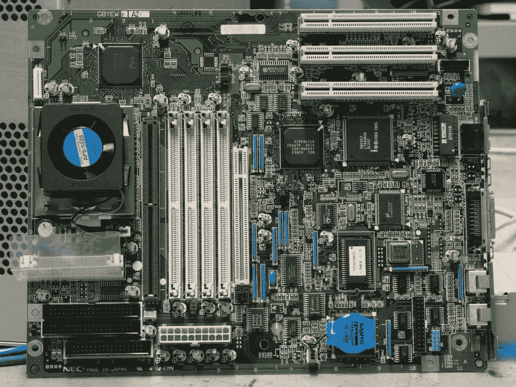

# 我的选择笔记本电脑编程的初学者指南

> 原文:[https://dev . to/rupertsmithers/my-beginners-guide-to-choose-a-laptop-for-programming](https://dev.to/rupertsmithers/my-beginners-guide-to-choosing-a-laptop-for-programming)

编程可以有很多乐趣！不，说真的。这是一个非常有创造性的职业，在很多方面都是有益的。在一个非常重要的条件下:那就是如果你使用顶尖的工具。滞后、故障等诸如此类的东西会扼杀你的情绪，使你的编码成为一项极其令人沮丧的活动。目前，我将省去软件细节，并在下一篇文章中讨论编码编辑器。今天我将把注意力集中在硬东西上，即笔记本电脑。以下是我的建议，告诉你在选择时应该考虑什么。我将按重要性列出这些问题，从最重要的开始，一直到可选的。

## 先做第一件事

为什么选择笔记本电脑？简单明了——方便移动。现代笔记本电脑是非常强大的机器，它们可以提供您需要的一切，甚至更多，都在一个紧凑的光滑的情况下。你不必坐在办公桌前工作，这太棒了。不仅对自由职业者，而且对我们所有人来说，这都是一个巨大的优势。

一些程序员对笔记本电脑有一种先入为主的观念，认为它们不如台式机。在它们存在的早期，它们是如此，但现在，用于网络浏览和媒体娱乐的轻薄小巧玩具的利基市场被平板电脑和智能手机占据，而笔记本电脑不断增强肌肉，占据台式机的生存空间。

只有两个原因让你想要一个大盒子放在你的桌子下面，即:实惠的价格和相对容易的硬件升级。嗯，你不可能同时拥有这一切，而且肯定会有所取舍。

## 核心问题

你并不真的需要高端 CPU 来做你的编程。不过，我也不会推荐低端处理器。问题是，今天的软件对资源越来越贪婪。你会想一直管理繁重的编程工作，即使有其他东西在运行。无论你是在开发一个应用程序，一个网站，还是其他东西，你都必须处理图形和声音编辑器以及所有附加的应用程序。所以，拥有一个顶尖的 CPU 从来都不会有坏处。

## 足够的空间

你一定要有一个灵活和宽敞的固态硬盘-建议 1 TB。经常听人说今天 256 GB 就够了。毕竟，你可以通过选择云服务或你自己的 NAS 来存储和访问你的媒体。这对于媒体来说很好，但是，我们庞大的文件并不局限于音轨和片段。同样，你永远不会知道你可能需要什么软件，今天，当一个简单的东西，如防病毒程序需要超过 2 GB 的安装本身，1TB 似乎不是浪费金钱。当然，较小的 SSD 也是可以管理的，但你必须通过跳圈来避免性能问题。查看 [makemacfast](https://makemacfast.com/) 获得您可能遇到的速度问题的完整列表。

[T2】](https://res.cloudinary.com/practicaldev/image/fetch/s--7whw6c7N--/c_limit%2Cf_auto%2Cfl_progressive%2Cq_auto%2Cw_880/https://thepracticaldev.s3.amazonaws.com/i/og4no9u2e70q0184yho5.jpeg)

## 回到正题

我说了嘀咕了吗？我是说拉姆，真的。虽然很多人说 8GB 内存已经足够了，但我还是会选择 16GB，以防万一。例如，我经常有 2 或 3 个虚拟机在运行，所以知道没有延迟总是好的。此外，作为一个铁杆游戏玩家，我更愿意为任何升级和一两年内可能发布的新游戏做好准备(我知道，我知道，这不是关于编程，但对我们大多数人来说仍然是巨大的，对不对？)游戏变得更贪婪，也无妨。

此外，如果你要进行多任务处理，处理大数据、大图像、矢量等，你会为没有获得 16GB 而自责。仅供参考，8GB 对 Photoshop T1 来说可能没问题，但对 T2 插画师 T3 来说远远不够。

## 变得漂亮生动

幸运的是，每一代集成卡都变得越来越好，所以严格来说，你不需要那个 T2 来编码。然而(我最喜欢的世界)，如果你从事游戏开发或做 3D 建模，你会需要一些更高级的东西，所以考虑专用显卡。对于游戏玩家来说，这是不言而喻的，但这是另一个故事，所以不要让我开始这个故事。

## 多汁的小块

当然，我指的是电池。电池续航时间长并不重要，但值得推荐。还记得我们当初为什么选择笔记本电脑吗？没错，为了移动性。由于电池容量有限，您的移动性也相当有限。当然，你可以在星巴克的电源插座旁边安营扎寨，但这并不总是可行的。此外，告别户外和公路旅行中的工作和娱乐。

总而言之，当你满足于更小的固态硬盘、集成显卡和更少的 RAM 时，你可能会认为你在省钱，但事实上，从长远来看，你可能会抢劫自己。如果你今天就给你的机器装上最好的东西，你不用升级也能生存很久。正如我已经提到的，升级笔记本电脑并不像摆弄一个大盒子那么容易。因此，对于一台移动电脑来说，为了更长的使用寿命，让它装满高端组件是有意义的。