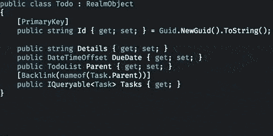

# 领域 101

> 原文:[https://dev.to/jonstodle/realm-101](https://dev.to/jonstodle/realm-101)

这是对 Realm 与 Xamarin 一起使用的全面介绍。当我在 Xamarin 做这个的时候。表单，非常适用于 Xamarin.iOS，Xamarin。安卓、UWP 和 WPF 也是如此。只要有一点想象力，你就可以把它作为 Swift、Java 或 JavaScript 的 101。

在本教程中，我们将构建一个简单的 Todo 应用程序，这是目前的定制。我们将从头开始创建一个 Xamarin。Forms 项目，添加必要的数据，然后构建模型类、UI 和逻辑。

在这个过程中，我还会解释为什么事情会以某种方式完成。如果您以前使用过 SQL-esque 解决方案，那么使用 Realm 时的一些实践可能会与您所习惯的有所不同。

# app

我们正在创建的应用程序只是一个简单的待办事项应用程序。用户将能够创建包含多个待办事项的列表。todo 还可以包含任务，以防用户想要将 todo 分成更小的任务。

## 创建项目

在本教程中，我将使用 Visual Studio for Mac。有些 UI 和向导与 Windows 上的 Visual Studio 有些不同，但是您应该能够找到自己的路。

首先，我们创建一个新项目，并选择 Xamarin Forms 应用程序。我将在 Android 上展示这个，所以我取消了 iOS。我们将它命名为 *Realm101* ，并选择使用共享项目模板。

这将为我们产生一些项目，并做好准备。

## 添加领域

接下来，我们需要添加领域。为 Realm101 打开 Nuget。双击*包*的 Droid 项目(或者右键单击项目名称并单击*管理 Nuget 包...*在 Windows 上)。

你会得到多个命中，但是你感兴趣的是名为 *Realm 的包。数据库*。这个包只包含在本地设备上使用的 Realm，这是我们感兴趣的。*领域*包也包含自动与服务器同步的功能，但那是另一个时间的教程。

Realm 现在将被添加到您的项目中，并且可以使用了。除了这个包之外，您的项目中还有一个名为 *FodyWeavers.xml* 的新文件。这是因为 Realm 使用 [Fody](https://github.com/Fody/Fody) 在你的模型类中生成额外的代码。生成的代码使您的模型实现了`INotifyPropertyChanged`以及其他功能。

# 数据领域

模型是代表一条信息的类。通常这些类用来表示存储在数据库中的东西。一个模型代表数据库中的一条记录。

在 Realm 中，模型类的对象实例是存储在数据库中的实际事物。幕后没有*转换*或者 [ORM](https://en.wikipedia.org/wiki/Object-relational_mapping) 。

所有与 Realm 一起使用的模型类都需要直接从`RealmObject`继承。不正式支持从继承自`RealmObject`的类继承的类。

模型类中的数据需要是自动属性，例如，没有自定义的 getters 和 setters。我使用 Visual Studio 中的`prop`片段来生成属性:

[T2】](https://res.cloudinary.com/practicaldev/image/fetch/s--xe16Vf-K--/c_limit%2Cf_auto%2Cfl_progressive%2Cq_66%2Cw_880/https://blog.jonstodle.com/conteimg/2017/06/prop-snippet-1.gif)

在撰写本文时，Realm 支持的类型有`bool`、`char`、`byte`、`short`、`int`、`long`、`float`、`double`、`string`和`DateTimeOffset`。此外，它还可以存储您创建的从`RealmObject`继承的任何类。最新列表可在[文档](https://realm.io/docs/xamarin/latest/#supported-types)中找到。

## 模型元数据/模式

在 SQL 数据库中，您必须创建一个模式来描述数据应该如何存储。在 Realm 中，类本身就是模式。但是你可以在你的课上给出一些额外的信息来帮助 Realm 理解它。

### 主键

在数据库术语中，主键是一条(或多条)记录，它可以唯一地标识该记录。本质上，它是一个用于记录的 id。

在 Realm 中，术语主键也用于表示记录的 id。通过使用`[PrimaryKey]`属性，指定类中的一个属性是主键。主键的类型可以是`string`或`long`。

我更喜欢使用 GUID 作为字符串作为 ID。GUIDs 很容易创建并转换成字符串，而且它们在我们的应用程序中是唯一的。

```
[PrimaryKey]
public string Id { get; set; } = Guid.NewGuid().ToString(); 
```

<svg width="20px" height="20px" viewBox="0 0 24 24" class="highlight-action crayons-icon highlight-action--fullscreen-on"><title>Enter fullscreen mode</title></svg> <svg width="20px" height="20px" viewBox="0 0 24 24" class="highlight-action crayons-icon highlight-action--fullscreen-off"><title>Exit fullscreen mode</title></svg>

通过给一个类一个主键，你可以用这个键来查找一个特定的记录。这是通过使用`Find()`方法完成的:

```
_todo = _realm.Find<Todo>("d4a48986-1a99-4652-ac3f-3289d0878e85"); 
```

<svg width="20px" height="20px" viewBox="0 0 24 24" class="highlight-action crayons-icon highlight-action--fullscreen-on"><title>Enter fullscreen mode</title></svg> <svg width="20px" height="20px" viewBox="0 0 24 24" class="highlight-action crayons-icon highlight-action--fullscreen-off"><title>Exit fullscreen mode</title></svg>

使用`Find()`是在 Realm 中获得记录的最快和最有效的方法。

### 索引属性

有时，您会想要搜索数据库(或查询它，因为它经常被称为)。虽然您可以在不修改模型类的情况下做到这一点，但是您可以通过索引属性来加快搜索速度。

当你告诉 Realm 索引一个属性时，Realm 会特别注意这个属性，当你在这个属性中搜索时会更快。您使用了`[Indexed]`属性:

```
[Indexed]
public string Title { get; set; } 
```

<svg width="20px" height="20px" viewBox="0 0 24 24" class="highlight-action crayons-icon highlight-action--fullscreen-on"><title>Enter fullscreen mode</title></svg> <svg width="20px" height="20px" viewBox="0 0 24 24" class="highlight-action crayons-icon highlight-action--fullscreen-off"><title>Exit fullscreen mode</title></svg>

虽然这听起来像是索引所有属性的理由，但通常不建议这样做。当您索引类中的属性时，当您将该类的对象添加到数据库中时，时间会稍长一些，并且数据库会使用更多的磁盘存储。

你必须权衡利弊，看看什么最适合你的应用程序，但是对于我们的 todo 应用程序，我们根本不会使用索引。我们不打算使用搜索，所以不需要。

### 忽略属性

有时，您不希望将属性存储在数据库的类中。通过用`[Ignored]`属性标记它，您告诉 Realm 在数据库中存储数据时忽略它，但是您将能够正常使用该属性。

```
[Ignored]
public string Details { get; set; } 
```

<svg width="20px" height="20px" viewBox="0 0 24 24" class="highlight-action crayons-icon highlight-action--fullscreen-on"><title>Enter fullscreen mode</title></svg> <svg width="20px" height="20px" viewBox="0 0 24 24" class="highlight-action crayons-icon highlight-action--fullscreen-off"><title>Exit fullscreen mode</title></svg>

## 泛指其他物体

可以在一个对象中引用其他对象。这是通过简单地创建另一个对象类型的属性来完成的，正如人们所期望的:

```
public Todo Parent { get; set; } // Where Todo is a RealmObject 
```

<svg width="20px" height="20px" viewBox="0 0 24 24" class="highlight-action crayons-icon highlight-action--fullscreen-on"><title>Enter fullscreen mode</title></svg> <svg width="20px" height="20px" viewBox="0 0 24 24" class="highlight-action crayons-icon highlight-action--fullscreen-off"><title>Exit fullscreen mode</title></svg>

### 列表

您还可以保留一个对象列表。您可以通过声明一个仅 getter 的自动属性来实现这一点。该列表将在您第一次使用时创建。然后，您可以像平常一样使用。

```
public IList<Task> Tasks { get; }

// Somewhere else
var task = new Task();  
myObject.Tasks.Add(task);  
myObject.Tasks.Remove(task);  
// etc... 
```

<svg width="20px" height="20px" viewBox="0 0 24 24" class="highlight-action crayons-icon highlight-action--fullscreen-on"><title>Enter fullscreen mode</title></svg> <svg width="20px" height="20px" viewBox="0 0 24 24" class="highlight-action crayons-icon highlight-action--fullscreen-off"><title>Exit fullscreen mode</title></svg>

也可以通过定义一个*反向链接*来保存一个列表。反向链接是一个由 Realm 维护的特殊查询，它将通过对象的一个属性找到引用它的所有对象。

一个对象对另一个对象的引用如下:

```
// In Task.cs
public Todo Parent { get; set; }

// In Todo.cs
[Backlink(nameof(Task.Parent))]
public IQueryable<Task> Tasks { get; } 
```

<svg width="20px" height="20px" viewBox="0 0 24 24" class="highlight-action crayons-icon highlight-action--fullscreen-on"><title>Enter fullscreen mode</title></svg> <svg width="20px" height="20px" viewBox="0 0 24 24" class="highlight-action crayons-icon highlight-action--fullscreen-off"><title>Exit fullscreen mode</title></svg>

我们将一个`Todo`设置为一个`Task`的父。然后，我们可以通过使用`[BackLink()]`属性找到所有将`Todo`作为其父节点的`Task`。

如果我们添加新的`Task`并将相同的`Todo`作为它们的父对象，那么反向链接查询将自动更新新的结果。

# 我们应用程序中的模型类

在我们的应用程序中，我们将使用三个模型类:

## TodoList

这个类将有一个名字和一个`Todo`列表。这样，应用程序的用户可以保留不同类别或组的`Todo`。

展开查看代码

```
public class TodoList : RealmObject  
{
    [PrimaryKey]
    public string Id { get; set; } = Guid.NewGuid().ToString();
    public string Name { get; set; }
    [Backlink(nameof(Todo.Parent))]
    public IQueryable<Todo> Todos { get; }
} 
```

<svg width="20px" height="20px" viewBox="0 0 24 24" class="highlight-action crayons-icon highlight-action--fullscreen-on"><title>Enter fullscreen mode</title></svg> <svg width="20px" height="20px" viewBox="0 0 24 24" class="highlight-action crayons-icon highlight-action--fullscreen-off"><title>Exit fullscreen mode</title></svg>

## 待办事宜

这门课只有一个标题，一些细节和截止日期。它还将有一个属性来告诉它属于哪个列表。

展开查看代码

```
public class Todo : RealmObject  
{
    [PrimaryKey]
    public string Id { get; set; } = Guid.NewGuid().ToString();
    public string Title { get; set; }
    public string Details { get; set; }
    public DateTimeOffset DueDate { get; set; }
    public TodoList Parent { get; set; }
    [Backlink(nameof(Task.Parent))]
    public IQueryable<Task> Tasks { get; }
} 
```

<svg width="20px" height="20px" viewBox="0 0 24 24" class="highlight-action crayons-icon highlight-action--fullscreen-on"><title>Enter fullscreen mode</title></svg> <svg width="20px" height="20px" viewBox="0 0 24 24" class="highlight-action crayons-icon highlight-action--fullscreen-off"><title>Exit fullscreen mode</title></svg>

## 任务

`Task`类代表一个小的工作单元，它是`Todo`的一部分。它还有标题、细节、截止日期和它所属的`Todo`的引用。

展开查看代码

```
public class Task : RealmObject  
{
    [PrimaryKey]
    public string Id { get; set; } = Guid.NewGuid().ToString();
    public string Title { get; set; }
    public string Details { get; set; }
    public DateTimeOffset DueDate { get; set; }
    public Todo Parent { get; set; }
} 
```

<svg width="20px" height="20px" viewBox="0 0 24 24" class="highlight-action crayons-icon highlight-action--fullscreen-on"><title>Enter fullscreen mode</title></svg> <svg width="20px" height="20px" viewBox="0 0 24 24" class="highlight-action crayons-icon highlight-action--fullscreen-off"><title>Exit fullscreen mode</title></svg>

# 用户界面

我们将需要几个页面来编辑和显示列表，待办事项和任务。

## TodoListsPage

这个页面将是我们的应用程序的第一个屏幕。它包含一个列表，显示用户已经创建的所有`TodoList`。它还允许用户添加新列表。用户可以通过按住某个项目来删除列表。

展开来看 XAML

```
<?xml version="1.0" encoding="UTF-8"?>  
<ContentPage  xmlns:x="http://schemas.microsoft.com/winfx/2009/xaml" x:Class="Realm101.Pages.TodoListsPage">  
    <ContentPage.ToolbarItems>
        <ToolbarItem Text="Add" Clicked="AddToolbarItems_Clicked"/>
    </ContentPage.ToolbarItems>

    <ContentPage.Content>
        <Grid>
            <ListView x:Name="TodoListsListView" ItemTapped="TodoListsListView_ItemTapped">
                <ListView.ItemTemplate>
                    <DataTemplate>
                        <TextCell Text="{Binding Name}">
                            <TextCell.ContextActions>
                                <MenuItem Text="Remove" IsDestructive="true" CommandParameter="{Binding .}" Clicked="RemoveMenuItem_Clicked"/>
                            </TextCell.ContextActions>
                        </TextCell>
                    </DataTemplate>
                </ListView.ItemTemplate>
            </ListView>

            <Grid x:Name="AddTodoListGrid" IsVisible="false" VerticalOptions="Center" BackgroundColor="#eeeeee">
                <Grid.ColumnDefinitions>
                    <ColumnDefinition/>
                    <ColumnDefinition/>
                </Grid.ColumnDefinitions>
                <Grid.RowDefinitions>
                    <RowDefinition/>
                    <RowDefinition/>
                </Grid.RowDefinitions>

                <Entry x:Name="AddTodoListEntry" Placeholder="Name" Grid.ColumnSpan="2"/>

                <Button Text="Add" Grid.Row="1" Clicked="AddTodoListAddButton_Clicked"/>

                <Button Text="Cancel" Clicked="AddTodoListCancelButton_Clicked" Grid.Row="1" Grid.Column="1"/>
            </Grid>
        </Grid>
    </ContentPage.Content>
</ContentPage> 
```

<svg width="20px" height="20px" viewBox="0 0 24 24" class="highlight-action crayons-icon highlight-action--fullscreen-on"><title>Enter fullscreen mode</title></svg> <svg width="20px" height="20px" viewBox="0 0 24 24" class="highlight-action crayons-icon highlight-action--fullscreen-off"><title>Exit fullscreen mode</title></svg>

在代码隐藏中，我们必须获取对领域的引用。我们通过调用`Realm.GetInstance()`来做到这一点。这将给我们默认的实例一个领域。如果该领域不存在，将会自动创建。这将在磁盘上创建一个名为`default.realm`的文件，其中包含存储在领域中的所有数据。

可以传递一个`RealmConfiguration`到`GetInstance()`来指定领域文件应该保存在磁盘上的什么位置。您还可以启用领域文件的加密。这会让 realm 的速度慢一点，但他们声称应该在 10%以下。

如果在开始使用 Realm 后更改模型类，Realm 必须更新类的内部模式。您可以通过提供一种方法来设置如何处理这些更改，运行该方法可以将数据从旧格式迁移到新格式。

在开发过程中，您可能会对模型类进行大量的修改。你可以删除磁盘上的 realm 文件，或者卸载应用程序来强制 realm 创建一个新的 Realm 文件。然而，更简单的方法是设置`ShouldDeleteIfMigrationNeeded = true`。如果模型类发生变化，Realm 将自动删除 realm 文件并创建一个新文件。

我们将对领域的引用作为私有字段保存在类中，以便于以后访问。

然后，我们查询该领域，从中获取一些记录。为了开始一个查询，我们在领域上调用`All()`。您在尖括号中指定您想要的记录类型:`_realm.All<TodoList>()`。然后，您可以分别使用`Where()`和`OrderBy()` / `OrderByDescending()`对结果进行过滤和排序。

在查询的最后，我们调用`AsRealmCollection()`。这将它转换成一个实现了`INotifyCollectionChanged`的`IRealmCollection<TodoList>`，使它的行为类似于`ObservableCollection`。当我们使用集合作为一个`ListView`的`ItemsSource`时，当集合更新时`ListView`会自动更新。

Realm 中的查询是实时的。这意味着，如果您向领域添加一个新的`TodoList`，查询将自动更新以包含新的`TodoList`作为结果。这将依次使`IRealmCollection<TodoList>`更新并通知`ListView`一个新的项目已经被添加。然后,`ListView`会更新以反映这一变化。

展开查看代码隐藏

```
public partial class TodoListsPage : ContentPage  
{
    public TodoListsPage()
    {
        InitializeComponent();

        Title = "Realm101";
        TodoListsListView.ItemsSource = _realm.All<TodoList>().OrderBy(list => list.Name).AsRealmCollection();
    }

    void AddToolbarItems_Clicked(object sender, System.EventArgs e) => AddTodoListGrid.IsVisible = true;

    async void TodoListsListView_ItemTapped(object sender, Xamarin.Forms.ItemTappedEventArgs e)
    {
        await Navigation.PushAsync(new TodoListPage((e.Item as TodoList).Id));
    }

    void DoneMenuItem_Clicked(object sender, System.EventArgs e)
    {
        var todoList = (sender as MenuItem)?.CommandParameter as TodoList;
        if (todoList != null)
        {
            _realm.Write(() =>
            {
                foreach (var todo in todoList.Todos) _realm.Remove(todo);
                _realm.Remove(todoList);
            });
        }
    }

    void AddTodoListAddButton_Clicked(object sender, System.EventArgs e)
    {
        if (!string.IsNullOrWhiteSpace(AddTodoListEntry.Text))
        {
            _realm.Write(() => _realm.Add(new TodoList { Name = AddTodoListEntry.Text }));
            AddTodoListEntry.Text = "";
            AddTodoListGrid.IsVisible = false;
        }
    }

    void AddTodoListCancelButton_Clicked(object sender, System.EventArgs e)
    {
        AddTodoListEntry.Text = "";
        AddTodoListGrid.IsVisible = false;
    }

    Realm _realm = Realm.GetInstance();
} 
```

<svg width="20px" height="20px" viewBox="0 0 24 24" class="highlight-action crayons-icon highlight-action--fullscreen-on"><title>Enter fullscreen mode</title></svg> <svg width="20px" height="20px" viewBox="0 0 24 24" class="highlight-action crayons-icon highlight-action--fullscreen-off"><title>Exit fullscreen mode</title></svg>

## 的证明日

该页面将显示所选`TodoList`中的所有`Todo`。用户也可以将新的`Todo`添加到列表中。要将`Todo`标记为完成，用户可以按住列表中的项目。

展开来看 XAML

```
<?xml version="1.0" encoding="UTF-8"?>  
<ContentPage  xmlns:x="http://schemas.microsoft.com/winfx/2009/xaml" x:Class="Realm101.Pages.TodoListPage">  
    <ContentPage.ToolbarItems>
        <ToolbarItem Text="Add" Clicked="AddToolbarItem_Clicked"/>
    </ContentPage.ToolbarItems>

    <ContentPage.Content>
        <Grid>
            <ListView x:Name="TodosListView" ItemTapped="TodosListView_ItemTapped">
                <ListView.ItemTemplate>
                    <DataTemplate>
                        <TextCell Text="{Binding Title}" Detail="{Binding DueDate, StringFormat='{0:d}'}">
                            <TextCell.ContextActions>
                                <MenuItem Text="Remove" CommandParameter="{Binding .}" Clicked="RemoveMenuitem_Clicked"/>
                            </TextCell.ContextActions>
                        </TextCell>
                    </DataTemplate>
                </ListView.ItemTemplate>
            </ListView>

            <Grid x:Name="AddTodoGrid" IsVisible="false" VerticalOptions="Center" BackgroundColor="#eeeeee">
                <Grid.ColumnDefinitions>
                    <ColumnDefinition/>
                    <ColumnDefinition/>
                </Grid.ColumnDefinitions>
                <Grid.RowDefinitions>
                    <RowDefinition/>
                    <RowDefinition/>
                    <RowDefinition Height="100"/>
                    <RowDefinition/>
                </Grid.RowDefinitions>

                <Entry x:Name="AddTodoEntry" Placeholder="Title" Grid.ColumnSpan="2"/>

                <DatePicker x:Name="AddTodoDatePicker" Grid.Row="1" Grid.ColumnSpan="2"/>

                <Editor x:Name="AddTodoEditor" Grid.Row="2" Grid.ColumnSpan="2"/>

                <Button Text="Add" Grid.Row="3" Clicked="AddTodoAddButton_Clicked"/>

                <Button Text="Cancel" Clicked="AddTodoCancelButton_Clicked" Grid.Row="3" Grid.Column="1"/>
            </Grid>
        </Grid>
    </ContentPage.Content>
</ContentPage> 
```

<svg width="20px" height="20px" viewBox="0 0 24 24" class="highlight-action crayons-icon highlight-action--fullscreen-on"><title>Enter fullscreen mode</title></svg> <svg width="20px" height="20px" viewBox="0 0 24 24" class="highlight-action crayons-icon highlight-action--fullscreen-off"><title>Exit fullscreen mode</title></svg>

我们在构造函数中传递被选择的`TodoList`的`Id`。然后我们使用这个 id 从领域中获取`TodoList`。

我们从`TodoList`中获取`Todo` s，按照`DueDate`对它们进行排序，并将其转换为`IRealmCollection`以便更容易使用。

每当我们想要对领域中的任何对象进行更改时，都必须在一个*事务*中完成。使用`Write()`方法最容易做到这一点。您传递一个`Action`,在此期间您可以对领域进行更改。

即使您想对存储在领域中的一个对象的属性进行更改，您也必须在`Write()`中进行。这是因为对象直接写入数据库，不能同时进行多次写入。

如果您要在领域中进行多项更改，如更新对象、添加对象或删除对象等。，最好在单个交易中完成:

```
// Do not do this
foreach(var todo in todoList.Todos)  
{
    _realm.Write(() => todo.Details = "Updated");
}

// DO THIS
_realm.Write(() =>  
{
    foreach(var todo in todoList.Todos) todo.Details = "Updated";
}); 
```

<svg width="20px" height="20px" viewBox="0 0 24 24" class="highlight-action crayons-icon highlight-action--fullscreen-on"><title>Enter fullscreen mode</title></svg> <svg width="20px" height="20px" viewBox="0 0 24 24" class="highlight-action crayons-icon highlight-action--fullscreen-off"><title>Exit fullscreen mode</title></svg>

展开查看代码隐藏

```
public partial class TodoListPage : ContentPage  
{
    public TodoListPage(string todoListId)
    {
        InitializeComponent();

        _todoList = _realm.Find<TodoList>(todoListId);
        Title = _todoList.Name;
        TodosListView.ItemsSource = _todoList.Todos.OrderBy(todo => todo.DueDate).AsRealmCollection();
    }

    void AddToolbarItem_Clicked(object sender, System.EventArgs e) => AddTodoGrid.IsVisible = true;

    async void TodosListView_ItemTapped(object sender, Xamarin.Forms.ItemTappedEventArgs e)
    {
        await Navigation.PushAsync(new TodoPage((e.Item as Todo).Id));
    }

    void DoneMenuitem_Clicked(object sender, System.EventArgs e)
    {
        var todo = (sender as MenuItem)?.CommandParameter as Todo;
        if (todo != null)
        {
            _realm.Write(() =>
            {
                foreach (var task in todo.Tasks) _realm.Remove(task);
                _realm.Remove(todo);
            });
        }
    }

    void AddTodoAddButton_Clicked(object sender, System.EventArgs e)
    {
        if (!string.IsNullOrWhiteSpace(AddTodoEntry.Text))
        {
            _realm.Write(() => _realm.Add(new Todo { Title = AddTodoEntry.Text, DueDate = AddTodoDatePicker.Date, Details = AddTodoEditor.Text, Parent = _todoList }));
            AddTodoEntry.Text = "";
            AddTodoEditor.Text = "";
            AddTodoDatePicker.Date = DateTimeOffset.Now.Date;
            AddTodoGrid.IsVisible = false;
        }
    }

    void AddTodoCancelButton_Clicked(object sender, System.EventArgs e)
    {
        AddTodoEntry.Text = "";
        AddTodoEditor.Text = "";
        AddTodoDatePicker.Date = DateTimeOffset.Now.Date;
        AddTodoGrid.IsVisible = false;
    }

    Realm _realm = Realm.GetInstance();
    TodoList _todoList;
} 
```

<svg width="20px" height="20px" viewBox="0 0 24 24" class="highlight-action crayons-icon highlight-action--fullscreen-on"><title>Enter fullscreen mode</title></svg> <svg width="20px" height="20px" viewBox="0 0 24 24" class="highlight-action crayons-icon highlight-action--fullscreen-off"><title>Exit fullscreen mode</title></svg>

## 全能

该页面显示了一个`Todo`的详细信息。它还允许用户将`Task`添加到`Todo`中。

展开来看 XAML

```
<?xml version="1.0" encoding="UTF-8"?>  
<ContentPage  xmlns:x="http://schemas.microsoft.com/winfx/2009/xaml" x:Class="Realm101.Pages.TodoPage">  
    <ContentPage.Content>
        <Grid>
            <Grid.RowDefinitions>
                <RowDefinition Height="Auto"/>
                <RowDefinition Height="100"/>
                <RowDefinition Height="Auto"/>
                <RowDefinition/>
            </Grid.RowDefinitions>

            <Label Text="{Binding DueDate, StringFormat='{0:d}'}"/>

            <Label Text="{Binding Details}" Grid.Row="1"/>

            <Button Text="Add task" HorizontalOptions="End" Grid.Row="2" Clicked="AddTaskButton_Clicked"/>

            <ListView x:Name="TasksListView" Grid.Row="3">
                <ListView.ItemTemplate>
                    <DataTemplate>
                        <TextCell Text="{Binding Title}" Detail="{Binding DueDate, StringFormat='{0:d}'}">
                            <TextCell.ContextActions>
                                <MenuItem Text="Remove" IsDestructive="true" CommandParameter="{Binding .}" Clicked="RemoveMenuItem_Clicked"/>
                            </TextCell.ContextActions>
                        </TextCell>
                    </DataTemplate>
                </ListView.ItemTemplate>
            </ListView>

            <Grid x:Name="AddTaskGrid" IsVisible="false" VerticalOptions="Center" BackgroundColor="#eeeeee" Grid.RowSpan="4">
                <Grid.ColumnDefinitions>
                    <ColumnDefinition/>
                    <ColumnDefinition/>
                </Grid.ColumnDefinitions>
                <Grid.RowDefinitions>
                    <RowDefinition/>
                    <RowDefinition/>
                    <RowDefinition Height="100"/>
                    <RowDefinition/>
                </Grid.RowDefinitions>

                <Entry x:Name="AddTaskEntry" Placeholder="Title" Grid.ColumnSpan="2"/>

                <DatePicker x:Name="AddTaskDatePicker" Grid.Row="1" Grid.ColumnSpan="2"/>

                <Editor x:Name="AddTaskEditor" Grid.Row="2" Grid.ColumnSpan="2"/>

                <Button Text="Add" Grid.Row="3" Clicked="AddTaskAddButton_Clicked"/>

                <Button Text="Cancel" Clicked="AddTaskCancelButton_Clicked" Grid.Row="3" Grid.Column="1"/>
            </Grid>
        </Grid>
    </ContentPage.Content>
</ContentPage> 
```

<svg width="20px" height="20px" viewBox="0 0 24 24" class="highlight-action crayons-icon highlight-action--fullscreen-on"><title>Enter fullscreen mode</title></svg> <svg width="20px" height="20px" viewBox="0 0 24 24" class="highlight-action crayons-icon highlight-action--fullscreen-off"><title>Exit fullscreen mode</title></svg>

我们又一次被传递了领域中一个对象的`Id`，它是通过使用`Find()`获得的。同时我们也将`Todo`设置为`BindingContext`，以便于在 XAML 中绑定到它。

我传递对象的`Id`而不是对象本身的原因是因为来自一个领域的对象只能在打开该领域的线程上使用。在我们的应用程序中没有必要担心这个问题，因为所有的事情都发生在 UI 线程上，但是在更大的应用程序中可能需要注意这个问题。

你总是可以在不同的线程上打开一个领域(通过调用`Realm.GetInstance()`)并在那里做所有你想做的事情。调用`GetInstance()`几乎不需要任何成本，并且可以在不担心性能成本的情况下完成。

展开查看代码隐藏

```
public partial class TodoPage : ContentPage  
{
    public TodoPage(string todoId)
    {
        InitializeComponent();

        BindingContext = _todo = _realm.Find<Todo>(todoId);
        Title = _todo.Title;
        TasksListView.ItemsSource = _realm.All<Task>().OrderBy(task => task.DueDate).AsRealmCollection();
    }

    void AddTaskButton_Clicked(object sender, System.EventArgs e) => AddTaskGrid.IsVisible = true;

    void DoneMenuItem_Clicked(object sender, System.EventArgs e)
    {
        var task = (sender as MenuItem)?.CommandParameter as Task;
        if (task != null)
        {
            _realm.Write(() => _realm.Remove(task));
        }
    }

    void AddTaskAddButton_Clicked(object sender, System.EventArgs e)
    {
        if (!string.IsNullOrWhiteSpace(AddTaskEntry.Text))
        {
            _realm.Write(() => _realm.Add(new Task { Title = AddTaskEntry.Text, DueDate = AddTaskDatePicker.Date, Details = AddTaskEditor.Text, Parent = _todo }));
            AddTaskEntry.Text = "";
            AddTaskEditor.Text = "";
            AddTaskDatePicker.Date = DateTimeOffset.Now.Date;
            AddTaskGrid.IsVisible = false;
        }
    }

    void AddTaskCancelButton_Clicked(object sender, System.EventArgs e)
    {
        AddTaskEntry.Text = "";
        AddTaskEditor.Text = "";
        AddTaskDatePicker.Date = DateTimeOffset.Now.Date;
        AddTaskGrid.IsVisible = false;
    }

    Realm _realm = Realm.GetInstance();
    Todo _todo;
} 
```

<svg width="20px" height="20px" viewBox="0 0 24 24" class="highlight-action crayons-icon highlight-action--fullscreen-on"><title>Enter fullscreen mode</title></svg> <svg width="20px" height="20px" viewBox="0 0 24 24" class="highlight-action crayons-icon highlight-action--fullscreen-off"><title>Exit fullscreen mode</title></svg>

# 总结

Realm 是一个为现代设计的快速、移动友好且易于使用的数据库。我认为对于大多数基于 SQLite 的数据库来说，它是一个更好的选择。不只我一个人有这种想法；像网飞、谷歌和英特尔这样的大公司已经选择在他们的一些应用程序中使用 Realm。网飞甚至为此写了一篇很好的博文。

如果你有任何问题，请随时在 Twitter 上联系我，或者加入 T2 Xamarin Chat Slack 团队，那里有一个专门的 Realm 频道。Realm Xamarin 的经理也在那里出没。

如果你想玩的话，整个应用程序都在我的 Github 上。

编码快乐！

*本帖最初发表于[blog.jonstodle.com](https://blog.jonstodle.com/realm-101/)T3】*