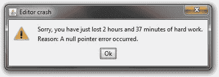
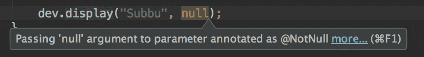
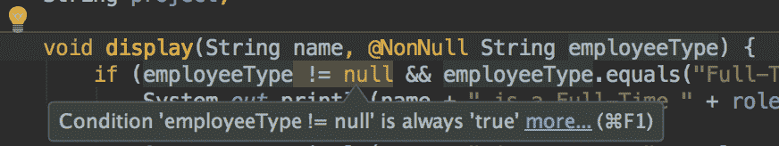
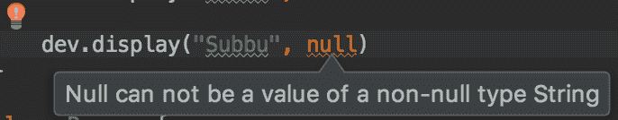

# Kotlin 简单而强大的功能

> 原文：<https://dev.to/subbramanil/simple-yet-powerful-features-of-kotlin>

几年前，当 Jetbrains 发布他们的 Kotlin 初始版本时，我读到过 Kotlin，这种简单而强大的语言可以替代 Java。从事 Java 工作时间长了，我称之为“亵渎”，完全忽略了它。

然而自从 *Kotlin* 在 **Google I/O** 中被宣布为 Android 的官方编程语言后，我意识到我一直都很傻，并且偏向 Kotlin。我为没有早点意识到这一点而感到愚蠢，并开始花时间学习科特林语。

我目前正在上由*【凯文·琼斯】*教授的 *[科特林基础](https://www.pluralsight.com/courses/kotlin-fundamentals)* 。当他解释“*Kotlin 如何改进空值*的处理”时，我意识到 kot Lin 在处理“*空值*方面简单而强大的特性，以及它如何帮助 java 开发人员避免*令人沮丧的*空值检查。

[T2】](https://res.cloudinary.com/practicaldev/image/fetch/s--X8O7Ozjs--/c_limit%2Cf_auto%2Cfl_progressive%2Cq_auto%2Cw_880/https://www.codeproject.com/KB/bugs/787668/null_pointer_error_message.jpg)

## [Java 中的](#in-java)

在 Java 中，默认情况下，任何声明的变量都可以是空的。举个例子，

```
class Developer {
    String team;
    String role;
    String project;

    void display(String name, String employeeType) {
        if (employeeType.equals("Full-Time")) {
            System.out.println(name + " is a Full-Time " + role + " in " + team + " working in " + project);
        } else {
            System.out.println(name + " is a Intern "+ role + " in " + team + " working in " + project);
        }
    }
}

class LearningKotlinUtil {

    public static void main(String[] args) {
        Developer dev = new Developer();
        dev.project = "ePhone7";
        dev.team = "Mobile Team";
        dev.role = "Android Developer";

        dev.display("Subbu", "Full-Time");

        dev.display("Subbu", null);
    }
} 
```

在*开发者*类中，*类型*可以为空。所以对' *display()* '方法的第二次调用将抛出一个 *NullPointerException* 。为了避免这种情况，开发人员必须进行如下的空检查。

```
class Developer {
    ...
    void display(String name) {
        if (employeeType != null && employeeType.equals("Full-Time")) {
            ...
        } else {
            ...
        }
    }
} 
```

或者你可以这样写:

```
class Developer {
    ...
    void display(String name, String employeeType) {
        if ("Full-time".equals(employeeType)) {
            ...
        } else {
            ...
        }
    }
} 
```

为了利用 IDE 的特性，开发者可以用下面的**@非空**注释来注释变量*类型*。

```
class Developer {
    ...

    void display(String name, @NonNull String employeeType) {
        if (employeeType != null && employeeType.equals("Full-Time")) {
            ...
        } else {
            ...
        }
    }
} 
```

> **@NonNull** 批注通过 android 批注支持库或 Java 8 批注支持 JSR-308 来支持。
> 导入 Android . support . annotation . nonnull；

现在 IDE (Intellij/Android Studio)警告开发者如下截图，
[](https://res.cloudinary.com/practicaldev/image/fetch/s--jVfllbfV--/c_limit%2Cf_auto%2Cfl_progressive%2Cq_auto%2Cw_880/https://s3-us-west-2.amazonaws.com/my-blogresources/screenshots/IDE%2BWarning-2.png) 
[](https://res.cloudinary.com/practicaldev/image/fetch/s--9X0Yum_6--/c_limit%2Cf_auto%2Cfl_progressive%2Cq_auto%2Cw_880/https://s3-us-west-2.amazonaws.com/my-blogresources/screenshots/IDE%2BWarning-3.png)

然而，这并不能阻止变量' **type** '被设置为' null ',开发者必须听取 IDE(如果使用的话)的警告。如果开发人员不小心，空指针只能在运行时实现。

## 科特林前来救援

在**科特林**、~~中，变量 *var* 默认为**非空**类型~~[类型系统](https://news.realm.io/news/revisiting-types-in-kotlin/)定义变量是否可以保持‘空’。例如，在这里，当您将 employeeType 声明为' *employeeType: String* '时，Kotlin 类型系统将 employeeType 变量强制为不可空。

```
class Developer {
    var team: String = ""
    var role: String = ""
    var project: String = ""

    fun display(name: String, employeeType: String){
        if(employeeType == "Full-Time") {
            println("$name is a Full Time $role in $team working in the $project project")
        } else {
            println("$name is a Intern $role in $team working in the $project project")
        }
    }
}

fun main(args: Array<String>) {
    val dev = Developer()
    dev.team = "Mobile Team"
    dev.role = "Android Developer"
    dev.project = "ePhone7"

    dev.display("Subbu", "Full-Time")
} 
```

现在，参数“ *employeeType* ”永远不能为 *null* ，试图这样做将导致**编译错误**。

```
fun main(args: Array<String>) {
    val dev = Developer()
    dev.team = "Mobile Team"
    dev.role = "Android Developer"
    dev.project = "ePhone7"

    dev.display("Subbu", "Full-Time")
    dev.display("Subbu", null)
} 
```

[T2】](https://res.cloudinary.com/practicaldev/image/fetch/s--fNFqCnRb--/c_limit%2Cf_auto%2Cfl_progressive%2Cq_auto%2Cw_880/https://s3-us-west-2.amazonaws.com/my-blogresources/screenshots/Kotlin%2BCompilation%2BError-1.png)

~~如果你真的想让 employeeType 接受' *null* 值，你必须使用**'？'显式声明如下**符。~~

如果' employeeType '变量可以有' null '值，应该声明为'*字符串？*’按照科特林式系统。

```
class Developer {
    ...
    fun display(name: String, employeeType: String?){
        ...
    }
} 
```

声明' *employeeType: String？*'告知 employeeType 的编译器可以接受' null '作为值。这相当于 java 中的 **@Nullable** 注释。

这是 Kotlin 的强大功能之一。将变量默认设置为“非空”，并强制开发者显式声明可以为“空”的变量、
和 ~~1。间接迫使开发者在声明一个~~
~~2 时考虑变量的用法。它防止开发人员试图在编译时自己赋值/传递“null”。~~

我刚刚开始学习 Kotlin，在我探索 Kotlin 的过程中，我会继续发布新的简单而强大的特性。

依我拙见，更好地理解 Kotlin 类型系统将极大地帮助开发人员考虑一个变量在声明中可以包含的值，并且还可以防止其他开发人员错误地传递/分配“null”值。

我刚刚开始学习 Kotlin，一旦我完全理解了它们，我会写更多关于我喜欢的特性的博客。请随时提出任何意见或建议。