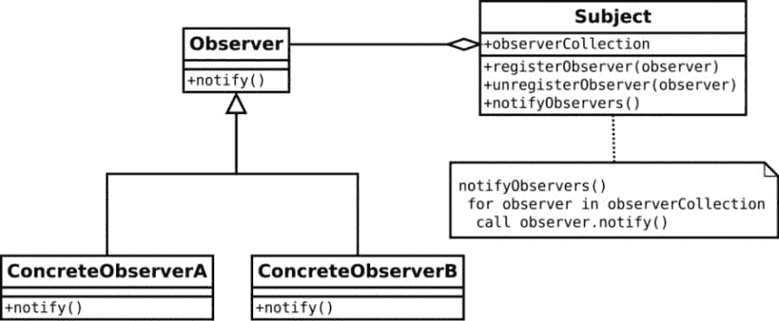
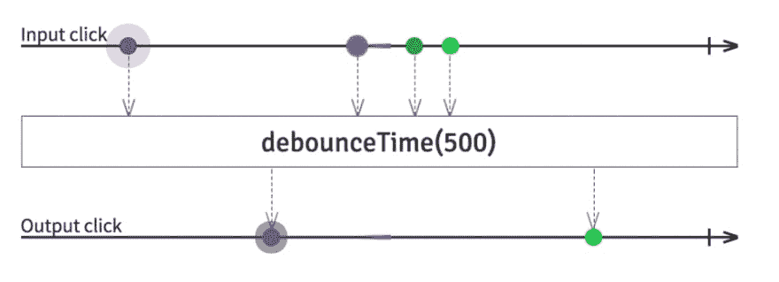

# 反应式编程，该死。这与反应无关

> 原文：<https://dev.to/samueleresca/reactive-programming-damn-it-is-not-about-reactjs>

最初发布于[samueleresca.net](https://samueleresca.net)

这篇文章是关于反应式编程的，文章中的很多主题都是独立于语言和面向模式的。这篇文章不是关于反应的。

很明显，“该死。”是对肯德里克·拉马尔新专辑的致敬，

[T2】](https://i.giphy.com/media/3o7btTV6kjvYgEaUqA/giphy.gif)

> ***“****无功* *编程* *是一种异步的 _ _*[编程范式](https://en.wikipedia.org/wiki/Programming_paradigm)**——关注于\ _ _[数据流](https://en.wikipedia.org/wiki/Dataflow_programming)**——以及变化的传播 _ *。”**——维基百科*

近年来，反应式编程范式作为一种旨在简化事件驱动应用程序的实现和异步代码的执行的模型，已经获得了广泛的流行。

#### 无功宣言

作为反应式系统构建的系统更加**灵活**、**松耦合**和**可伸缩**。这使得它们更容易开发和修改。他们对失败的容忍度明显更高，当失败真的发生时，他们会优雅地面对，而不是灾难。反应式系统反应灵敏，给用户有效的互动反馈。反应系统包括:

*   反应灵敏；
*   有弹性；
*   弹性(可伸缩)；
*   消息驱动(组件)；

你可以在这里找到并签署反应宣言:http://www.reactivemanifesto.org/

#### 开始思考功能

以下几点是一些函数式编程语言所展示的:

*   **一类函数:**这意味着该语言支持将函数作为参数传递给其他函数，作为其他函数的值返回，并将其赋给变量或存储在数据结构中；
*   * *高阶函数:高阶函数是至少执行以下操作之一的函数:将一个或多个函数作为输入，输出一个函数；
*   * *词法闭包:闭包(也称为词法闭包或函数闭包)是一个函数以及该函数的非局部变量的引用环境；*
*   **不可变数据:**不可变对象是指创建后状态不可修改的对象；
*   * *惰性求值:这是一种求值策略，它将表达式的求值延迟到需要它的值时，同时也避免了重复求值；

### react vex

[react vex . io](http://reactivex.io)实现了来自**观察者模式**、**迭代器模式**和**函数式编程**的最佳理念。**观察者模式**让许多观察者在他们观察的对象发生变化时得到通知。**迭代器模式**让我们抽象出如何通过将迭代封装在对象中并提供统一的 API 来迭代特定的集合。[react vex . io](http://reactivex.io)并不是一个特定语言的库，事实上它适用于几乎所有的语言:[http://reactivex.io/languages.html](http://reactivex.io/languages.html)。

#### 模式实现

ReactiveX 扩展了 observer 模式，以支持数据和/或事件的序列，并添加了操作符，允许您以声明的方式将序列组合在一起，同时抽象出诸如**低级线程**、**同步**、**线程安全**、**并发数据结构**和**非阻塞 I/O** 之类的问题。下面是描述**观察者模式**实现的 UML 图: [](https://res.cloudinary.com/practicaldev/image/fetch/s--lGGTGOWj--/c_limit%2Cf_auto%2Cfl_progressive%2Cq_auto%2Cw_880/https://samueleresca.net/wp-content/uploads/2017/06/observer_pattern_UML-960x396.png)

#### 运算符

反应式扩展的一个重要特征是**运算符**。数据流可以与操作符**结合起来，将可观察对象链接在一起，并改变它们的行为**。有不同类型操作符，例如 debounceTime()(我们以前见过)或 filter，它们只能从通过谓词测试的可观察对象中发出特定的项目。这是一个完整的列表，展示了如何使用[各种各样的可观察算子。](http://reactivex.io/documentation/operators.html)[RxMarbales.com](http://rxmarbles.com/)将可观察操作符与 [**大理石图**](http://rxwiki.wikidot.com/marble-diagrams) (描述数据流)结合起来，并为每个操作符提供了一个具体的例子。

### 实践中的反应*(关于数据、事件和承诺)*

首先，反应式扩展作用于**集合和数组**的每种类型。就拿下面这个片段来说:

```
[1,2,3].map(value=>value*10)
 .forEach(value=>
     console.log(value)
  );
 //10
 //20
 //30 
```

Enter fullscreen mode Exit fullscreen mode

我们可以使用`Observable <T>Â` :
来实现同样的事情

```
 Observable.of(1,2,3)
 .map(value=>value*10)
 .subscribe(value=>
     console.log(value)
  );
 //10
 //20
 //30 
```

Enter fullscreen mode Exit fullscreen mode

_ 为什么我们应该使用`Observable <T>`而不是简单的数组？Â _

数组和 a`Observable <T>`的区别在于`Array`是项目的**集合，**和`Observable`是项目的**集合。**重点是**时间**。其次，`Observable <T>`也可以使用**events**，在这种情况下，点击一个 HTML5 输入控件，例如一个按钮:

```
 button.addEventListener('click', event =>{
     console.log("clicked");
 }); 
```

Enter fullscreen mode Exit fullscreen mode

我们可以将点击事件转换成可观察的数据流:

```
 Observable.fromEvent(button, 'click')
     .subscribe(event=>
         {
           console.log("you clicked");
         }); 
```

Enter fullscreen mode Exit fullscreen mode

此时，更容易操纵数据流，例如通过在每次点击之间添加一个`delay`以防止点击垃圾:

```
 Observable.fromEvent(button, 'click')
     .debouceTime(500)
     .subscribe(event=>
         {
           console.log("you clicked");
         }); 
```

Enter fullscreen mode Exit fullscreen mode

我们可以用一个 [**弹珠图**](http://rxwiki.wikidot.com/marble-diagrams) : [](https://res.cloudinary.com/practicaldev/image/fetch/s--sQYZX1GA--/c_limit%2Cf_auto%2Cfl_progressive%2Cq_auto%2Cw_880/https://samueleresca.net/wp-content/uploads/2017/06/Screen-Shot-2017-06-11-at-18.54.01-960x348.png) 来描述数据流，最后，我们还可以对**承诺应用`Observable <T>`。**关键的区别在于，承诺只能表达一项将在未来某个时间完成的任务。`Observable.fromPromises()`将承诺的概念概括为随时间变化的异步数据序列，并为您提供大量操作符，帮助您以任意方式操纵该序列。这里有一个例子:

```
 //example promise that will resolve or reject based on input
const myPromise = (willReject) => {
    return new Promise((resolve, reject) => {
          if(willReject){
            reject('Rejected!');
        }
        resolve('Resolved!');
    })
}
//emit true, then false
const source = Rx.Observable.of(true, false);
const example = source
    .mergeMap(val => Rx.Observable
        //turn promise into observable
        .fromPromise(myPromise(val))
        //catch and gracefully handle rejections
        .catch(error => Rx.Observable.of(`Error: ${error}`))
    )
//output: 'Error: Rejected!', 'Resolved!'
const subscribe = example.subscribe(val => console.log(val)); 
```

Enter fullscreen mode Exit fullscreen mode

#### 案例研究@网飞

网飞是反应式延伸的主要用户之一。其实我们可以找到很多网飞 UI 工程关于该话题的谈话:[网飞 JavaScript Talks -带反应式扩展的异步 JavaScript](https://www.youtube.com/watch?v=XRYN2xt11Ek)[网飞 JavaScript Talks-RxJS+Redux+React =惊艳！](https://www.youtube.com/watch?v=AslncyG8whg) [网飞 JavaScript 演讲——由反应式编程驱动的实时洞察](https://www.youtube.com/watch?v=uODxUJ5Jwis)下面的例子来自其中一个演讲，展示了我们如何通过使用反应式编程来简化我们的代码:

```
 function play(movieId, cancelButton, callback) {
    var movieTicket,
        playError,
        tryFinish = function () {
            if (playError) {
                callback(null, playError);
            }
            else if (movieTicket && player.initialized) {
                callback(null, ticket);
            }
        };

    cancelButton.addEventListener("click", function () { playError = "cancel"; });

    if (!player.initialized) {
        player.init(function () {
            playError = error;
            tryFinish();
        });
    }

    authorizeMovie(movieId, function (error, ticket) {
        playError = error;
        movieTicket = ticket;
        tryFinish();
    });

} 
```

Enter fullscreen mode Exit fullscreen mode

带`Observable <T>` :

```
 var authorizations =
    player
        .init()
        .map(() =>
            playAttemps
                .map(movieId =>
                    player.authorize(movieId)
                        .retry(3)
                        .takeUntil(cancels))
                .concatAll())
        .concatAll();

authorizations.forEach(
    license => player.play(license),
    error => showError()
); 
```

Enter fullscreen mode Exit fullscreen mode

#### 网络演讲示例

我发现了一个由 Jaime gonz lez garc a @ Active Dublin 2k 16 提供支持的很棒的例子。下面是链接到[的**完整例子。你也可以在下面的报告中找到这个例子的打字稿版本:https://github.com/samueleresca/reactive-programming-damn**](https://www.barbarianmeetscoding.com/blog/2016/05/02/making-a-game-with-rx-dot-js-and-web-speech-at-active-dublin-2016-part-iii/)

### 最终的想法

因此，反应式扩展帮助我们使用以下原则和技术编写更好的代码库:

*   **功能性:**避免复杂的有状态程序，在可观察的流上使用干净的输入/输出功能；
*   **少即是多:**react vex 的操作人员经常将曾经复杂的挑战简化为几行代码；
*   **异步错误处理:**传统的 try/catch 对异步计算中的错误无能为力，但 ReactiveX 配备了处理错误的适当机制；
*   **并发变得容易:**react vex 中的观察器和调度器允许程序员抽象出低级线程、同步和并发问题；

##### **牢记在心**

总之，在使用反应式扩展时，有一些副产品需要评估，它可能不是您用来解决应用程序中某个问题的库类型。反应式扩展更像是应用程序的一种生活方式的选择，一个希望在任何地方都是反应式的应用程序。从好的方面来说，反应式扩展让我们能够使用一些更高级的抽象来处理事件和对数据做出反应。

干杯:)

封面图片由[科拉多·泽妮](http://www.corradozeni.it/)