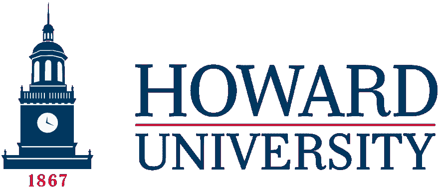

# 我高中毕业了，现在呢？

> 原文:[https://dev.to/aunyks/so-i-graduated-high-school-now-what](https://dev.to/aunyks/so-i-graduated-high-school-now-what)

[T2】](https://res.cloudinary.com/practicaldev/image/fetch/s--aNN4kwCF--/c_limit%2Cf_auto%2Cfl_progressive%2Cq_auto%2Cw_880/https://cdn-images-1.medium.com/max/1600/1%2A8yMRhfBMi2P9PyUR9c5hmA.jpeg)

完成了…结束了…结束了。我终于度过了一生中难忘的 4 年。充满微笑、压力、汗水和软件的 4 年。在这期间，我取得了一些小小的成就:我在大一的时候加入了大学足球队，在一年内参加了三项运动，成绩都是 A，在 Github 上做了我的第一个 [100 星级项目](https://github.com/aunyks/newton-api)，开了一个科技博客，等等。

## 我高中毕业了，现在怎么样？

[T2】](https://res.cloudinary.com/practicaldev/image/fetch/s--3U0tsw1o--/c_limit%2Cf_auto%2Cfl_progressive%2Cq_auto%2Cw_880/https://cdn-images-1.medium.com/max/1600/1%2A11mbPap2sCrzZpTGz1ivNQ.png)

嗯，我在继续我的学业。经过深思熟虑，我决定去 DC 华盛顿州的霍华德大学。在霍华德大学，我将主修计算机科学，辅修一门待定的课程。我非常兴奋能加入野牛大家庭！

## 作为一名软件开发人员，这一切对我来说意味着什么？

嗯，我得到了 Github 学生包，所以这有点酷😉。Lol 但是现在我是一名大学生，我可以获得很多以前我没有的机会:我可以随心所欲地参加许多黑客马拉松，申请实习，并在学校实际学习计算*。我对即将到来的事情非常兴奋。*

## 那么，我现在在做什么？

[T2】](https://res.cloudinary.com/practicaldev/image/fetch/s--iolzNkUZ--/c_limit%2Cf_auto%2Cfl_progressive%2Cq_auto%2Cw_880/https://cdn-images-1.medium.com/max/1600/1%2AftWHMegx9BcOO9oI0E46uQ.png)

在我开始上大学之前，我有幸在今年夏天作为一名软件工程师实习生与杰夫·尼尔森和[钦查皮](https://cinchapi.com)团队一起工作。我非常高兴能在这里工作，我感谢每一个帮助我成为更好的开发人员的人，他们给了我这个机会！

现在我高中毕业了，我迫不及待地想看到即将到来的一切！我对每个人都感激不尽，我感谢你们阅读这篇文章。

### 在社交媒体上与我联系:

[Twitter](https://twitter.com/aunyks) ， [Github](https://github.com/aunyks) ， [Snapchat](https://snapchat.com/add/aunyks) ， [Medium](https://medium.com/@aunyks) ， [Instagram](https://instagram.com/aunyks)