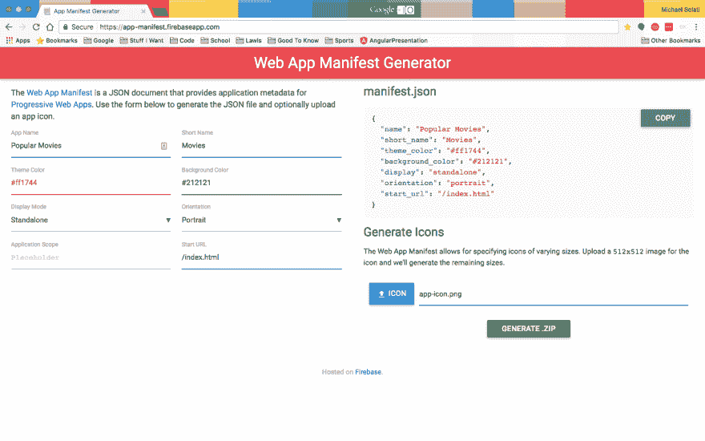
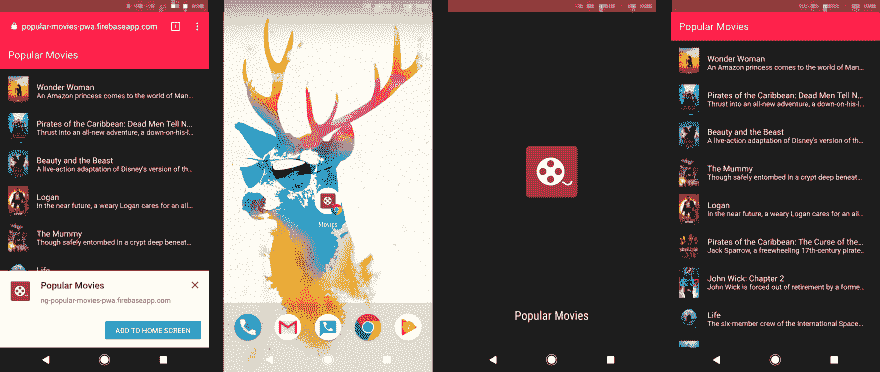
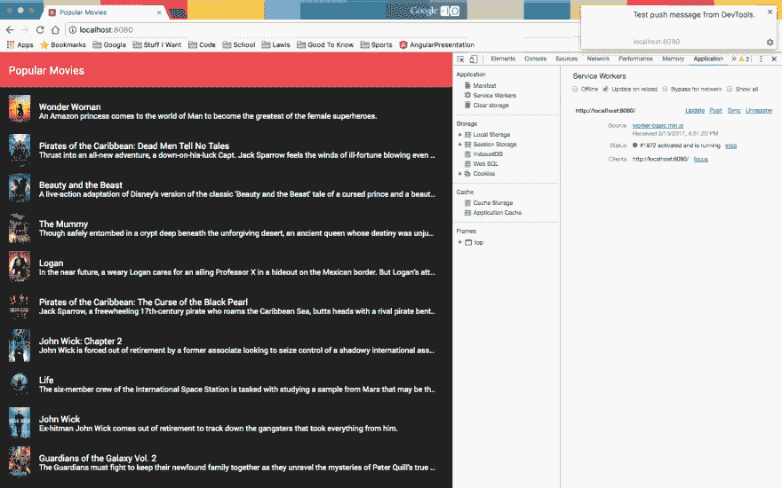
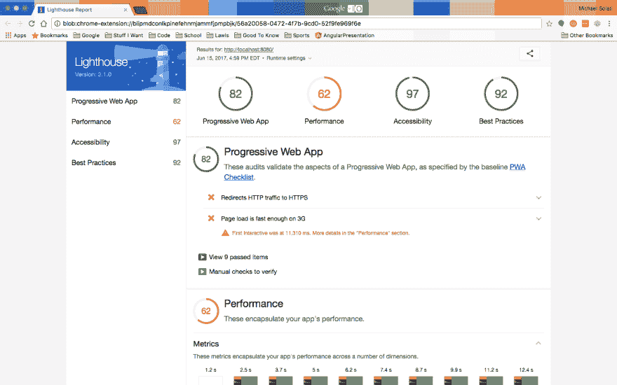
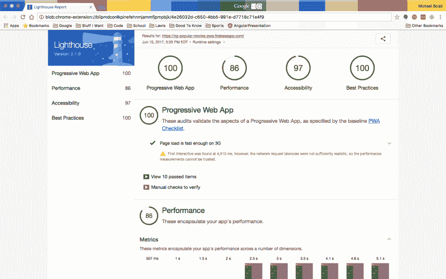

# 有棱角的 PWAs:引人入胜

> 原文:[https://dev . to/michaelsolati/pwas-with-angle-be-engaged](https://dev.to/michaelsolati/pwas-with-angular-being-engaging)

在过去的一周里，我们做了大量的工作，把一个常规的老 Angular 应用程序变成了一个渐进式的 Web 应用程序。我们通过使用服务人员([点击这里](https://dev.to/michaelsolati/pwas-with-angular-beingreliable))使我们的应用程序*变得可靠*；我们还制作了应用程序 *fast* ，通过预渲染我们的回家路线，并用模块延迟加载我们的路线([点击此处](https://dev.to/michaelsolati/pwas-with-angular-beingfast))。但是我们缺少构建 PWA 的一个关键部分:让我们的应用程序*参与*！

那么，制作一个吸引人的应用程序的最好方法是什么呢？两件事。

1.  我们希望我们的应用程序能够提供一种*原生的*体验，在很大程度上，我们使用角状材料做得很好，但是如果用户能够*将我们的 PWA*安装到他们的发射器上，那就更好了。
2.  大多数应用程序能够发送推送通知，通过使用我们的服务人员，我们也可以做到这一点！

* * *

```
git clone --branch v2.0 https://github.com/MichaelSolati/ng-popular-movies-pwa.git
cd ng-popular-movies-pwa
npm install 
```

*这个应用依赖于[电影](https://www.themoviedb.org/)的 API。获取一个 API 键( [check this out](https://www.themoviedb.org/faq/api?language=en) )并将其作为 moviedb 环境变量放入您的* `src/environments/environment.ts` *和* `src/environments/environment.prod.ts` *中。*

我们已经做了很多来提供本地应用程序体验，我们现在需要做的就是允许我们的用户安装我们的应用程序。我们需要做的是向我们的应用程序添加一个 Web 应用程序清单。首先，我建议您访问[应用清单生成器](https://app-manifest.firebaseapp.com/)。这个应用程序将剔除我们需要的很多东西。你可以根据你希望你的应用程序在手机上的外观和感觉来填写字段，但下面是我选择的内容。(为了可读性，我把它放在 JSON 格式中)。

```
{  "name":  "Popular Movies",  "short_name":  "Movies"  "theme_color":  "#ff1744",  "background_color":  "#212121",  "display":  "standalone",  "orientation":  "portrait",  "scope":  null,  "start_url":  "/index.html",  } 
```

还有一个上传图标的选项，这样生成器可以为 web 应用程序生成图标，幸运的是在我们的`src/assets/`目录中有一个名为`app-icon.png`的图像！(你应该选那个)

选择好所有内容后，点击**生成。拉链**按钮。

[T2】](https://res.cloudinary.com/practicaldev/image/fetch/s--78JKV5Qh--/c_limit%2Cf_auto%2Cfl_progressive%2Cq_auto%2Cw_880/https://thepracticaldev.s3.amazonaws.com/i/ro4yet9dsv5h5z43ty9s.png)

解压缩下载的`app-images.zip`。我们将把`manifest.json`文件移到我们的`src/`目录中，我们还将把`images/`目录中的`icons/`目录移到我们的`src/assests/`目录中。

然后我们将修改我们的`src/manifest.json`,删除对象末尾的`"splash_pages": null`,并且将我们所有的图标源的前缀路径从`images/icons/`改为`assets/icons/`。它应该是这样的...

```
{  "name":  "Popular Movies",  "short_name":  "Movies",  "theme_color":  "#ff1744",  "background_color":  "#212121",  "display":  "standalone",  "orientation":  "portrait",  "start_url":  "/index.html",  "icons":  [  {  "src":  "assets/icons/icon-72x72.png",  "sizes":  "72x72",  "type":  "image/png"  },  {  "src":  "assets/icons/icon-96x96.png",  "sizes":  "96x96",  "type":  "image/png"  },  {  "src":  "assets/icons/icon-128x128.png",  "sizes":  "128x128",  "type":  "image/png"  },  {  "src":  "assets/icons/icon-144x144.png",  "sizes":  "144x144",  "type":  "image/png"  },  {  "src":  "assets/icons/icon-152x152.png",  "sizes":  "152x152",  "type":  "image/png"  },  {  "src":  "assets/icons/icon-192x192.png",  "sizes":  "192x192",  "type":  "image/png"  },  {  "src":  "assets/icons/icon-384x384.png",  "sizes":  "384x384",  "type":  "image/png"  },  {  "src":  "assets/icons/icon-512x512.png",  "sizes":  "512x512",  "type":  "image/png"  }  ]  } 
```

我们现在需要更新我们的`src/index.html`来包含`manifest.json`，但是我们也将添加一个`theme-color`，这样当移动浏览器查看我们的页面时，浏览器的地址栏将匹配我们作为应用程序的导航栏的美丽的红色。

```
<head>
  <meta charset="utf-8">
  <title>Popular Movies</title>
  <base href="/">

  <meta name="viewport" content="width=device-width, initial-scale=1">
  <link rel="icon" type="image/x-icon" href="favicon.ico">

  <meta name="theme-color" content="#ff1744">
  <link rel="manifest" href="/manifest.json">
</head> 
```

最后，我们只需要告诉我们的 CLI 在捆绑我们的构建时包含`src/manifest.json`文件。所以我们将更新我们的`angular-cli.json`,把它包含在`apps[0].assets`数组中。

```
[  "assets",  "favicon.ico",  "manifest.json"  ] 
```

有了所有这些设置，如果我们要部署这个应用程序并访问它，在几次使用后，我们会被提示将它添加到我们的主屏幕！(请记住，此提示以及我们即将进入的推送通知只有在您的应用通过 HTTPS 提供时才有效。如果你使用 Firebase 作为你的主机，你已经准备好了！)

[T2】](https://res.cloudinary.com/practicaldev/image/fetch/s--sUbLrFH_--/c_limit%2Cf_auto%2Cfl_progressive%2Cq_auto%2Cw_880/https://thepracticaldev.s3.amazonaws.com/i/l1vm0ze9607nh0myzbhf.png)

* * *

我们希望能够做的最后一件事是向我们的用户发送推送通知。虽然像我们这样的电影应用程序可能并不真正需要它，但它仍然是一个很好的、易于实现的功能，可供未来使用，并可以提高我们的*参与度*。

在我们的`src/ngsw-manifet.json`文件的末尾(在`dynamic`子对象之后),我们将添加一个`push`对象，如下所示。

```
"push":  {  "showNotifications":  true  } 
```

现在我们告诉我们的服务人员当它接收到推送通知时显示它，但是我们仍然需要注册来接收这些通知。我们可以通过使用`@angular/service-worker`包中的`NgServiceWorker`服务来实现这一点，我们还需要从服务工作者包中将我们的`ServiceWorkerModule`导入到我们的应用程序中。

在我们的`src/app/app.module.ts`中，我们将添加:

```
import { NgServiceWorker, ServiceWorkerModule } from '@angular/service-worker'; 
```

我们将把`ServiceWorkerModule`添加到`AppModule`的导入中，并将`NgServiceWorker`作为`AppModule`构造函数的参数传递。

```
constructor(private _moviesService: MoviesService, private _navbarService: NavbarService, private _sw: NgServiceWorker) { } 
```

网络推送要求我们的消息通过[网络推送协议](https://tools.ietf.org/html/draft-ietf-webpush-protocol)从后端发送。如果我们想通过推送消息发送数据，我们还必须按照[网络推送消息加密规范](https://tools.ietf.org/html/draft-ietf-webpush-encryption)对数据进行加密。为了获得所需的`Public Key`和`Private Key`，我们将使用`web-push`库 CLI ( [细节在此](https://github.com/web-push-libs/web-push#command-line))。

```
npm install -g web-push
web-push generate-vapid-keys 
```

CLI 将为我们的应用程序提供所需的 T1 和 T2。`Private Key`，嗯，*对每个人来说都是秘密*...所以把它保存在某个地方，因为你会在你的服务器上用它来给用户发送消息，但是`Public Key`我们会马上使用。像 MovieDB 的 API 一样，我们将把它添加到我们的`src/environments/environment.ts`和`src/environments/environment.prod.ts`中。您应该创建一个名为`applicationServerKey`的新键，并将您的键分配给它。

现在我们可以将我们的`environment`导入到我们的`src/app/app.module.ts`中，就像这样:

```
import { environment } from '../environments/environment'; 
```

然后在我们的`AppModule`的构造函数中，我们将注册我们的推送通知。

```
constructor(private _moviesService: MoviesService, private _navbarService: NavbarService, private _sw: NgServiceWorker) {
  this._sw.registerForPush({
    applicationServerKey: environment.applicationServerKey
  }).subscribe((sub: any) => {
    // Use details to register on your server to send notifications to this device
    console.log(sub);
  });

  this._sw.push.subscribe((msg: any) => {
    // Handle message when in app
    console.log(msg);
  });
} 
```

现在我们已经注册了我们的服务人员来接收和显示通知，我们可以在运行我们的服务器(`npm run start:pwa`)时实际测试它，如下所示。

[T2】](https://res.cloudinary.com/practicaldev/image/fetch/s--7SKcGv9---/c_limit%2Cf_auto%2Cfl_progressive%2Cq_auto%2Cw_880/https://thepracticaldev.s3.amazonaws.com/i/vk0cp5mycetqtwkkbu9v.png)

当我们让我们的应用通过 Lighthouse 测试时，我们的 PWA 得分在 80 分左右(我们现在不需要太关心性能得分，因为它主要反映了我们加载的所有图像以及我们控制之外的其他小因素)。

[T2】](https://res.cloudinary.com/practicaldev/image/fetch/s--1B6s5__1--/c_limit%2Cf_auto%2Cfl_progressive%2Cq_auto%2Cw_880/https://thepracticaldev.s3.amazonaws.com/i/006jotyrq3wf7axogrrg.png)

* * *

嗯，我们做到了！我们用 Angular 编写了一个非常基本的 web 应用程序，并把它变成了一个渐进式 Web 应用程序。是*可靠*、*快速*、*啮合*！虽然我们可以做一些视觉上的调整来改善整体体验，但我们的应用程序现在处于一个非常好的位置！你可以[在这里](https://github.com/MichaelSolati/ng-popular-movies-pwa/compare/v2.0...v3.0?expand=1)查看我们的代码从上一篇文章到这篇文章的变化，如果你想在这里看到这个 app [在野外运行(我推荐你在手机上试试)。](https://ng-popular-movies-pwa.firebaseapp.com/)

最后，我想最激动人心也是最重要的问题是，当我们部署 PWA 时，它有多好？好吧，你为什么不看看下面:

[T2】](https://res.cloudinary.com/practicaldev/image/fetch/s--zsWzBrES--/c_limit%2Cf_auto%2Cfl_progressive%2Cq_auto%2Cw_880/https://thepracticaldev.s3.amazonaws.com/i/7fk7vj250xung6j1lxu0.png)